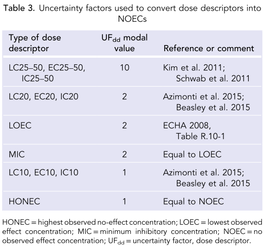
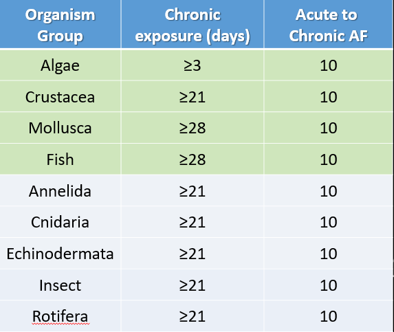

```{r libraries, include=FALSE}
library(tidyverse)
library(calecopal)
library(ssdtools)
library(DT)
library(plotly)
library(gridExtra)
library(grid)
library(wesanderson)
library(ggdark)
library(broom)
library(knitr)
library(viridis)
library(ggrepel)
library(scales)
library(gt)
```

```{r Theme, include=FALSE}
#Theme type
     theme.type<- theme_gray(base_size = 14)#,
                  #     dark_theme_bw(base_size = 20)
     #color selection
     fill.type <-    scale_fill_viridis(discrete = TRUE)#,
                         #scale_fill_brewer(palette = "Paired"),
                         # scale_fill_tron(),
                         # scale_fill_locuszoom(),
                         # scale_fill_d3(),
                         # scale_fill_npg(),
                         # scale_fill_jama())
     #color selection
     color.type <- scale_color_viridis(discrete = TRUE)#,
                         # scale_color_brewer(palette = "Paired"),
                         # scale_color_tron(),
                         # scale_color_locuszoom(),
                         # scale_color_d3(),
                         # scale_color_npg(),
                         # scale_color_jama())

```

```{r import, include=FALSE}
# Data Import
#require(readr)
#load aoc_z into dataframe. This file is generated from RDA_Maker.R
#source("Tox Data/RDA_Maker.R")
aoc_z <- readRDS(file = "Tox Data/aoc_z.Rda")

## First filter data with global filters
aoc_final <- aoc_z %>% 
  filter(!environment %in% c("Terrestrial", "Not Reported"),
         org_f != "Bacterium",
         org_f != "Plant",
         effect.metric != "HONEC")  
  
```


The figure above displays the working threshold framework for the ambient threshold group for the Microplastics Health Effects Workshop. 

The current framework for generating SSDs includes the following parameters:

Data pertaining to only aquatic organisms are included (marine and freshwater).  

All taxa are included with the exception of bacterium and plants.  

HONEC (Highest Observed No Effect Concentration) are excluded.  

Assessment factors are applied to convert all other effect metrics into NOECs:



Reference: Wigger et al. 2020 (doi: 10.1002/ieam.4214)  

Assessment factors are applied to convert acute data into chronic:  



Green rows are from Wigger et al. 2020. Grey rows were agreed upon by the ambient threshold working group.

Reference: Wigger et al. 2020 (doi: 10.1002/ieam.4214)


# Tiers 1 & 2

Tier 1 and 2 are the same SSD. A different HC metric is selected to differentiate between the tiers. Specifically, Tier 1 uses the 95% CI whereas Tier 2 uses the Mean. See below for more details of specific parameters. 

Hazard Confidence Level = HC5  

Endpoints = All  

Levels of Biological Organization = All  

HC Metric = 95% CI (Tier 1); Mean (Tier 2)  

Data Quality = Pass Technical Quality Red Criteria

## Data Collapsing

```{r size category selection, include=FALSE}
tier1_2 <- aoc_final %>% 
  filter(tier_zero_tech_f == "Red Criteria Passed") %>% 
         mutate(dose_new = dose.particles.mL.master / (af.time * af.noec)) %>%  
         drop_na(dose_new) %>% 
         mutate(dose_new = dose_new*1000)

#### Size filters ####

### 100 - 5000 um
tier1_2_large <- tier1_2 %>% 
  filter(size_f %in% c("10µm < 100µm", "100µm < 1mm", "1mm < 5mm")) 
# Count observations and studies
tier1_2_large.obs <- tier1_2_large %>% summarize(n.obs = n(), n.studies = n_distinct(doi), n.taxa = n_distinct(org_f), n.species = n_distinct(species_f))

# ### 10 - 100 um
# tier1_2_medium <- tier1_2 %>% 
#   filter(size_f %in% c("10µm < 100µm")) 
#   
# # Count observations and studies
# tier1_2_medium.obs <- tier1_2_medium %>% summarize(n.obs = n(), n.studies = n_distinct(doi), n.taxa = n_distinct(org_f), n.species = n_distinct(species_f))

### 1 - 10 um
tier1_2_small <- tier1_2 %>% 
  filter(size_f %in% c("1µm < 10µm")) 
  
# Count observations and studies
tier1_2_small.obs <- tier1_2_small %>% summarize(n.obs = n(), n.studies = n_distinct(doi), n.taxa = n_distinct(org_f), n.species = n_distinct(species_f))
```

```{r endpoint plots, message=FALSE}
#large
endpoints_tier1_2_large <- tier1_2_large %>% 
  group_by(lvl1_f, bio_f) %>% 
  mutate(lvl1_count = n()) %>% 
  group_by(lvl1_f, lvl1_count, bio_f) %>% 
  summarise() %>%  
  ggplot(aes(x = lvl1_f, y=lvl1_count, fill = bio_f))+
  geom_bar(stat = "identity") +
  scale_fill_manual(values = wes_palette("Zissou1", 5, type = "continuous")) +
  labs(title = "Tier 1 & 2, Endpoint Representation", subtitle = "10µm - 5mm", x = "Endpoint Category", y = "Number of Endpoints", fill = "Biological Level\nof Organization", caption = "Number of endpoints is prior to data collapse") +
  theme_test() +
  scale_x_discrete(labels = wrap_format(10)) 
        

plot(endpoints_tier1_2_large)

#medium
# endpoints_tier1_2_medium <- tier1_2_medium %>% 
#   group_by(lvl1_f, bio_f) %>% 
#   mutate(lvl1_count = n()) %>% 
#   group_by(lvl1_f, lvl1_count, bio_f) %>% 
#   summarise() %>%  
#   ggplot(aes(x = lvl1_f, y=lvl1_count, fill = bio_f))+
#   geom_bar(stat = "identity") +
#   scale_fill_manual(values = wes_palette("Zissou1", 5, type = "continuous")) +
#   labs(title = "Tier 1 & 2, Endpoint Representation", subtitle = "10µm < 100µm", x = "Endpoint Category", y = "Number of Endpoints", fill = "Biological Level\nof Organization", caption = "Number of endpoints is prior to data collapse") +
#   theme_test() +
#   scale_x_discrete(labels = wrap_format(10)) 
#         
# 
# plot(endpoints_tier1_2_medium)

#small
endpoints_tier1_2_small <- tier1_2_small %>% 
  group_by(lvl1_f, bio_f) %>% 
  mutate(lvl1_count = n()) %>% 
  group_by(lvl1_f, lvl1_count, bio_f) %>% 
  summarise() %>%  
  ggplot(aes(x = lvl1_f, y=lvl1_count, fill = bio_f))+
  geom_bar(stat = "identity") +
  scale_fill_manual(values = wes_palette("Zissou1", 5, type = "continuous")) +
  labs(title = "Tier 1 & 2, Endpoint Representation", subtitle = "1µm < 10µm", x = "Endpoint Category", y = "Number of Endpoints", fill = "Biological Level\nof Organization", caption = "Number of endpoints is prior to data collapse") +
  theme_test() +
  scale_x_discrete(labels = wrap_format(10)) 
        

plot(endpoints_tier1_2_small)
```

```{r data collapse, include=FALSE}

#First quartile large particles
tier1_2_large_1q <- tier1_2_large %>% 
  group_by(Species, Group) %>% 
  summarize(Conc = quantile(dose_new, 0.25))

#First quartile medium particles
# tier1_2_medium_1q <- tier1_2_medium %>% 
#   group_by(Species, Group) %>% 
#   summarize(Conc = quantile(dose_new, 0.25))

#First quartile small particles
tier1_2_small_1q <- tier1_2_small %>% 
  group_by(Species, Group) %>% 
  summarize(Conc = quantile(dose_new, 0.25))

```

## SSD Build

### Large (10 - 5000 um) 

```{r include=TRUE, warning=FALSE}
###### --modelling ####
dists_tier1_2_large_1q <- ssd_fit_dists(tier1_2_large_1q, left = "Conc", dists = c("weibull", "llogis", "lnorm", "gamma", "lgumbel"), computable = FALSE, silent = FALSE) 

#autoplot(dists_tier1_2_large_1q) #plots the distribution in ggplotier2
#### Goodness of fit ####
gof_tier1_2_large_1q <- as.data.frame(ssd_gof(dists_tier1_2_large_1q)) %>% mutate_if(is.numeric, ~ signif(., 3))

#### Prediction ####
set.seed(99)
pred_tier1_2_large_1q <- predict(dists_tier1_2_large_1q, average = TRUE, ic = "aicc", nboot = 10, ci= TRUE) 

#order data
SSD_tier1_2_large_1q <- tier1_2_large_1q[order(tier1_2_large_1q$Conc), ]
SSD_tier1_2_large_1q$frac <- ppoints(tier1_2_large_1q$Conc, 0.5)

tier1_2_large_1q_lcl <- c(pred_tier1_2_large_1q$lcl[5]) #CI95
tier1_2_large_1q_hc5 <- c(pred_tier1_2_large_1q$est[5]) #HC5
pred_tier1_2_large_1q$est_format <-format(pred_tier1_2_large_1q$est, digits = 3, scientific = TRUE)

#ggplot
tier1_2_large_1q_ggplot <- ggplot(pred_tier1_2_large_1q,aes_string(x = "est")) +
      geom_xribbon(aes_string(xmin = "lcl", xmax = "ucl", y = "percent/100"), alpha = 0.2, color = "blue", fill = "lightblue") +
      geom_line(aes_string(y = "percent/100"), color = "gray") +
      geom_point(data = SSD_tier1_2_large_1q,aes(x = Conc, y =frac, color = Group)) + 
      geom_text_repel(data = SSD_tier1_2_large_1q, aes(x = Conc, y = frac, label = Species, color = Group), nudge_x = 0.2, size = 3, segment.alpha = 0.5) + 
      scale_y_continuous("Species Affected (%)", labels = scales::percent, limits = c(0,1)) +
      coord_trans(x = "log10") +
      scale_x_continuous(breaks = scales::trans_breaks("log10", function(x) 10^x, n = 15),
                         labels = trans_format("log10", scales::math_format(10^.x))) + 
  labs(title = "Tier 1/2, 10-5000 µm", x = "particles/L") +
      fill.type + #user-selected
      color.type + #user-selected
      theme.type #user theme

plot(tier1_2_large_1q_ggplot)
```

```{r include=FALSE, warning=FALSE}
# ###### --modelling ####
# dists_tier1_2_medium_1q <- ssd_fit_dists(tier1_2_medium_1q, left = "Conc", dists = c("weibull", "llogis", "lnorm", "gamma", "lgumbel"), computable = FALSE, silent = FALSE) 
# 
# #autoplot(dists_tier1_2_medium_1q) #plots the distribution in ggplotier2
# #### Goodness of fit ####
# gof_tier1_2_medium_1q <- as.data.frame(ssd_gof(dists_tier1_2_medium_1q)) %>% mutate_if(is.numeric, ~ signif(., 3))
# 
# #### Prediction ####
# set.seed(99)
# pred_tier1_2_medium_1q <- predict(dists_tier1_2_medium_1q, average = TRUE, ic = "aicc", nboot = 10, ci= TRUE) 
# 
# #order data
# SSD_tier1_2_medium_1q <- tier1_2_medium_1q[order(tier1_2_medium_1q$Conc), ]
# SSD_tier1_2_medium_1q$frac <- ppoints(tier1_2_medium_1q$Conc, 0.5)
# 
# tier1_2_medium_1q_lcl <- c(pred_tier1_2_medium_1q$lcl[5]) #CI95
# tier1_2_medium_1q_hc5 <- c(pred_tier1_2_medium_1q$est[5]) #HC5
# pred_tier1_2_medium_1q$est_format <-format(pred_tier1_2_medium_1q$est, digits = 3, scientific = TRUE)
# 
# #ggplot
# tier1_2_medium_1q_ggplot <- ggplot(pred_tier1_2_medium_1q,aes_string(x = "est")) +
#       geom_xribbon(aes_string(xmin = "lcl", xmax = "ucl", y = "percent/100"), alpha = 0.2, color = "blue", fill = "lightblue") +
#       geom_line(aes_string(y = "percent/100"), color = "gray") +
#       geom_point(data = SSD_tier1_2_medium_1q,aes(x = Conc, y =frac, color = Group)) + 
#       geom_text_repel(data = SSD_tier1_2_medium_1q, aes(x = Conc, y = frac, label = Species, color = Group), nudge_x = 0.2, size = 3, segment.alpha = 0.5) + 
#       scale_y_continuous("Species Affected (%)", labels = scales::percent, limits = c(0,1)) +
#       coord_trans(x = "log10") +
#       scale_x_continuous(breaks = scales::trans_breaks("log10", function(x) 10^x, n = 15),
#                          labels = trans_format("log10", scales::math_format(10^.x))) + 
#   labs(title = "Tier 1/2, 10-100 µm", x = "particles/L") +
#       fill.type + #user-selected
#       color.type + #user-selected
#       theme.type #user theme
# 
# plot(tier1_2_medium_1q_ggplot)
```

### Small (1 - 10 um) 

```{r include=TRUE, warning=FALSE}
###### --modelling ####
dists_tier1_2_small_1q <- ssd_fit_dists(tier1_2_small_1q, left = "Conc", dists = c("weibull", "llogis", "lnorm", "gamma", "lgumbel"), computable = FALSE, silent = FALSE) 

#autoplot(dists_tier1_2_small_1q) #plots the distribution in ggplotier2
#### Goodness of fit ####
gof_tier1_2_small_1q <- as.data.frame(ssd_gof(dists_tier1_2_small_1q)) %>% mutate_if(is.numeric, ~ signif(., 3))

#### Prediction ####
set.seed(99)
pred_tier1_2_small_1q <- predict(dists_tier1_2_small_1q, average = TRUE, ic = "aicc", nboot = 10, ci= TRUE) 

#order data
SSD_tier1_2_small_1q <- tier1_2_small_1q[order(tier1_2_small_1q$Conc), ]
SSD_tier1_2_small_1q$frac <- ppoints(tier1_2_small_1q$Conc, 0.5)

tier1_2_small_1q_lcl <- c(pred_tier1_2_small_1q$lcl[5]) #CI95
tier1_2_small_1q_hc5 <- c(pred_tier1_2_small_1q$est[5]) #HC5
pred_tier1_2_small_1q$est_format <-format(pred_tier1_2_small_1q$est, digits = 3, scientific = TRUE)

#ggplot
tier1_2_small_1q_ggplot <- ggplot(pred_tier1_2_small_1q,aes_string(x = "est")) +
      geom_xribbon(aes_string(xmin = "lcl", xmax = "ucl", y = "percent/100"), alpha = 0.2, color = "blue", fill = "lightblue") +
      geom_line(aes_string(y = "percent/100"), color = "gray") +
      geom_point(data = SSD_tier1_2_small_1q,aes(x = Conc, y =frac, color = Group)) + 
      geom_text_repel(data = SSD_tier1_2_small_1q, aes(x = Conc, y = frac, label = Species, color = Group), nudge_x = 0.2, size = 3, segment.alpha = 0.5) + 
      scale_y_continuous("Species Affected (%)", labels = scales::percent, limits = c(0,1)) +
      coord_trans(x = "log10") +
      scale_x_continuous(breaks = scales::trans_breaks("log10", function(x) 10^x, n = 15),
                         labels = trans_format("log10", scales::math_format(10^.x))) + 
  labs(title = "Tier 1/2, 1-10 µm", x = "particles/L") +
      fill.type + #user-selected
      color.type + #user-selected
      theme.type #user theme

plot(tier1_2_small_1q_ggplot)
```

### Tier 1 & 2 Summary Table

Hazard Confidence Level = HC5  

Endpoints = All  

Levels of Biological Organization = All  

HC Metric = 95% CI (Tier 1); Mean (Tier 2)  

Data Quality = Pass Technical Quality Red Criteria

```{r}

larges <- list(tier1_2_large_1q_lcl, tier1_2_large_1q_hc5,
              tier1_2_large.obs[[1,1]], #n.obs
              tier1_2_large.obs[[1,2]], #n.studies
              tier1_2_large.obs[[1,3]], #n.taxa
              tier1_2_large.obs[[1,4]]) #n.species

# mediums <- list(tier1_2_medium_1q_lcl, tier1_2_medium_1q_hc5,
#               tier1_2_medium.obs[[1,1]], #n.obs
#               tier1_2_medium.obs[[1,2]], #n.studies
#               tier1_2_medium.obs[[1,3]], #n.taxa
#               tier1_2_medium.obs[[1,4]]) #n.species

smalls <- list(tier1_2_small_1q_lcl, tier1_2_small_1q_hc5,
              tier1_2_small.obs[[1,1]], #n.obs
              tier1_2_small.obs[[1,2]], #n.studies
              tier1_2_small.obs[[1,3]], #n.taxa
              tier1_2_small.obs[[1,4]]) #n.species

# Convert to data frames
largesdf <- data.frame(matrix(unlist(larges), ncol = 6))
# mediumsdf <- data.frame(matrix(unlist(mediums), ncol = 6))
smallsdf <- data.frame(matrix(unlist(smalls), ncol = 6))

# Rename columns
colnames(largesdf) <- c("Tier_1", "Tier_2", "N_Obs.", "N_Doi", "N_Taxa", "N_Species")
# colnames(mediumsdf) <- c("Tier_1", "Tier_2", "N_Obs.", "N_Doi", "N_Taxa", "N_Species")
colnames(smallsdf) <- c("Tier_1", "Tier_2", "N_Obs.", "N_Doi", "N_Taxa", "N_Species")

# Make tables

gt(largesdf) %>% 
  tab_header(title = "Tier 1/2, 10-5000 um", subtitle = "Thresholds presented in particles/L") %>% 
  fmt_number(columns = vars(Tier_1, Tier_2),decimals = 2, use_seps = TRUE) 

             
# gt(mediumsdf) %>% 
#   tab_header(title = "Tier 1/2, 10-100 um", subtitle = "Thresholds presented in particles/L") %>% 
#   fmt_number(columns = vars(Tier_1, Tier_2),decimals = 2, use_seps = TRUE)

gt(smallsdf) %>% 
  tab_header(title = "Tier 1/2, 1-10 um", subtitle = "Thresholds presented in particles/L") %>% 
  fmt_number(columns = vars(Tier_1, Tier_2),decimals = 2, use_seps = TRUE)

```

# Tiers 3 & 4

Tier 3 and 4 are the same SSD. A different HC metric is selected to differentiate between the tiers. Specifically, Tier 1 uses the 95% CI whereas Tier 2 uses the Mean. See below for more details of specific parameters. 

Hazard Confidence Level = HC5(Tier3)/HC10(Tier4)  

Endpoints = All  

Levels of Biological Organization = Organism and Population  

HC Metric = Mean  

Data Quality = Pass Technical & Risk Quality Red Criteria

## Data Collapsing

```{r size category selection - tiers 3/4, include=FALSE}
tier3_4 <- aoc_final %>% 
  filter(tier_zero_tech_f == "Red Criteria Passed",
         tier_zero_risk_f == "Red Criteria Passed",
         bio_f %in% c("Organism", "Population")) %>% 
         mutate(dose_new = dose.particles.mL.master / (af.time * af.noec)) %>%  
         drop_na(dose_new) %>% 
         mutate(dose_new = dose_new*1000)

#### Size filters ####

### 100 - 5000 um
tier3_4_large <- tier3_4 %>% 
  filter(size_f %in% c("10µm < 100µm", "100µm < 1mm", "1mm < 5mm")) 
# Count observations and studies
tier3_4_large.obs <- tier3_4_large %>% summarize(n.obs = n(), n.studies = n_distinct(doi), n.taxa = n_distinct(org_f), n.species = n_distinct(species_f))

# ### 10 - 100 um
# tier3_4_medium <- tier3_4 %>% 
#   filter(size_f %in% c("10µm < 100µm")) 
#   
# # Count observations and studies
# tier3_4_medium.obs <- tier3_4_medium %>% summarize(n.obs = n(), n.studies = n_distinct(doi), n.taxa = n_distinct(org_f), n.species = n_distinct(species_f))

### 1 - 10 um
tier3_4_small <- tier3_4 %>% 
  filter(size_f %in% c("1µm < 10µm")) 
  
# Count observations and studies
tier3_4_small.obs <- tier3_4_small %>% summarize(n.obs = n(), n.studies = n_distinct(doi), n.taxa = n_distinct(org_f), n.species = n_distinct(species_f))
```

```{r endpoint plots - tiers 3/4, message=FALSE}
#large
endpoints_tier3_4_large <- tier3_4_large %>% 
  group_by(lvl1_f, bio_f) %>% 
  mutate(lvl1_count = n()) %>% 
  group_by(lvl1_f, lvl1_count, bio_f) %>% 
  summarise() %>%  
  ggplot(aes(x = lvl1_f, y=lvl1_count, fill = bio_f))+
  geom_bar(stat = "identity") +
  scale_fill_manual(values = wes_palette("Zissou1", 5, type = "continuous")) +
  labs(title = "Tier 1 & 2, Endpoint Representation", subtitle = "10µm - 5mm", x = "Endpoint Category", y = "Number of Endpoints", fill = "Biological Level\nof Organization", caption = "Number of endpoints is prior to data collapse") +
  theme_test() +
  scale_x_discrete(labels = wrap_format(10)) 
        

plot(endpoints_tier3_4_large)

#medium
# endpoints_tier3_4_medium <- tier3_4_medium %>% 
#   group_by(lvl1_f, bio_f) %>% 
#   mutate(lvl1_count = n()) %>% 
#   group_by(lvl1_f, lvl1_count, bio_f) %>% 
#   summarise() %>%  
#   ggplot(aes(x = lvl1_f, y=lvl1_count, fill = bio_f))+
#   geom_bar(stat = "identity") +
#   scale_fill_manual(values = wes_palette("Zissou1", 5, type = "continuous")) +
#   labs(title = "Tier 1 & 2, Endpoint Representation", subtitle = "10µm < 100µm", x = "Endpoint Category", y = "Number of Endpoints", fill = "Biological Level\nof Organization", caption = "Number of endpoints is prior to data collapse") +
#   theme_test() +
#   scale_x_discrete(labels = wrap_format(10)) 
#         
# 
# plot(endpoints_tier3_4_medium)

#small
endpoints_tier3_4_small <- tier3_4_small %>% 
  group_by(lvl1_f, bio_f) %>% 
  mutate(lvl1_count = n()) %>% 
  group_by(lvl1_f, lvl1_count, bio_f) %>% 
  summarise() %>%  
  ggplot(aes(x = lvl1_f, y=lvl1_count, fill = bio_f))+
  geom_bar(stat = "identity") +
  scale_fill_manual(values = wes_palette("Zissou1", 5, type = "continuous")) +
  labs(title = "Tier 1 & 2, Endpoint Representation", subtitle = "1µm < 10µm", x = "Endpoint Category", y = "Number of Endpoints", fill = "Biological Level\nof Organization", caption = "Number of endpoints is prior to data collapse") +
  theme_test() +
  scale_x_discrete(labels = wrap_format(10)) 
        

plot(endpoints_tier3_4_small)
```

```{r data collapse - tiers 3/4, include=FALSE}

#First quartile large particles
tier3_4_large_median <- tier3_4_large %>% 
  group_by(Species, Group) %>% 
  summarize(Conc = median(dose_new))

#First quartile medium particles
# tier3_4_medium_median <- tier3_4_medium %>% 
#   group_by(Species, Group) %>% 
#   summarize(Conc = median(dose_new))

#First quartile small particles
tier3_4_small_median <- tier3_4_small %>% 
  group_by(Species, Group) %>% 
  summarize(Conc = median(dose_new))

```

## SSD Build

### Large (10 - 5000 um) 

```{r include=TRUE, warning=FALSE}
###### --modelling ####
dists_tier3_4_large_median <- ssd_fit_dists(tier3_4_large_median, left = "Conc", dists = c("weibull", "llogis", "lnorm", "gamma", "lgumbel"), computable = FALSE, silent = FALSE) 

#autoplot(dists_tier3_4_large_median) #plots the distribution in ggplotier2
#### Goodness of fit ####
gof_tier3_4_large_median <- as.data.frame(ssd_gof(dists_tier3_4_large_median)) %>% mutate_if(is.numeric, ~ signif(., 3))

#### Prediction ####
set.seed(99)
pred_tier3_4_large_median <- predict(dists_tier3_4_large_median, average = TRUE, ic = "aicc", nboot = 10, ci= TRUE) 

#order data
SSD_tier3_4_large_median <- tier3_4_large_median[order(tier3_4_large_median$Conc), ]
SSD_tier3_4_large_median$frac <- ppoints(tier3_4_large_median$Conc, 0.5)

tier3_4_large_median_hc5 <- c(pred_tier3_4_large_median$est[5]) #HC5
tier3_4_large_median_hc10 <- c(pred_tier3_4_large_median$est[10]) #HC10
pred_tier3_4_large_median$est_format <-format(pred_tier3_4_large_median$est, digits = 3, scientific = TRUE)

#ggplot
tier3_4_large_median_ggplot <- ggplot(pred_tier3_4_large_median,aes_string(x = "est")) +
      geom_xribbon(aes_string(xmin = "lcl", xmax = "ucl", y = "percent/100"), alpha = 0.2, color = "blue", fill = "lightblue") +
      geom_line(aes_string(y = "percent/100"), color = "gray") +
      geom_point(data = SSD_tier3_4_large_median,aes(x = Conc, y =frac, color = Group)) + 
      geom_text_repel(data = SSD_tier3_4_large_median, aes(x = Conc, y = frac, label = Species, color = Group), nudge_x = 0.2, size = 3, segment.alpha = 0.5) + 
      scale_y_continuous("Species Affected (%)", labels = scales::percent, limits = c(0,1)) +
      coord_trans(x = "log10") +
      scale_x_continuous(breaks = scales::trans_breaks("log10", function(x) 10^x, n = 15),
                         labels = trans_format("log10", scales::math_format(10^.x))) + 
  labs(title = "Tier 1/2, 10-5000 µm", x = "particles/L") +
      fill.type + #user-selected
      color.type + #user-selected
      theme.type #user theme

plot(tier3_4_large_median_ggplot)
```

```{r include=FALSE, warning=FALSE}
###### --modelling ####
# dists_tier3_4_medium_median <- ssd_fit_dists(tier3_4_medium_median, left = "Conc", dists = c("weibull", "llogis", "lnorm", "gamma", "lgumbel"), computable = FALSE, silent = FALSE) 
# 
# #autoplot(dists_tier3_4_medium_median) #plots the distribution in ggplotier2
# #### Goodness of fit ####
# gof_tier3_4_medium_median <- as.data.frame(ssd_gof(dists_tier3_4_medium_median)) %>% mutate_if(is.numeric, ~ signif(., 3))
# 
# #### Prediction ####
# set.seed(99)
# pred_tier3_4_medium_median <- predict(dists_tier3_4_medium_median, average = TRUE, ic = "aicc", nboot = 10, ci= TRUE) 
# 
# #order data
# SSD_tier3_4_medium_median <- tier3_4_medium_median[order(tier3_4_medium_median$Conc), ]
# SSD_tier3_4_medium_median$frac <- ppoints(tier3_4_medium_median$Conc, 0.5)
# 
# tier3_4_medium_median_hc5 <- c(pred_tier3_4_medium_median$est[5]) #HC5
# tier3_4_medium_median_hc10 <- c(pred_tier3_4_medium_median$est[10]) #HC10
# pred_tier3_4_medium_median$est_format <-format(pred_tier3_4_medium_median$est, digits = 3, scientific = TRUE)
# 
# #ggplot
# tier3_4_medium_median_ggplot <- ggplot(pred_tier3_4_medium_median,aes_string(x = "est")) +
#       geom_xribbon(aes_string(xmin = "lcl", xmax = "ucl", y = "percent/100"), alpha = 0.2, color = "blue", fill = "lightblue") +
#       geom_line(aes_string(y = "percent/100"), color = "gray") +
#       geom_point(data = SSD_tier3_4_medium_median,aes(x = Conc, y =frac, color = Group)) + 
#       geom_text_repel(data = SSD_tier3_4_medium_median, aes(x = Conc, y = frac, label = Species, color = Group), nudge_x = 0.2, size = 3, segment.alpha = 0.5) + 
#       scale_y_continuous("Species Affected (%)", labels = scales::percent, limits = c(0,1)) +
#       coord_trans(x = "log10") +
#       scale_x_continuous(breaks = scales::trans_breaks("log10", function(x) 10^x, n = 15),
#                          labels = trans_format("log10", scales::math_format(10^.x))) + 
#   labs(title = "Tier 1/2, 10-100 µm", x = "particles/L") +
#       fill.type + #user-selected
#       color.type + #user-selected
#       theme.type #user theme
# 
# tier3_4_medium_median_ggplot
```

### Small (1 - 10 um) 

```{r include=TRUE, warning=FALSE}
###### --modelling ####
dists_tier3_4_small_median <- ssd_fit_dists(tier3_4_small_median, left = "Conc", dists = c("weibull", "llogis", "lnorm", "gamma", "lgumbel"), computable = FALSE, silent = FALSE) 

#autoplot(dists_tier3_4_small_median) #plots the distribution in ggplotier2
#### Goodness of fit ####
gof_tier3_4_small_median <- as.data.frame(ssd_gof(dists_tier3_4_small_median)) %>% mutate_if(is.numeric, ~ signif(., 3))

#### Prediction ####
set.seed(99)
pred_tier3_4_small_median <- predict(dists_tier3_4_small_median, average = TRUE, ic = "aicc", nboot = 10, ci= TRUE) 

#order data
SSD_tier3_4_small_median <- tier3_4_small_median[order(tier3_4_small_median$Conc), ]
SSD_tier3_4_small_median$frac <- ppoints(tier3_4_small_median$Conc, 0.5)

tier3_4_small_median_hc5 <- c(pred_tier3_4_small_median$est[5]) #HC5
tier3_4_small_median_hc10 <- c(pred_tier3_4_small_median$est[10]) #HC10
pred_tier3_4_small_median$est_format <-format(pred_tier3_4_small_median$est, digits = 3, scientific = TRUE)

#ggplot
tier3_4_small_median_ggplot <- ggplot(pred_tier3_4_small_median,aes_string(x = "est")) +
      geom_xribbon(aes_string(xmin = "lcl", xmax = "ucl", y = "percent/100"), alpha = 0.2, color = "blue", fill = "lightblue") +
      geom_line(aes_string(y = "percent/100"), color = "gray") +
      geom_point(data = SSD_tier3_4_small_median,aes(x = Conc, y =frac, color = Group)) + 
      geom_text_repel(data = SSD_tier3_4_small_median, aes(x = Conc, y = frac, label = Species, color = Group), nudge_x = 0.2, size = 3, segment.alpha = 0.5) + 
      scale_y_continuous("Species Affected (%)", labels = scales::percent, limits = c(0,1)) +
      coord_trans(x = "log10") +
      scale_x_continuous(breaks = scales::trans_breaks("log10", function(x) 10^x, n = 15),
                         labels = trans_format("log10", scales::math_format(10^.x))) + 
  labs(title = "Tier 1/2, 1-10 µm", x = "particles/L") +
      fill.type + #user-selected
      color.type + #user-selected
      theme.type #user theme

plot(tier3_4_small_median_ggplot)
```

### Tier 3 & 4 Summary Table

Hazard Confidence Level = HC5(Tier3)/HC10(Tier4)  

Endpoints = All  

Levels of Biological Organization = Organism and Population  

HC Metric = Mean  

Data Quality = Pass Technical & Risk Quality Red Criteria  

```{r include=TRUE}

larges <- list(tier3_4_large_median_hc5, tier3_4_large_median_hc10,
              tier3_4_large.obs[[1,1]], #n.obs
              tier3_4_large.obs[[1,2]], #n.studies
              tier3_4_large.obs[[1,3]], #n.taxa
              tier3_4_large.obs[[1,4]]) #n.species

# mediums <- list(tier3_4_medium_median_hc5, tier3_4_medium_median_hc10,
#               tier3_4_medium.obs[[1,1]], #n.obs
#               tier3_4_medium.obs[[1,2]], #n.studies
#               tier3_4_medium.obs[[1,3]], #n.taxa
#               tier3_4_medium.obs[[1,4]]) #n.species

smalls <- list(tier3_4_small_median_hc5, tier3_4_small_median_hc10,
              tier3_4_small.obs[[1,1]], #n.obs
              tier3_4_small.obs[[1,2]], #n.studies
              tier3_4_small.obs[[1,3]], #n.taxa
              tier3_4_small.obs[[1,4]]) #n.species

# Convert to data frames
largesdf <- data.frame(matrix(unlist(larges), ncol = 6))
# mediumsdf <- data.frame(matrix(unlist(mediums), ncol = 6))
smallsdf <- data.frame(matrix(unlist(smalls), ncol = 6))

# Rename columns
colnames(largesdf) <- c("Tier_3", "Tier_4", "N_Obs.", "N_Doi", "N_Taxa", "N_Species")
# colnames(mediumsdf) <- c("Tier_1", "Tier_2", "N_Obs.", "N_Doi", "N_Taxa", "N_Species")
colnames(smallsdf) <- c("Tier_3", "Tier_4", "N_Obs.", "N_Doi", "N_Taxa", "N_Species")

# Make tables

gt(largesdf) %>% 
  tab_header(title = "Tier 3/4, 10-5000 um", subtitle = "Thresholds presented in particles/L") %>% 
  fmt_number(columns = vars(Tier_3, Tier_4),decimals = 2, use_seps = TRUE) 

             
# gt(mediumsdf) %>% 
#   tab_header(title = "Tier 1/2, 10-100 um", subtitle = "Thresholds presented in particles/L") %>% 
#   fmt_number(columns = vars(Tier_3, Tier_4),decimals = 2, use_seps = TRUE)

gt(smallsdf) %>% 
  tab_header(title = "Tier 3/4, 1-10 um", subtitle = "Thresholds presented in particles/L") %>% 
  fmt_number(columns = vars(Tier_3, Tier_4),decimals = 2, use_seps = TRUE)

```
