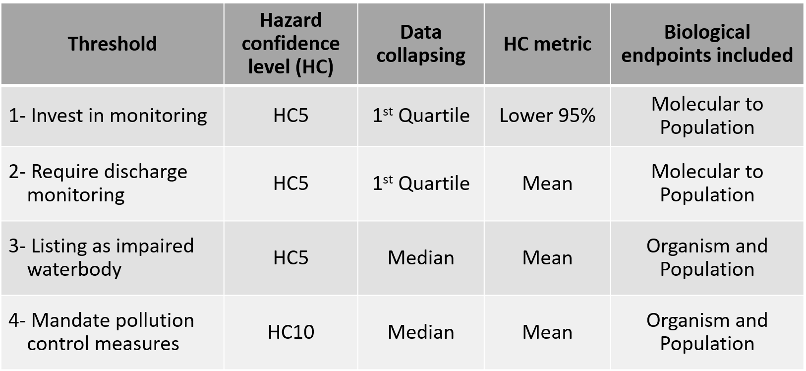
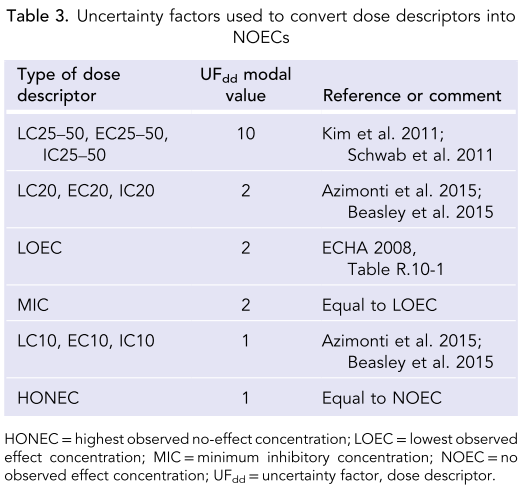
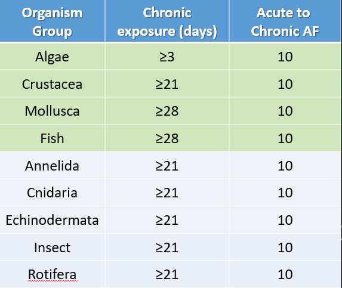
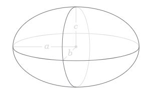

```{r Libraries, include = FALSE}

library(tidyverse)
library(calecopal)
library(ssdtools)
library(DT)
library(plotly)
library(gridExtra)
library(grid)
library(wesanderson)
library(ggdark)
library(broom)
library(knitr)
library(kableExtra)
library(viridis)
library(ggrepel)
library(scales)
library(gt)
library(ggsci)
library(openxlsx)

```

```{r Set Particle Size, include = FALSE}
###define sizes for filtering and alignment##
# smaller size bin
small_tier_lower_size <- 1 #um
small_tier_upper_size <- 5000 #um #size to align to
upper.tissue.trans.size.um <- 83 #um #set size for filtering data and x2M
# larger size bin
large_tier_lower_size <- 1 #um
large_tier_upper_size <- 5000 #um
```

```{r Aesthetics, include = FALSE}

#Theme
theme.type <- theme_bw(base_size = 12) +
              theme(plot.title = element_text(hjust = 0.5),
                    plot.subtitle = element_text(hjust = 0.5))

#Fill
fill.type <-  scale_fill_nejm()

#Color
color.type <- scale_color_nejm()

```

```{r Data Import, include = FALSE}
#Load aoc_z into dataframe. This file is generated from RDA_Maker.R
#Source("Tox Data/RDA_Maker.R")
aoc_z <- readRDS(file = "Tox Data/aoc_z.Rda")
```

#Framework Summary



The figure above displays the working threshold framework for the ambient threshold group for the Microplastics Health Effects Workshop. 

The current framework for generating SSDs includes the following parameters:

Data pertaining to only aquatic organisms are included (marine and freshwater).  

All taxa are included with the exception of bacterium and plants.  

HONEC (Highest Observed No Effect Concentration) are excluded.  

Assessment factors are applied to convert all other effect metrics into NOECs:



Reference: Wigger et al. 2020 (doi: 10.1002/ieam.4214)  

Assessment factors are applied to convert acute data into chronic:  



Green rows are from Wigger et al. 2020. Grey rows were agreed upon by the ambient threshold working group.

Reference: Wigger et al. 2020 (doi: 10.1002/ieam.4214)

Note: Values may be slightly different than those presented in the shiny app as concentrations are converted from particles/mL to particles/L ahead of calculations.

# Illustrative Example
## Re-scaling effect concentrations according to Ecological Relevent Metrics (ERMs)
### Particles
A monodisperse effect concentration (e.g. 10 micron polyethylene fragments) may be re-scaled to a default size range (e.g. 1 - 5,000 microns) using methods described in Kooi et al (2021). Re-scaling to a default size range allows direct comparison to exposure concentrations for a default size range (which may also be re-scaled). 

The effect concentration must first be corrected for bioavailability. If the suspected effect mechanism depends on ingestion of the particle, particles that are too large to be ingested by the organism of interest should be considered to not be bioavailable. Further, if toxicity depends on tissue translocation, particles too large to be translocated will be considered to be unavailable.

For an example, the tox database is queried to determine a real-world example. Studies in the database are filtered for all 'red' criteria, and only organismal and population-level biological organizations are considered, then default assessment metrics are applied.
```{r}
EC_mono <- aoc_z %>% 
  filter(species == "magna") %>% 
  filter(effect.metric == "NOEC") %>% 
  filter(tier_zero_tech_f == "Red Criteria Passed",
         tier_zero_risk_f == "Red Criteria Passed",
         bio_f %in% c("Organism", "Population")) %>% 
         mutate(dose_new = dose.particles.mL.master / (af.time * af.noec)) %>%  
         drop_na(dose_new) %>% 
         mutate(dose_new = dose_new * 1000) %>% 
  summarize(min.NOEC.particles.L = min(dose_new)) %>% 
  as.numeric()
```

The resulting real-life example of a *monodisperse* effect concentration is for a of a 40 um PE fragment for *C. Daphnia*. The minimum NOEC for acute mortality endpoints from these studies is:

```{r}
paste("40 um PE fragment Monodisperse Effect Concentration (C. Daphnia, acute mortality):", EC_mono, "(particles/L)")
```

In order to convert the *monodisperse* effect concentration to a *polydisperse* mixture of microplastic particles, a correction must occur which takes into consideration the ecologically relevant metric (ERM) [(Koelmans et al 2017)](https://europepmc.org/article/med/28971682). For a given ERM, the threshold may be related to both mono- or polydisperse particles interchangeably so long as the total magnitude of ERM remains the same (Koelmans et al, 2020). 

$EC_{poly} * \mu_{x,poly} = EC_{mono} * \mu_{x,mono}$

In this example of a monodisperse effect concentration for *C.Daphnia*, $EC_{mono}$ is in particle count per volume (i.e. 1e+05 particles/L), and $\mu_{x,mono}$ is the mean value of the ERM of interest in this study, which in the case of particle count, is 1. 
```{r}
mu_x.mono = 1
```

Particles follow a power law regime in the marine environment, so $\mu_{x,poly}$ may be calculated using the following equation (equation 4, Kooi et al 2021):

$\mu_{x,poly} = \frac{1 - a_{x}}{2 - a_{x}}  \frac{X^{2-a_x}_{UL} - X^{2-a_x}_{LL}}{X^{1-a_x}_{UL} - X^{1-a_x}_{LL}}$

Where $a_x$ relates to the power law distribution of microplastic particles in the marine environment (i.e. particle length; 2.07; Kooi et al 2021), and UL and LL are the upper and lower limits of bioavailability for this species/life stage/effect metric, respectively.

In this example, the organism of interest is *Cerodaphnia magna*, which has an average body length of 0.5 cm, and an estimated maximum ingestible particle width of 115 um particles based on average mouth size opening. Therefore, $L_{UL,m}$ would be equivalent to 115 um, and $L_{LL,m}$ would be the lower size range of the bin for which the SSD is built- in this example, 1 um as a lower limit. 

Note that if bioavailability for an ERM of interest is based on a different parameter (for example, tissue translocation potential), $L_{UL,m}$ would be equivalent to that size. A default assumption for an upper limit of tissue translocation for this exercise is 10 um.

$\mu_{x,poly}$ for particles for the 1-115 um fraction in the marine environment is then calculated:
```{r}
###### if alpha does not equal 2 #####
mux.polyfnx = function(a.x, 
                       x_UL, 
                       x_LL){
  mux.poly = ((1-a.x)/(2-a.x)) * ((x_UL^(2-a.x) - x_LL^(2-a.x))/(x_UL^(1-a.x) - x_LL^(1-a.x)))
  return(mux.poly)}

#define parameters for C.daphnia
upper.ingestible.length.um = 115
lower.ingestible.length.um = 1

# marine surface water alpha for length
alpha = 2.07

#compute
mu_x.poly <- mux.polyfnx(a.x = alpha, 
                         x_UL = upper.ingestible.length.um,
                         x_LL = lower.ingestible.length.um)
#report
paste("mu_x_poly:", round(mu_x.poly,2))
```
Now that $\mu_{x,poly}$, $\mu_{x,mono}$, and $EC_{mono}$ are known for this example, the *bioavailable* *polydisperse* effect concentration $EC_{poly}$ may then be calculated using the equation:

$EC_{poly} = \frac{EC_{mono} * \mu_{x,mono}}{\mu_{x,poly}}$

```{r}
EC_poly <- (EC_mono * mu_x.mono)/mu_x.poly
paste("EC_poly:",signif(EC_poly,5), "particles/L")
```
Now that the *bioavailable*, *polydisperse* effect concentration is known for this example, in order to relate this threshold effect concentration to an *environmentally relevant* (e.g. 1 - 5,000 um) range of particles ($EC_{env}$; particles/L) a further correction must occur using the following equation (equation 2; Kooi et al 2021):

$EC_{env} = EC_{poly} * CF_{bio}$

Where $CF_{bio}$ is a dimensionless correction factor for the bioavailable effect concentration. This equation  rescales the bioavailable effect concentration (particles/L) to an environmentally relevant concentration for the microplastics default (D) size range (e.g. 1 to 5,000 um) according to the power law distribution for length (L) with slope $\alpha_L$ in Table S4 of Kooi et al (2021). $CF_{bio}$ is calculated as follows (Kooi et al 2021):

$CF_{bio} = \frac{L^{1-a}_{UL,D} - L^{1-a}_{LL,D}}{L^{1-a}_{UL,B} - L^{1-a}_{LL,B}}$

In this example, the organism of interest is *Cerodaphnia magna*, which has an average body length of 0.5 cm, and an estimated maximum ingestible size range of 115 um particles, $L_{UL,B}$ would be equivalent to 115 um, and $L_{LL,B}$ would be the lower size range of the bin for which the SSD is built- in this example, 1 um as a lower limit. Further, the upper limit (UL,D) and lower limit (LL,D) of the default size range are 5,000 and 1 um, respectively.
```{r}
#function to derive correction factor (CF) from Koelmans et al (equation 2)
CFfnx = function(a, #default alpha from Koelmans et al (2020)
                 x2D, #set detault values to convert ranges to (1-5,000 um) #5mm is upper defuault 
                 x1D, #1 um is lower default size
                 x2M, x1M){
  
  CF = (x2D^(1-a)-x1D^(1-a))/(x2M^(1-a)-x1M^(1-a))
  
  return(CF)
}
### Define params for ###
alpha = alpha #table s4 for freshwater surface water
x2D_set = 5000
x1D_set = 1
x2M = 115
x1M = 1

# calculate CF_bio
CF_bio <- CFfnx(a = alpha, 
                x2D = x2D_set,
                x1D = x1D_set,
                x1M = x1M, 
                x2M = x2M)
paste("CF_bio = ",signif(CF_bio,4), "(unitless)")
```
Finally, the $EC_{env}$ is calculated for particles/L as an ERM:

```{r}
EC_env <- EC_poly * CF_bio
paste("EC_env = ",signif(EC_env,4), "Particles/L (1-5,000 um; marine surface water )")
```

### Volume

In the case of an ERM of interest being volume, $\mu_{x,mono}$ is equivalent to the average volume of a the monodisperse particle (i.e. $\mu_{v,mono}$), calculated as follows:

$\mu_{v,mono} = V_{i} = \frac{4}{3}\pi abc$

Where $V_i$ is the volume for a given particle *i*, and a, b, and c are radii along the principal axes, corresponding to one-half times the length, width, and height of an ellipsoid. Upper and lower limits of bioavailability for volume correspond to the maximum ingestible size of particles and the lower limit of the size range to be aligned to (typically 1 micron).


Image source: Wikipedia.com

The above equation can be applied to fragments, thin films, microbeads, spheres, or fibers given a known length to width ratios for such shapes, with the height assumed to be equivalent to 0.67 x width (Kooi et al 2021). Width to length ratios differ for microplastics differ by compartment, with averages ranging from 0.67 to 0.77 (Kooi et al 2021; Table S3). Averaged values may be used to estimate the volume of polydisperse environmental mixtures of microplastics.

Substituting $R_i$ for the length to width ratio of a particles, the formula simplifies to:

$V_i = 0.111667*pi*R_i^2*L_i^3$

Where $L_i$ is the length of the particle (um) and $R_i$ is the width:length ratio of the particle (unitless). 

For the example of a 40 um PE fragment, the length was reported ($L_i = 40 \mu m$), however the width was not reported by the authors, so a default value of 0.77 is used, which is the average for marine surface water ($R_i = 0.77$). 

$\mu_{v,mono}$ is calculated:
```{r}
volumefnx = function(R, L){
  volume = 0.111667 * pi * R^2 * L^3 #assumes height = 0.67 * Width, and Width:Length ratio is 'R' (compartment-specific)
  return(volume)}

mu_v.mono = volumefnx(R = 0.77,
                      L = 10)
paste("mu_v.mono = ", signif(mu_v.mono,3), "um^3")
```

$\mu_{v,poly}$ is then calculated using the volume of particles that are bioaccessible (based on mouth opening and particle length), the volume of particles for the lower limit of the size range of interest.

As discussed above, for the example of an organism of interest of *Cerodaphnia magna*, the estimated maximum ingestible size range is 115 um particles, $L_{UL,m}$ would be equivalent to 115 um, and $L_{LL,m}$ would be the lower size range of the bin for which the SSD is built- in this example, 1 um as a lower limit. Volumetric limits are calculated:

```{r}
R.ave = 0.77

x_LL_v = volumefnx(R = R.ave,
                      L = lower.ingestible.length.um)
x_UL_v = volumefnx(R = R.ave,
                      L = upper.ingestible.length.um)

paste("x_UL_v = ",signif(x_UL_v,3), "um^3",
      ";x_LL_v = ", signif(x_LL_v,3), "um^3")
```
$\mu_{v,poly}$ may now be calculated given these limits, using an alpha value of 1.48 for volume in the marine surface water environment (Kooi et al 2021):
```{r}
a.v = 1.48
#compute
mu_v.poly <- mux.polyfnx(a.x = a.v, 
                         x_UL = x_UL_v,
                         x_LL = x_LL_v)
#report
paste("mu_v_poly:", round(mu_v.poly,2), "um^3")
```
Now that $\mu_{v,poly}$, $\mu_{v,mono}$, and $EC_{mono}$ are known for this example for volume, the *bioavailable* *polydisperse* effect concentration $EC_{poly}$ for the volume ERM may then be calculated:

```{r}
EC_poly_v <- (EC_mono * mu_v.mono)/mu_v.poly
paste("EC_poly_v:",signif(EC_poly_v,5), "particles/L")
```
Again, to relate this *bioavailable*, *polydisperse* effect threshold ($EC_{poly,v}$) to an environmentally relevant *polydisperse* mixture of particles for the volume ERM, an additional correction must be applied to rescale the threshold to the size range of interest (e.g. 1-5,000 um) using $CF_{bio}$, identical as for particles. 

```{r}
EC_env_v <- EC_poly_v * CF_bio
paste("EC_env_v = ",signif(EC_env_v,4), "Particles/L (1-5,000 um; marine surface water )")
```

###  Surface Area
For surface area as an ERM, $\mu_{sa,mono}$ is equivalent to the average surface area ($SA$) of the *monodisperse* particle for the effect threshold, calculated as follows:

$\mu_{sa,mono} = SA = 4 \pi (\frac{(ab)^{1.6} + (ac)^{1.6} + (bc)^{1.6}}{3})^{1/1.6}$

With a, b, c being equal to 0.5x length, 0.5x width, and 0.5x height, respectively. 

For the example of a 40 um PE fragment, the length was reported ($a = 0.5* 40 \mu m$), however the width was not reported by the authors, so a default value of 0.77 is used ($b = 0.5 * 0.77 * 40 \mu m$), which is the average for marine surface water, and height is assumed to be 0.67 times the width ($c = 0.5 * 0.77 * 0.67 * 40 \mu m$) (Kooi et al 2021). Surface area is calculated:
```{r}
#surface area equation
SAfnx = function(a,
                 b,
                 c){
  SA = 4*pi*(((a*b)^1.6 + (a*c)^1.6 + (b*c)^1.6) / 3)^(1/1.6)
    return(SA)}
#calculate for 10 um fragment
mu_sa.mono = SAfnx(a = 0.5 * 40,
                   b = 0.5 * 0.77 * 40,
                   c = 0.5 * 0.77 * 0.67 * 40)

paste("mu_sa.mono = ", signif(mu_sa.mono,3), "um^2")
```

Since the probability distribution of ERM $sa$ (surface area) follows a power law regime, the mean ERM value for the polydisperse particles, $\mu_{sa,poly}$, can be calculated. For surface area of environmentally disperse particles, UL and LL are calculated using the equation for the surface area of an ellipsoid (above).

```{r}
# calculate lower
x_LL_sa = SAfnx(a = 0.5 * lower.ingestible.length.um, 
                b = 0.5 * 0.77 * lower.ingestible.length.um, 
                c = 0.5 * 0.77 * 0.67 *lower.ingestible.length.um)

# calculate lower
x_UL_sa = SAfnx(a = 0.5 * upper.ingestible.length.um, 
                b = 0.5 * 0.77 * upper.ingestible.length.um, 
                c = 0.5 * 0.77 * 0.67 *upper.ingestible.length.um)

paste("x_UL = ",round(x_UL_sa,2), "um^2",
      ";x_LL = ", round(x_LL_sa,2), "um^2")
```
$\mu_{sa,poly}$ may now be calculated given these limits, using an alpha value of 1.98 for surface area in the marine surface water environment (Kooi et al 2021):
```{r}
a.sa = 1.5
#compute
mu_sa.poly <- mux.polyfnx(a.x = a.sa, 
                         x_UL = x_UL_sa,
                         x_LL = x_LL_sa)
#report
paste("mu_sa_poly:", round(mu_sa.poly,2), "um^2")
```
Now that $\mu_{v,poly}$, $\mu_{v,mono}$, and $EC_{mono}$ are known for this example for surface area, the *bioavailable* *polydisperse* effect concentration $EC_{poly}$ for the surface area ERM may then be calculated:

```{r}
EC_poly_sa <- (EC_mono * mu_sa.mono)/mu_sa.poly
paste("EC_poly_sa:",signif(EC_poly_sa,5), "particles/L")
```
Again, to relate this *bioavailable*, *polydisperse* effect threshold ($EC_{poly,sa}$) to an environmentally relevant *polydisperse* mixture of particles for the surface area ERM, an additional correction must be applied to rescale the threshold to the size range of interest (e.g. 1-5,000 um) using $CF_{bio}$, identical as for particles. 

```{r}
EC_env_sa <- EC_poly_sa * CF_bio
paste("EC_env_sa = ",signif(EC_env_sa,4), "Particles/L (1-5,000 um; marine surface water )")
```

### Mass
In the case of an ERM of interest being total mass, $\mu_{x,mono}$ is equivalent to the average mass of a the monodisperse particle (i.e. $\mu_{m,mono}$), calculated as follows:

$\mu_{m,mono} = m = pV*\frac{1}{1e12}*1e6$

Where *m* is the mass (ug), *p* is density (g/cm^3), *V* is volume (um^3) - which is calculated by the cube of the radius of each particle (i.e. 1/2 * length, or 2.5 um), and additional conversion factors for g to ug (1e6) and cm^3 to um^3 (1e-12).

For the example of a 40 um polyethylene fragment, the volume was calculated above (~ $207 um^3$), and the density of polyethylene was is estimated to be 0.935 g/cm^3. $\mu_{x,mono}$ is calculated:

```{r}
massfnx = function(R, L, p){
  mass = p * #density (g/cm^3)
    0.111667 * pi * R^2 * L^3 * # volume (um^3): assumes height = 0.67 * Width, and Width:Length ratio is 'R' (compartment-specific)
    1/1e12 * 1e6 #correction factor
  return(mass)}

mu_m.mono <- massfnx(R = 0.77,  L = 40, p = 0.935)
paste("mu_m,mono:", signif(mu_m.mono,3),"ug")
```
Since the probability distribution of ERM $m$ (mass) follows a power law regime, the mean ERM value for the polydisperse particles, $\mu_{m,poly}$, can be calculated by first calculating the lower and upper ingestible masses of particles based on the length of the ingestible particle. The UL and LL are respectively defined as the upper and lower limit in ERM $m$ (mass) for which the mean is calculated, and $a_m$ is the power law exponent of mass. In the case of marine surface water,an $a_m$ of 1.32 is utilized (Kooi et al 2021; Table S4).

For mass, UL and LL are mass-based upper and lower limits of bioaccessibility based on the width of particles, respectively. To estimate mass-based limits based on size, the volume of bioaccessible particles is first calculated using the equation for the volume of an ellipsoid, then multipied by the average density of particles in the 1-5,000 um distribution in the environmental compartment of interest (e.g.surface marine water: 1.10 g/cm^3) (Kooi et al 2021; table S3).

```{r}
p.ave = 1.1

#lower limit
x_LL_m = massfnx(R = R.ave, #width to length ratio
               L = lower.ingestible.length.um, #lower bioaccessible length
               p = p.ave) #average density
#upper limit
x_UL_m = massfnx(R = R.ave, #width to length ratio
               L = upper.ingestible.length.um, #upper bioaccessible length
               p = p.ave) #average density

paste("x_UL = ",signif(x_UL_m,2), "ug",
      ";x_LL = ", signif(x_LL_m,2), "ug")
```

$\mu_{m,poly}$ may now be calculated given these limits, using an alpha value of $a_m$ of 1.32 for the marine surface water environment (Kooi et al 2021):
```{r}
a.m = 1.32
#compute
mu_m.poly <- mux.polyfnx(a.x = a.m, 
                         x_UL = x_UL_m,
                         x_LL = x_LL_m)
#report
paste("mu_m_poly:", signif(mu_m.poly,2), "ug")
```

Now that $\mu_{m,poly}$, $\mu_{m,mono}$, and $EC_{mono}$ are known for this example for mass, the *bioavailable* *polydisperse* effect concentration $EC_{poly}$ for the mass ERM may then be calculated:

```{r}
EC_poly_m <- (EC_mono * mu_m.mono)/mu_m.poly
paste("EC_poly_m:",signif(EC_poly_m,5), "particles/L")
```
Again, to relate this *bioavailable*, *polydisperse* effect threshold ($EC_{poly,sa}$) to an environmentally relevant *polydisperse* mixture of particles for the mass ERM, an additional correction must be applied to rescale the threshold to the size range of interest (e.g. 1-5,000 um) using $CF_{bio}$, identical as for particles. 

```{r}
EC_env_m <- EC_poly_m * CF_bio
paste("EC_env_m = ",signif(EC_env_m,4), "Particles/L (1-5,000 um; marine surface water)")
```

### Specific Surface Area

In the case of an ERM of interest being specific surface area, $\mu_{ssa,mono}$ is equivalent to the surface area of a 5 um PS sphere (i.e. $\mu_{sa,mono}$) divided by the mass (i.e. $\mu_{m,mono}$), calculated as follows:

$\mu_{sa,mono} = SSA = \frac{SA}{m}$

Where *SA* is the surface area (um^2) of the particle, and *m* is the mass (ug).

```{r}
mu_ssa.mono = mu_sa.mono/mu_m.mono
paste("mu_ssa,mono:", formatC(mu_ssa.mono,format = "e", digits = 2),"um^2/ug")
```

Since the probability distribution of ERM $ssa$ (specific surface area) follows a power law regime, the mean ERM value for the polydisperse particles, $\mu_{ssa,poly}$, can be calculated, where UL and LL are respectively defined as the upper and lower limit in ERM $ssa$ (ssa) for which the mean is calculated, and $a_ssa$ is the power law exponent of specific surface area. For example, marine surface water has an $a_ssa$ of 1.98 (Kooi et al 2021; Table S4). For specific surface area, UL and LL are area/mass-based upper and lower limits of bioaccessibility based on the width of particles, respectively. To estimate area/mass-based limits based on size, the volume of bioaccessible particles  is first calculated using the equation for the surface area of an ellipsoid, then divided by the lower and upper bioavailable  mass of particles in the 1-5,000 um distribution in surface marine water, as calculated above.

```{r}
#max ingestible specific surface area
SSAfnx = function(sa,
                  m){
  SSA = sa/m
    return(SSA)}

#calculate
x_LL_ssa = SSAfnx(sa = x_LL_sa, m = x_LL_m)
x_UL_ssa = SSAfnx(sa = x_UL_sa, m = x_UL_m)

#report
paste("x_UL_ssa = ", signif(x_UL_ssa,3), "um^2/ug",
      ";x_LL_ssa = ", signif(x_LL_ssa,3), "um^2/ug")
```

$\mu_{m,poly}$ may now be calculated given these limits, using an alpha value of $a_ssa$ of 1.98 for the marine surface water environment (Kooi et al 2021):
```{r}
a.ssa = 1.98 # A_SSA for marine surface water
  
mu_ssa.poly <- mux.polyfnx(a.x = a.ssa, 
            x_UL = x_UL_ssa,
            x_LL = x_LL_ssa) 

paste("mu_ssa,poly =",signif(mu_ssa.poly,3), "um^2/ug")
```

Now that $\mu_{ssa,poly}$, $\mu_{ssa,mono}$, and $EC_{mono}$ are known for this example for specific surface area, the *bioavailable* *polydisperse* effect concentration $EC_{poly}$ for the specific surface area ERM may then be calculated:

```{r}
EC_poly_ssa <- (EC_mono * mu_ssa.mono)/mu_ssa.poly
paste("EC_poly_ssa:",signif(EC_poly_ssa,5), "particles/L")
```
Again, to relate this *bioavailable*, *polydisperse* effect threshold ($EC_{poly,ssa}$) to an environmentally relevant *polydisperse* mixture of particles for the specific surface area ERM, an additional correction must be applied to rescale the threshold to the size range of interest (e.g. 1-5,000 um) using $CF_{bio}$, identical as for particles. 

```{r}
EC_env_ssa <- EC_poly_ssa * CF_bio
paste("EC_env_ssa = ",signif(EC_env_ssa,4), "Particles/L (1-5,000 um; marine surface water)")
```

## Aligning Occurence Data for Risk Characterization
Given an upper limit (UL) and lower limit (LL) of the measured (M) and default size range (D), a dimensionless correction factor ($CF_{meas}$) for measured environmental concentrations may be calculated, which rescales the measured (M) number concentrations for a certain size range to the number concentration for the microplastics default (D) size range (e.g. 1 to 5,000 um) according to the power law distribution for length (L) with slope $\alpha_L$ in Table S4 of Kooi et al (2021). 

The following equation for $CF_{meas}$ is identical for effect concentration ($CF_{Bio}$) except the bioavailable fraction of particles is denoted as UL,B and LL,B on the denominator (Koelmans et al., 2020; Kooi et al., 2021).

$CF_{Meas} = \frac{L^{1-a}_{UL,D} - L^{1-a}_{LL,D}}{L^{1-a}_{UL,M} - L^{1-a}_{LL,M}}$

For example, a marine surface water concentration of 10 particles/L for 300 - 5,000 um is used.
```{r}
C_meas = 10
paste("C_meas =",C_meas, "particles/L (300 - 5,000 um; marine surface water)")
```
To compare this concentration to the environmentally relevant (1 - 5,000 um) effect threshold (EC_env) in particles/L (calculated above), $CF_{meas}$ is first calculated.

```{r}
### Define params for ###
alpha = alpha #table s4 for freshwater surface water
x2D_set = 5000
x1D_set = 1
x2M = 5000
x1M = 300

# calculate CF_bio
CF_meas <- CFfnx(a = alpha, 
                x2D = x2D_set,
                x1D = x1D_set,
                x1M = x1M, 
                x2M = x2M)
paste("CF_meas = ",signif(CF_meas,4), "(unitless)")
```

The resulting correction factor ($CF_{meas}$ (unitless) is then multiplied by the measured concentration ($C_{Meas}$) to obtain a rescaled exposure number concentration $C_{Env} =  CF_{meas} x C_{meas}$.
```{r}
C_env <- CF_meas * C_meas
paste("C_env =",signif(C_env,4), "particles/L (1 - 5,000 um; marine surface water)")
```
This measured rescaled environmental concentration $C_{env}$ may then be directly compared to the rescaled effect thresholds for various ERM $EC_{env,x}$ to determine if risk is present using the traditional PNEC/PEC formula:

```{r}
risk <- tibble('ERM' = c("Particles", "Volume", "Surface Area", "Mass", "Specific Surface Area"),
               'EC_env' = c(EC_env, EC_env_v, EC_env_sa, EC_env_m, EC_env_ssa)) %>% 
  mutate('PNEC/PEC' = EC_env / C_env)

# build gt table
full_val_range_1 <- risk %>% 
    ungroup %>% 
    select_if(is.numeric) %>% 
    range

gt(risk) %>% 
  tab_header(title = "1-5,000 um Thresholds (Aligned) Compared to Environmental Concentration
             (4,703 particles/L)", 
             subtitle = "Thresholds presented in particles/L") %>% 
  fmt_number(columns = vars(EC_env, 'PNEC/PEC'),
             n_sigfig = 2,
             use_seps = TRUE) %>% 
    data_color(
    columns = names(risk)[2:3],
    colors = scales::col_numeric(
      palette = paletteer::paletteer_d(palette = "ggsci::teal_material") %>% as.character(),
      domain = full_val_range_1),
    alpha = 0.75) %>% 
    tab_options(column_labels.hidden = FALSE) #%>% 
    #as_raw_html() # return as htmlk 
```

In this case, the environmental concentration is nearly 5x lower than the effect threshold for particles, so exceedance of a NOEC for this particular endpoint/species (i.e. mortality,*C.Daphnia*) would not be expected to occur for that ERM. However, in the case of specific surface area as an ERM, risk is exceeded by a factor of 1.32.

The above approach used for particles as an ecologically relevent metric may be applied for any other ecologically relevent metric for which particle distributions are characterized in the environmental compartment of interest. Below are proofs for additional ERM, including surface area, volume, mass, and specific surface area.

# ERM/SSD Calculations
The following script utilizes the above equations to calculate *a priori* effect thresholds for each of the ERM of interest for each species in the database, then calculates species sensitivity distributions using each ERM.

*Data Filtering by Quality*
```{r}
## First filter data with global filters
aoc_intermediate <- aoc_z %>% 
  filter(!environment %in% c("Terrestrial", "Not Reported"),
         org_f != "Bacterium",
         org_f != "Plant",
    effect.metric != "HONEC",
    tier_zero_tech_f == "Red Criteria Passed",
         tier_zero_risk_f == "Red Criteria Passed", #All thresholds must pass technical and risk red criteria
         risk.13 != 0 #Drop studies that received a score of 0 for endpoints criteria (this also drops studies that have not yet been scored) - KEEP THIS AFTER THE RED CRITERIA FILTERS  
         ) %>% 
  #Remove 26C temperature treatment data from Jaimukar et al. 2018
  filter(!(article == 42 & media.temp == 26)) %>% 
  mutate(max.size.ingest.um = 1000 * max.size.ingest.mm) #makes it less confusing below
#### Ecologically Relevant Metric calculations ####

#examine available data as histogram
Group_size <- aoc_intermediate %>% 
  ggplot(aes(x = size.length.um.used.for.conversions, fill = Group)) +
  geom_histogram(bins = 25) +
  scale_fill_manual(values = cal_palette(name = "superbloom1", type = "continuous", n = 9)) +
  labs(title = "Filtered Data by Group") +
  ylab("# of observations")+
  xlab("Length (um)") +
  theme.type +
  scale_x_log10()

endpoint_size <- aoc_intermediate %>% 
  ggplot(aes(x = size.length.um.used.for.conversions, fill = lvl1_f)) +
  geom_histogram(bins = 25) +
   scale_fill_manual(name = "General Endpoint", values = cal_palette(name = "superbloom3", type = "continuous", n = 9)) +
  xlab("Particle Length (um)") +
  ylab("# of observations")+
  labs(title = "Filtered Data by General Endpoint") +
  theme.type +
  scale_x_log10()

#arrange histograms
grid.arrange(Group_size, endpoint_size)
```
```{r}
#examine available data as bar plots
species_size_f <- aoc_intermediate %>% 
  distinct(Species, size_f) %>% 
  ggplot(aes(x = size_f, fill = Species)) +
  geom_bar() +
  scale_fill_manual(values = cal_palette(name = "superbloom1", type = "continuous", n = 35)) +
  labs(title = "Number of Species by Particle Length",
       subtitle = "Red criteria passed only, aquatic species (subcell to population organization)") +
  xlab("Length (um)") +
  ylab("# of Species")+
  theme.type 
  
  
endpoint_size_f <- aoc_intermediate %>% 
   distinct(lvl1_f, size_f) %>% 
  ggplot(aes(x = size_f, fill = lvl1_f)) +
  geom_bar() +
  scale_fill_manual(name = "General Endpoint", values = cal_palette(name = "superbloom3", type = "continuous", n = 6)) +
  labs(title = "Filtered Data by General Endpoint",
       subtitle = "Red criteria passed only, aquatic species (subcell to population organization)") +
  ylab("# of Endpoints")+
  xlab("Particle Length (um)") +
  theme.type 

#arrange histograms
grid.arrange(species_size_f, endpoint_size_f)
```
Do these size bins make sense for the endpoints of interest? I.e.food dilution and ROS.
```{r}
# determine if ROS is shown for any studies (no filtering)
ROS_size_allData <- aoc_z %>% 
  filter(lvl2_f %in% "Oxidative Stress") %>% 
  ggplot(aes(x = size.length.um.used.for.conversions, fill = lvl2_f)) +
  geom_histogram(bins = 25) +
  xlab("Length (um)") +
  ylab("# of observations")+
  labs(title = "All Data by Oxidative Stress",
       subtitle = "Includes all data - no filters for quality") +
  theme.type +
  scale_x_log10()

# determine if ROS is shown for organismal studies with high quality
ROS_size_filteredData <- aoc_intermediate %>%
   #filter(#risk.13 != 1, #Drop studies that only scored a 1 for endpoints criteria
    #     bio_f %in% c("Organism", "Population")) %>% #limit to endpoints measured at the organism or population level
  filter(lvl2_f %in% "Oxidative Stress") %>% 
  ggplot(aes(x = size.length.um.used.for.conversions, fill = lvl2_f)) +
  geom_histogram(bins = 25) +
  xlab("Length (um)") +
  ylab("# of observations")+
  labs(title = "Data by Oxidative Stress",
       subtitle = "Includes only high-quality data") +
  theme.type +
  scale_x_log10()

grid.arrange(ROS_size_allData, ROS_size_filteredData)
```


*Data Alignments*
```{r}
###function to derive correction factor (CF) from Koelmans et al (equation 2)
CFfnx = function(a, #default alpha from Koelmans et al (2020)
                 x2D, #set detault values to convert ranges to (1-5,000 um) #5mm is upper defuault 
                 x1D, #1 um is lower default size
                 x2M, x1M){
  CF = (x2D^(1-a)-x1D^(1-a))/(x2M^(1-a)-x1M^(1-a)) 
  return(CF)}

#### equations for mu_x_poly (note that there are three depending on certain alphas for limits of equation)
###### if alpha does not equal 2 #####
mux.polyfnx = function(a.x, 
                       x_UL, 
                       x_LL){
  mux.poly = ((1-a.x)/(2-a.x)) * ((x_UL^(2-a.x) - x_LL^(2-a.x))/(x_UL^(1-a.x) - x_LL^(1-a.x)))
  return(mux.poly)}

##### If alpha does equal 2 #####
mux.polyfnx.2 = function(x_UL,x_LL){
  mux.poly = (log(x_UL/x_LL))/(x_LL^(-1) - x_UL^-1)
  return(mux.poly)}

### Calculating max ingestible parameters ###
## function to calcualte min and max ingestible surface area ##
SAfnx = function(a, # a = 0.5 * length
                 b, # b = 0.5 * width
                 c # c = 0.5 * height (note that hieght is 0.67 * width)
){
  SA = 4*pi*(((a*b)^1.6 + (a*c)^1.6 + (b*c)^1.6) / 3)^(1/1.6)
  return(SA)}

## max ingestible volume ##
volumefnx = function(R, L){
  volume = 0.111667 * pi * R^2 * L^3 #assumes height = 0.67 * Width, and Width:Length ratio is 'R' (compartment-specific)
  return(volume)}

#max ingestible mass
massfnx = function(R, L, p){
  mass = p * #density (g/cm^3)
    0.111667 * pi * R^2 * L^3 * # volume (um^3): assumes height = 0.67 * Width, and Width:Length ratio is 'R' (compartment-specific)
    1/1e12 * 1e6 #correction factors
  return(mass)}

#max ingestible specific surface area
SSAfnx = function(sa, #surface area, calcaulted elsewhere
                  m){ #mass, calculated elsewhere
  SSA = sa/m
    return(SSA)}

## parametrization ##
# Define params for correction #
alpha = 2.07 #table s4 for marine surface water. length
# define parameters for power law coefficients
a.sa = 1.5 #marine surface area power law
a.v = 1.48 #a_V for marine surface water volume
a.m = 1.32 # upper limit fora_m for mass for marine surface water in table S4 
a.ssa = 1.98 # A_SSA for marine surface water

#define additional parameters for calculations based on averages in the environment
R.ave = 0.77 #average width to length ratio for microplastics in marine enviornment
p.ave = 1.10 #average density in marine surface water


##### SMALL TIER DATA ####
### Set size limits for tier
x2D_set = small_tier_upper_size #upper size range (default)
x1D_set = small_tier_lower_size #lower size range (default)
x1M_set = small_tier_lower_size #lower size range for measured

# calculate ERM for each species
aoc_final_small <- aoc_intermediate  %>% 
   # define upper size length for Translocation
  mutate(x2M = case_when(is.na(max.size.ingest.um) ~ upper.tissue.trans.size.um, 
                         max.size.ingest.um  < upper.tissue.trans.size.um ~  max.size.ingest.um,
                         max.size.ingest.um  > upper.tissue.trans.size.um ~ upper.tissue.trans.size.um)) %>%  #set to 10um for upper limit or max size ingest, whichever is smaller
 # calculate effect threshold for particles
  mutate(EC_mono_p.particles.mL = dose.particles.mL.master) %>% 
  mutate(mu.p.mono = 1) %>% #mu_x_mono is always 1 for particles to particles
  mutate(mu.p.poly = mux.polyfnx(a.x = alpha, #alpha for particles
                                 x_UL= x2M, #upper ingestible size limit (width of particle)
                                 x_LL = x1M_set)) %>% 
  # polydisperse effect threshold for particles
  mutate(EC_poly_p.particles.mL = (EC_mono_p.particles.mL * mu.p.mono)/mu.p.poly) %>% 
   #calculate CF_bio for all conversions
  mutate(CF_bio = CFfnx(x1M = x1M_set,#lower size bin
                        x2M = x2M, #upper ingestible
                        x1D = x1D_set, #default
                        x2D = x2D_set,  #default
                        a = alpha)) %>%  
  ## Calculate environmentally relevant effect threshold for particles
  mutate(EC_env_p.particles.mL = EC_poly_p.particles.mL * CF_bio) %>%  #aligned particle effect concentraiton (1-5000 um)
  
  #### Surface area ERM ####
  mutate(mu.sa.mono = particle.surface.area.um2) %>% #define mu_x_mono for alignment to ERM
  #calculate lower ingestible surface area
  mutate(x_LL_sa = SAfnx(a = 0.5 * x1D_set, 
                         b = 0.5 * R.ave * x1D_set, 
                         c = 0.5 * R.ave * 0.67 * x1D_set)) %>%  
  #calculate upper ingestible surface area
  mutate(x_UL_sa = SAfnx(a = 0.5 * x2M, 
                         b = 0.5 * R.ave *x2M, 
                         c = 0.5 * R.ave * 0.67 * x2M)) %>%  
  #calculate mu_x_poly for surface area
  mutate(mu.sa.poly = if(a.sa == 2){mux.polyfnx.2(x_UL_sa, x_LL_sa)} else if (a.sa != 2){mux.polyfnx(a.sa, x_UL_sa, x_LL_sa)}) %>% 
  #calculate polydisperse effect concentration for surface area (particles/mL)
  mutate(EC_poly_sa.particles.mL = (EC_mono_p.particles.mL * mu.sa.mono)/mu.sa.poly) %>%  
  #calculate environmentally realistic effect threshold
  mutate(EC_env_sa.particles.mL = EC_poly_sa.particles.mL * CF_bio) %>% 
  
  #### volume ERM ####
#define mu_x_mono for alignment to ERM
  mutate(mu.v.mono = particle.volume.um3) %>% 
  #calculate lower ingestible volume 
  mutate(x_LL_v = volumefnx(R = R.ave,
                            L = x1D_set)) %>%
  #calculate maximum ingestible volume 
  mutate(x_UL_v = volumefnx(R = R.ave,
                            L = x2M)) %>%  
  # calculate mu.v.poly
  mutate(mu.v.poly = if(a.v == 2){mux.polyfnx.2(x_UL_v, x_LL_v)} else if (a.v != 2){mux.polyfnx(a.v, x_UL_v, x_LL_v)}) %>% 
  #calculate polydisperse effect concentration for volume (particles/mL)
  mutate(EC_poly_v.particles.mL = (EC_mono_p.particles.mL * mu.v.mono)/mu.v.poly) %>%  
    #calculate environmentally realistic effect threshold
  mutate(EC_env_v.particles.mL = EC_poly_v.particles.mL * CF_bio) %>% 
  
  #### mass ERM ###
  #define mu_x_mono for alignment to ERM (ug)
  mutate(mu.m.mono = mass.per.particle.mg * 1000) %>% 
  #calculate lower ingestible mass
  mutate(x_LL_m = massfnx(R = R.ave, L = x1D_set, p = p.ave)) %>%  
  #calculate upper ingestible mass
  mutate(x_UL_m = massfnx(R = R.ave, L = x2M, p = p.ave)) %>%  
  # calculate mu.m.poly
  mutate(mu.m.poly = if(a.m == 2){mux.polyfnx.2(x_UL_m, x_LL_m)} else if (a.m != 2){mux.polyfnx(a.m, x_UL_m, x_LL_m)}) %>% 
  #calculate polydisperse effect concentration for volume (particles/mL)
  mutate(EC_poly_m.particles.mL = (EC_env_p.particles.mL * mu.m.mono)/mu.m.poly) %>%
  #calculate environmentally realistic effect threshold
  mutate(EC_env_m.particles.mL = EC_poly_m.particles.mL * CF_bio) %>% 
  
  ##### specific surface area ERM ####
  mutate(mu.ssa.mono = mu.sa.mono/mu.m.mono) %>% #define mu_x_mono for alignment to ERM (um^2/ug)
  #calculate lower ingestible SSA
  mutate(x_LL_ssa = SSAfnx(sa = x_LL_sa, #surface area
                           m = x_LL_m) #mass
         ) %>% 
  #calculate upper ingestible SSA  (um^2/ug)
  mutate(x_UL_ssa = SSAfnx(sa = x_UL_sa, #surface area
                           m = x_UL_m) #mass
         ) %>% 
  #calculate mu_x_poly for specific surface area
  mutate(mu.ssa.poly = if(a.ssa == 2){mux.polyfnx.2(x_UL_ssa, x_LL_ssa)} else if (a.ssa != 2){mux.polyfnx(a.ssa, x_UL_ssa, x_LL_ssa)}) %>% 
  #calculate polydisperse effect concentration for specific surface area (particles/mL)
  mutate(EC_poly_ssa.particles.mL = (EC_env_p.particles.mL * mu.ssa.mono)/mu.ssa.poly) %>% 
  #calculate environmentally realistic effect threshold
  mutate(EC_env_ssa.particles.mL = EC_poly_ssa.particles.mL * CF_bio)
```

```{r Data Alignments-2}
##### SMALL TIER DATA ####
### Set size limits for tier
x2D_set <- large_tier_upper_size #upper size range (default)
x1D_set <- large_tier_lower_size #lower size range (default)
x1M_set <- large_tier_lower_size #lower size range for measured
# calculate ERM for each species

aoc_final_large <- aoc_intermediate  %>% 
  # define upper size WIDTH for ingestion (based on average width:length ratio)
  mutate(x2M = case_when(is.na(max.size.ingest.um) ~ (1/R.ave) * x2D_set, #all calculations below occur for length. Width is R.ave * length, so correcting here makes width the max size ingest below
                         (max.size.ingest.um * (1/R.ave)) < x2D_set ~ ((1/R.ave) * max.size.ingest.um),
                         (max.size.ingest.um * (1/R.ave)) > x2D_set ~ (x2D_set * (1/R.ave))
                         )) %>%  #set to 10um for upper limit or max size ingest, whichever is smaller
 # calculate effect threshold for particles
  mutate(EC_mono_p.particles.mL = dose.particles.mL.master) %>% 
  mutate(mu.p.mono = 1) %>% #mu_x_mono is always 1 for particles to particles
  mutate(mu.p.poly = mux.polyfnx(a.x = alpha, #alpha for particles
                                 x_UL= x2M, #upper ingestible size limit
                                 x_LL = x1M_set)) %>% 
  # polydisperse effect threshold for particles
  mutate(EC_poly_p.particles.mL = (EC_mono_p.particles.mL * mu.p.mono)/mu.p.poly) %>% 
   #calculate CF_bio for all conversions
  mutate(CF_bio = CFfnx(x1M = x1M_set,#lower size bin
                        x2M = x2M, #upper ingestible
                        x1D = x1D_set, #default
                        x2D = x2D_set,  #default
                        a = alpha)) %>%  
  ## Calculate environmentally relevant effect threshold for particles
  mutate(EC_env_p.particles.mL = EC_poly_p.particles.mL * CF_bio) %>%  #aligned particle effect concentraiton (1-5000 um)
  
  #### Surface area ERM ####
  mutate(mu.sa.mono = particle.surface.area.um2) %>% #define mu_x_mono for alignment to ERM
  #calculate lower ingestible surface area
  mutate(x_LL_sa = SAfnx(a = 0.5 * x1D_set, 
                         b = 0.5 * R.ave * x1D_set, 
                         c = 0.5 * R.ave * 0.67 * x1D_set)) %>%  
  #calculate upper ingestible surface area
  mutate(x_UL_sa = SAfnx(a = 0.5 * x2M, 
                         b = 0.5 * R.ave *x2M, 
                         c = 0.5 * R.ave * 0.67 * x2M)) %>%  
  #calculate mu_x_poly for surface area
  mutate(mu.sa.poly = if(a.sa == 2){mux.polyfnx.2(x_UL_sa, x_LL_sa)} else if (a.sa != 2){mux.polyfnx(a.sa, x_UL_sa, x_LL_sa)}) %>% 
  #calculate polydisperse effect concentration for surface area (particles/mL)
  mutate(EC_poly_sa.particles.mL = (EC_mono_p.particles.mL * mu.sa.mono)/mu.sa.poly) %>%  
  #calculate environmentally realistic effect threshold
  mutate(EC_env_sa.particles.mL = EC_poly_sa.particles.mL * CF_bio) %>% 
  
  #### volume ERM ####
#define mu_x_mono for alignment to ERM
  mutate(mu.v.mono = particle.volume.um3) %>% 
  #calculate lower ingestible volume 
  mutate(x_LL_v = volumefnx(R = R.ave,
                            L = x1D_set)) %>%
  #calculate maximum ingestible volume 
  mutate(x_UL_v = volumefnx(R = R.ave,
                            L = x2M)) %>%  
  # calculate mu.v.poly
  mutate(mu.v.poly = if(a.v == 2){mux.polyfnx.2(x_UL_v, x_LL_v)} else if (a.v != 2){mux.polyfnx(a.v, x_UL_v, x_LL_v)}) %>% 
  #calculate polydisperse effect concentration for volume (particles/mL)
  mutate(EC_poly_v.particles.mL = (EC_mono_p.particles.mL * mu.v.mono)/mu.v.poly) %>%  
    #calculate environmentally realistic effect threshold
  mutate(EC_env_v.particles.mL = EC_poly_v.particles.mL * CF_bio) %>% 
  
  #### mass ERM ###
  #define mu_x_mono for alignment to ERM (ug)
  mutate(mu.m.mono = mass.per.particle.mg * 1000) %>% 
  #calculate lower ingestible mass
  mutate(x_LL_m = massfnx(R = R.ave, L = x1D_set, p = p.ave)) %>%  
  #calculate upper ingestible mass
  mutate(x_UL_m = massfnx(R = R.ave, L = x2M, p = p.ave)) %>%  
  # calculate mu.m.poly
  mutate(mu.m.poly = if(a.m == 2){mux.polyfnx.2(x_UL_m, x_LL_m)} else if (a.m != 2){mux.polyfnx(a.m, x_UL_m, x_LL_m)}) %>% 
  #calculate polydisperse effect concentration for volume (particles/mL)
  mutate(EC_poly_m.particles.mL = (EC_env_p.particles.mL * mu.m.mono)/mu.m.poly) %>%
  #calculate environmentally realistic effect threshold
  mutate(EC_env_m.particles.mL = EC_poly_m.particles.mL * CF_bio) %>% 
  
  ##### specific surface area ERM ####
  mutate(mu.ssa.mono = mu.sa.mono/mu.m.mono) %>% #define mu_x_mono for alignment to ERM (um^2/ug)
  #calculate lower ingestible SSA
  mutate(x_LL_ssa = SSAfnx(sa = x_LL_sa, #surface area
                           m = x_LL_m) #mass
         ) %>% 
  #calculate upper ingestible SSA  (um^2/ug)
  mutate(x_UL_ssa = SSAfnx(sa = x_UL_sa, #surface area
                           m = x_UL_m) #mass
         ) %>% 
  #calculate mu_x_poly for specific surface area
  mutate(mu.ssa.poly = if(a.ssa == 2){mux.polyfnx.2(x_UL_ssa, x_LL_ssa)} else if (a.ssa != 2){mux.polyfnx(a.ssa, x_UL_ssa, x_LL_ssa)}) %>% 
  #calculate polydisperse effect concentration for specific surface area (particles/mL)
  mutate(EC_poly_ssa.particles.mL = (EC_env_p.particles.mL * mu.ssa.mono)/mu.ssa.poly) %>% 
  #calculate environmentally realistic effect threshold
  mutate(EC_env_ssa.particles.mL = EC_poly_ssa.particles.mL * CF_bio)
```

## ERM = Unaligned
```{r}
ERM <- "Unaligned"
```

### Tiers 1 & 2

Tier 1 and 2 are the same SSD. A different HC metric is selected to differentiate between the tiers. Specifically, Tier 1 uses the 95% CI whereas Tier 2 uses the Mean. See below for more details of specific parameters. 

Hazard Confidence Level = HC5  

Endpoints = All  

Levels of Biological Organization = All  

HC Metric = 95% CI (Tier 1); Mean (Tier 2)  

Data Quality = Pass Technical Quality Red Criteria

#### Data Filtering

```{r}
#Food Dilution
tier1_2_large <- aoc_final_large %>% 
         mutate(dose_new = dose.particles.mL.master / (af.time * af.noec)) %>%  
         drop_na(dose_new) %>% 
         mutate(dose_new = dose_new * 1000) %>% 
  filter(between(size.length.um.used.for.conversions,large_tier_lower_size, large_tier_upper_size)) 

# Count observations and studies
tier1_2_large.obs <- tier1_2_large %>% summarize(n.obs = n(), n.studies = n_distinct(doi), n.taxa = n_distinct(org_f), n.species = n_distinct(species_f))

#Translocation
tier1_2_small <- aoc_final_small %>% 
         mutate(dose_new = dose.particles.mL.master / (af.time * af.noec)) %>%  
         drop_na(dose_new) %>% 
         mutate(dose_new = dose_new * 1000) %>% 
  filter(between(size.length.um.used.for.conversions, small_tier_lower_size, upper.tissue.trans.size.um)) 
  
# Count observations and studies
tier1_2_small.obs <- tier1_2_small %>% summarize(n.obs = n(), n.studies = n_distinct(doi), n.taxa = n_distinct(org_f), n.species = n_distinct(species_f))
```

#### Endpoint Representation

```{r, include = TRUE, message = FALSE, warning = FALSE, fig.height = 6, fig.width = 10}
#large
endpoints_tier1_2_large <- tier1_2_large %>% 
  group_by(lvl1_f, bio_f) %>% 
  mutate(lvl1_count = n()) %>% 
  group_by(lvl1_f, lvl1_count, bio_f) %>% 
  summarise() %>%  
  ggplot(aes(x = lvl1_f, y=lvl1_count, fill = bio_f))+
  geom_bar(stat = "identity") +
  scale_fill_manual(values = wes_palette("Zissou1", 5, type = "continuous")) +
  labs(title = "Tier 1 & 2, Endpoint Representation", subtitle = "1µm - 5mm", x = "Endpoint Category", y = "Number of Endpoints", fill = "Biological Level\nof Organization", caption = "Number of endpoints is prior to data collapse") +
  theme_test() +
  scale_x_discrete(labels = wrap_format(10)) 
        

plot(endpoints_tier1_2_large)

#small
endpoints_tier1_2_small <- tier1_2_small %>% 
  group_by(lvl1_f, bio_f) %>% 
  mutate(lvl1_count = n()) %>% 
  group_by(lvl1_f, lvl1_count, bio_f) %>% 
  summarise() %>%  
  ggplot(aes(x = lvl1_f, y=lvl1_count, fill = bio_f))+
  geom_bar(stat = "identity") +
  scale_fill_manual(values = wes_palette("Zissou1", 5, type = "continuous")) +
  labs(title = "Tier 1 & 2, Endpoint Representation", subtitle = "1µm < 83µm", x = "Endpoint Category", y = "Number of Endpoints", fill = "Biological Level\nof Organization", caption = "Number of endpoints is prior to data collapse") +
  theme_test() +
  scale_x_discrete(labels = wrap_format(10)) 
        

plot(endpoints_tier1_2_small)
```

#### SSD Build
##### Data Collapse
```{r, include = TRUE, warning = FALSE, message = FALSE}

#Food Dilution First Quartile
tier1_2_large_1q <- tier1_2_large %>% 
  group_by(Species, Group) %>% 
  summarize(Conc = quantile(dose_new, 0.25))

#Translocation First Quartile
tier1_2_small_1q <- tier1_2_small %>% 
  group_by(Species, Group) %>% 
  summarize(Conc = quantile(dose_new, 0.25))

```

##### Food Dilution (1 - 5000 µm) 

```{r include = TRUE, warning = FALSE, fig.height = 6, fig.width = 10}
###### Modelling ####
dists_tier1_2_large_1q <- ssd_fit_dists(tier1_2_large_1q, left = "Conc", dists = c("weibull", "llogis", "lnorm", "gamma", "lgumbel"), computable = FALSE, silent = FALSE) 

#autoplot(dists_tier1_2_large_1q) #plots the distribution in ggplotier2
#### Goodness of fit ####
gof_tier1_2_large_1q <- as.data.frame(ssd_gof(dists_tier1_2_large_1q)) %>% mutate_if(is.numeric, ~ signif(., 3))

#### Prediction ####
set.seed(99)
pred_tier1_2_large_1q <- predict(dists_tier1_2_large_1q, average = TRUE, ic = "aicc", nboot = 10, ci= TRUE) 

#order data
SSD_tier1_2_large_1q <- tier1_2_large_1q[order(tier1_2_large_1q$Conc), ]
SSD_tier1_2_large_1q$frac <- ppoints(tier1_2_large_1q$Conc, 0.5)

#add unique ID for multiplot
pred_tier1_2_large_1q_unaligned <- pred_tier1_2_large_1q
SSD_tier1_2_large_1q_unaligned <- SSD_tier1_2_large_1q

tier1_2_large_1q_lcl <- c(pred_tier1_2_large_1q$lcl[5]) #CI95
tier1_2_large_1q_hc5 <- c(pred_tier1_2_large_1q$est[5]) #HC5
pred_tier1_2_large_1q$est_format <-format(pred_tier1_2_large_1q$est, digits = 3, scientific = TRUE)

#ggplot
tier1_2_large_1q_ggplot <- ggplot(pred_tier1_2_large_1q,aes_string(x = "est")) +
      geom_xribbon(aes_string(xmin = "lcl", xmax = "ucl", y = "percent/100"), alpha = 0.2, color = "grey", fill = "lightgrey") +
      geom_line(aes_string(y = "percent/100"), color = "black") +
      geom_point(data = SSD_tier1_2_large_1q,aes(x = Conc, y =frac, color = Group), size = 2) + 
      geom_text_repel(data = SSD_tier1_2_large_1q, aes(x = Conc, y = frac, label = Species), color = "black", size = 3.5, segment.alpha = 0.5, min.segment.length = 0, direction = "x", hjust = -1) + 
      scale_y_continuous("Species Affected (%)", labels = scales::percent, limits = c(0,1)) +
  #   labs(title = "Microplastics Species Sensitivity Distribution",
  #        subtitle = paste("(ERM = ",ERM,")")) +
      coord_trans(x = "log10") +
      scale_x_continuous(breaks = scales::trans_breaks("log10", function(x) 10^x, n = 15),
                         labels = trans_format("log10", scales::math_format(10^.x))) + 
      labs(
  #        title = "Tier 1 & 2, 1-5000 µm", 
        x = "Particles/L") +
      fill.type + 
      color.type + 
      theme.type 

plot(tier1_2_large_1q_ggplot)
```

##### Translocation (1 - 83 µm) 

```{r include = TRUE, warning = FALSE, fig.height = 6, fig.width = 10}
###### Modelling ####
dists_tier1_2_small_1q <- ssd_fit_dists(tier1_2_small_1q, left = "Conc", dists = c("weibull", "llogis", "lnorm", "gamma", "lgumbel"), computable = FALSE, silent = FALSE) 

#autoplot(dists_tier1_2_small_1q) #plots the distribution in ggplotier2
#### Goodness of fit ####
gof_tier1_2_small_1q <- as.data.frame(ssd_gof(dists_tier1_2_small_1q)) %>% mutate_if(is.numeric, ~ signif(., 3))

#### Prediction ####
set.seed(99)
pred_tier1_2_small_1q <- predict(dists_tier1_2_small_1q, average = TRUE, ic = "aicc", nboot = 10, ci= TRUE) 

#order data
SSD_tier1_2_small_1q <- tier1_2_small_1q[order(tier1_2_small_1q$Conc), ]
SSD_tier1_2_small_1q$frac <- ppoints(tier1_2_small_1q$Conc, 0.5)

tier1_2_small_1q_lcl <- c(pred_tier1_2_small_1q$lcl[5]) #CI95
tier1_2_small_1q_hc5 <- c(pred_tier1_2_small_1q$est[5]) #HC5
pred_tier1_2_small_1q$est_format <-format(pred_tier1_2_small_1q$est, digits = 3, scientific = TRUE)

#ggplot
tier1_2_small_1q_ggplot <- ggplot(pred_tier1_2_small_1q,aes_string(x = "est")) +
      geom_xribbon(aes_string(xmin = "lcl", xmax = "ucl", y = "percent/100"), alpha = 0.2, color = "grey", fill = "lightgrey") +
      geom_line(aes_string(y = "percent/100"), color = "gray") +
      geom_point(data = SSD_tier1_2_small_1q,aes(x = Conc, y =frac, color = Group)) + 
      geom_text_repel(data = SSD_tier1_2_small_1q, aes(x = Conc, y = frac, label = Species), color = "black", size = 3.5, segment.alpha = 0.5, min.segment.length = 0, direction = "x", hjust = -1) + 
      scale_y_continuous("Species Affected (%)", labels = scales::percent, limits = c(0,1)) +
      # labs(title = "Microplastics Species Sensitivity Distribution",
      #      subtitle = paste("(ERM = ",ERM,")")) +
      coord_trans(x = "log10") +
      scale_x_continuous(breaks = scales::trans_breaks("log10", function(x) 10^x, n = 15),
                         labels = trans_format("log10", scales::math_format(10^.x))) + 
  labs(
      # title = "Tier 1 & 2, 1 < 83 µm", 
      x = "particles/L") +
      fill.type + 
      color.type + 
      theme.type 

plot(tier1_2_small_1q_ggplot)
```

#### Tier 1 & 2 Summary Table

Hazard Confidence Level = HC5  

Endpoints = All  

Levels of Biological Organization = All  

HC Metric = 95% CI (Tier 1); Mean (Tier 2)  

Data Quality = Pass Technical Quality Red Criteria

```{r}
#save unique ID for ERM
tier1_large_u <- tier1_2_large_1q_lcl
tier2_large_u <- tier1_2_large_1q_hc5
tier1_small_u <- tier1_2_small_1q_lcl
tier2_small_u <- tier1_2_small_1q_hc5

larges <- list(tier1_2_large_1q_lcl, tier1_2_large_1q_hc5,
              tier1_2_large.obs[[1,1]], #n.obs
              tier1_2_large.obs[[1,2]], #n.studies
              tier1_2_large.obs[[1,3]], #n.taxa
              tier1_2_large.obs[[1,4]]) #n.species

smalls <- list(tier1_2_small_1q_lcl, tier1_2_small_1q_hc5,
              tier1_2_small.obs[[1,1]], #n.obs
              tier1_2_small.obs[[1,2]], #n.studies
              tier1_2_small.obs[[1,3]], #n.taxa
              tier1_2_small.obs[[1,4]]) #n.species

# Convert to data frames
largesdf <- data.frame(matrix(unlist(larges), ncol = 6))
smallsdf <- data.frame(matrix(unlist(smalls), ncol = 6))

# Rename columns
colnames(largesdf) <- c("Tier_1", "Tier_2", "N_Obs.", "N_Doi", "N_Taxa", "N_Species")
colnames(smallsdf) <- c("Tier_1", "Tier_2", "N_Obs.", "N_Doi", "N_Taxa", "N_Species")

# Make tables
gt(largesdf) %>% 
  tab_header(title = "Tier 1 & 2, 1um-5mm", subtitle = paste("Thresholds presented in particles/L; ERM = ",ERM)) %>% 
  fmt_number(columns = vars(Tier_1, Tier_2),decimals = 2, use_seps = TRUE) 

gt(smallsdf) %>% 
  tab_header(title = "Tier 1 & 2, 1-83um ", subtitle = paste("Thresholds presented in particles/L; ERM = ",ERM)) %>% 
  fmt_number(columns = vars(Tier_1, Tier_2),decimals = 2, use_seps = TRUE)
```

### Tiers 3 & 4

#### Data Filtering

```{r}
#Food Dilution
tier3_4_large <- aoc_final_large %>%
         filter(risk.13 != 1, #Drop studies that only scored a 1 for endpoints criteria
         bio_f %in% c("Organism", "Population")) %>% #limit to endpoints measured at the organism or population level
         mutate(dose_new = dose.particles.mL.master / (af.time * af.noec)) %>%  
         drop_na(dose_new) %>% 
         mutate(dose_new = dose_new * 1000) %>% 
  filter(between(size.length.um.used.for.conversions, large_tier_lower_size, large_tier_upper_size)) 

# Count observations and studies
tier3_4_large.obs <- tier3_4_large %>% summarize(n.obs = n(), n.studies = n_distinct(doi), n.taxa = n_distinct(org_f), n.species = n_distinct(species_f))

#Translocation
tier3_4_small <- aoc_final_small %>%
         filter(risk.13 != 1, #Drop studies that only scored a 1 for endpoints criteria
         bio_f %in% c("Organism", "Population")) %>% #limit to endpoints measured at the organism or population level
         mutate(dose_new = dose.particles.mL.master / (af.time * af.noec)) %>%  
         drop_na(dose_new) %>% 
         mutate(dose_new = dose_new * 1000) %>% 
  filter(between(size.length.um.used.for.conversions, small_tier_lower_size, upper.tissue.trans.size.um))  
  
# Count observations and studies
tier3_4_small.obs <- tier3_4_small %>% summarize(n.obs = n(), n.studies = n_distinct(doi), n.taxa = n_distinct(org_f), n.species = n_distinct(species_f))
```

#### Endpoint Representation

```{r, include = TRUE, message = FALSE, warning = FALSE, fig.height = 6, fig.width = 10}
#large
endpoints_tier3_4_large <- tier3_4_large %>% 
  group_by(lvl1_f, bio_f) %>% 
  mutate(lvl1_count = n()) %>% 
  group_by(lvl1_f, lvl1_count, bio_f) %>% 
  summarise() %>%  
  ggplot(aes(x = lvl1_f, y=lvl1_count, fill = bio_f))+
  geom_bar(stat = "identity") +
  scale_fill_manual(values = wes_palette("Zissou1", 5, type = "continuous")) +
  labs(title = "Tier 1 & 2, Endpoint Representation", subtitle = "1µm - 5mm", x = "Endpoint Category", y = "Number of Endpoints", fill = "Biological Level\nof Organization", caption = "Number of endpoints is prior to data collapse") +
  theme_test() +
  scale_x_discrete(labels = wrap_format(10)) 
        

plot(endpoints_tier3_4_large)

#small
endpoints_tier3_4_small <- tier3_4_small %>% 
  group_by(lvl1_f, bio_f) %>% 
  mutate(lvl1_count = n()) %>% 
  group_by(lvl1_f, lvl1_count, bio_f) %>% 
  summarise() %>%  
  ggplot(aes(x = lvl1_f, y=lvl1_count, fill = bio_f))+
  geom_bar(stat = "identity") +
  scale_fill_manual(values = wes_palette("Zissou1", 5, type = "continuous")) +
  labs(title = "Tier 1 & 2, Endpoint Representation", subtitle = "1µm < 83µm", x = "Endpoint Category", y = "Number of Endpoints", fill = "Biological Level\nof Organization", caption = "Number of endpoints is prior to data collapse") +
  theme_test() +
  scale_x_discrete(labels = wrap_format(10)) 
        

plot(endpoints_tier3_4_small)
```

#### SSD Build
##### Data Collapse
```{r, include = TRUE, warning = FALSE, message = FALSE}

#Food Dilution Median
tier3_4_large_median <- tier3_4_large %>% 
  group_by(Species, Group) %>% 
  summarize(Conc = median(dose_new))

#Translocation Median
tier3_4_small_median <- tier3_4_small %>% 
  group_by(Species, Group) %>% 
  summarize(Conc = median(dose_new))

```

##### Food Dilution (1 - 5000 µm) 

```{r include = TRUE, warning = FALSE, fig.height = 6, fig.width = 10}
###### Modelling ####
dists_tier3_4_large_median <- ssd_fit_dists(tier3_4_large_median, left = "Conc", dists = c("weibull", "llogis", "lnorm", "gamma", "lgumbel"), computable = FALSE, silent = FALSE) 

#autoplot(dists_tier3_4_large_median) #plots the distribution in ggplotier2
#### Goodness of fit ####
gof_tier3_4_large_median <- as.data.frame(ssd_gof(dists_tier3_4_large_median)) %>% mutate_if(is.numeric, ~ signif(., 3))

#### Prediction ####
set.seed(99)
pred_tier3_4_large_median <- predict(dists_tier3_4_large_median, average = TRUE, ic = "aicc", nboot = 10, ci= TRUE) 

#order data
SSD_tier3_4_large_median <- tier3_4_large_median[order(tier3_4_large_median$Conc), ]
SSD_tier3_4_large_median$frac <- ppoints(tier3_4_large_median$Conc, 0.5)

#add unique ID for multiplot
pred_tier3_4_large_median_unaligned <- pred_tier3_4_large_median
SSD_tier3_4_large_median_unaligned <- SSD_tier3_4_large_median

tier3_4_large_median_hc5 <- c(pred_tier3_4_large_median$est[5]) #HC5
tier3_4_large_median_hc10 <- c(pred_tier3_4_large_median$est[10]) #HC10
pred_tier3_4_large_median$est_format <-format(pred_tier3_4_large_median$est, digits = 3, scientific = TRUE)

#ggplot
tier3_4_large_median_ggplot <- ggplot(pred_tier3_4_large_median,aes_string(x = "est")) +
      geom_xribbon(aes_string(xmin = "lcl", xmax = "ucl", y = "percent/100"), alpha = 0.2, color = "grey", fill = "lightgrey") +
      geom_line(aes_string(y = "percent/100"), color = "gray") +
      geom_point(data = SSD_tier3_4_large_median,aes(x = Conc, y =frac, color = Group)) + 
      geom_text_repel(data = SSD_tier3_4_large_median, aes(x = Conc, y = frac, label = Species), color = "black", size = 3.5, segment.alpha = 0.5, min.segment.length = 0, direction = "x", hjust = -1) + 
      scale_y_continuous("Species Affected (%)", labels = scales::percent, limits = c(0,1)) +
      # labs(title = "Microplastics Species Sensitivity Distribution",
      #        subtitle = paste("(ERM = ",ERM,")")) +
      coord_trans(x = "log10") +
      scale_x_continuous(breaks = scales::trans_breaks("log10", function(x) 10^x, n = 15),
                         labels = trans_format("log10", scales::math_format(10^.x))) + 
  labs(
      # title = "Tier 1 & 2, 1-5000 µm", 
      x = "particles/L") +
      fill.type + 
      color.type + 
      theme.type 

plot(tier3_4_large_median_ggplot)
```

##### Translocation (1 - 83 µm) 

```{r include = TRUE, warning = FALSE, fig.height = 6, fig.width = 10}
###### Modelling ####
dists_tier3_4_small_median <- ssd_fit_dists(tier3_4_small_median, left = "Conc", dists = c("weibull", "llogis", "lnorm", "gamma", "lgumbel"), computable = FALSE, silent = FALSE) 

#autoplot(dists_tier3_4_small_median) #plots the distribution in ggplotier2
#### Goodness of fit ####
gof_tier3_4_small_median <- as.data.frame(ssd_gof(dists_tier3_4_small_median)) %>% mutate_if(is.numeric, ~ signif(., 3))

#### Prediction ####
set.seed(99)
pred_tier3_4_small_median <- predict(dists_tier3_4_small_median, average = TRUE, ic = "aicc", nboot = 10, ci= TRUE) 

#order data
SSD_tier3_4_small_median <- tier3_4_small_median[order(tier3_4_small_median$Conc), ]
SSD_tier3_4_small_median$frac <- ppoints(tier3_4_small_median$Conc, 0.5)

tier3_4_small_median_hc5 <- c(pred_tier3_4_small_median$est[5]) #HC5
tier3_4_small_median_hc10 <- c(pred_tier3_4_small_median$est[10]) #HC10
pred_tier3_4_small_median$est_format <-format(pred_tier3_4_small_median$est, digits = 3, scientific = TRUE)

#ggplot
tier3_4_small_median_ggplot <- ggplot(pred_tier3_4_small_median,aes_string(x = "est")) +
      geom_xribbon(aes_string(xmin = "lcl", xmax = "ucl", y = "percent/100"), alpha = 0.2, color = "grey", fill = "lightgrey") +
      geom_line(aes_string(y = "percent/100"), color = "gray") +
      geom_point(data = SSD_tier3_4_small_median,aes(x = Conc, y =frac, color = Group)) + 
      geom_text_repel(data = SSD_tier3_4_small_median, aes(x = Conc, y = frac, label = Species), color = "black", size = 3.5, segment.alpha = 0.5, min.segment.length = 0, direction = "x", hjust = -1) + 
      scale_y_continuous("Species Affected (%)", labels = scales::percent, limits = c(0,1)) +
      # labs(title = "Microplastics Species Sensitivity Distribution",
      #        subtitle = paste("(ERM = ",ERM,")")) +
      coord_trans(x = "log10") +
      scale_x_continuous(breaks = scales::trans_breaks("log10", function(x) 10^x, n = 15),
                         labels = trans_format("log10", scales::math_format(10^.x))) + 
  labs(
      # title = "Tier 1 & 2, 1 < 83 µm", 
      x = "particles/L") +
      fill.type + 
      color.type + 
      theme.type 

plot(tier3_4_small_median_ggplot)
```

#### Tier 3 & 4 Summary Table

Hazard Confidence Level = HC5  

Endpoints = All  

Levels of Biological Organization = All  

HC Metric = 95% CI (Tier 1); Mean (Tier 2)  

Data Quality = Pass Technical Quality Red Criteria

```{r}
#save unique ID for ERM
tier3_large_u <- tier3_4_large_median_hc5
tier4_large_u <- tier3_4_large_median_hc10
tier3_small_u <- tier3_4_small_median_hc5
tier4_small_u <- tier3_4_small_median_hc10

larges <- list(tier3_4_large_median_hc5, tier3_4_large_median_hc10,
              tier3_4_large.obs[[1,1]], #n.obs
              tier3_4_large.obs[[1,2]], #n.studies
              tier3_4_large.obs[[1,3]], #n.taxa
              tier3_4_large.obs[[1,4]]) #n.species

smalls <- list(tier3_4_small_median_hc5, tier3_4_small_median_hc10,
              tier3_4_small.obs[[1,1]], #n.obs
              tier3_4_small.obs[[1,2]], #n.studies
              tier3_4_small.obs[[1,3]], #n.taxa
              tier3_4_small.obs[[1,4]]) #n.species

# Convert to data frames
largesdf <- data.frame(matrix(unlist(larges), ncol = 6))
smallsdf <- data.frame(matrix(unlist(smalls), ncol = 6))

# Rename columns
colnames(largesdf) <- c("Tier_3", "Tier_4", "N_Obs.", "N_Doi", "N_Taxa", "N_Species")
colnames(smallsdf) <- c("Tier_3", "Tier_4", "N_Obs.", "N_Doi", "N_Taxa", "N_Species")

# Make tables
gt(largesdf) %>% 
  tab_header(title = "Tier 3 & 4, 1-5000 um", subtitle = paste("Thresholds presented in particles/L; ERM = ",ERM)) %>% 
  fmt_number(columns = vars(Tier_3, Tier_4),decimals = 2, use_seps = TRUE) 

gt(smallsdf) %>% 
  tab_header(title = "Tier 3 & 4, 1-83um ", subtitle = paste("Thresholds presented in particles/L; ERM = ",ERM)) %>% 
  fmt_number(columns = vars(Tier_3, Tier_4),decimals = 2, use_seps = TRUE)
```

## ERM = Particles
```{r}
ERM <- "Particles"
```

### Tiers 1 & 2

Tier 1 and 2 are the same SSD. A different HC metric is selected to differentiate between the tiers. Specifically, Tier 1 uses the 95% CI whereas Tier 2 uses the Mean. See below for more details of specific parameters. 

Hazard Confidence Level = HC5  

Endpoints = All  

Levels of Biological Organization = All  

HC Metric = 95% CI (Tier 1); Mean (Tier 2)  

Data Quality = Pass Technical Quality Red Criteria

#### Data Filtering

```{r size category selection2, include=TRUE}
#Food Dilution
tier1_2_large <- aoc_final_large %>% 
         mutate(dose_new = EC_env_p.particles.mL / (af.time * af.noec)) %>%  
         drop_na(dose_new) %>% 
         mutate(dose_new = dose_new * 1000) %>% 
  filter(between(size.length.um.used.for.conversions, large_tier_lower_size, large_tier_upper_size)) 

# Count observations and studies
tier1_2_large.obs <- tier1_2_large %>% summarize(n.obs = n(), n.studies = n_distinct(doi), n.taxa = n_distinct(org_f), n.species = n_distinct(species_f))

#Translocation
tier1_2_small <- aoc_final_small %>% 
         mutate(dose_new = EC_env_p.particles.mL / (af.time * af.noec)) %>%  
         drop_na(dose_new) %>% 
         mutate(dose_new = dose_new * 1000) %>% 
  filter(between(size.length.um.used.for.conversions, small_tier_lower_size, upper.tissue.trans.size.um))  
  
# Count observations and studies
tier1_2_small.obs <- tier1_2_small %>% summarize(n.obs = n(), n.studies = n_distinct(doi), n.taxa = n_distinct(org_f), n.species = n_distinct(species_f))
```

#### Endpoint Representation

```{r, include = TRUE, message = FALSE, warning = FALSE, fig.height = 6, fig.width = 10}
#large
endpoints_tier1_2_large <- tier1_2_large %>% 
  group_by(lvl1_f, bio_f) %>% 
  mutate(lvl1_count = n()) %>% 
  group_by(lvl1_f, lvl1_count, bio_f) %>% 
  summarise() %>%  
  ggplot(aes(x = lvl1_f, y=lvl1_count, fill = bio_f))+
  geom_bar(stat = "identity") +
  scale_fill_manual(values = wes_palette("Zissou1", 5, type = "continuous")) +
  labs(title = "Tier 1 & 2, Endpoint Representation", subtitle = "1µm - 5mm", x = "Endpoint Category", y = "Number of Endpoints", fill = "Biological Level\nof Organization", caption = "Number of endpoints is prior to data collapse") +
  theme_test() +
  scale_x_discrete(labels = wrap_format(10)) 
        

plot(endpoints_tier1_2_large)

#small
endpoints_tier1_2_small <- tier1_2_small %>% 
  group_by(lvl1_f, bio_f) %>% 
  mutate(lvl1_count = n()) %>% 
  group_by(lvl1_f, lvl1_count, bio_f) %>% 
  summarise() %>%  
  ggplot(aes(x = lvl1_f, y=lvl1_count, fill = bio_f))+
  geom_bar(stat = "identity") +
  scale_fill_manual(values = wes_palette("Zissou1", 5, type = "continuous")) +
  labs(title = "Tier 1 & 2, Endpoint Representation", subtitle = "1µm < 83µm", x = "Endpoint Category", y = "Number of Endpoints", fill = "Biological Level\nof Organization", caption = "Number of endpoints is prior to data collapse") +
  theme_test() +
  scale_x_discrete(labels = wrap_format(10)) 
        

plot(endpoints_tier1_2_small)
```

#### SSD Build
##### Data Collapse
```{r, include = TRUE, warning = FALSE, message = FALSE}

#Food Dilution First Quartile
tier1_2_large_1q <- tier1_2_large %>% 
  group_by(Species, Group) %>% 
  summarize(Conc = quantile(dose_new, 0.25))

#Translocation First Quartile
tier1_2_small_1q <- tier1_2_small %>% 
  group_by(Species, Group) %>% 
  summarize(Conc = quantile(dose_new, 0.25))

```

##### Food Dilution (1 - 5000 µm) 

```{r include = TRUE, warning = FALSE, fig.height = 6, fig.width = 10}
###### Modelling ####
dists_tier1_2_large_1q <- ssd_fit_dists(tier1_2_large_1q, left = "Conc", dists = c("weibull", "llogis", "lnorm", "gamma", "lgumbel"), computable = FALSE, silent = FALSE) 

#autoplot(dists_tier1_2_large_1q) #plots the distribution in ggplotier2
#### Goodness of fit ####
gof_tier1_2_large_1q <- as.data.frame(ssd_gof(dists_tier1_2_large_1q)) %>% mutate_if(is.numeric, ~ signif(., 3))

#### Prediction ####
set.seed(99)
pred_tier1_2_large_1q <- predict(dists_tier1_2_large_1q, average = TRUE, ic = "aicc", nboot = 10, ci= TRUE) 

#order data
SSD_tier1_2_large_1q <- tier1_2_large_1q[order(tier1_2_large_1q$Conc), ]
SSD_tier1_2_large_1q$frac <- ppoints(tier1_2_large_1q$Conc, 0.5)

#add unique ID for multiplot
pred_tier1_2_large_1q_particles <- pred_tier1_2_large_1q
SSD_tier1_2_large_1q_particles <- SSD_tier1_2_large_1q

tier1_2_large_1q_lcl <- c(pred_tier1_2_large_1q$lcl[5]) #CI95
tier1_2_large_1q_hc5 <- c(pred_tier1_2_large_1q$est[5]) #HC5
pred_tier1_2_large_1q$est_format <-format(pred_tier1_2_large_1q$est, digits = 3, scientific = TRUE)

#ggplot
tier1_2_large_1q_ggplot <- ggplot(pred_tier1_2_large_1q,aes_string(x = "est")) +
      geom_xribbon(aes_string(xmin = "lcl", xmax = "ucl", y = "percent/100"), alpha = 0.2, color = "grey", fill = "lightgrey") +
      geom_line(aes_string(y = "percent/100"), color = "gray") +
      geom_point(data = SSD_tier1_2_large_1q,aes(x = Conc, y =frac, color = Group)) + 
      geom_text_repel(data = SSD_tier1_2_large_1q, aes(x = Conc, y = frac, label = Species), color = "black", size = 3.5, segment.alpha = 0.5, min.segment.length = 0, direction = "x", hjust = -1) + 
      scale_y_continuous("Species Affected (%)", labels = scales::percent, limits = c(0,1)) +
      # labs(title = "Microplastics Species Sensitivity Distribution",
      #      subtitle = paste("(ERM = ",ERM,")")) +
      coord_trans(x = "log10") +
      scale_x_continuous(breaks = scales::trans_breaks("log10", function(x) 10^x, n = 15),
                         labels = trans_format("log10", scales::math_format(10^.x))) + 
  labs(
      # title = "Tier 1 & 2, 1-5000 µm", 
      x = "particles/L") +
      fill.type + 
      color.type + 
      theme.type 

plot(tier1_2_large_1q_ggplot)
```

##### Translocation (1 - 83 µm) 

```{r include = TRUE, warning = FALSE, fig.height = 6, fig.width = 10}
###### Modelling ####
dists_tier1_2_small_1q <- ssd_fit_dists(tier1_2_small_1q, left = "Conc", dists = c("weibull", "llogis", "lnorm", "gamma", "lgumbel"), computable = FALSE, silent = FALSE) 

#autoplot(dists_tier1_2_small_1q) #plots the distribution in ggplotier2
#### Goodness of fit ####
gof_tier1_2_small_1q <- as.data.frame(ssd_gof(dists_tier1_2_small_1q)) %>% mutate_if(is.numeric, ~ signif(., 3))

#### Prediction ####
set.seed(99)
pred_tier1_2_small_1q <- predict(dists_tier1_2_small_1q, average = TRUE, ic = "aicc", nboot = 10, ci= TRUE) 

#order data
SSD_tier1_2_small_1q <- tier1_2_small_1q[order(tier1_2_small_1q$Conc), ]
SSD_tier1_2_small_1q$frac <- ppoints(tier1_2_small_1q$Conc, 0.5)

tier1_2_small_1q_lcl <- c(pred_tier1_2_small_1q$lcl[5]) #CI95
tier1_2_small_1q_hc5 <- c(pred_tier1_2_small_1q$est[5]) #HC5
pred_tier1_2_small_1q$est_format <-format(pred_tier1_2_small_1q$est, digits = 3, scientific = TRUE)

#ggplot
tier1_2_small_1q_ggplot <- ggplot(pred_tier1_2_small_1q,aes_string(x = "est")) +
      geom_xribbon(aes_string(xmin = "lcl", xmax = "ucl", y = "percent/100"), alpha = 0.2, color = "grey", fill = "lightgrey") +
      geom_line(aes_string(y = "percent/100"), color = "gray") +
      geom_point(data = SSD_tier1_2_small_1q,aes(x = Conc, y =frac, color = Group)) + 
      geom_text_repel(data = SSD_tier1_2_small_1q, aes(x = Conc, y = frac, label = Species), color = "black", size = 3.5, segment.alpha = 0.5, min.segment.length = 0, direction = "x", hjust = -1) + 
      scale_y_continuous("Species Affected (%)", labels = scales::percent, limits = c(0,1)) +
      # labs(title = "Microplastics Species Sensitivity Distribution",
      #      subtitle = paste("(ERM = ",ERM,")")) +
      coord_trans(x = "log10") +
      scale_x_continuous(breaks = scales::trans_breaks("log10", function(x) 10^x, n = 15),
                         labels = trans_format("log10", scales::math_format(10^.x))) + 
  labs(
      # title = "Tier 1 & 2, 1 < 83 µm", 
      x = "particles/L") +
      fill.type + 
      color.type + 
      theme.type 

plot(tier1_2_small_1q_ggplot)
```

#### Tier 1 & 2 Summary Table

Hazard Confidence Level = HC5  

Endpoints = All  

Levels of Biological Organization = All  

HC Metric = 95% CI (Tier 1); Mean (Tier 2)  

Data Quality = Pass Technical Quality Red Criteria

```{r}
#save unique ID for ERM
tier1_large_p <- tier1_2_large_1q_lcl
tier2_large_p <- tier1_2_large_1q_hc5
tier1_small_p <- tier1_2_small_1q_lcl
tier2_small_p <- tier1_2_small_1q_hc5

larges <- list(tier1_2_large_1q_lcl, tier1_2_large_1q_hc5,
              tier1_2_large.obs[[1,1]], #n.obs
              tier1_2_large.obs[[1,2]], #n.studies
              tier1_2_large.obs[[1,3]], #n.taxa
              tier1_2_large.obs[[1,4]]) #n.species

smalls <- list(tier1_2_small_1q_lcl, tier1_2_small_1q_hc5,
              tier1_2_small.obs[[1,1]], #n.obs
              tier1_2_small.obs[[1,2]], #n.studies
              tier1_2_small.obs[[1,3]], #n.taxa
              tier1_2_small.obs[[1,4]]) #n.species

# Convert to data frames
largesdf <- data.frame(matrix(unlist(larges), ncol = 6))
smallsdf <- data.frame(matrix(unlist(smalls), ncol = 6))

# Rename columns
colnames(largesdf) <- c("Tier_1", "Tier_2", "N_Obs.", "N_Doi", "N_Taxa", "N_Species")
colnames(smallsdf) <- c("Tier_1", "Tier_2", "N_Obs.", "N_Doi", "N_Taxa", "N_Species")

# Make tables
gt(largesdf) %>% 
  tab_header(title = "Tier 1 & 2, 1um-5mm", subtitle = paste("Thresholds presented in particles/L; ERM = ",ERM)) %>% 
  fmt_number(columns = vars(Tier_1, Tier_2),decimals = 2, use_seps = TRUE) 

gt(smallsdf) %>% 
  tab_header(title = "Tier 1 & 2, 1-83um ", subtitle = paste("Thresholds presented in particles/L; ERM = ",ERM)) %>% 
  fmt_number(columns = vars(Tier_1, Tier_2),decimals = 2, use_seps = TRUE)
```

### Tiers 3 & 4

Tier 3 and 4 are the same SSD. A different HC metric is selected to differentiate between the tiers. Specifically, Tier 1 uses the 95% CI whereas Tier 2 uses the Mean. See below for more details of specific parameters. 

Hazard Confidence Level = HC5(Tier3)/HC10(Tier4)  

Endpoints = All  

Levels of Biological Organization = Organism and Population  

HC Metric = Mean  

Data Quality = Pass Technical & Risk Quality Red Criteria

#### Data Filtering

```{r size category selection3 - tiers 3/4, include=TRUE}

#Food Dilution
tier3_4_large <-  aoc_final_large %>% 
  filter(risk.13 != 1, #Drop studies that only scored a 1 for endpoints criteria
         bio_f %in% c("Organism", "Population")) %>% #limit to endpoints measured at the organism or population level
         mutate(dose_new = EC_env_p.particles.mL / (af.time * af.noec)) %>%  
         drop_na(dose_new) %>% 
         mutate(dose_new = dose_new*1000) %>% 
  filter(between(size.length.um.used.for.conversions, large_tier_lower_size, large_tier_upper_size)) 

# Count observations and studies
tier3_4_large.obs <- tier3_4_large %>% summarize(n.obs = n(), n.studies = n_distinct(doi), n.taxa = n_distinct(org_f), n.species = n_distinct(species_f))

#Translocation
tier3_4_small <- aoc_final_small %>% 
  filter(risk.13 != 1, #Drop studies that only scored a 1 for endpoints criteria
         bio_f %in% c("Organism", "Population")) %>% #limit to endpoints measured at the organism or population level
         mutate(dose_new = EC_env_p.particles.mL / (af.time * af.noec)) %>%  
         drop_na(dose_new) %>% 
         mutate(dose_new = dose_new*1000) %>% 
  filter(between(size.length.um.used.for.conversions, small_tier_lower_size, upper.tissue.trans.size.um))  
  
# Count observations and studies
tier3_4_small.obs <- tier3_4_small %>% summarize(n.obs = n(), n.studies = n_distinct(doi), n.taxa = n_distinct(org_f), n.species = n_distinct(species_f))
```

#### Endpoint Representation

```{r, include = TRUE, message = FALSE, warning = FALSE, fig.height = 6, fig.width = 10}
#large
endpoints_tier3_4_large <- tier3_4_large %>% 
  group_by(lvl1_f, bio_f) %>% 
  mutate(lvl1_count = n()) %>% 
  group_by(lvl1_f, lvl1_count, bio_f) %>% 
  summarise() %>%  
  ggplot(aes(x = lvl1_f, y=lvl1_count, fill = bio_f))+
  geom_bar(stat = "identity") +
  scale_fill_manual(values = wes_palette("Zissou1", 5, type = "continuous")) +
  labs(title = "Tier 1 & 2, Endpoint Representation", subtitle = "1µm - 5mm", x = "Endpoint Category", y = "Number of Endpoints", fill = "Biological Level\nof Organization", caption = "Number of endpoints is prior to data collapse") +
  theme_test() +
  scale_x_discrete(labels = wrap_format(10)) 
        

plot(endpoints_tier3_4_large)

#small
endpoints_tier3_4_small <- tier3_4_small %>% 
  group_by(lvl1_f, bio_f) %>% 
  mutate(lvl1_count = n()) %>% 
  group_by(lvl1_f, lvl1_count, bio_f) %>% 
  summarise() %>%  
  ggplot(aes(x = lvl1_f, y=lvl1_count, fill = bio_f))+
  geom_bar(stat = "identity") +
  scale_fill_manual(values = wes_palette("Zissou1", 5, type = "continuous")) +
  labs(title = "Tier 1 & 2, Endpoint Representation", subtitle = "1µm < 83µm", x = "Endpoint Category", y = "Number of Endpoints", fill = "Biological Level\nof Organization", caption = "Number of endpoints is prior to data collapse") +
  theme_test() +
  scale_x_discrete(labels = wrap_format(10)) 
        

plot(endpoints_tier3_4_small)
```

#### SSD Build
##### Data Collapse

```{r, include = TRUE, warning = FALSE, message = FALSE}

#Food Dilution Median
tier3_4_large_median <- tier3_4_large %>% 
  group_by(Species, Group) %>% 
  summarize(Conc = median(dose_new))

#Translocation Median
tier3_4_small_median <- tier3_4_small %>% 
  group_by(Species, Group) %>% 
  summarize(Conc = median(dose_new))

```

##### Food Dilution (1 - 5000 µm) 

```{r include = TRUE, warning = FALSE, fig.height = 6, fig.width = 10}
###### Modelling ####
dists_tier3_4_large_median <- ssd_fit_dists(tier3_4_large_median, left = "Conc", dists = c("weibull", "llogis", "lnorm", "gamma", "lgumbel"), computable = FALSE, silent = FALSE) 

#autoplot(dists_tier3_4_large_median) #plots the distribution in ggplotier2
#### Goodness of fit ####
gof_tier3_4_large_median <- as.data.frame(ssd_gof(dists_tier3_4_large_median)) %>% mutate_if(is.numeric, ~ signif(., 3))

#### Prediction ####
set.seed(99)
pred_tier3_4_large_median <- predict(dists_tier3_4_large_median, average = TRUE, ic = "aicc", nboot = 10, ci= TRUE) 

#order data
SSD_tier3_4_large_median <- tier3_4_large_median[order(tier3_4_large_median$Conc), ]
SSD_tier3_4_large_median$frac <- ppoints(tier3_4_large_median$Conc, 0.5)

tier3_4_large_median_hc5 <- c(pred_tier3_4_large_median$est[5]) #HC5
tier3_4_large_median_hc10 <- c(pred_tier3_4_large_median$est[10]) #HC10
pred_tier3_4_large_median$est_format <-format(pred_tier3_4_large_median$est, digits = 3, scientific = TRUE)

#ggplot
tier3_4_large_median_ggplot <- ggplot(pred_tier3_4_large_median,aes_string(x = "est")) +
      geom_xribbon(aes_string(xmin = "lcl", xmax = "ucl", y = "percent/100"), alpha = 0.2, color = "grey", fill = "lightgrey") +
      geom_line(aes_string(y = "percent/100"), color = "gray") +
      geom_point(data = SSD_tier3_4_large_median,aes(x = Conc, y =frac, color = Group)) + 
      geom_text_repel(data = SSD_tier3_4_large_median, aes(x = Conc, y = frac, label = Species), color = "black", size = 3.5, segment.alpha = 0.5, min.segment.length = 0, direction = "x", hjust = -1) + 
      scale_y_continuous("Species Affected (%)", labels = scales::percent, limits = c(0,1)) +
      # labs(title = "Microplastics Species Sensitivity Distribution",
      #      subtitle = paste("(ERM = ",ERM,")")) +
      coord_trans(x = "log10") +
      scale_x_continuous(breaks = scales::trans_breaks("log10", function(x) 10^x, n = 15),
                         labels = trans_format("log10", scales::math_format(10^.x))) + 
  labs(
      # title = "Tier 3/4, 1-5000 µm", 
      x = "particles/L") +
      fill.type + 
      color.type + 
      theme.type 

plot(tier3_4_large_median_ggplot)
```

##### Translocation (1 - 83 µm) 

```{r include = TRUE, warning = FALSE, fig.height = 6, fig.width = 10}
###### Modelling ####
dists_tier3_4_small_median <- ssd_fit_dists(tier3_4_small_median, left = "Conc", dists = c("weibull", "llogis", "lnorm", "gamma", "lgumbel"), computable = FALSE, silent = FALSE) 

#autoplot(dists_tier3_4_small_median) #plots the distribution in ggplotier2
#### Goodness of fit ####
gof_tier3_4_small_median <- as.data.frame(ssd_gof(dists_tier3_4_small_median)) %>% mutate_if(is.numeric, ~ signif(., 3))

#### Prediction ####
set.seed(99)
pred_tier3_4_small_median <- predict(dists_tier3_4_small_median, average = TRUE, ic = "aicc", nboot = 10, ci= TRUE) 

#order data
SSD_tier3_4_small_median <- tier3_4_small_median[order(tier3_4_small_median$Conc), ]
SSD_tier3_4_small_median$frac <- ppoints(tier3_4_small_median$Conc, 0.5)

tier3_4_small_median_hc5 <- c(pred_tier3_4_small_median$est[5]) #HC5
tier3_4_small_median_hc10 <- c(pred_tier3_4_small_median$est[10]) #HC10
pred_tier3_4_small_median$est_format <-format(pred_tier3_4_small_median$est, digits = 3, scientific = TRUE)

#ggplot
tier3_4_small_median_ggplot <- ggplot(pred_tier3_4_small_median,aes_string(x = "est")) +
      geom_xribbon(aes_string(xmin = "lcl", xmax = "ucl", y = "percent/100"), alpha = 0.2, color = "grey", fill = "lightgrey") +
      geom_line(aes_string(y = "percent/100"), color = "gray") +
      geom_point(data = SSD_tier3_4_small_median,aes(x = Conc, y =frac, color = Group)) + 
      geom_text_repel(data = SSD_tier3_4_small_median, aes(x = Conc, y = frac, label = Species), color = "black", size = 3.5, segment.alpha = 0.5, min.segment.length = 0, direction = "x", hjust = -1) + 
      scale_y_continuous("Species Affected (%)", labels = scales::percent, limits = c(0,1)) +
      # labs(title = "Microplastics Species Sensitivity Distribution",
      #      subtitle = paste("(ERM = ",ERM,")")) +
      coord_trans(x = "log10") +
      scale_x_continuous(breaks = scales::trans_breaks("log10", function(x) 10^x, n = 15),
                         labels = trans_format("log10", scales::math_format(10^.x))) + 
  labs(
      # title = "Tier 3/4, 1 < 83 µm", 
      x = "particles/L") +
      fill.type + 
      color.type + 
      theme.type 

plot(tier3_4_small_median_ggplot)
```

##### Tier 3 & 4 Summary Table

Hazard Confidence Level = HC5(Tier3)/HC10(Tier4)  

Endpoints = All  

Levels of Biological Organization = Organism and Population  

HC Metric = Mean  

Data Quality = Pass Technical & Risk Quality Red Criteria  

```{r include=TRUE}
#save unique ID for ERM
tier3_large_p <- tier3_4_large_median_hc5
tier4_large_p <- tier3_4_large_median_hc10
tier3_small_p <- tier3_4_small_median_hc5
tier4_small_p <- tier3_4_small_median_hc10

larges <- list(tier3_4_large_median_hc5, tier3_4_large_median_hc10,
              tier3_4_large.obs[[1,1]], #n.obs
              tier3_4_large.obs[[1,2]], #n.studies
              tier3_4_large.obs[[1,3]], #n.taxa
              tier3_4_large.obs[[1,4]]) #n.species

smalls <- list(tier3_4_small_median_hc5, tier3_4_small_median_hc10,
              tier3_4_small.obs[[1,1]], #n.obs
              tier3_4_small.obs[[1,2]], #n.studies
              tier3_4_small.obs[[1,3]], #n.taxa
              tier3_4_small.obs[[1,4]]) #n.species

# Convert to data frames
largesdf <- data.frame(matrix(unlist(larges), ncol = 6))
smallsdf <- data.frame(matrix(unlist(smalls), ncol = 6))

# Rename columns
colnames(largesdf) <- c("Tier_3", "Tier_4", "N_Obs.", "N_Doi", "N_Taxa", "N_Species")
colnames(smallsdf) <- c("Tier_3", "Tier_4", "N_Obs.", "N_Doi", "N_Taxa", "N_Species")

# Make tables
gt(largesdf) %>% 
  tab_header(title = "Tier 3 & 4, 1-5000 um", subtitle = paste("Thresholds presented in particles/L; ERM = ",ERM)) %>% 
  fmt_number(columns = vars(Tier_3, Tier_4),decimals = 2, use_seps = TRUE) 

gt(smallsdf) %>% 
  tab_header(title = "Tier 3 & 4, 1-83um ", subtitle = paste("Thresholds presented in particles/L; ERM = ",ERM)) %>% 
  fmt_number(columns = vars(Tier_3, Tier_4),decimals = 2, use_seps = TRUE)

```

## ERM = Volume

```{r}
ERM <- "Volume"
```

### Tiers 1 & 2

Tier 1 and 2 are the same SSD. A different HC metric is selected to differentiate between the tiers. Specifically, Tier 1 uses the 95% CI whereas Tier 2 uses the Mean. See below for more details of specific parameters. 

Hazard Confidence Level = HC5  

Endpoints = All  

Levels of Biological Organization = All  

HC Metric = 95% CI (Tier 1); Mean (Tier 2)  

Data Quality = Pass Technical Quality Red Criteria

#### Data Filtering

```{r size category selection4, include=TRUE}
#Food Dilution
tier1_2_large <- aoc_final_large %>% 
         mutate(dose_new = EC_env_v.particles.mL / (af.time * af.noec)) %>%  
         drop_na(dose_new) %>% 
         mutate(dose_new = dose_new * 1000) %>% 
  filter(between(size.length.um.used.for.conversions, 1, 5000)) 

# Count observations and studies
tier1_2_large.obs <- tier1_2_large %>% summarize(n.obs = n(), n.studies = n_distinct(doi), n.taxa = n_distinct(org_f), n.species = n_distinct(species_f))

#Study list for manuscript
study_list_fooddilution_1_2 <-tier1_2_large %>% 
  select(doi, authors, org_f, species_f, lvl1_f, lvl3_f, bio_f, effect.metric, acute.chronic_f, shape_f, poly_f,
         size.length.um.used.for.conversions, dose.particles.mL.master, dose.particles.mL.master.converted.reported, 
         dose.mg.L.master, dose.mg.L.master.converted.reported, EC_env_v.particles.mL, dose_new) %>% 
  rename("DOI" = doi,
         "First Author" = authors,
         "Particle Morphology" = shape_f,
         "Effect Metric" = effect.metric,
         "Exposure Duration" = acute.chronic_f,
         "Polymer" = poly_f,
         "Original Dose (Particles/mL)" = dose.particles.mL.master, 
         "Original Dose (Particles/mL), Reported or Converted" = dose.particles.mL.master.converted.reported,
         "Original Dose (mg/L)" = dose.mg.L.master,
         "Original Dose (mg/L), Reported or Converted" = dose.mg.L.master.converted.reported,
         "Organism Group" = org_f,
         "Species" = species_f,
         "Endpoint Category" = lvl1_f,
         "Measured Endpoint" = lvl3_f,
         "Biological Level of Organization" = bio_f,
         "Particle Size (µm)" = size.length.um.used.for.conversions, 
         "Aligned Dose, Volume (Particles/mL)" = EC_env_v.particles.mL, 
         "Aligned Dose, Volume, Assessment Factors Applied (Particles/mL)" = dose_new)

#Translocation
tier1_2_small <- aoc_final_small %>% 
         mutate(dose_new = EC_env_v.particles.mL / (af.time * af.noec)) %>%  
         drop_na(dose_new) %>% 
         mutate(dose_new = dose_new * 1000) %>% 
  filter(between(size.length.um.used.for.conversions, 1, upper.tissue.trans.size.um))  
  
# Count observations and studies
tier1_2_small.obs <- tier1_2_small %>% summarize(n.obs = n(), n.studies = n_distinct(doi), n.taxa = n_distinct(org_f), n.species = n_distinct(species_f))
```

#### Endpoint Representation

```{r, include = TRUE, message = FALSE, warning = FALSE, fig.height = 6, fig.width = 10}
#large
endpoints_tier1_2_large <- tier1_2_large %>% 
  group_by(lvl1_f, bio_f) %>% 
  mutate(lvl1_count = n()) %>% 
  group_by(lvl1_f, lvl1_count, bio_f) %>% 
  summarise() %>%  
  ggplot(aes(x = lvl1_f, y=lvl1_count, fill = bio_f))+
  geom_bar(stat = "identity") +
  scale_fill_manual(values = wes_palette("Zissou1", 5, type = "continuous")) +
  labs(title = "Tier 1 & 2, Endpoint Representation", subtitle = "1µm - 5mm", x = "Endpoint Category", y = "Number of Endpoints", fill = "Biological Level\nof Organization", caption = "Number of endpoints is prior to data collapse") +
  theme_test() +
  scale_x_discrete(labels = wrap_format(10)) 
        

plot(endpoints_tier1_2_large)

#small
endpoints_tier1_2_small <- tier1_2_small %>% 
  group_by(lvl1_f, bio_f) %>% 
  mutate(lvl1_count = n()) %>% 
  group_by(lvl1_f, lvl1_count, bio_f) %>% 
  summarise() %>%  
  ggplot(aes(x = lvl1_f, y=lvl1_count, fill = bio_f))+
  geom_bar(stat = "identity") +
  scale_fill_manual(values = wes_palette("Zissou1", 5, type = "continuous")) +
  labs(title = "Tier 1 & 2, Endpoint Representation", subtitle = "1µm < 83µm", x = "Endpoint Category", y = "Number of Endpoints", fill = "Biological Level\nof Organization", caption = "Number of endpoints is prior to data collapse") +
  theme_test() +
  scale_x_discrete(labels = wrap_format(10)) 
        

plot(endpoints_tier1_2_small)
```

#### SSD Build
##### Data Collapse

```{r, include = TRUE, warning = FALSE, message = FALSE}

#Food Dilution First Quartile
tier1_2_large_1q <- tier1_2_large %>% 
  group_by(Species, Group) %>% 
  summarize(Conc = quantile(dose_new, 0.25))

#Translocation First Quartile
tier1_2_small_1q <- tier1_2_small %>% 
  group_by(Species, Group) %>% 
  summarize(Conc = quantile(dose_new, 0.25))

```

##### Food Dilution (10 - 5000 µm) 

```{r include = TRUE, warning = FALSE, fig.height = 6, fig.width = 10}
###### Modelling ####
dists_tier1_2_large_1q <- ssd_fit_dists(tier1_2_large_1q, left = "Conc", dists = c("weibull", "llogis", "lnorm", "gamma", "lgumbel"), computable = FALSE, silent = FALSE) 

#autoplot(dists_tier1_2_large_1q) #plots the distribution in ggplotier2
#### Goodness of fit ####
gof_tier1_2_large_1q <- as.data.frame(ssd_gof(dists_tier1_2_large_1q)) %>% mutate_if(is.numeric, ~ signif(., 3))

#### Prediction ####
set.seed(99)
pred_tier1_2_large_1q <- predict(dists_tier1_2_large_1q, average = TRUE, ic = "aicc", nboot = 10, ci= TRUE) 

#order data
SSD_tier1_2_large_1q <- tier1_2_large_1q[order(tier1_2_large_1q$Conc), ]
SSD_tier1_2_large_1q$frac <- ppoints(tier1_2_large_1q$Conc, 0.5)

tier1_2_large_1q_lcl <- c(pred_tier1_2_large_1q$lcl[5]) #CI95
tier1_2_large_1q_hc5 <- c(pred_tier1_2_large_1q$est[5]) #HC5
pred_tier1_2_large_1q$est_format <-format(pred_tier1_2_large_1q$est, digits = 3, scientific = TRUE)


#add unique ID for multiplot
pred_tier1_2_large_1q_volume <- pred_tier1_2_large_1q
SSD_tier1_2_large_1q_volume <- SSD_tier1_2_large_1q

#ggplot
tier1_2_large_1q_ggplot <- ggplot(pred_tier1_2_large_1q,aes_string(x = "est")) +
      geom_xribbon(aes_string(xmin = "lcl", xmax = "ucl", y = "percent/100"), alpha = 0.2, color = "blue", fill = "lightblue") +
      geom_line(aes_string(y = "percent/100"), color = "gray") +
      geom_point(data = SSD_tier1_2_large_1q,aes(x = Conc, y =frac, color = Group)) + 
      geom_text_repel(data = SSD_tier1_2_large_1q, aes(x = Conc, y = frac, label = Species), color = "black", size = 3.5, segment.alpha = 0.5, min.segment.length = 0, direction = "x", hjust = -1) +
      scale_y_continuous("Species Affected (%)", labels = scales::percent, limits = c(0,1)) +
      # labs(title = "Microplastics Species Sensitivity Distribution",
      #      subtitle = paste("(ERM = ",ERM,")")) +
      coord_trans(x = "log10") +
      scale_x_continuous(breaks = scales::trans_breaks("log10", function(x) 10^x, n = 15),
                         labels = trans_format("log10", scales::math_format(10^.x))) + 
      labs(
          # title = "Tier 1/2, 1-5000 µm", 
          x = "particles/L") +
          fill.type + 
          color.type + 
          theme.type 

plot(tier1_2_large_1q_ggplot)

#Export for manuscript
ggsave(filename = "FoodDilution_Tier1_2_SSD.tiff",
       path = "./Concentration data/Threshold_Manuscript_Figs/", 
       plot = tier1_2_large_1q_ggplot, width = 10, height = 6, units = "in")

```

Is body size related to effect threshold for Volume?
```{r}

size.volume <- aoc_final_large %>%  
  #filter(effect.metric %in% c("EC50","LC50")) %>% 
  filter(lvl1_f %in% c("Fitness"))

summary(lm(data = size.volume, EC_env_v.particles.mL ~ body.length.cm))


size.volume %>%  
  #filter(effect.metric %in% c("EC50","LC50")) %>% 
  ggplot(aes(x = EC_env_v.particles.mL, y = body.length.cm, color = Group)) +
  #geom_smooth() +
  geom_point() + 
  scale_x_log10(limits = c(1e-2, 1e10)) + 
  scale_y_log10() + 
  dark_theme_bw()
```
Is body size related to effect threshold for Surface Area?
```{r}
size.sa <- aoc_final_large %>%  
  #filter(effect.metric %in% c("EC50","LC50")) %>% 
  filter(lvl1_f %in% c("Fitness"))

summary(lm(data = size.sa, EC_env_sa.particles.mL ~ body.length.cm))


size.sa %>%  
  #filter(effect.metric %in% c("EC50","LC50")) %>% 
  ggplot(aes(x = EC_env_sa.particles.mL, y = body.length.cm, color = Group)) +
  #geom_smooth() +
  geom_point() + 
  scale_x_log10(limits = c(1e-2, 1e10)) + 
  scale_y_log10() + 
  dark_theme_bw()
```

##### Oxidative Stress (1 - 83 µm) 

```{r include=TRUE, warning=FALSE}
###### --modelling ####
dists_tier1_2_small_1q <- ssd_fit_dists(tier1_2_small_1q, left = "Conc", dists = c("weibull", "llogis", "lnorm", "gamma", "lgumbel"), computable = FALSE, silent = FALSE) 

#autoplot(dists_tier1_2_small_1q) #plots the distribution in ggplotier2
#### Goodness of fit ####
gof_tier1_2_small_1q <- as.data.frame(ssd_gof(dists_tier1_2_small_1q)) %>% mutate_if(is.numeric, ~ signif(., 3))

#### Prediction ####
set.seed(99)
pred_tier1_2_small_1q <- predict(dists_tier1_2_small_1q, average = TRUE, ic = "aicc", nboot = 10, ci= TRUE) 

#order data
SSD_tier1_2_small_1q <- tier1_2_small_1q[order(tier1_2_small_1q$Conc), ]
SSD_tier1_2_small_1q$frac <- ppoints(tier1_2_small_1q$Conc, 0.5)

tier1_2_small_1q_lcl <- c(pred_tier1_2_small_1q$lcl[5]) #CI95
tier1_2_small_1q_hc5 <- c(pred_tier1_2_small_1q$est[5]) #HC5
pred_tier1_2_small_1q$est_format <-format(pred_tier1_2_small_1q$est, digits = 3, scientific = TRUE)

#ggplot
tier1_2_small_1q_ggplot <- ggplot(pred_tier1_2_small_1q,aes_string(x = "est")) +
      geom_xribbon(aes_string(xmin = "lcl", xmax = "ucl", y = "percent/100"), alpha = 0.2, color = "grey", fill = "lightgrey") +
      geom_line(aes_string(y = "percent/100"), color = "gray") +
      geom_point(data = SSD_tier1_2_small_1q,aes(x = Conc, y =frac, color = Group)) + 
      geom_text_repel(data = SSD_tier1_2_small_1q, aes(x = Conc, y = frac, label = Species), color = "black", size = 3.5, segment.alpha = 0.5, min.segment.length = 0, direction = "x", hjust = -1) + 
      scale_y_continuous("Species Affected (%)", labels = scales::percent, limits = c(0,1)) +
      # labs(title = "Microplastics Species Sensitivity Distribution",
      #      subtitle = paste("(ERM = ",ERM,")")) +
      coord_trans(x = "log10") +
      scale_x_continuous(breaks = scales::trans_breaks("log10", function(x) 10^x, n = 15),
                         labels = trans_format("log10", scales::math_format(10^.x))) + 
  labs(
      # title = "Tier 1 & 2, 1 < 83 µm", 
      x = "particles/L") +
      fill.type + 
      color.type + 
      theme.type 

plot(tier1_2_small_1q_ggplot)
```

#### Tier 1 & 2 Summary Table

Hazard Confidence Level = HC5  

Endpoints = All  

Levels of Biological Organization = All  

HC Metric = 95% CI (Tier 1); Mean (Tier 2)  

Data Quality = Pass Technical Quality Red Criteria

```{r}
#save unique ID for ERM
tier1_large_v <- tier1_2_large_1q_lcl
tier2_large_v <- tier1_2_large_1q_hc5
tier1_small_v <- tier1_2_small_1q_lcl
tier2_small_v <- tier1_2_small_1q_hc5

larges <- list(tier1_2_large_1q_lcl, tier1_2_large_1q_hc5,
              tier1_2_large.obs[[1,1]], #n.obs
              tier1_2_large.obs[[1,2]], #n.studies
              tier1_2_large.obs[[1,3]], #n.taxa
              tier1_2_large.obs[[1,4]]) #n.species

smalls <- list(tier1_2_small_1q_lcl, tier1_2_small_1q_hc5,
              tier1_2_small.obs[[1,1]], #n.obs
              tier1_2_small.obs[[1,2]], #n.studies
              tier1_2_small.obs[[1,3]], #n.taxa
              tier1_2_small.obs[[1,4]]) #n.species

# Convert to data frames
largesdf <- data.frame(matrix(unlist(larges), ncol = 6))
smallsdf <- data.frame(matrix(unlist(smalls), ncol = 6))

# Rename columns
colnames(largesdf) <- c("Tier_1", "Tier_2", "N_Obs.", "N_Doi", "N_Taxa", "N_Species")
colnames(smallsdf) <- c("Tier_1", "Tier_2", "N_Obs.", "N_Doi", "N_Taxa", "N_Species")

# Make tables
gt(largesdf) %>% 
  tab_header(title = "Tier 1 & 2, 1um-5mm", subtitle = paste("Thresholds presented in particles/L; ERM = ",ERM)) %>% 
  fmt_number(columns = vars(Tier_1, Tier_2),decimals = 2, use_seps = TRUE) 

gt(smallsdf) %>% 
  tab_header(title = "Tier 1 & 2, 1-83um ", subtitle = paste("Thresholds presented in particles/L; ERM = ",ERM)) %>% 
  fmt_number(columns = vars(Tier_1, Tier_2),decimals = 2, use_seps = TRUE)
```

### Tiers 3 & 4

Tier 3 and 4 are the same SSD. A different HC metric is selected to differentiate between the tiers. Specifically, Tier 1 uses the 95% CI whereas Tier 2 uses the Mean. See below for more details of specific parameters. 

Hazard Confidence Level = HC5(Tier3)/HC10(Tier4)  

Endpoints = All  

Levels of Biological Organization = Organism and Population  

HC Metric = Mean  

Data Quality = Pass Technical & Risk Quality Red Criteria

#### Data Filtering

```{r}

#Food Dilution
tier3_4_large <-  aoc_final_large %>% 
  filter(risk.13 != 1,
         bio_f %in% c("Organism", "Population")) %>% 
         mutate(dose_new = EC_poly_v.particles.mL / (af.time * af.noec)) %>%  
         drop_na(dose_new) %>% 
         mutate(dose_new = dose_new * 1000) %>% 
  filter(between(size.length.um.used.for.conversions, 1, 5000)) 

# Count observations and studies
tier3_4_large.obs <- tier3_4_large %>% summarize(n.obs = n(), n.studies = n_distinct(doi), n.taxa = n_distinct(org_f), n.species = n_distinct(species_f))

#Study list for manuscript
study_list_fooddilution_3_4 <-tier3_4_large %>% 
  select(doi, authors, org_f, species_f, lvl1_f, lvl3_f, bio_f, effect.metric, acute.chronic_f, shape_f, poly_f,
         size.length.um.used.for.conversions, dose.particles.mL.master, dose.particles.mL.master.converted.reported, 
         dose.mg.L.master, dose.mg.L.master.converted.reported, EC_env_v.particles.mL, dose_new) %>% 
  rename("DOI" = doi,
         "First Author" = authors,
         "Particle Morphology" = shape_f,
         "Effect Metric" = effect.metric,
         "Exposure Duration" = acute.chronic_f,
         "Polymer" = poly_f,
         "Original Dose (Particles/mL)" = dose.particles.mL.master, 
         "Original Dose (Particles/mL), Reported or Converted" = dose.particles.mL.master.converted.reported,
         "Original Dose (mg/L)" = dose.mg.L.master,
         "Original Dose (mg/L), Reported or Converted" = dose.mg.L.master.converted.reported,
         "Organism Group" = org_f,
         "Species" = species_f,
         "Endpoint Category" = lvl1_f,
         "Measured Endpoint" = lvl3_f,
         "Biological Level of Organization" = bio_f,
         "Particle Size (µm)" = size.length.um.used.for.conversions, 
         "Aligned Dose, Volume (Particles/mL)" = EC_env_v.particles.mL, 
         "Aligned Dose, Volume, Assessment Factors Applied (Particles/mL)" = dose_new)

#Translocation
tier3_4_small <- aoc_final_small %>% 
  filter(risk.13 != 1,
         bio_f %in% c("Organism", "Population")) %>% 
         mutate(dose_new = EC_poly_v.particles.mL / (af.time * af.noec)) %>%  
         drop_na(dose_new) %>% 
         mutate(dose_new = dose_new * 1000) %>% 
  filter(between(size.length.um.used.for.conversions, 1, upper.tissue.trans.size.um))  
  
# Count observations and studies
tier3_4_small.obs <- tier3_4_small %>% summarize(n.obs = n(), n.studies = n_distinct(doi), n.taxa = n_distinct(org_f), n.species = n_distinct(species_f))
```

#### Endpoint Representation

```{r, include = TRUE, message = FALSE, warning = FALSE, fig.height = 6, fig.width = 10}
#large
endpoints_tier3_4_large <- tier3_4_large %>% 
  group_by(lvl1_f, bio_f) %>% 
  mutate(lvl1_count = n()) %>% 
  group_by(lvl1_f, lvl1_count, bio_f) %>% 
  summarise() %>%  
  ggplot(aes(x = lvl1_f, y=lvl1_count, fill = bio_f))+
  geom_bar(stat = "identity") +
  scale_fill_manual(values = wes_palette("Zissou1", 5, type = "continuous")) +
  labs(title = "Tier 1 & 2, Endpoint Representation", subtitle = "1µm - 5mm", x = "Endpoint Category", y = "Number of Endpoints", fill = "Biological Level\nof Organization", caption = "Number of endpoints is prior to data collapse") +
  theme_test() +
  scale_x_discrete(labels = wrap_format(10)) 
        

plot(endpoints_tier3_4_large)

#small
endpoints_tier3_4_small <- tier3_4_small %>% 
  group_by(lvl1_f, bio_f) %>% 
  mutate(lvl1_count = n()) %>% 
  group_by(lvl1_f, lvl1_count, bio_f) %>% 
  summarise() %>%  
  ggplot(aes(x = lvl1_f, y=lvl1_count, fill = bio_f))+
  geom_bar(stat = "identity") +
  scale_fill_manual(values = wes_palette("Zissou1", 5, type = "continuous")) +
  labs(title = "Tier 1 & 2, Endpoint Representation", subtitle = "1µm < 83µm", x = "Endpoint Category", y = "Number of Endpoints", fill = "Biological Level\nof Organization", caption = "Number of endpoints is prior to data collapse") +
  theme_test() +
  scale_x_discrete(labels = wrap_format(10)) 
        

plot(endpoints_tier3_4_small)
```

#### SSD Build

##### Data Collapse

```{r, include = TRUE, warning = FALSE, message = FALSE}

#Food Dilution Median
tier3_4_large_median <- tier3_4_large %>% 
  group_by(Species, Group) %>% 
  summarize(Conc = median(dose_new))

#Translocation Median
tier3_4_small_median <- tier3_4_small %>% 
  group_by(Species, Group) %>% 
  summarize(Conc = median(dose_new))

```

##### Food Dilution (10 - 5000 µm) 

```{r include = TRUE, warning = FALSE, fig.height = 6, fig.width = 10}
###### --modelling ####
dists_tier3_4_large_median <- ssd_fit_dists(tier3_4_large_median, left = "Conc", dists = c("weibull", "llogis", "lnorm", "gamma", "lgumbel"), computable = FALSE, silent = FALSE) 

#autoplot(dists_tier3_4_large_median) #plots the distribution in ggplotier2
#### Goodness of fit ####
gof_tier3_4_large_median <- as.data.frame(ssd_gof(dists_tier3_4_large_median)) %>% mutate_if(is.numeric, ~ signif(., 3))

#### Prediction ####
set.seed(99)
pred_tier3_4_large_median <- predict(dists_tier3_4_large_median, average = TRUE, ic = "aicc", nboot = 10, ci= TRUE) 

#order data
SSD_tier3_4_large_median <- tier3_4_large_median[order(tier3_4_large_median$Conc), ]
SSD_tier3_4_large_median$frac <- ppoints(tier3_4_large_median$Conc, 0.5)

tier3_4_large_median_hc5 <- c(pred_tier3_4_large_median$est[5]) #HC5
tier3_4_large_median_hc10 <- c(pred_tier3_4_large_median$est[10]) #HC10
pred_tier3_4_large_median$est_format <-format(pred_tier3_4_large_median$est, digits = 3, scientific = TRUE)

#ggplot
tier3_4_large_median_ggplot <- ggplot(pred_tier3_4_large_median,aes_string(x = "est")) +
      geom_xribbon(aes_string(xmin = "lcl", xmax = "ucl", y = "percent/100"), alpha = 0.2, color = "grey", fill = "lightgrey") +
      geom_line(aes_string(y = "percent/100"), color = "gray") +
      geom_point(data = SSD_tier3_4_large_median,aes(x = Conc, y =frac, color = Group)) + 
      geom_text_repel(data = SSD_tier3_4_large_median, aes(x = Conc, y = frac, label = Species), color = "black", size = 3.5, segment.alpha = 0.5, min.segment.length = 0, direction = "x", hjust = -1) + 
      scale_y_continuous("Species Affected (%)", labels = scales::percent, limits = c(0,1)) +
      # labs(title = "Microplastics Species Sensitivity Distribution",
      #      subtitle = paste("(ERM = ",ERM,")")) +
      coord_trans(x = "log10") +
      scale_x_continuous(breaks = scales::trans_breaks("log10", function(x) 10^x, n = 15),
                         labels = trans_format("log10", scales::math_format(10^.x))) + 
      labs(
      # title = "Tier 3/4, 1-5000 µm", 
      x = "particles/L") +
      fill.type + 
      color.type + 
      theme.type 

plot(tier3_4_large_median_ggplot)

#Export for manuscript
ggsave(filename = "FoodDilution_Tier3_4_SSD.tiff",
       path = "./Concentration data/Threshold_Manuscript_Figs/", 
       plot = tier3_4_large_median_ggplot, width = 10, height = 6, units = "in")
```

##### Translocation (1 - 83 µm) 

```{r include = TRUE, warning = FALSE, fig.height = 6, fig.width = 10}
###### --modelling ####
dists_tier3_4_small_median <- ssd_fit_dists(tier3_4_small_median, left = "Conc", dists = c("weibull", "llogis", "lnorm", "gamma", "lgumbel"), computable = FALSE, silent = FALSE) 

#autoplot(dists_tier3_4_small_median) #plots the distribution in ggplotier2
#### Goodness of fit ####
gof_tier3_4_small_median <- as.data.frame(ssd_gof(dists_tier3_4_small_median)) %>% mutate_if(is.numeric, ~ signif(., 3))

#### Prediction ####
set.seed(99)
pred_tier3_4_small_median <- predict(dists_tier3_4_small_median, average = TRUE, ic = "aicc", nboot = 10, ci= TRUE) 

#order data
SSD_tier3_4_small_median <- tier3_4_small_median[order(tier3_4_small_median$Conc), ]
SSD_tier3_4_small_median$frac <- ppoints(tier3_4_small_median$Conc, 0.5)

tier3_4_small_median_hc5 <- c(pred_tier3_4_small_median$est[5]) #HC5
tier3_4_small_median_hc10 <- c(pred_tier3_4_small_median$est[10]) #HC10
pred_tier3_4_small_median$est_format <-format(pred_tier3_4_small_median$est, digits = 3, scientific = TRUE)

#ggplot
tier3_4_small_median_ggplot <- ggplot(pred_tier3_4_small_median,aes_string(x = "est")) +
      geom_xribbon(aes_string(xmin = "lcl", xmax = "ucl", y = "percent/100"), alpha = 0.2, color = "grey", fill = "lightgrey") +
      geom_line(aes_string(y = "percent/100"), color = "gray") +
      geom_point(data = SSD_tier3_4_small_median,aes(x = Conc, y =frac, color = Group)) + 
      geom_text_repel(data = SSD_tier3_4_small_median, aes(x = Conc, y = frac, label = Species), color = "black", size = 3.5, segment.alpha = 0.5, min.segment.length = 0, direction = "x", hjust = -1) + 
      scale_y_continuous("Species Affected (%)", labels = scales::percent, limits = c(0,1)) +
      # labs(title = "Microplastics Species Sensitivity Distribution",
      #      subtitle = paste("(ERM = ",ERM,")")) +
      coord_trans(x = "log10") +
      scale_x_continuous(breaks = scales::trans_breaks("log10", function(x) 10^x, n = 15),
                         labels = trans_format("log10", scales::math_format(10^.x))) + 
      labs(
      # title = "Tier 3/4, 1 < 83 µm", 
      x = "particles/L") +
      fill.type + #user-selected
      color.type + #user-selected
      theme.type #user theme

plot(tier3_4_small_median_ggplot)
```

##### Tier 3 & 4 Summary Table

Hazard Confidence Level = HC5(Tier3)/HC10(Tier4)  

Endpoints = All  

Levels of Biological Organization = Organism and Population  

HC Metric = Mean  

Data Quality = Pass Technical & Risk Quality Red Criteria  

```{r include=TRUE}
#save unique ID for ERM
tier3_large_v <- tier3_4_large_median_hc5
tier4_large_v <- tier3_4_large_median_hc10
tier3_small_v <- tier3_4_small_median_hc5
tier4_small_v <- tier3_4_small_median_hc10

larges <- list(tier3_4_large_median_hc5, tier3_4_large_median_hc10,
              tier3_4_large.obs[[1,1]], #n.obs
              tier3_4_large.obs[[1,2]], #n.studies
              tier3_4_large.obs[[1,3]], #n.taxa
              tier3_4_large.obs[[1,4]]) #n.species

smalls <- list(tier3_4_small_median_hc5, tier3_4_small_median_hc10,
              tier3_4_small.obs[[1,1]], #n.obs
              tier3_4_small.obs[[1,2]], #n.studies
              tier3_4_small.obs[[1,3]], #n.taxa
              tier3_4_small.obs[[1,4]]) #n.species

# Convert to data frames
largesdf <- data.frame(matrix(unlist(larges), ncol = 6))
smallsdf <- data.frame(matrix(unlist(smalls), ncol = 6))

# Rename columns
colnames(largesdf) <- c("Tier_3", "Tier_4", "N_Obs.", "N_Doi", "N_Taxa", "N_Species")
colnames(smallsdf) <- c("Tier_3", "Tier_4", "N_Obs.", "N_Doi", "N_Taxa", "N_Species")

# Make tables
gt(largesdf) %>% 
  tab_header(title = "Tier 3 & 4, 1-5000 um", subtitle = paste("Thresholds presented in particles/L; ERM = ",ERM)) %>% 
  fmt_number(columns = vars(Tier_3, Tier_4),decimals = 2, use_seps = TRUE) 

gt(smallsdf) %>% 
  tab_header(title = "Tier 3 & 4, 1-83um ", subtitle = paste("Thresholds presented in particles/L; ERM = ",ERM)) %>% 
  fmt_number(columns = vars(Tier_3, Tier_4),decimals = 2, use_seps = TRUE)

```

## ERM = Surface Area
```{r}
ERM <- "Surface Area"
```

### Tiers 1 & 2

Tier 1 and 2 are the same SSD. A different HC metric is selected to differentiate between the tiers. Specifically, Tier 1 uses the 95% CI whereas Tier 2 uses the Mean. See below for more details of specific parameters. 

Hazard Confidence Level = HC5  

Endpoints = All  

Levels of Biological Organization = All  

HC Metric = 95% CI (Tier 1); Mean (Tier 2)  

Data Quality = Pass Technical Quality Red Criteria

#### Data Filtering

```{r size category selection6, include=TRUE}
#Food Dilution
tier1_2_large <- aoc_final_large %>% 
         mutate(dose_new = EC_env_sa.particles.mL / (af.time * af.noec)) %>%  
         drop_na(dose_new) %>% 
         mutate(dose_new = dose_new * 1000) %>% 
  filter(between(size.length.um.used.for.conversions, 1, 5000)) 

# Count observations and studies
tier1_2_large.obs <- tier1_2_large %>% summarize(n.obs = n(), n.studies = n_distinct(doi), n.taxa = n_distinct(org_f), n.species = n_distinct(species_f))

#Translocation
tier1_2_small <- aoc_final_small %>% 
         mutate(dose_new = EC_env_sa.particles.mL / (af.time * af.noec)) %>%  
         drop_na(dose_new) %>% 
         mutate(dose_new = dose_new * 1000) %>% 
  filter(between(size.length.um.used.for.conversions, 1, upper.tissue.trans.size.um))  
  
# Count observations and studies
tier1_2_small.obs <- tier1_2_small %>% summarize(n.obs = n(), n.studies = n_distinct(doi), n.taxa = n_distinct(org_f), n.species = n_distinct(species_f))

#Study list for manuscript
study_list_translocation_1_2 <-tier1_2_small %>% 
  select(doi, authors, org_f, species_f, lvl1_f, lvl3_f, bio_f, effect.metric, acute.chronic_f, shape_f, poly_f,
         size.length.um.used.for.conversions, dose.particles.mL.master, dose.particles.mL.master.converted.reported, 
         dose.mg.L.master, dose.mg.L.master.converted.reported, EC_env_sa.particles.mL, dose_new) %>% 
  rename("DOI" = doi,
         "First Author" = authors,
         "Particle Morphology" = shape_f,
         "Effect Metric" = effect.metric,
         "Exposure Duration" = acute.chronic_f,
         "Polymer" = poly_f,
         "Original Dose (Particles/mL)" = dose.particles.mL.master, 
         "Original Dose (Particles/mL), Reported or Converted" = dose.particles.mL.master.converted.reported,
         "Original Dose (mg/L)" = dose.mg.L.master,
         "Original Dose (mg/L), Reported or Converted" = dose.mg.L.master.converted.reported,
         "Organism Group" = org_f,
         "Species" = species_f,
         "Endpoint Category" = lvl1_f,
         "Measured Endpoint" = lvl3_f,
         "Biological Level of Organization" = bio_f,
         "Particle Size (µm)" = size.length.um.used.for.conversions, 
         "Aligned Dose, Surface Area (Particles/mL)" = EC_env_sa.particles.mL, 
         "Aligned Dose, Surface Area, Assessment Factors Applied (Particles/mL)" = dose_new)

```

#### Endpoint Representation

```{r, include = TRUE, message = FALSE, warning = FALSE, fig.height = 6, fig.width = 10}
#large
endpoints_tier1_2_large <- tier1_2_large %>% 
  group_by(lvl1_f, bio_f) %>% 
  mutate(lvl1_count = n()) %>% 
  group_by(lvl1_f, lvl1_count, bio_f) %>% 
  summarise() %>%  
  ggplot(aes(x = lvl1_f, y=lvl1_count, fill = bio_f))+
  geom_bar(stat = "identity") +
  scale_fill_manual(values = wes_palette("Zissou1", 5, type = "continuous")) +
  labs(title = "Tier 1 & 2, Endpoint Representation", subtitle = "1µm - 5mm", x = "Endpoint Category", y = "Number of Endpoints", fill = "Biological Level\nof Organization", caption = "Number of endpoints is prior to data collapse") +
  theme_test() +
  scale_x_discrete(labels = wrap_format(10)) 
        

plot(endpoints_tier1_2_large)

#small
endpoints_tier1_2_small <- tier1_2_small %>% 
  group_by(lvl1_f, bio_f) %>% 
  mutate(lvl1_count = n()) %>% 
  group_by(lvl1_f, lvl1_count, bio_f) %>% 
  summarise() %>%  
  ggplot(aes(x = lvl1_f, y=lvl1_count, fill = bio_f))+
  geom_bar(stat = "identity") +
  scale_fill_manual(values = wes_palette("Zissou1", 5, type = "continuous")) +
  labs(title = "Tier 1 & 2, Endpoint Representation", subtitle = "1µm < 83µm", x = "Endpoint Category", y = "Number of Endpoints", fill = "Biological Level\nof Organization", caption = "Number of endpoints is prior to data collapse") +
  theme_test() +
  scale_x_discrete(labels = wrap_format(10)) 
        

plot(endpoints_tier1_2_small)
```

#### SSD Build
##### Data Collapse

```{r, include = TRUE, warning = FALSE, message = FALSE}

#Food Dilution First Quartile
tier1_2_large_1q <- tier1_2_large %>% 
  group_by(Species, Group) %>% 
  summarize(Conc = quantile(dose_new, 0.25))

#Translocation First Quartile
tier1_2_small_1q <- tier1_2_small %>% 
  group_by(Species, Group) %>% 
  summarize(Conc = quantile(dose_new, 0.25))

```

##### Food Dilution (10 - 5000 µm) 

```{r include = TRUE, warning = FALSE, fig.height = 6, fig.width = 10}
###### --modelling ####
dists_tier1_2_large_1q <- ssd_fit_dists(tier1_2_large_1q, left = "Conc", dists = c("weibull", "llogis", "lnorm", "gamma", "lgumbel"), computable = FALSE, silent = FALSE) 

#autoplot(dists_tier1_2_large_1q) #plots the distribution in ggplotier2
#### Goodness of fit ####
gof_tier1_2_large_1q <- as.data.frame(ssd_gof(dists_tier1_2_large_1q)) %>% mutate_if(is.numeric, ~ signif(., 3))

#### Prediction ####
set.seed(99)
pred_tier1_2_large_1q <- predict(dists_tier1_2_large_1q, average = TRUE, ic = "aicc", nboot = 10, ci= TRUE) 

#order data
SSD_tier1_2_large_1q <- tier1_2_large_1q[order(tier1_2_large_1q$Conc), ]
SSD_tier1_2_large_1q$frac <- ppoints(tier1_2_large_1q$Conc, 0.5)

tier1_2_large_1q_lcl <- c(pred_tier1_2_large_1q$lcl[5]) #CI95
tier1_2_large_1q_hc5 <- c(pred_tier1_2_large_1q$est[5]) #HC5
pred_tier1_2_large_1q$est_format <-format(pred_tier1_2_large_1q$est, digits = 3, scientific = TRUE)

#add unique ID for multiplot
pred_tier1_2_large_1q_surfacearea <- pred_tier1_2_large_1q
SSD_tier1_2_large_1q_surfacearea <- SSD_tier1_2_large_1q

#ggplot
tier1_2_large_1q_ggplot <- ggplot(pred_tier1_2_large_1q,aes_string(x = "est")) +
      geom_xribbon(aes_string(xmin = "lcl", xmax = "ucl", y = "percent/100"), alpha = 0.2, color = "grey", fill = "lightgrey") +
      geom_line(aes_string(y = "percent/100"), color = "gray") +
      geom_point(data = SSD_tier1_2_large_1q,aes(x = Conc, y =frac, color = Group)) + 
      geom_text_repel(data = SSD_tier1_2_large_1q, aes(x = Conc, y = frac, label = Species), color = "black", size = 3.5, segment.alpha = 0.5, min.segment.length = 0, direction = "x", hjust = -1) + 
      scale_y_continuous("Species Affected (%)", labels = scales::percent, limits = c(0,1)) +
      # labs(title = "Microplastics Species Sensitivity Distribution",
      #      subtitle = paste("(ERM = ",ERM,")")) +
      coord_trans(x = "log10") +
      scale_x_continuous(breaks = scales::trans_breaks("log10", function(x) 10^x, n = 15),
                         labels = trans_format("log10", scales::math_format(10^.x))) + 
      labs(
        # title = "Tier 1 & 2, 1-5000 µm", 
        x = "particles/L") +
        fill.type + 
        color.type + 
        theme.type 

plot(tier1_2_large_1q_ggplot)
```

##### Translocation (1 - 83 µm) 

```{r include = TRUE, warning = FALSE, fig.height = 6, fig.width = 10}
###### --modelling ####
dists_tier1_2_small_1q <- ssd_fit_dists(tier1_2_small_1q, left = "Conc", dists = c("weibull", "llogis", "lnorm", "gamma", "lgumbel"), computable = FALSE, silent = FALSE) 

#autoplot(dists_tier1_2_small_1q) #plots the distribution in ggplotier2
#### Goodness of fit ####
gof_tier1_2_small_1q <- as.data.frame(ssd_gof(dists_tier1_2_small_1q)) %>% mutate_if(is.numeric, ~ signif(., 3))

#### Prediction ####
set.seed(99)
pred_tier1_2_small_1q <- predict(dists_tier1_2_small_1q, average = TRUE, ic = "aicc", nboot = 10, ci= TRUE) 

#order data
SSD_tier1_2_small_1q <- tier1_2_small_1q[order(tier1_2_small_1q$Conc), ]
SSD_tier1_2_small_1q$frac <- ppoints(tier1_2_small_1q$Conc, 0.5)

tier1_2_small_1q_lcl <- c(pred_tier1_2_small_1q$lcl[5]) #CI95
tier1_2_small_1q_hc5 <- c(pred_tier1_2_small_1q$est[5]) #HC5
pred_tier1_2_small_1q$est_format <-format(pred_tier1_2_small_1q$est, digits = 3, scientific = TRUE)

#ggplot
tier1_2_small_1q_ggplot <- ggplot(pred_tier1_2_small_1q,aes_string(x = "est")) +
      geom_xribbon(aes_string(xmin = "lcl", xmax = "ucl", y = "percent/100"), alpha = 0.2, color = "grey", fill = "lightgrey") +
      geom_line(aes_string(y = "percent/100"), color = "gray") +
      geom_point(data = SSD_tier1_2_small_1q,aes(x = Conc, y =frac, color = Group)) + 
      geom_text_repel(data = SSD_tier1_2_small_1q, aes(x = Conc, y = frac, label = Species), color = "black", size = 3.5, segment.alpha = 0.5, min.segment.length = 0, direction = "x", hjust = -1) + 
      scale_y_continuous("Species Affected (%)", labels = scales::percent, limits = c(0,1)) +
      # labs(title = "Microplastics Species Sensitivity Distribution",
      #      subtitle = paste("(ERM = ",ERM,")")) +
      coord_trans(x = "log10") +
      scale_x_continuous(breaks = scales::trans_breaks("log10", function(x) 10^x, n = 15),
                         labels = trans_format("log10", scales::math_format(10^.x))) + 
      labs(
           # title = "Tier 1 & 2, 1 < 83 µm", 
           x = "particles/L") +
           fill.type + 
           color.type + 
           theme.type 

plot(tier1_2_small_1q_ggplot)

#Export for manuscript
ggsave(filename = "Translocation_Tier1_2_SSD.tiff",
       path = "./Concentration data/Threshold_Manuscript_Figs/", 
       plot = tier1_2_small_1q_ggplot, width = 10, height = 6, units = "in")
```

#### Tier 1 & 2 Summary Table

Hazard Confidence Level = HC5  

Endpoints = All  

Levels of Biological Organization = All  

HC Metric = 95% CI (Tier 1); Mean (Tier 2)  

Data Quality = Pass Technical Quality Red Criteria

```{r}
#save unique ID for ERM
tier1_large_sa <- tier1_2_large_1q_lcl
tier2_large_sa <- tier1_2_large_1q_hc5
tier1_small_sa <- tier1_2_small_1q_lcl
tier2_small_sa <- tier1_2_small_1q_hc5

larges <- list(tier1_2_large_1q_lcl, tier1_2_large_1q_hc5,
              tier1_2_large.obs[[1,1]], #n.obs
              tier1_2_large.obs[[1,2]], #n.studies
              tier1_2_large.obs[[1,3]], #n.taxa
              tier1_2_large.obs[[1,4]]) #n.species

smalls <- list(tier1_2_small_1q_lcl, tier1_2_small_1q_hc5,
              tier1_2_small.obs[[1,1]], #n.obs
              tier1_2_small.obs[[1,2]], #n.studies
              tier1_2_small.obs[[1,3]], #n.taxa
              tier1_2_small.obs[[1,4]]) #n.species

# Convert to data frames
largesdf <- data.frame(matrix(unlist(larges), ncol = 6))
smallsdf <- data.frame(matrix(unlist(smalls), ncol = 6))

# Rename columns
colnames(largesdf) <- c("Tier_1", "Tier_2", "N_Obs.", "N_Doi", "N_Taxa", "N_Species")
colnames(smallsdf) <- c("Tier_1", "Tier_2", "N_Obs.", "N_Doi", "N_Taxa", "N_Species")

# Make tables
gt(largesdf) %>% 
  tab_header(title = "Tier 1 & 2, 1um-5mm", subtitle = paste("Thresholds presented in particles/L; ERM = ",ERM)) %>% 
  fmt_number(columns = vars(Tier_1, Tier_2),decimals = 2, use_seps = TRUE) 

gt(smallsdf) %>% 
  tab_header(title = "Tier 1 & 2, 1-83um ", subtitle = paste("Thresholds presented in particles/L; ERM = ",ERM)) %>% 
  fmt_number(columns = vars(Tier_1, Tier_2),decimals = 2, use_seps = TRUE)

```

### Tiers 3 & 4

Tier 3 and 4 are the same SSD. A different HC metric is selected to differentiate between the tiers. Specifically, Tier 1 uses the 95% CI whereas Tier 2 uses the Mean. See below for more details of specific parameters. 

Hazard Confidence Level = HC5(Tier3)/HC10(Tier4)  

Endpoints = All  

Levels of Biological Organization = Organism and Population  

HC Metric = Mean  

Data Quality = Pass Technical & Risk Quality Red Criteria

#### Data Filtering

```{r size category selection7 - tiers 3/4, include=TRUE}

#Food Dilution
tier3_4_large <-  aoc_final_large %>% 
  filter(risk.13 != 1,
         bio_f %in% c("Organism", "Population")) %>% 
         mutate(dose_new = EC_poly_sa.particles.mL / (af.time * af.noec)) %>%  
         drop_na(dose_new) %>% 
         mutate(dose_new = dose_new*1000) %>% 
  filter(between(size.length.um.used.for.conversions, 1, 5000)) 

# Count observations and studies
tier3_4_large.obs <- tier3_4_large %>% summarize(n.obs = n(), n.studies = n_distinct(doi), n.taxa = n_distinct(org_f), n.species = n_distinct(species_f))

#Translocation
tier3_4_small <- aoc_final_small %>% 
  filter(risk.13 != 1,
         bio_f %in% c("Organism", "Population")) %>% 
         mutate(dose_new = EC_poly_sa.particles.mL / (af.time * af.noec)) %>%  
         drop_na(dose_new) %>% 
         mutate(dose_new = dose_new*1000) %>% 
  filter(between(size.length.um.used.for.conversions, 1, upper.tissue.trans.size.um))  
  
# Count observations and studies
tier3_4_small.obs <- tier3_4_small %>% summarize(n.obs = n(), n.studies = n_distinct(doi), n.taxa = n_distinct(org_f), n.species = n_distinct(species_f))

#Study list for manuscript
study_list_translocation_3_4 <-tier3_4_small %>% 
  select(doi, authors, org_f, species_f, lvl1_f, lvl3_f, bio_f, effect.metric, acute.chronic_f, shape_f, poly_f,
         size.length.um.used.for.conversions, dose.particles.mL.master, dose.particles.mL.master.converted.reported, 
         dose.mg.L.master, dose.mg.L.master.converted.reported, EC_env_sa.particles.mL, dose_new) %>% 
  rename("DOI" = doi,
         "First Author" = authors,
         "Particle Morphology" = shape_f,
         "Effect Metric" = effect.metric,
         "Exposure Duration" = acute.chronic_f,
         "Polymer" = poly_f,
         "Original Dose (Particles/mL)" = dose.particles.mL.master, 
         "Original Dose (Particles/mL), Reported or Converted" = dose.particles.mL.master.converted.reported,
         "Original Dose (mg/L)" = dose.mg.L.master,
         "Original Dose (mg/L), Reported or Converted" = dose.mg.L.master.converted.reported,
         "Organism Group" = org_f,
         "Species" = species_f,
         "Endpoint Category" = lvl1_f,
         "Measured Endpoint" = lvl3_f,
         "Biological Level of Organization" = bio_f,
         "Particle Size (µm)" = size.length.um.used.for.conversions, 
         "Aligned Dose, Surface Area (Particles/mL)" = EC_env_sa.particles.mL, 
         "Aligned Dose, Surface Area, Assessment Factors Applied (Particles/mL)" = dose_new)
```

#### Endpoint Representation

```{r, include = TRUE, message = FALSE, warning = FALSE, fig.height = 6, fig.width = 10}
#large
endpoints_tier3_4_large <- tier3_4_large %>% 
  group_by(lvl1_f, bio_f) %>% 
  mutate(lvl1_count = n()) %>% 
  group_by(lvl1_f, lvl1_count, bio_f) %>% 
  summarise() %>%  
  ggplot(aes(x = lvl1_f, y=lvl1_count, fill = bio_f))+
  geom_bar(stat = "identity") +
  scale_fill_manual(values = wes_palette("Zissou1", 5, type = "continuous")) +
  labs(title = "Tier 1 & 2, Endpoint Representation", subtitle = "1µm - 5mm", x = "Endpoint Category", y = "Number of Endpoints", fill = "Biological Level\nof Organization", caption = "Number of endpoints is prior to data collapse") +
  theme_test() +
  scale_x_discrete(labels = wrap_format(10)) 
        

plot(endpoints_tier3_4_large)

#small
endpoints_tier3_4_small <- tier3_4_small %>% 
  group_by(lvl1_f, bio_f) %>% 
  mutate(lvl1_count = n()) %>% 
  group_by(lvl1_f, lvl1_count, bio_f) %>% 
  summarise() %>%  
  ggplot(aes(x = lvl1_f, y=lvl1_count, fill = bio_f))+
  geom_bar(stat = "identity") +
  scale_fill_manual(values = wes_palette("Zissou1", 5, type = "continuous")) +
  labs(title = "Tier 1 & 2, Endpoint Representation", subtitle = "1µm < 83µm", x = "Endpoint Category", y = "Number of Endpoints", fill = "Biological Level\nof Organization", caption = "Number of endpoints is prior to data collapse") +
  theme_test() +
  scale_x_discrete(labels = wrap_format(10)) 
        

plot(endpoints_tier3_4_small)
```

#### SSD Build
#### Data Collapse

```{r, include = TRUE, warning = FALSE, message = FALSE}

#First quartile large particles
tier3_4_large_median <- tier3_4_large %>% 
  group_by(Species, Group) %>% 
  summarize(Conc = median(dose_new))

#First quartile small particles
tier3_4_small_median <- tier3_4_small %>% 
  group_by(Species, Group) %>% 
  summarize(Conc = median(dose_new))

```

##### Food Dilution (1 - 5000 µm) 

```{r include = TRUE, warning = FALSE, fig.height = 6, fig.width = 10}
###### --modelling ####
dists_tier3_4_large_median <- ssd_fit_dists(tier3_4_large_median, left = "Conc", dists = c("weibull", "llogis", "lnorm", "gamma", "lgumbel"), computable = FALSE, silent = FALSE) 

#autoplot(dists_tier3_4_large_median) #plots the distribution in ggplotier2
#### Goodness of fit ####
gof_tier3_4_large_median <- as.data.frame(ssd_gof(dists_tier3_4_large_median)) %>% mutate_if(is.numeric, ~ signif(., 3))

#### Prediction ####
set.seed(99)
pred_tier3_4_large_median <- predict(dists_tier3_4_large_median, average = TRUE, ic = "aicc", nboot = 10, ci= TRUE) 

#order data
SSD_tier3_4_large_median <- tier3_4_large_median[order(tier3_4_large_median$Conc), ]
SSD_tier3_4_large_median$frac <- ppoints(tier3_4_large_median$Conc, 0.5)

tier3_4_large_median_hc5 <- c(pred_tier3_4_large_median$est[5]) #HC5
tier3_4_large_median_hc10 <- c(pred_tier3_4_large_median$est[10]) #HC10
pred_tier3_4_large_median$est_format <-format(pred_tier3_4_large_median$est, digits = 3, scientific = TRUE)

#ggplot
tier3_4_large_median_ggplot <- ggplot(pred_tier3_4_large_median,aes_string(x = "est")) +
      geom_xribbon(aes_string(xmin = "lcl", xmax = "ucl", y = "percent/100"), alpha = 0.2, color = "grey", fill = "lightgrey") +
      geom_line(aes_string(y = "percent/100"), color = "gray") +
      geom_point(data = SSD_tier3_4_large_median,aes(x = Conc, y =frac, color = Group)) + 
      geom_text_repel(data = SSD_tier3_4_large_median, aes(x = Conc, y = frac, label = Species), color = "black", size = 3.5, segment.alpha = 0.5, min.segment.length = 0, direction = "x", hjust = -1) + 
      scale_y_continuous("Species Affected (%)", labels = scales::percent, limits = c(0,1)) +
      # labs(title = "Microplastics Species Sensitivity Distribution",
      #      subtitle = paste("(ERM = ",ERM,")")) +
      coord_trans(x = "log10") +
      scale_x_continuous(breaks = scales::trans_breaks("log10", function(x) 10^x, n = 15),
                         labels = trans_format("log10", scales::math_format(10^.x))) + 
      labs(
          # title = "Tier 3/4, 1-5000 µm", 
          x = "particles/L") +
          fill.type + 
          color.type + 
          theme.type 

plot(tier3_4_large_median_ggplot)
```

##### Translocation (1 - 83 µm) 

```{r include = TRUE, warning = FALSE, fig.height = 6, fig.width = 10}
###### --modelling ####
dists_tier3_4_small_median <- ssd_fit_dists(tier3_4_small_median, left = "Conc", dists = c("weibull", "llogis", "lnorm", "gamma", "lgumbel"), computable = FALSE, silent = FALSE) 

#autoplot(dists_tier3_4_small_median) #plots the distribution in ggplotier2
#### Goodness of fit ####
gof_tier3_4_small_median <- as.data.frame(ssd_gof(dists_tier3_4_small_median)) %>% mutate_if(is.numeric, ~ signif(., 3))

#### Prediction ####
set.seed(99)
pred_tier3_4_small_median <- predict(dists_tier3_4_small_median, average = TRUE, ic = "aicc", nboot = 10, ci= TRUE) 

#order data
SSD_tier3_4_small_median <- tier3_4_small_median[order(tier3_4_small_median$Conc), ]
SSD_tier3_4_small_median$frac <- ppoints(tier3_4_small_median$Conc, 0.5)

tier3_4_small_median_hc5 <- c(pred_tier3_4_small_median$est[5]) #HC5
tier3_4_small_median_hc10 <- c(pred_tier3_4_small_median$est[10]) #HC10
pred_tier3_4_small_median$est_format <-format(pred_tier3_4_small_median$est, digits = 3, scientific = TRUE)

#ggplot
tier3_4_small_median_ggplot <- ggplot(pred_tier3_4_small_median,aes_string(x = "est")) +
      geom_xribbon(aes_string(xmin = "lcl", xmax = "ucl", y = "percent/100"), alpha = 0.2, color = "grey", fill = "lightgrey") +
      geom_line(aes_string(y = "percent/100"), color = "gray") +
      geom_point(data = SSD_tier3_4_small_median,aes(x = Conc, y =frac, color = Group)) + 
      geom_text_repel(data = SSD_tier3_4_small_median, aes(x = Conc, y = frac, label = Species), color = "black", size = 3.5, segment.alpha = 0.5, min.segment.length = 0, direction = "x", hjust = -1) + 
      scale_y_continuous("Species Affected (%)", labels = scales::percent, limits = c(0,1)) +
      # labs(title = "Microplastics Species Sensitivity Distribution",
      #      subtitle = paste("(ERM = ",ERM,")")) +
      coord_trans(x = "log10") +
      scale_x_continuous(breaks = scales::trans_breaks("log10", function(x) 10^x, n = 15),
                         labels = trans_format("log10", scales::math_format(10^.x))) + 
      labs(
          # title = "Tier 3/4, 1 < 83 µm", 
          x = "particles/L") +
          fill.type + 
          color.type + 
          theme.type 

plot(tier3_4_small_median_ggplot)

#Export for manuscript
ggsave(filename = "Translocation_Tier3_4_SSD.tiff",
       path = "./Concentration data/Threshold_Manuscript_Figs/", 
       plot = tier3_4_small_median_ggplot, width = 10, height = 6, units = "in")
```

##### Tier 3 & 4 Summary Table

Hazard Confidence Level = HC5(Tier3)/HC10(Tier4)  

Endpoints = All  

Levels of Biological Organization = Organism and Population  

HC Metric = Mean  

Data Quality = Pass Technical & Risk Quality Red Criteria  

```{r include=TRUE}
#save unique ID for ERM
tier3_large_sa <- tier3_4_large_median_hc5
tier4_large_sa <- tier3_4_large_median_hc10
tier3_small_sa <- tier3_4_small_median_hc5
tier4_small_sa <- tier3_4_small_median_hc10

larges <- list(tier3_4_large_median_hc5, tier3_4_large_median_hc10,
              tier3_4_large.obs[[1,1]], #n.obs
              tier3_4_large.obs[[1,2]], #n.studies
              tier3_4_large.obs[[1,3]], #n.taxa
              tier3_4_large.obs[[1,4]]) #n.species

smalls <- list(tier3_4_small_median_hc5, tier3_4_small_median_hc10,
              tier3_4_small.obs[[1,1]], #n.obs
              tier3_4_small.obs[[1,2]], #n.studies
              tier3_4_small.obs[[1,3]], #n.taxa
              tier3_4_small.obs[[1,4]]) #n.species

# Convert to data frames
largesdf <- data.frame(matrix(unlist(larges), ncol = 6))
smallsdf <- data.frame(matrix(unlist(smalls), ncol = 6))

# Rename columns
colnames(largesdf) <- c("Tier_3", "Tier_4", "N_Obs.", "N_Doi", "N_Taxa", "N_Species")
colnames(smallsdf) <- c("Tier_3", "Tier_4", "N_Obs.", "N_Doi", "N_Taxa", "N_Species")

# Make tables
gt(largesdf) %>% 
  tab_header(title = "Tier 3 & 4, 1-5000 um", subtitle = paste("Thresholds presented in particles/L; ERM = ",ERM)) %>% 
  fmt_number(columns = vars(Tier_3, Tier_4),decimals = 2, use_seps = TRUE) 

gt(smallsdf) %>% 
  tab_header(title = "Tier 3 & 4, 1-83um ", subtitle = paste("Thresholds presented in particles/L; ERM = ",ERM)) %>% 
  fmt_number(columns = vars(Tier_3, Tier_4),decimals = 2, use_seps = TRUE)

```

## ERM = Mass
```{r}
ERM <- "Mass"
```

### Tiers 1 & 2

Tier 1 and 2 are the same SSD. A different HC metric is selected to differentiate between the tiers. Specifically, Tier 1 uses the 95% CI whereas Tier 2 uses the Mean. See below for more details of specific parameters. 

Hazard Confidence Level = HC5  

Endpoints = All  

Levels of Biological Organization = All  

HC Metric = 95% CI (Tier 1); Mean (Tier 2)  

Data Quality = Pass Technical Quality Red Criteria

#### Data Filtering

```{r size category selection8, include=TRUE}
#Food Dilution
tier1_2_large <- aoc_final_large %>% 
         mutate(dose_new = EC_env_m.particles.mL / (af.time * af.noec)) %>%  
         drop_na(dose_new) %>% 
         mutate(dose_new = dose_new * 1000) %>% 
  filter(between(size.length.um.used.for.conversions, 1, 5000)) 

# Count observations and studies
tier1_2_large.obs <- tier1_2_large %>% summarize(n.obs = n(), n.studies = n_distinct(doi), n.taxa = n_distinct(org_f), n.species = n_distinct(species_f))

#Translocation
tier1_2_small <- aoc_final_small %>% 
         mutate(dose_new = EC_env_m.particles.mL / (af.time * af.noec)) %>%  
         drop_na(dose_new) %>% 
         mutate(dose_new = dose_new * 1000) %>% 
  filter(between(size.length.um.used.for.conversions, 1, upper.tissue.trans.size.um))  
  
# Count observations and studies
tier1_2_small.obs <- tier1_2_small %>% summarize(n.obs = n(), n.studies = n_distinct(doi), n.taxa = n_distinct(org_f), n.species = n_distinct(species_f))
```

#### Endpoint Representation

```{r, include = TRUE, message = FALSE, warning = FALSE, fig.height = 6, fig.width = 10}
#large
endpoints_tier1_2_large <- tier1_2_large %>% 
  group_by(lvl1_f, bio_f) %>% 
  mutate(lvl1_count = n()) %>% 
  group_by(lvl1_f, lvl1_count, bio_f) %>% 
  summarise() %>%  
  ggplot(aes(x = lvl1_f, y=lvl1_count, fill = bio_f))+
  geom_bar(stat = "identity") +
  scale_fill_manual(values = wes_palette("Zissou1", 5, type = "continuous")) +
  labs(title = "Tier 1 & 2, Endpoint Representation", subtitle = "1µm - 5mm", x = "Endpoint Category", y = "Number of Endpoints", fill = "Biological Level\nof Organization", caption = "Number of endpoints is prior to data collapse") +
  theme_test() +
  scale_x_discrete(labels = wrap_format(10)) 
        

plot(endpoints_tier1_2_large)

#small
endpoints_tier1_2_small <- tier1_2_small %>% 
  group_by(lvl1_f, bio_f) %>% 
  mutate(lvl1_count = n()) %>% 
  group_by(lvl1_f, lvl1_count, bio_f) %>% 
  summarise() %>%  
  ggplot(aes(x = lvl1_f, y=lvl1_count, fill = bio_f))+
  geom_bar(stat = "identity") +
  scale_fill_manual(values = wes_palette("Zissou1", 5, type = "continuous")) +
  labs(title = "Tier 1 & 2, Endpoint Representation", subtitle = "1µm < 83µm", x = "Endpoint Category", y = "Number of Endpoints", fill = "Biological Level\nof Organization", caption = "Number of endpoints is prior to data collapse") +
  theme_test() +
  scale_x_discrete(labels = wrap_format(10)) 
        

plot(endpoints_tier1_2_small)
```

#### SSD Build
##### Data Collapse
```{r, include = TRUE, warning = FALSE, message = FALSE}

#Food Dilution First Quartile
tier1_2_large_1q <- tier1_2_large %>% 
  group_by(Species, Group) %>% 
  summarize(Conc = quantile(dose_new, 0.25))

#Translocation First Quartile
tier1_2_small_1q <- tier1_2_small %>% 
  group_by(Species, Group) %>% 
  summarize(Conc = quantile(dose_new, 0.25))

```

##### Food Dilution (1 - 5000 µm) 

```{r include = TRUE, warning = FALSE, fig.height = 6, fig.width = 10}
###### --modelling ####
dists_tier1_2_large_1q <- ssd_fit_dists(tier1_2_large_1q, left = "Conc", dists = c("weibull", "llogis", "lnorm", "gamma", "lgumbel"), computable = FALSE, silent = FALSE) 

#autoplot(dists_tier1_2_large_1q) #plots the distribution in ggplotier2
#### Goodness of fit ####
gof_tier1_2_large_1q <- as.data.frame(ssd_gof(dists_tier1_2_large_1q)) %>% mutate_if(is.numeric, ~ signif(., 3))

#### Prediction ####
set.seed(99)
pred_tier1_2_large_1q <- predict(dists_tier1_2_large_1q, average = TRUE, ic = "aicc", nboot = 10, ci= TRUE) 

#order data
SSD_tier1_2_large_1q <- tier1_2_large_1q[order(tier1_2_large_1q$Conc), ]
SSD_tier1_2_large_1q$frac <- ppoints(tier1_2_large_1q$Conc, 0.5)

tier1_2_large_1q_lcl <- c(pred_tier1_2_large_1q$lcl[5]) #CI95
tier1_2_large_1q_hc5 <- c(pred_tier1_2_large_1q$est[5]) #HC5
pred_tier1_2_large_1q$est_format <-format(pred_tier1_2_large_1q$est, digits = 3, scientific = TRUE)

#add unique ID for multiplot
pred_tier1_2_large_1q_mass <- pred_tier1_2_large_1q
SSD_tier1_2_large_1q_mass <- SSD_tier1_2_large_1q

#ggplot
tier1_2_large_1q_ggplot <- ggplot(pred_tier1_2_large_1q,aes_string(x = "est")) +
      geom_xribbon(aes_string(xmin = "lcl", xmax = "ucl", y = "percent/100"), alpha = 0.2, color = "grey", fill = "lightgrey") +
      geom_line(aes_string(y = "percent/100"), color = "gray") +
      geom_point(data = SSD_tier1_2_large_1q,aes(x = Conc, y =frac, color = Group)) + 
      geom_text_repel(data = SSD_tier1_2_large_1q, aes(x = Conc, y = frac, label = Species), color = "black", size = 3.5, segment.alpha = 0.5, min.segment.length = 0, direction = "x", hjust = -1) + 
      scale_y_continuous("Species Affected (%)", labels = scales::percent, limits = c(0,1)) +
      # labs(title = "Microplastics Species Sensitivity Distribution",
      #      subtitle = paste("(ERM = ",ERM,")")) +
      coord_trans(x = "log10") +
      scale_x_continuous(breaks = scales::trans_breaks("log10", function(x) 10^x, n = 15),
                         labels = trans_format("log10", scales::math_format(10^.x))) + 
      labs(
          # title = "Tier 1 & 2, 1-5000 µm", 
          x = "particles/L") +
          fill.type + 
          color.type + 
          theme.type 

plot(tier1_2_large_1q_ggplot)
```

##### Translocation (1 - 83 µm) 

```{r include = TRUE, warning = FALSE, fig.height = 6, fig.width = 10}
###### Modelling ####
dists_tier1_2_small_1q <- ssd_fit_dists(tier1_2_small_1q, left = "Conc", dists = c("weibull", "llogis", "lnorm", "lgumbel"), computable = FALSE, silent = FALSE) 

#autoplot(dists_tier1_2_small_1q) #plots the distribution in ggplotier2
#### Goodness of fit ####
gof_tier1_2_small_1q <- as.data.frame(ssd_gof(dists_tier1_2_small_1q)) %>% mutate_if(is.numeric, ~ signif(., 3))

#### Prediction ####
set.seed(99)
pred_tier1_2_small_1q <- predict(dists_tier1_2_small_1q, average = TRUE, ic = "aicc", nboot = 10, ci= TRUE) 

#order data
SSD_tier1_2_small_1q <- tier1_2_small_1q[order(tier1_2_small_1q$Conc), ]
SSD_tier1_2_small_1q$frac <- ppoints(tier1_2_small_1q$Conc, 0.5)

tier1_2_small_1q_lcl <- c(pred_tier1_2_small_1q$lcl[5]) #CI95
tier1_2_small_1q_hc5 <- c(pred_tier1_2_small_1q$est[5]) #HC5
pred_tier1_2_small_1q$est_format <-format(pred_tier1_2_small_1q$est, digits = 3, scientific = TRUE)

#ggplot
tier1_2_small_1q_ggplot <- ggplot(pred_tier1_2_small_1q,aes_string(x = "est")) +
      geom_xribbon(aes_string(xmin = "lcl", xmax = "ucl", y = "percent/100"), alpha = 0.2, color = "grey", fill = "lightgrey") +
      geom_line(aes_string(y = "percent/100"), color = "gray") +
      geom_point(data = SSD_tier1_2_small_1q,aes(x = Conc, y =frac, color = Group)) + 
      geom_text_repel(data = SSD_tier1_2_small_1q, aes(x = Conc, y = frac, label = Species), color = "black", size = 3.5, segment.alpha = 0.5, min.segment.length = 0, direction = "x", hjust = -1) + 
      scale_y_continuous("Species Affected (%)", labels = scales::percent, limits = c(0,1)) +
      # labs(title = "Microplastics Species Sensitivity Distribution",
      #      subtitle = paste("(ERM = ",ERM,")")) +
      coord_trans(x = "log10") +
      scale_x_continuous(breaks = scales::trans_breaks("log10", function(x) 10^x, n = 15),
                         labels = trans_format("log10", scales::math_format(10^.x))) + 
      labs(
          # title = "Tier 1 & 2, 1 < 83 µm", 
          x = "particles/L") +
          fill.type + 
          color.type +
          theme.type 

plot(tier1_2_small_1q_ggplot)
```

#### Tier 1 & 2 Summary Table

Hazard Confidence Level = HC5  

Endpoints = All  

Levels of Biological Organization = All  

HC Metric = 95% CI (Tier 1); Mean (Tier 2)  

Data Quality = Pass Technical Quality Red Criteria

```{r}
#save unique ID for ERM
tier1_large_m <- tier1_2_large_1q_lcl
tier2_large_m <- tier1_2_large_1q_hc5
tier1_small_m <- tier1_2_small_1q_lcl
tier2_small_m <- tier1_2_small_1q_hc5

larges <- list(tier1_2_large_1q_lcl, tier1_2_large_1q_hc5,
              tier1_2_large.obs[[1,1]], #n.obs
              tier1_2_large.obs[[1,2]], #n.studies
              tier1_2_large.obs[[1,3]], #n.taxa
              tier1_2_large.obs[[1,4]]) #n.species

smalls <- list(tier1_2_small_1q_lcl, tier1_2_small_1q_hc5,
              tier1_2_small.obs[[1,1]], #n.obs
              tier1_2_small.obs[[1,2]], #n.studies
              tier1_2_small.obs[[1,3]], #n.taxa
              tier1_2_small.obs[[1,4]]) #n.species

# Convert to data frames
largesdf <- data.frame(matrix(unlist(larges), ncol = 6))
smallsdf <- data.frame(matrix(unlist(smalls), ncol = 6))

# Rename columns
colnames(largesdf) <- c("Tier_1", "Tier_2", "N_Obs.", "N_Doi", "N_Taxa", "N_Species")
colnames(smallsdf) <- c("Tier_1", "Tier_2", "N_Obs.", "N_Doi", "N_Taxa", "N_Species")

# Make tables
gt(largesdf) %>% 
  tab_header(title = "Tier 1 & 2, 1um-5mm", subtitle = paste("Thresholds presented in particles/L; ERM = ",ERM)) %>% 
  fmt_number(columns = vars(Tier_1, Tier_2),decimals = 2, use_seps = TRUE) 

gt(smallsdf) %>% 
  tab_header(title = "Tier 1 & 2, 1-83um ", subtitle = paste("Thresholds presented in particles/L; ERM = ",ERM)) %>% 
  fmt_number(columns = vars(Tier_1, Tier_2),decimals = 2, use_seps = TRUE)

```

### Tiers 3 & 4

Tier 3 and 4 are the same SSD. A different HC metric is selected to differentiate between the tiers. Specifically, Tier 1 uses the 95% CI whereas Tier 2 uses the Mean. See below for more details of specific parameters. 

Hazard Confidence Level = HC5(Tier3)/HC10(Tier4)  

Endpoints = All  

Levels of Biological Organization = Organism and Population  

HC Metric = Mean  

Data Quality = Pass Technical & Risk Quality Red Criteria

#### Data Filtering

```{r size category selection9 - tiers 3/4, include=TRUE}

#Food Dilution
tier3_4_large <-  aoc_final_large %>% 
  filter(risk.13 != 1,
         bio_f %in% c("Organism", "Population")) %>% 
         mutate(dose_new = EC_poly_m.particles.mL / (af.time * af.noec)) %>%  
         drop_na(dose_new) %>% 
         mutate(dose_new = dose_new*1000) %>% 
  filter(between(size.length.um.used.for.conversions, 1, 5000)) 

# Count observations and studies
tier3_4_large.obs <- tier3_4_large %>% summarize(n.obs = n(), n.studies = n_distinct(doi), n.taxa = n_distinct(org_f), n.species = n_distinct(species_f))

#Translocation
tier3_4_small <- aoc_final_small %>% 
  filter(risk.13 != 1,
         bio_f %in% c("Organism", "Population")) %>% 
         mutate(dose_new = EC_poly_m.particles.mL / (af.time * af.noec)) %>%  
         drop_na(dose_new) %>% 
         mutate(dose_new = dose_new*1000) %>% 
  filter(between(size.length.um.used.for.conversions, 1, upper.tissue.trans.size.um))  
  
# Count observations and studies
tier3_4_small.obs <- tier3_4_small %>% summarize(n.obs = n(), n.studies = n_distinct(doi), n.taxa = n_distinct(org_f), n.species = n_distinct(species_f))
```

#### Endpoint Representation

```{r, include = TRUE, message = FALSE, warning = FALSE, fig.height = 6, fig.width = 10}
#large
endpoints_tier3_4_large <- tier3_4_large %>% 
  group_by(lvl1_f, bio_f) %>% 
  mutate(lvl1_count = n()) %>% 
  group_by(lvl1_f, lvl1_count, bio_f) %>% 
  summarise() %>%  
  ggplot(aes(x = lvl1_f, y=lvl1_count, fill = bio_f))+
  geom_bar(stat = "identity") +
  scale_fill_manual(values = wes_palette("Zissou1", 5, type = "continuous")) +
  labs(title = "Tier 1 & 2, Endpoint Representation", subtitle = "1µm - 5mm", x = "Endpoint Category", y = "Number of Endpoints", fill = "Biological Level\nof Organization", caption = "Number of endpoints is prior to data collapse") +
  theme_test() +
  scale_x_discrete(labels = wrap_format(10)) 
        

plot(endpoints_tier3_4_large)

#small
endpoints_tier3_4_small <- tier3_4_small %>% 
  group_by(lvl1_f, bio_f) %>% 
  mutate(lvl1_count = n()) %>% 
  group_by(lvl1_f, lvl1_count, bio_f) %>% 
  summarise() %>%  
  ggplot(aes(x = lvl1_f, y=lvl1_count, fill = bio_f))+
  geom_bar(stat = "identity") +
  scale_fill_manual(values = wes_palette("Zissou1", 5, type = "continuous")) +
  labs(title = "Tier 1 & 2, Endpoint Representation", subtitle = "1µm < 83µm", x = "Endpoint Category", y = "Number of Endpoints", fill = "Biological Level\nof Organization", caption = "Number of endpoints is prior to data collapse") +
  theme_test() +
  scale_x_discrete(labels = wrap_format(10)) 
        

plot(endpoints_tier3_4_small)
```

#### SSD Build

##### Data Collapse

```{r, include = TRUE, warning = FALSE, message = FALSE}

#Food Dilution Median
tier3_4_large_median <- tier3_4_large %>% 
  group_by(Species, Group) %>% 
  summarize(Conc = median(dose_new))

#Translocation Median
tier3_4_small_median <- tier3_4_small %>% 
  group_by(Species, Group) %>% 
  summarize(Conc = median(dose_new))

```

##### Food Dilution (10 - 5000 µm) 

```{r include = TRUE, warning = FALSE, fig.height = 6, fig.width = 10}
###### --modelling ####
dists_tier3_4_large_median <- ssd_fit_dists(tier3_4_large_median, left = "Conc", dists = c("llogis", "lnorm", "gamma", "lgumbel"), computable = FALSE, silent = FALSE) 

#autoplot(dists_tier3_4_large_median) #plots the distribution in ggplotier2
#### Goodness of fit ####
gof_tier3_4_large_median <- as.data.frame(ssd_gof(dists_tier3_4_large_median)) %>% mutate_if(is.numeric, ~ signif(., 3))

#### Prediction ####
set.seed(99)
pred_tier3_4_large_median <- predict(dists_tier3_4_large_median, average = TRUE, ic = "aicc", nboot = 10, ci= TRUE) 

#order data
SSD_tier3_4_large_median <- tier3_4_large_median[order(tier3_4_large_median$Conc), ]
SSD_tier3_4_large_median$frac <- ppoints(tier3_4_large_median$Conc, 0.5)

tier3_4_large_median_hc5 <- c(pred_tier3_4_large_median$est[5]) #HC5
tier3_4_large_median_hc10 <- c(pred_tier3_4_large_median$est[10]) #HC10
pred_tier3_4_large_median$est_format <-format(pred_tier3_4_large_median$est, digits = 3, scientific = TRUE)

#ggplot
tier3_4_large_median_ggplot <- ggplot(pred_tier3_4_large_median,aes_string(x = "est")) +
      geom_xribbon(aes_string(xmin = "lcl", xmax = "ucl", y = "percent/100"), alpha = 0.2, color = "grey", fill = "lightgrey") +
      geom_line(aes_string(y = "percent/100"), color = "gray") +
      geom_point(data = SSD_tier3_4_large_median,aes(x = Conc, y =frac, color = Group)) + 
      geom_text_repel(data = SSD_tier3_4_large_median, aes(x = Conc, y = frac, label = Species), color = "black", size = 3.5, segment.alpha = 0.5, min.segment.length = 0, direction = "x", hjust = -1) + 
      scale_y_continuous("Species Affected (%)", labels = scales::percent, limits = c(0,1)) +
      # labs(title = "Microplastics Species Sensitivity Distribution",
      #      subtitle = paste("(ERM = ",ERM,")")) +
      coord_trans(x = "log10") +
      scale_x_continuous(breaks = scales::trans_breaks("log10", function(x) 10^x, n = 15),
                         labels = trans_format("log10", scales::math_format(10^.x))) + 
      labs(
          # title = "Tier 3/4, 1-5000 µm", 
          x = "particles/L") +
          fill.type + 
          color.type + 
          theme.type 

plot(tier3_4_large_median_ggplot)
```

##### Translocation (1 - 83 µm) 

```{r include = TRUE, warning = FALSE, fig.height = 6, fig.width = 10}
###### Modelling ####
dists_tier3_4_small_median <- ssd_fit_dists(tier3_4_small_median, left = "Conc", dists = c("weibull", "llogis", "lnorm", "gamma", "lgumbel"), computable = FALSE, silent = FALSE) 

#autoplot(dists_tier3_4_small_median) #plots the distribution in ggplotier2
#### Goodness of fit ####
gof_tier3_4_small_median <- as.data.frame(ssd_gof(dists_tier3_4_small_median)) %>% mutate_if(is.numeric, ~ signif(., 3))

#### Prediction ####
set.seed(99)
pred_tier3_4_small_median <- predict(dists_tier3_4_small_median, average = TRUE, ic = "aicc", nboot = 10, ci= TRUE) 

#order data
SSD_tier3_4_small_median <- tier3_4_small_median[order(tier3_4_small_median$Conc), ]
SSD_tier3_4_small_median$frac <- ppoints(tier3_4_small_median$Conc, 0.5)

tier3_4_small_median_hc5 <- c(pred_tier3_4_small_median$est[5]) #HC5
tier3_4_small_median_hc10 <- c(pred_tier3_4_small_median$est[10]) #HC10
pred_tier3_4_small_median$est_format <-format(pred_tier3_4_small_median$est, digits = 3, scientific = TRUE)

#ggplot
tier3_4_small_median_ggplot <- ggplot(pred_tier3_4_small_median,aes_string(x = "est")) +
      geom_xribbon(aes_string(xmin = "lcl", xmax = "ucl", y = "percent/100"), alpha = 0.2, color = "grey", fill = "lightgrey") +
      geom_line(aes_string(y = "percent/100"), color = "gray") +
      geom_point(data = SSD_tier3_4_small_median,aes(x = Conc, y =frac, color = Group)) + 
      geom_text_repel(data = SSD_tier3_4_small_median, aes(x = Conc, y = frac, label = Species), color = "black", size = 3.5, segment.alpha = 0.5, min.segment.length = 0, direction = "x", hjust = -1) + 
      scale_y_continuous("Species Affected (%)", labels = scales::percent, limits = c(0,1)) +
      # labs(title = "Microplastics Species Sensitivity Distribution",
      #            subtitle = paste("(ERM = ",ERM,")")) +
      coord_trans(x = "log10") +
      scale_x_continuous(breaks = scales::trans_breaks("log10", function(x) 10^x, n = 15),
                         labels = trans_format("log10", scales::math_format(10^.x))) + 
      labs(
          # title = "Tier 3/4, 1 < 83 µm", 
          x = "particles/L") +
          fill.type + 
          color.type + 
          theme.type 

plot(tier3_4_small_median_ggplot)
```

##### Tier 3 & 4 Summary Table

Hazard Confidence Level = HC5(Tier3)/HC10(Tier4)  

Endpoints = All  

Levels of Biological Organization = Organism and Population  

HC Metric = Mean  

Data Quality = Pass Technical & Risk Quality Red Criteria  

```{r include=TRUE}
#save unique ID for ERM
tier3_large_m <- tier3_4_large_median_hc5
tier4_large_m <- tier3_4_large_median_hc10
tier3_small_m <- tier3_4_small_median_hc5
tier4_small_m <- tier3_4_small_median_hc10

larges <- list(tier3_4_large_median_hc5, tier3_4_large_median_hc10,
              tier3_4_large.obs[[1,1]], #n.obs
              tier3_4_large.obs[[1,2]], #n.studies
              tier3_4_large.obs[[1,3]], #n.taxa
              tier3_4_large.obs[[1,4]]) #n.species

smalls <- list(tier3_4_small_median_hc5, tier3_4_small_median_hc10,
              tier3_4_small.obs[[1,1]], #n.obs
              tier3_4_small.obs[[1,2]], #n.studies
              tier3_4_small.obs[[1,3]], #n.taxa
              tier3_4_small.obs[[1,4]]) #n.species

# Convert to data frames
largesdf <- data.frame(matrix(unlist(larges), ncol = 6))
smallsdf <- data.frame(matrix(unlist(smalls), ncol = 6))

# Rename columns
colnames(largesdf) <- c("Tier_3", "Tier_4", "N_Obs.", "N_Doi", "N_Taxa", "N_Species")
colnames(smallsdf) <- c("Tier_3", "Tier_4", "N_Obs.", "N_Doi", "N_Taxa", "N_Species")

# Make tables
gt(largesdf) %>% 
  tab_header(title = "Tier 3 & 4, 1-5000 um", subtitle = paste("Thresholds presented in particles/L; ERM = ",ERM)) %>% 
  fmt_number(columns = vars(Tier_3, Tier_4),decimals = 2, use_seps = TRUE) 

gt(smallsdf) %>% 
  tab_header(title = "Tier 3 & 4, 1-83um ", subtitle = paste("Thresholds presented in particles/L; ERM = ",ERM)) %>% 
  fmt_number(columns = vars(Tier_3, Tier_4),decimals = 2, use_seps = TRUE)

```

## ERM = Specific Surface Area
```{r}
ERM <- "Specific Surface Area"
```

### Tiers 1 & 2

Tier 1 and 2 are the same SSD. A different HC metric is selected to differentiate between the tiers. Specifically, Tier 1 uses the 95% CI whereas Tier 2 uses the Mean. See below for more details of specific parameters. 

Hazard Confidence Level = HC5  

Endpoints = All  

Levels of Biological Organization = All  

HC Metric = 95% CI (Tier 1); Mean (Tier 2)  

Data Quality = Pass Technical Quality Red Criteria

#### Data Filtering

```{r size category selection6, include=TRUE}
#Food Dilution
tier1_2_large <- aoc_final_large %>% 
         mutate(dose_new = EC_env_sa.particles.mL / (af.time * af.noec)) %>%  
         drop_na(dose_new) %>% 
         mutate(dose_new = dose_new * 1000) %>% 
  filter(between(size.length.um.used.for.conversions, large_tier_lower_size, large_tier_upper_size)) 

# Count observations and studies
tier1_2_large.obs <- tier1_2_large %>% summarize(n.obs = n(), n.studies = n_distinct(doi), n.taxa = n_distinct(org_f), n.species = n_distinct(species_f))

#Translocation
tier1_2_small <- aoc_final_small %>% 
         mutate(dose_new = EC_env_sa.particles.mL / (af.time * af.noec)) %>%  
         drop_na(dose_new) %>% 
         mutate(dose_new = dose_new * 1000) %>% 
  filter(between(size.length.um.used.for.conversions, small_tier_lower_size, upper.tissue.trans.size.um))  
  
# Count observations and studies
tier1_2_small.obs <- tier1_2_small %>% summarize(n.obs = n(), n.studies = n_distinct(doi), n.taxa = n_distinct(org_f), n.species = n_distinct(species_f))
```

#### Endpoint Representation

```{r, include = TRUE, message = FALSE, warning = FALSE, fig.height = 6, fig.width = 10}
#large
endpoints_tier1_2_large <- tier1_2_large %>% 
  group_by(lvl1_f, bio_f) %>% 
  mutate(lvl1_count = n()) %>% 
  group_by(lvl1_f, lvl1_count, bio_f) %>% 
  summarise() %>%  
  ggplot(aes(x = lvl1_f, y=lvl1_count, fill = bio_f))+
  geom_bar(stat = "identity") +
  scale_fill_manual(values = wes_palette("Zissou1", 5, type = "continuous")) +
  labs(title = "Tier 1 & 2, Endpoint Representation", subtitle = "1µm - 5mm", x = "Endpoint Category", y = "Number of Endpoints", fill = "Biological Level\nof Organization", caption = "Number of endpoints is prior to data collapse") +
  theme_test() +
  scale_x_discrete(labels = wrap_format(10)) 
        

plot(endpoints_tier1_2_large)

#small
endpoints_tier1_2_small <- tier1_2_small %>% 
  group_by(lvl1_f, bio_f) %>% 
  mutate(lvl1_count = n()) %>% 
  group_by(lvl1_f, lvl1_count, bio_f) %>% 
  summarise() %>%  
  ggplot(aes(x = lvl1_f, y=lvl1_count, fill = bio_f))+
  geom_bar(stat = "identity") +
  scale_fill_manual(values = wes_palette("Zissou1", 5, type = "continuous")) +
  labs(title = "Tier 1 & 2, Endpoint Representation", subtitle = "1µm < 83µm", x = "Endpoint Category", y = "Number of Endpoints", fill = "Biological Level\nof Organization", caption = "Number of endpoints is prior to data collapse") +
  theme_test() +
  scale_x_discrete(labels = wrap_format(10)) 
        

plot(endpoints_tier1_2_small)
```

#### SSD Build
##### Data Collapse

```{r, include = TRUE, warning = FALSE, message = FALSE}

#Food Dilution First Quartile
tier1_2_large_1q <- tier1_2_large %>% 
  group_by(Species, Group) %>% 
  summarize(Conc = quantile(dose_new, 0.25))

#Translocation First Quartile
tier1_2_small_1q <- tier1_2_small %>% 
  group_by(Species, Group) %>% 
  summarize(Conc = quantile(dose_new, 0.25))

```

##### Food Dilution (10 - 5000 µm) 

```{r include = TRUE, warning = FALSE, fig.height = 6, fig.width = 10}
###### Modelling ####
dists_tier1_2_large_1q <- ssd_fit_dists(tier1_2_large_1q, left = "Conc", dists = c("weibull", "llogis", "lnorm", "gamma", "lgumbel"), computable = FALSE, silent = FALSE) 

#autoplot(dists_tier1_2_large_1q) #plots the distribution in ggplotier2
#### Goodness of fit ####
gof_tier1_2_large_1q <- as.data.frame(ssd_gof(dists_tier1_2_large_1q)) %>% mutate_if(is.numeric, ~ signif(., 3))

#### Prediction ####
set.seed(99)
pred_tier1_2_large_1q <- predict(dists_tier1_2_large_1q, average = TRUE, ic = "aicc", nboot = 10, ci= TRUE) 

#order data
SSD_tier1_2_large_1q <- tier1_2_large_1q[order(tier1_2_large_1q$Conc), ]
SSD_tier1_2_large_1q$frac <- ppoints(tier1_2_large_1q$Conc, 0.5)

tier1_2_large_1q_lcl <- c(pred_tier1_2_large_1q$lcl[5]) #CI95
tier1_2_large_1q_hc5 <- c(pred_tier1_2_large_1q$est[5]) #HC5
pred_tier1_2_large_1q$est_format <-format(pred_tier1_2_large_1q$est, digits = 3, scientific = TRUE)

#add unique ID for multiplot
pred_tier1_2_large_1q_surfacearea <- pred_tier1_2_large_1q
SSD_tier1_2_large_1q_surfacearea <- SSD_tier1_2_large_1q

#ggplot
tier1_2_large_1q_ggplot <- ggplot(pred_tier1_2_large_1q,aes_string(x = "est")) +
      geom_xribbon(aes_string(xmin = "lcl", xmax = "ucl", y = "percent/100"), alpha = 0.2, color = "grey", fill = "lightgrey") +
      geom_line(aes_string(y = "percent/100"), color = "gray") +
      geom_point(data = SSD_tier1_2_large_1q,aes(x = Conc, y =frac, color = Group)) + 
      geom_text_repel(data = SSD_tier1_2_large_1q, aes(x = Conc, y = frac, label = Species), color = "black", size = 3.5, segment.alpha = 0.5, min.segment.length = 0, direction = "x", hjust = -1) + 
      scale_y_continuous("Species Affected (%)", labels = scales::percent, limits = c(0,1)) +
      # labs(title = "Microplastics Species Sensitivity Distribution",
      #            subtitle = paste("(ERM = ",ERM,")")) +
      coord_trans(x = "log10") +
      scale_x_continuous(breaks = scales::trans_breaks("log10", function(x) 10^x, n = 15),
                         labels = trans_format("log10", scales::math_format(10^.x))) + 
      labs(
          # title = "Tier 1 & 2, 1-5000 µm", 
          x = "particles/L") +
          fill.type + 
          color.type + 
          theme.type 

plot(tier1_2_large_1q_ggplot)
```

##### Translocation (1 - 83 µm) 

```{r include = TRUE, warning = FALSE, fig.height = 6, fig.width = 10}
###### Modelling ####
dists_tier1_2_small_1q <- ssd_fit_dists(tier1_2_small_1q, left = "Conc", dists = c("weibull", "llogis", "lnorm", "gamma", "lgumbel"), computable = FALSE, silent = FALSE) 

#autoplot(dists_tier1_2_small_1q) #plots the distribution in ggplotier2
#### Goodness of fit ####
gof_tier1_2_small_1q <- as.data.frame(ssd_gof(dists_tier1_2_small_1q)) %>% mutate_if(is.numeric, ~ signif(., 3))

#### Prediction ####
set.seed(99)
pred_tier1_2_small_1q <- predict(dists_tier1_2_small_1q, average = TRUE, ic = "aicc", nboot = 10, ci= TRUE) 

#order data
SSD_tier1_2_small_1q <- tier1_2_small_1q[order(tier1_2_small_1q$Conc), ]
SSD_tier1_2_small_1q$frac <- ppoints(tier1_2_small_1q$Conc, 0.5)

tier1_2_small_1q_lcl <- c(pred_tier1_2_small_1q$lcl[5]) #CI95
tier1_2_small_1q_hc5 <- c(pred_tier1_2_small_1q$est[5]) #HC5
pred_tier1_2_small_1q$est_format <-format(pred_tier1_2_small_1q$est, digits = 3, scientific = TRUE)

#ggplot
tier1_2_small_1q_ggplot <- ggplot(pred_tier1_2_small_1q,aes_string(x = "est")) +
      geom_xribbon(aes_string(xmin = "lcl", xmax = "ucl", y = "percent/100"), alpha = 0.2, color = "grey", fill = "lightgrey") +
      geom_line(aes_string(y = "percent/100"), color = "gray") +
      geom_point(data = SSD_tier1_2_small_1q,aes(x = Conc, y =frac, color = Group)) + 
      geom_text_repel(data = SSD_tier1_2_small_1q, aes(x = Conc, y = frac, label = Species), color = "black", size = 3.5, segment.alpha = 0.5, min.segment.length = 0, direction = "x", hjust = -1) + 
      scale_y_continuous("Species Affected (%)", labels = scales::percent, limits = c(0,1)) +
      # labs(title = "Microplastics Species Sensitivity Distribution",
      #            subtitle = paste("(ERM = ",ERM,")")) +
      coord_trans(x = "log10") +
      scale_x_continuous(breaks = scales::trans_breaks("log10", function(x) 10^x, n = 15),
                         labels = trans_format("log10", scales::math_format(10^.x))) + 
      labs(
          # title = "Tier 1 & 2, 1 < 83 µm", 
          x = "particles/L") +
          fill.type + 
          color.type + 
          theme.type 

plot(tier1_2_small_1q_ggplot)
```

#### Tier 1 & 2 Summary Table

Hazard Confidence Level = HC5  

Endpoints = All  

Levels of Biological Organization = All  

HC Metric = 95% CI (Tier 1); Mean (Tier 2)  

Data Quality = Pass Technical Quality Red Criteria

```{r}
#save unique ID for ERM
tier1_large_ssa <- tier1_2_large_1q_lcl
tier2_large_ssa <- tier1_2_large_1q_hc5
tier1_small_ssa <- tier1_2_small_1q_lcl
tier2_small_ssa <- tier1_2_small_1q_hc5

larges <- list(tier1_2_large_1q_lcl, tier1_2_large_1q_hc5,
              tier1_2_large.obs[[1,1]], #n.obs
              tier1_2_large.obs[[1,2]], #n.studies
              tier1_2_large.obs[[1,3]], #n.taxa
              tier1_2_large.obs[[1,4]]) #n.species

smalls <- list(tier1_2_small_1q_lcl, tier1_2_small_1q_hc5,
              tier1_2_small.obs[[1,1]], #n.obs
              tier1_2_small.obs[[1,2]], #n.studies
              tier1_2_small.obs[[1,3]], #n.taxa
              tier1_2_small.obs[[1,4]]) #n.species

# Convert to data frames
largesdf <- data.frame(matrix(unlist(larges), ncol = 6))
smallsdf <- data.frame(matrix(unlist(smalls), ncol = 6))

# Rename columns
colnames(largesdf) <- c("Tier_1", "Tier_2", "N_Obs.", "N_Doi", "N_Taxa", "N_Species")
colnames(smallsdf) <- c("Tier_1", "Tier_2", "N_Obs.", "N_Doi", "N_Taxa", "N_Species")

# Make tables
gt(largesdf) %>% 
  tab_header(title = "Tier 1 & 2, 1um-5mm", subtitle = paste("Thresholds presented in particles/L; ERM = ",ERM)) %>% 
  fmt_number(columns = vars(Tier_1, Tier_2),decimals = 2, use_seps = TRUE) 

gt(smallsdf) %>% 
  tab_header(title = "Tier 1 & 2, 1-83um ", subtitle = paste("Thresholds presented in particles/L; ERM = ",ERM)) %>% 
  fmt_number(columns = vars(Tier_1, Tier_2),decimals = 2, use_seps = TRUE)

```

### Tiers 3 & 4

Tier 3 and 4 are the same SSD. A different HC metric is selected to differentiate between the tiers. Specifically, Tier 1 uses the 95% CI whereas Tier 2 uses the Mean. See below for more details of specific parameters. 

Hazard Confidence Level = HC5(Tier3)/HC10(Tier4)  

Endpoints = All  

Levels of Biological Organization = Organism and Population  

HC Metric = Mean  

Data Quality = Pass Technical & Risk Quality Red Criteria

#### Data Filtering

```{r size category selection7 - tiers 3/4, include=TRUE}

#Food Dilution
tier3_4_large <-  aoc_final_large %>% 
  filter(risk.13 != 1,
         bio_f %in% c("Organism", "Population")) %>% 
         mutate(dose_new = EC_poly_sa.particles.mL / (af.time * af.noec)) %>%  
         drop_na(dose_new) %>% 
         mutate(dose_new = dose_new*1000) %>% 
  filter(between(size.length.um.used.for.conversions, 1, 5000)) 

# Count observations and studies
tier3_4_large.obs <- tier3_4_large %>% summarize(n.obs = n(), n.studies = n_distinct(doi), n.taxa = n_distinct(org_f), n.species = n_distinct(species_f))

#Translocation
tier3_4_small <- aoc_final_small %>% 
  filter(risk.13 != 1,
         bio_f %in% c("Organism", "Population")) %>% 
         mutate(dose_new = EC_poly_sa.particles.mL / (af.time * af.noec)) %>%  
         drop_na(dose_new) %>% 
         mutate(dose_new = dose_new*1000) %>% 
  filter(between(size.length.um.used.for.conversions, 1, upper.tissue.trans.size.um))  
  
# Count observations and studies
tier3_4_small.obs <- tier3_4_small %>% summarize(n.obs = n(), n.studies = n_distinct(doi), n.taxa = n_distinct(org_f), n.species = n_distinct(species_f))
```

#### Endpoint Representation

```{r, include = TRUE, message = FALSE, warning = FALSE, fig.height = 6, fig.width = 10}
#large
endpoints_tier3_4_large <- tier3_4_large %>% 
  group_by(lvl1_f, bio_f) %>% 
  mutate(lvl1_count = n()) %>% 
  group_by(lvl1_f, lvl1_count, bio_f) %>% 
  summarise() %>%  
  ggplot(aes(x = lvl1_f, y=lvl1_count, fill = bio_f))+
  geom_bar(stat = "identity") +
  scale_fill_manual(values = wes_palette("Zissou1", 5, type = "continuous")) +
  labs(title = "Tier 1 & 2, Endpoint Representation", subtitle = "1µm - 5mm", x = "Endpoint Category", y = "Number of Endpoints", fill = "Biological Level\nof Organization", caption = "Number of endpoints is prior to data collapse") +
  theme_test() +
  scale_x_discrete(labels = wrap_format(10)) 
        

plot(endpoints_tier3_4_large)

#small
endpoints_tier3_4_small <- tier3_4_small %>% 
  group_by(lvl1_f, bio_f) %>% 
  mutate(lvl1_count = n()) %>% 
  group_by(lvl1_f, lvl1_count, bio_f) %>% 
  summarise() %>%  
  ggplot(aes(x = lvl1_f, y=lvl1_count, fill = bio_f))+
  geom_bar(stat = "identity") +
  scale_fill_manual(values = wes_palette("Zissou1", 5, type = "continuous")) +
  labs(title = "Tier 1 & 2, Endpoint Representation", subtitle = "1µm < 83µm", x = "Endpoint Category", y = "Number of Endpoints", fill = "Biological Level\nof Organization", caption = "Number of endpoints is prior to data collapse") +
  theme_test() +
  scale_x_discrete(labels = wrap_format(10)) 
        

plot(endpoints_tier3_4_small)
```

#### SSD Build
#### Data Collapse

```{r, include = TRUE, warning = FALSE, message = FALSE}

#Food Dilution Median
tier3_4_large_median <- tier3_4_large %>% 
  group_by(Species, Group) %>% 
  summarize(Conc = median(dose_new))

#Translocation Median
tier3_4_small_median <- tier3_4_small %>% 
  group_by(Species, Group) %>% 
  summarize(Conc = median(dose_new))

```

##### Food Dilution (1 - 5000 µm) 

```{r include = TRUE, warning = FALSE, fig.height = 6, fig.width = 10}
###### Modelling ####
dists_tier3_4_large_median <- ssd_fit_dists(tier3_4_large_median, left = "Conc", dists = c("weibull", "llogis", "lnorm", "gamma", "lgumbel"), computable = FALSE, silent = FALSE) 

#autoplot(dists_tier3_4_large_median) #plots the distribution in ggplotier2
#### Goodness of fit ####
gof_tier3_4_large_median <- as.data.frame(ssd_gof(dists_tier3_4_large_median)) %>% mutate_if(is.numeric, ~ signif(., 3))

#### Prediction ####
set.seed(99)
pred_tier3_4_large_median <- predict(dists_tier3_4_large_median, average = TRUE, ic = "aicc", nboot = 10, ci= TRUE) 

#order data
SSD_tier3_4_large_median <- tier3_4_large_median[order(tier3_4_large_median$Conc), ]
SSD_tier3_4_large_median$frac <- ppoints(tier3_4_large_median$Conc, 0.5)

tier3_4_large_median_hc5 <- c(pred_tier3_4_large_median$est[5]) #HC5
tier3_4_large_median_hc10 <- c(pred_tier3_4_large_median$est[10]) #HC10
pred_tier3_4_large_median$est_format <-format(pred_tier3_4_large_median$est, digits = 3, scientific = TRUE)

#ggplot
tier3_4_large_median_ggplot <- ggplot(pred_tier3_4_large_median,aes_string(x = "est")) +
      geom_xribbon(aes_string(xmin = "lcl", xmax = "ucl", y = "percent/100"), alpha = 0.2, color = "grey", fill = "lightgrey") +
      geom_line(aes_string(y = "percent/100"), color = "gray") +
      geom_point(data = SSD_tier3_4_large_median,aes(x = Conc, y =frac, color = Group)) + 
      geom_text_repel(data = SSD_tier3_4_large_median, aes(x = Conc, y = frac, label = Species), color = "black", size = 3.5, segment.alpha = 0.5, min.segment.length = 0, direction = "x", hjust = -1) + 
      scale_y_continuous("Species Affected (%)", labels = scales::percent, limits = c(0,1)) +
  labs(title = "Microplastics Species Sensitivity Distribution",
             subtitle = paste("(ERM = ",ERM,")")) +
      coord_trans(x = "log10") +
      scale_x_continuous(breaks = scales::trans_breaks("log10", function(x) 10^x, n = 15),
                         labels = trans_format("log10", scales::math_format(10^.x))) + 
  labs(title = "Tier 3/4, 1-5000 µm", x = "particles/L") +
      fill.type + 
      color.type + 
      theme.type 

plot(tier3_4_large_median_ggplot)
```

##### Translocation (1 - 83 µm) 

```{r include = TRUE, warning = FALSE, fig.height = 6, fig.width = 10}
###### Modelling ####
dists_tier3_4_small_median <- ssd_fit_dists(tier3_4_small_median, left = "Conc", dists = c("weibull", "llogis", "lnorm", "gamma", "lgumbel"), computable = FALSE, silent = FALSE) 

#autoplot(dists_tier3_4_small_median) #plots the distribution in ggplotier2
#### Goodness of fit ####
gof_tier3_4_small_median <- as.data.frame(ssd_gof(dists_tier3_4_small_median)) %>% mutate_if(is.numeric, ~ signif(., 3))

#### Prediction ####
set.seed(99)
pred_tier3_4_small_median <- predict(dists_tier3_4_small_median, average = TRUE, ic = "aicc", nboot = 10, ci= TRUE) 

#order data
SSD_tier3_4_small_median <- tier3_4_small_median[order(tier3_4_small_median$Conc), ]
SSD_tier3_4_small_median$frac <- ppoints(tier3_4_small_median$Conc, 0.5)

tier3_4_small_median_hc5 <- c(pred_tier3_4_small_median$est[5]) #HC5
tier3_4_small_median_hc10 <- c(pred_tier3_4_small_median$est[10]) #HC10
pred_tier3_4_small_median$est_format <-format(pred_tier3_4_small_median$est, digits = 3, scientific = TRUE)

#ggplot
tier3_4_small_median_ggplot <- ggplot(pred_tier3_4_small_median,aes_string(x = "est")) +
      geom_xribbon(aes_string(xmin = "lcl", xmax = "ucl", y = "percent/100"), alpha = 0.2, color = "grey", fill = "lightgrey") +
      geom_line(aes_string(y = "percent/100"), color = "gray") +
      geom_point(data = SSD_tier3_4_small_median,aes(x = Conc, y =frac, color = Group)) + 
      geom_text_repel(data = SSD_tier3_4_small_median, aes(x = Conc, y = frac, label = Species), color = "black", size = 3.5, segment.alpha = 0.5, min.segment.length = 0, direction = "x", hjust = -1) + 
      scale_y_continuous("Species Affected (%)", labels = scales::percent, limits = c(0,1)) +
      # labs(title = "Microplastics Species Sensitivity Distribution",
      #            subtitle = paste("(ERM = ",ERM,")")) +
      coord_trans(x = "log10") +
      scale_x_continuous(breaks = scales::trans_breaks("log10", function(x) 10^x, n = 15),
                         labels = trans_format("log10", scales::math_format(10^.x))) + 
      labs(
          # title = "Tier 3/4, 1 < 83 µm", 
          x = "particles/L") +
          fill.type + 
          color.type + 
          theme.type 

plot(tier3_4_small_median_ggplot)
```

##### Tier 3 & 4 Summary Table

Hazard Confidence Level = HC5(Tier3)/HC10(Tier4)  

Endpoints = All  

Levels of Biological Organization = Organism and Population  

HC Metric = Mean  

Data Quality = Pass Technical & Risk Quality Red Criteria  

```{r include=TRUE}
#save unique ID for ERM
tier3_large_ssa <- tier3_4_large_median_hc5
tier4_large_ssa <- tier3_4_large_median_hc10
tier3_small_ssa <- tier3_4_small_median_hc5
tier4_small_ssa <- tier3_4_small_median_hc10

larges <- list(tier3_4_large_median_hc5, tier3_4_large_median_hc10,
              tier3_4_large.obs[[1,1]], #n.obs
              tier3_4_large.obs[[1,2]], #n.studies
              tier3_4_large.obs[[1,3]], #n.taxa
              tier3_4_large.obs[[1,4]]) #n.species

smalls <- list(tier3_4_small_median_hc5, tier3_4_small_median_hc10,
              tier3_4_small.obs[[1,1]], #n.obs
              tier3_4_small.obs[[1,2]], #n.studies
              tier3_4_small.obs[[1,3]], #n.taxa
              tier3_4_small.obs[[1,4]]) #n.species

# Convert to data frames
largesdf <- data.frame(matrix(unlist(larges), ncol = 6))
smallsdf <- data.frame(matrix(unlist(smalls), ncol = 6))

# Rename columns
colnames(largesdf) <- c("Tier_3", "Tier_4", "N_Obs.", "N_Doi", "N_Taxa", "N_Species")
colnames(smallsdf) <- c("Tier_3", "Tier_4", "N_Obs.", "N_Doi", "N_Taxa", "N_Species")

# Make tables
gt(largesdf) %>% 
  tab_header(title = "Tier 3 & 4, 1-5000 um", subtitle = paste("Thresholds presented in particles/L; ERM = ",ERM)) %>% 
  fmt_number(columns = vars(Tier_3, Tier_4),decimals = 2, use_seps = TRUE) 

gt(smallsdf) %>% 
  tab_header(title = "Tier 3 & 4, 1-83um ", subtitle = paste("Thresholds presented in particles/L; ERM = ",ERM)) %>% 
  fmt_number(columns = vars(Tier_3, Tier_4),decimals = 2, use_seps = TRUE)

```

#Study List Export for Manuscript

```{r}

list_of_datasets <- list("Thresholds 1_2,1-5000um,Vol" = study_list_fooddilution_1_2, 
                         "Thresholds 3_4,1-5000um,Vol" = study_list_fooddilution_3_4, 
                         "Thresholds 1_2,1-83um,SA" = study_list_translocation_1_2, 
                         "Thresholds 3_4, 1-83um,SA" = study_list_translocation_3_4)

write.xlsx(list_of_datasets, file = "./Concentration data/Threshold_Manuscript_Figs/SSD_rawdata.xlsx")

```


## Multi plots
### Larges
```{r}
# Build dataframe with all SSDs so we can get a color scale
p_t1_l_p <- pred_tier1_2_large_1q_particles %>% mutate(alignment = "particle")
p_t1_l_u <- pred_tier1_2_large_1q_unaligned %>% mutate(alignment = "unaligned")
p_t1_l_v <- pred_tier1_2_large_1q_volume %>% mutate(alignment = "volume") %>% select(-est_format)
p_t1_l_sa <- pred_tier1_2_large_1q_surfacearea %>% mutate(alignment = "surface_area") %>% select(-est_format)
p_t1_l_m <- pred_tier1_2_large_1q_mass %>% mutate(alignment = "mass") %>% select(-est_format)

predictions_t1_large <- rbind.data.frame(p_t1_l_p, 
                                p_t1_l_u,
                                p_t1_l_v,
                                p_t1_l_sa,
                                p_t1_l_m) %>% 
  mutate(alignment = factor(alignment))
predictions_t1_large

#do the same for individual points
s_t1_l_p <- SSD_tier1_2_large_1q_particles %>% mutate(alignment = "particle")
s_t1_l_u <- SSD_tier1_2_large_1q_unaligned %>% mutate(alignment = "unaligned")
s_t1_l_v <- SSD_tier1_2_large_1q_volume %>% mutate(alignment = "volume")
s_t1_l_sa <- SSD_tier1_2_large_1q_surfacearea %>% mutate(alignment = "surface_area")
s_t1_l_m <- SSD_tier1_2_large_1q_mass %>% mutate(alignment = "mass")

points_t1_large <- rbind.data.frame(s_t1_l_p, 
                                s_t1_l_u,
                                s_t1_l_v,
                                s_t1_l_sa,
                                s_t1_l_m)# %>% 
  #mutate(alignment = as.factor(alignment))
#convert alignment to factor
points_t1_large$alignment <- as.factor(points_t1_large$alignment)
```
#### All
```{r}
predictions_t1_large %>% 
ggplot(aes(x = est, y = percent/100, color = alignment)) +
  geom_line(size = 1.3) +
  #geom_xribbon(aes(xmin = lcl, xmax = ucl, y = percent/100, fill = alignment),color = "black", alpha = 0.15) +
  geom_point(data = points_t1_large,aes(x = Conc, y =frac, color = alignment)) + 
  scale_color_tron(name = "Alignment") +
  scale_fill_tron(name = "Alignment") +
  guides(fill = FALSE) + # suppress different legend for colors and lines
  coord_trans(x = "log10") +
      scale_x_continuous(breaks = scales::trans_breaks("log10", function(x) 10^x, n = 15),
                         labels = trans_format("log10", scales::math_format(10^.x))) +
scale_y_continuous("Species Affected (%)", labels = scales::percent, limits = c(0,1)) +
  labs(title = "Tiers 1 & 2, 1-5000 µm", x = "particles/L") +
      theme.type #user theme
```

#### Simple aligned vs unaligned
```{r}
## Particles, Mass, Volume for Tier 1
ggplot(pred_tier1_2_large_1q_particles,aes_string(x = "est")) +
      geom_xribbon(aes_string(xmin = "lcl", xmax = "ucl", y = "percent/100"), alpha = 0.2, fill = "green", color = "green") +
      geom_line(aes_string(y = "percent/100"), color = "green") +
      geom_point(data = SSD_tier1_2_large_1q_particles,aes(x = Conc, y =frac), color = "green") + 
     
  # Unailgned
  geom_xribbon(data =pred_tier1_2_large_1q_unaligned, aes_string(xmin = "lcl", xmax = "ucl", y = "percent/100"), alpha = 0.2, color = "red", fill = "red") +
  geom_line(data = pred_tier1_2_large_1q_unaligned,aes_string(y = "percent/100"), color = "red") +
  geom_point(data = SSD_tier1_2_large_1q_unaligned,aes(x = Conc, y =frac), color = "red") + 
  
  #Volume
 # geom_point(data = SSD_tier1_2_large_1q_volume,aes(x = Conc, y =frac, color = Group)) + 
  #geom_xribbon(data =pred_tier1_2_large_1q_volume, aes_string(xmin = "lcl", xmax = "ucl", y = "percent/100"), alpha = 0.2, color = "red", fill = "red") +
  #Mass
 # geom_point(data = SSD_tier1_2_large_1q_mass,aes(x = Conc, y =frac, color = Group)) + 
  #geom_xribbon(data =pred_tier1_2_large_1q_mass, aes_string(xmin = "lcl", xmax = "ucl", y = "percent/100"), alpha = 0.2, color = "blue", fill = "blue") +
  #surface area
 # geom_point(data = SSD_tier1_2_large_1q_surfacearea,aes(x = Conc, y =frac, color = Group)) + 
  #geom_xribbon(data =pred_tier1_2_large_1q_surfacearea, aes_string(xmin = "lcl", xmax = "ucl", y = "percent/100"), alpha = 0.2, color = "yellow", fill = "yellow") +
  #aesthetics
  # scale_color_manual(name = "ERM",
  #                      breaks = c("green", "red", "blue", "yellow"),
  #                      labels = c("particles","volume", "mass", "surface area"),
  #                      guide = "legend")+
      scale_color_manual(name = "alignment",
                         values = c(1,1),
                         guide = guide_legend(override.aes = list(color = c("red", "green")))) +
scale_y_continuous("Species Affected (%)", labels = scales::percent, limits = c(0,1)) +
  labs(title = "Microplastics Species Sensitivity Distribution",
             subtitle = "Red = Unaligned, Green = Particles") +
      coord_trans(x = "log10") +
      scale_x_continuous(breaks = scales::trans_breaks("log10", function(x) 10^x, n = 15),
                         labels = trans_format("log10", scales::math_format(10^.x))) + 
  labs(title = "Tier 1 & 2, 1-5000 µm", x = "particles/L") +
     # fill.type + #user-selected
    #  color.type + #user-selected
      theme.type #user theme

```
#### all ERMs
```{r}
## Particles, Mass, Volume for Tier 1
ggplot(pred_tier1_2_large_1q_particles,aes_string(x = "est")) +
      geom_xribbon(aes_string(xmin = "lcl", xmax = "ucl", y = "percent/100"), alpha = 0.2, fill = "green", color = "green") +
      geom_line(aes_string(y = "percent/100"), color = "green") +
      geom_point(data = SSD_tier1_2_large_1q_particles,aes(x = Conc, y =frac), color = "green") + 
  
  #unalighed
  geom_point(data = SSD_tier1_2_large_1q_unaligned,aes(x = Conc, y =frac), color = "white") + 
  geom_line(data = pred_tier1_2_large_1q_unaligned, aes_string(y = "percent/100"), color = "white") +
  geom_xribbon(data = pred_tier1_2_large_1q_unaligned, aes_string(xmin = "lcl", xmax = "ucl", y = "percent/100"), alpha = 0.2, color = "grey", fill = "white") +
  
  #Volume
  geom_point(data = SSD_tier1_2_large_1q_volume,aes(x = Conc, y =frac), color = "red") + 
   geom_line(data = pred_tier1_2_large_1q_volume, aes_string(y = "percent/100"), color = "red") +
  geom_xribbon(data =pred_tier1_2_large_1q_volume, aes_string(xmin = "lcl", xmax = "ucl", y = "percent/100"), alpha = 0.2, color = "red", fill = "red") +
  
  #Mass
  geom_point(data = SSD_tier1_2_large_1q_mass,aes(x = Conc, y =frac), color = "blue") + 
  geom_line(data = pred_tier1_2_large_1q_mass, aes_string(y = "percent/100"), color = "blue") +
  geom_xribbon(data =pred_tier1_2_large_1q_mass, aes_string(xmin = "lcl", xmax = "ucl", y = "percent/100"), alpha = 0.2, color = "blue", fill = "blue") +
  
  #surface area
  geom_point(data = SSD_tier1_2_large_1q_surfacearea,aes(x = Conc, y =frac), color = "yellow") + 
  geom_line(data = pred_tier1_2_large_1q_surfacearea, aes_string(y = "percent/100"), color = "yellow") +
  geom_xribbon(data =pred_tier1_2_large_1q_surfacearea, aes_string(xmin = "lcl", xmax = "ucl", y = "percent/100"), alpha = 0.2, color = "yellow", fill = "yellow") +
  
  #aesthetics
  scale_color_manual(name = "ERM",
                       breaks = c("green", "red", "blue", "yellow"),
                       labels = c("particles","volume", "mass", "surface area"),
                       guide = "legend")+
      scale_y_continuous("Species Affected (%)", labels = scales::percent, limits = c(0,1)) +
  labs(title = "Microplastics Species Sensitivity Distribution",
             subtitle = "White = Unaligned, Green = Particles, Red = Volume, Yellow = surface area, blue = mass") +
      coord_trans(x = "log10") +
      scale_x_continuous(breaks = scales::trans_breaks("log10", function(x) 10^x, n = 15),
                         labels = trans_format("log10", scales::math_format(10^.x))) + 
  labs(title = "Tier 1 & 2, 1-5000 µm", x = "particles/L") +
      fill.type + #user-selected
      color.type + #user-selected
      theme.type #user theme

```
### Smalls
CURRENTLY DOES NOT WORK DUE TO LACK OF ASSIGNING UNIQUE IDs
```{r eval=FALSE, include=FALSE}
# Build dataframe with all SSDs so we can get a color scale
p_t1_s_p <- pred_tier1_2_small_1q_particles %>% mutate(alignment = "particle")
p_t1_s_u <- pred_tier1_2_small_1q_unaligned %>% mutate(alignment = "unaligned")
p_t1_s_v <- pred_tier1_2_small_1q_volume %>% mutate(alignment = "volume") %>% select(-est_format)
p_t1_s_sa <- pred_tier1_2_small_1q_surfacearea %>% mutate(alignment = "surface_area") %>% select(-est_format)
p_t1_s_m <- pred_tier1_2_small_1q_mass %>% mutate(alignment = "mass") %>% select(-est_format)

predictions_t1_small <- rbind.data.frame(p_t1_s_p, 
                                p_t1_s_u,
                                p_t1_s_v,
                                p_t1_s_sa,
                                p_t1_s_m) %>% 
  mutate(alignment = factor(alignment))
predictions_t1_small

#do the same for individual points
s_t1_s_p <- SSD_tier1_2_small_1q_particles %>% mutate(alignment = "particle")
s_t1_s_u <- SSD_tier1_2_small_1q_unaligned %>% mutate(alignment = "unaligned")
s_t1_s_v <- SSD_tier1_2_small_1q_volume %>% mutate(alignment = "volume")
s_t1_s_sa <- SSD_tier1_2_small_1q_surfacearea %>% mutate(alignment = "surface_area")
s_t1_s_m <- SSD_tier1_2_small_1q_mass %>% mutate(alignment = "mass")

points_t1_small <- rbind.data.frame(s_t1_s_p, 
                                s_t1_s_u,
                                s_t1_s_v,
                                s_t1_s_sa,
                                s_t1_s_m)# %>% 
  #mutate(alignment = as.factor(alignment))
#convert alignment to factor
points_t1_small$alignment <- as.factor(points_t1_small$alignment)
```
#### All
```{r eval=FALSE, include=FALSE}
predictions_t1_small %>% 
ggplot(aes(x = est, y = percent/100, color = alignment)) +
  geom_line() +
  geom_xribbon(aes(xmin = lcl, xmax = ucl, y = percent/100, fill = alignment),color = "black", alpha = 0.15) +
  geom_point(data = points_t1_small,aes(x = Conc, y =frac, color = alignment)) + 
  scale_color_tron(name = "Alignment") +
  guides(fill = FALSE) + # suppress different legend for colors and lines
  coord_trans(x = "log10") +
      scale_x_continuous(breaks = scales::trans_breaks("log10", function(x) 10^x, n = 15),
                         labels = trans_format("log10", scales::math_format(10^.x))) +
scale_y_continuous("Species Affected (%)", labels = scales::percent, limits = c(0,1)) +
  labs(title = "Tiers 1 & 2, 1-5000 µm", x = "particles/L") +
      coord_trans(x = "log10") +
      theme.type #user theme
```

## Grand Summary
```{r}
ERM_small <- tibble(
  "Tier" = c('Tier1', 'Tier2', 'Tier3', 'Tier4'),
  "Unaligned" = c(tier1_small_u, tier2_small_u, tier3_small_u, tier4_small_u),
  "Particle" = c(tier1_small_p, tier2_small_p, tier3_small_p, tier4_small_p), 
  "Volume" = c(tier1_small_v, tier2_small_v, tier3_small_v, tier4_small_v), 
  "Surface Area" = c(tier1_small_sa, tier2_small_sa, tier3_small_sa, tier4_small_sa),
  "Mass" = c(tier1_small_m, tier2_small_m, tier3_small_m, tier4_small_m),
  "Specific Surface Area" = c(tier1_small_ssa, tier2_small_ssa, tier3_small_ssa, tier4_small_ssa)
                    )


# build gt table
full_val_range <- ERM_small %>% 
    ungroup %>% 
    select_if(is.numeric) %>% 
    range

gt(ERM_small) %>% 
  tab_header(title = paste0("1-", upper.tissue.trans.size.um, "µm Thresholds (Aligned to 1 - 5000 µm)"), subtitle = "Thresholds presented in particles/L") %>% 
  fmt_number(columns = vars(Unaligned, Particle, Volume,'Surface Area', Mass, 'Specific Surface Area'), 
             n_sigfig = 2,
             use_seps = TRUE) %>% 
    data_color(
    columns = names(ERM_small)[2:7],
    colors = scales::col_numeric(
      palette = paletteer::paletteer_d(palette = "ggsci::teal_material") %>% as.character(),
      domain = full_val_range),
    alpha = 0.75) %>% 
    tab_options(column_labels.hidden = FALSE) #%>% 
    #as_raw_html() # return as html
```

```{r}
ERM_large <- tibble(
  "Tier" = c('Tier1', 'Tier2', 'Tier3', 'Tier4'),
  "Unaligned" = c(tier1_large_u, tier2_large_u, tier3_large_u, tier4_large_u),
  "Particle" = c(tier1_large_p, tier2_large_p, tier3_large_p, tier4_large_p), 
  "Volume" = c(tier1_large_v, tier2_large_v, tier3_large_v, tier4_large_v), 
  "Surface Area" = c(tier1_large_sa, tier2_large_sa, tier3_large_sa, tier4_large_sa),
  "Mass" = c(tier1_large_m, tier2_large_m, tier3_large_m, tier4_large_m),
  "Specific Surface Area" = c(tier1_large_ssa, tier2_large_ssa, tier3_large_ssa, tier4_large_ssa)
                    )

full_val_range <- ERM_large %>% 
    ungroup %>% 
    select_if(is.numeric) %>% 
    range

gt(ERM_large) %>% 
  tab_header(title = "1-5,000 µm Thresholds (Aligned to 1-5,000 µm)", subtitle = "Thresholds presented in particles/L") %>% 
  fmt_number(columns = vars(Unaligned, Particle, Volume,'Surface Area', Mass, 'Specific Surface Area'), 
             n_sigfig = 2,
             use_seps = TRUE) %>% 
    data_color(
    columns = names(ERM_large)[2:7],
    colors = scales::col_numeric(
      palette = paletteer::paletteer_d(palette = "ggsci::teal_material") %>% as.character(),
      domain = full_val_range),
    alpha = 0.75) %>% 
    tab_options(column_labels.hidden = FALSE) #%>% 
    #as_raw_html() # return as html
```
## SIMPLE Summary Table
Thresholds are presented in multiple exposure metrics, aligned to ERMs of interest (surface area for translocatable particles, volume for ingestible particles). Data are aligned using the methods described in Kooi et al 2021. 

The environmentally-relevant, ERM-aligned threshold in particles/L is converted to surface area (um2/L) and mass (ug/L) using equations 5 and 4 from Kooi et al 2021.

$EC_{env,ERM, x} = \mu_{x,poly} * EC_{env}$

Where  $\mu_{x,poly}$ is derived using the following equation:
$\mu_{x,poly} = \frac{1 - a_{x}}{2 - a_{x}}  \frac{X^{2-a_x}_{UL} - X^{2-a_x}_{LL}}{X^{1-a_x}_{UL} - X^{1-a_x}_{LL}}$

In this case, the limits LL and UL in  $\mu_{x,poly}$ relate to the values of the ERM at the 1 and 5,000 um size limits, respectively, rather than to bioavailability limits. Compartment-specific alpha values are used based on Table S4 of Kooi et al 2021. Marine surface water values are used. For converting to surface area, an alpha value of 1.50 is used, 1.48 for volume, and 1.32 for mass.

```{r}
# Steve wants thresholds reported in the units they're aligned to (um3/L and um2/L)
oxidative.stress.tiers <- ERM_small %>% 
  mutate(EC_env_sa_um2.L =  `Surface Area` * mux.polyfnx(a.x = 1.50, #alpha for marine surface water for surface area
                                       x_UL = 5000, #upper limit of default range
                                       x_LL = 1 # lower limit of default range
                                       )) %>% 
  mutate(EC_env_mass_ug.L.SA =  `Surface Area` * mux.polyfnx(a.x = 1.32, #alpha for marine surface water for mass
                                       x_UL = 5000, #upper limit of default range
                                       x_LL = 1 # lower limit of default range
                                       )) %>% 
  dplyr::select(EC_env_sa_um2.L, EC_env_mass_ug.L.SA, `Surface Area`)

# calculate food dilution tiers with surface area and in particles/L
food.dilution.tiers <- ERM_large %>% 
  mutate(EC_env_volume_um3.L =  Volume * mux.polyfnx(a.x = 1.48, #alpha for marine surface water for surface area
                                       x_UL = 5000, #upper limit of default range
                                       x_LL = 1 # lower limit of default range
                                       )) %>% 
  mutate(EC_env_mass_ug.L.V =  `Surface Area` * mux.polyfnx(a.x = 1.32, #alpha for marine surface water for mass
                                       x_UL = 5000, #upper limit of default range
                                       x_LL = 1 # lower limit of default range
                                       )) %>% 
  dplyr::select(EC_env_volume_um3.L, EC_env_mass_ug.L.V, Volume)

simple.summary <- bind_cols(oxidative.stress.tiers, food.dilution.tiers)

simple.summary <- simple.summary %>% 
  mutate("Tier" = c('Tier1', 'Tier2', 'Tier3', 'Tier4')) %>% 
  rename("um2/L" = EC_env_sa_um2.L,
         "surface area (particles/L)" = 'Surface Area',
         "ug/L (SA)" = EC_env_mass_ug.L.SA,
         "um3/L" = EC_env_volume_um3.L,
        "volume (particles/L)" =  Volume,
        "ug/L (V)" = EC_env_mass_ug.L.V,) %>% 
  relocate(Tier)

full_val_range <- simple.summary %>% 
    ungroup %>% 
    select_if(is.numeric) %>% 
    range

gt(simple.summary) %>% 
  tab_header(title = "Microplastics Thresholds (Aligned to 1-5,000 µm)") %>% 
  fmt_number(columns = vars(names(simple.summary)[2:7]), 
             decimals = 0,
             use_seps = TRUE) %>% 
    tab_options(column_labels.hidden = FALSE) %>% 
  tab_spanner(label = "Surface Area ERM",
              columns = vars(names(simple.summary)[2:4])) %>% 
  tab_spanner(label = "Volume ERM",
              columns = vars(names(simple.summary)[5:7]))
```


# Probabilistic Species Sensitivity Distribution Plus

The below code will not run with an open environment due to memory constraints.
```{r eval=FALSE, include=FALSE}
#library(gdata)
#keep(tier1_2_large, sure = TRUE)
write.csv(tier1_2_large, "tier1_2_large.csv")
#rm(list = ls())
#gc()
tier1_2_large <- read.csv("tier1_2_large.csv")
```

```{r eval=FALSE, include=FALSE}
# -------------------------------------------------------------------------------------------------
# Code based on PSSD and PNEC calculations using the tool PSSD+ developed by Wigger et al. (2019)
# -------------------------------------------------------------------------------------------------
# 
# Associated publication: Systematic consideration of parameter uncertainty and variability in
#                         probabilistic species sensitivity distributions
# 
# Authors: Henning Wigger, Delphine Kawecki, Bernd Nowack and V?ronique Adam
# 
# Institute: Empa, Swiss Federal Laboratories for Materials Science and Technology,
#            Technology and Society Laboratory, Lerchenfeldstrasse 5, 9014 St. Gallen, Switzerland
# 
# submitted to Integrated Environmental Assessment and Management in December 2018
# 
# -------------------------------------------------------------------------------------------------

##### Build functions ####
source("PSSD/rmore.r")
source("PSSD/do.pssd.r")
#source("PSSD/do.pssd.troph.r")
#source("PSSD/do.pssd.ag.r")


###################################################################################################
##### MAIN PARAMETERS FOR THE CALCULATION #########################################################
###################################################################################################

# number of simulations for the triangular distributions of the data points and uncertainty factors
SIM <- 10 #10 is minimum, 10,000 is recommended

# coefficient of variation for the data point distributions
CV.DP <- 0.3

# coefficient of variation for the uncertainty factor distributions
CV.UF <- 0.5
```
## Data preparation
```{r eval=FALSE, include=FALSE}
memory.limit(size=56000) #force R to use more memory than what's phyiscally available
library(reshape2)
require(tidyverse)
require(Matrix)

t2 <- tier1_2_large#%>% 
 # filter(species == "magna")

# prep dataframe for tox datapoints
DP_1_large_volume <-  t2 %>% 
  #mutate(tier = "A") %>% 
  mutate(id = row_number()) %>% 
  mutate(particles_L = EC_env_v.particles.mL * 1000) %>% #must *10 to eliminate sub-zero values, can't go above 10 b/c R can't handle integers above certain value
  mutate(particles_L_round = as.integer(round(particles_L,digits = 1))) %>%  #must make integer for below code to work
  select(id, species, particles_L_round) %>% 
  acast(id ~ species, value.var = "particles_L_round") %>% 
  Matrix(sparse = TRUE) # makes a smaller object than using as.matrix()

#prep uncertainty factors for conversion from acute to chronic values
UFt_1_large_volume <- t2 %>% 
  mutate(id = row_number()) %>% 
  select(id, species, af.time) %>% 
  acast(id ~ species, value.var = "af.time")

# uncertainty factors for conversion of dose descriptors to NOEC
UFdd_1_large_volume <- t2 %>% 
  mutate(id = row_number()) %>% 
  select(id, species, af.noec) %>% 
  acast(id ~ species, value.var = "af.noec")
#rm(tier1_2_large)
```

## Tier 1_2_Large_volume
```{r eval=FALSE, include=FALSE}
# read toxicity data
# data points from the literature
DP   <- DP_1_large_volume
# uncertainty factors for conversion from acute to chronic values
UFt  <- UFt_1_large_volume
# uncertainty factors for conversion of dose descriptors to NOEC
UFdd <- UFdd_1_large_volume


###################################################################################################
##### CALCULATION OF NOECs and PSSDs ##############################################################
###################################################################################################

# estimate the NOEC distributions for each species
NOEC_t1_volume <- do.pSSD(DP, UFt, UFdd, SIM, CV.DP, CV.UF)

# calculate the deterministic (modal) values of the NOEC
NOEC.det_t1_volume <- DP/(UFdd*UFt)

###convert to particles/L
NOEC2_t1_volume = NOEC_t1_volume * 1000 #correction factor from getting into integer values (above)
NOEC.det2_t1_volume = NOEC.det_t1_volume * 1000
```

```{r eval=FALSE, include=FALSE}
###################################################################################################
##### EXAMPLES OF RESULTS #########################################################################
###################################################################################################

### Plot the probability densities of some species

## For a species with 1 endpoint (T. thermophila)
# histogram
hist(log10(NOEC2_t1_volume[3,]), freq = F, main = "Ceriodaphnia dupia - 14 endpoints", xlab = "NOEC log[particles/L]")
# probability density
lines(density(log10(NOEC2_t1_volume[3,])), col = "red", lwd = 2) 
# Deterministic NOEC
abline(v = median(log10(NOEC.det2_t1_volume[,3]), na.rm = TRUE), col = "green", lty = 2, lwd = 2)
```

```{r eval=FALSE, include=FALSE}
## For a species with 1 endpoints (Danio rerio)
hist(NOEC_t1_volume[11,], freq = F, main = "Danio rero - 1 endpoints", xlab = "NOEC [ug/l]")
lines(density(NOEC_t1_volume[11,]), col = "red", lwd = 2)
abline(v = median(NOEC.det_t1_volume[,11], na.rm = TRUE), col = "green", lty = 2, lwd = 2)

# for(i in 1:length(which(!is.na(NOEC.det[,11])))){
#   abline(v = NOEC.det[i,11], col = "green", lty = 2, lwd = 2)
#}

```

```{r eval=FALSE, include=FALSE}
### Plot PSSDs

# calculate all PSSD curves
xvalues <- seq(-6,7,0.001)
PSSD <- matrix(NA, SIM, length(xvalues))
# calculate the ecdf function
for(i in 1:SIM){
  the.ecdf.f <- ecdf(log(NOEC_t1_volume[,i], base = 10))
  PSSD[i,] <- the.ecdf.f(xvalues)
}

```

```{r eval=FALSE, include=FALSE}
# Plot the mean PSSD
plot(c(-2,6), c(0,1),
     main = "Microplastics Probabilistic SSD (1-5,000 um; volumetric)",
     xlab = "NOEC [particles/L]",
     ylab = "Proportion of Species Affected",
     type = "n",
     axes = F)
axis(1, at = c(-2,0,2,4,6), labels = expression(10^-2, 10^0, 10^2, 10^4, 10^6), lwd = 0.5)
axis(2, lwd = 0.5, las = 1)
abline(h = seq(0,1,0.2), lty = 1, lwd = 0.5, col = "gray90")
abline(v = seq(-6,5,1), lty = 1, lwd = 0.5, col = "gray90")
box(lwd = 0.5)
lines(xvalues, apply(PSSD,2,function(x) {mean(x)}), col = "red", lwd = 1.5)
legend("topleft", "Mean PSSD", col = "red", lwd = 1.5)
```

## Tier 1_2_Small_SurfaceArea
```{r eval=FALSE, include=FALSE}
t2_s <- tier1_2_small#%>% 
 # filter(species == "magna")

# prep dataframe for tox datapoints
DP_1_small_surfaceArea <-  t2_s %>% 
  #mutate(tier = "A") %>% 
  mutate(id = row_number()) %>% 
  mutate(particles_L = EC_env_sa.particles.mL * 1000) %>% #must *10 to eliminate sub-zero values, can't go above 10 b/c R can't handle integers above certain value
  mutate(particles_L_round = as.integer(round(particles_L,digits = 1))) %>%  #must make integer for below code to work
  select(id, species, particles_L_round) %>% 
  acast(id ~ species, value.var = "particles_L_round") %>% 
  Matrix(sparse = TRUE) # makes a smaller object than using as.matrix()

#prep uncertainty factors for conversion from acute to chronic values
UFt_1_small_surfaceArea <- t2_s %>% 
  mutate(id = row_number()) %>% 
  select(id, species, af.time) %>% 
  acast(id ~ species, value.var = "af.time")

# uncertainty factors for conversion of dose descriptors to NOEC
UFdd_1_small_surfaceArea <- t2_s %>% 
  mutate(id = row_number()) %>% 
  select(id, species, af.noec) %>% 
  acast(id ~ species, value.var = "af.noec")

# read toxicity data
# data points from the literature
DP   <- DP_1_small_surfaceArea
# uncertainty factors for conversion from acute to chronic values
UFt  <- UFt_1_small_surfaceArea
# uncertainty factors for conversion of dose descriptors to NOEC
UFdd <- UFdd_1_small_surfaceArea


###################################################################################################
##### CALCULATION OF NOECs and PSSDs ##############################################################
###################################################################################################

# estimate the NOEC distributions for each species
NOEC_t1_SA <- do.pSSD(DP, UFt, UFdd, SIM, CV.DP, CV.UF)

# calculate the deterministic (modal) values of the NOEC
NOEC.det_t1_SA <- DP/(UFdd*UFt)

###convert to particles/L
NOEC2_t1_SA = NOEC_t1_SA * 1000 #correction factor from getting into integer values (above)
NOEC.det2_t1_SA = NOEC.det_t1_SA * 1000
```

## Plotting
```{r eval=FALSE, include=FALSE}
# calculate PNEC (HC5) for volume and surface area
PNEC_t1_SA <- apply(NOEC_t1_SA,2,function(x){quantile(x, probs = 0.05, na.rm = TRUE) })

PNEC_t1_volume <- apply(NOEC_t1_SA,2,function(x){quantile(x, probs = 0.05, na.rm = TRUE) })

#make into dataframe
PNECs <- data.frame( = PNEC_t1_SA,
                    

PNEC %>% 
  data.frame(PNEC) %>% 
  ggplot(aes(x = PNEC))
```


# Sensitivity Analysis
## Leave-one-out method
These techniques are based on the Leave-One-Out-method, in which we recalculate the results of our meta-analysis K − 1  times, each times leaving out one study. This way, we can more easily detect studies which influence the overall estimate of our meta-analysis the most, and this lets us better assess if this influence may distort our pooled effect (Viechtbauer and Cheung 2010).

### SSD and Sensitivity analysis Functions
```{r}
#### define function for SSD generation for tier 1 ####
SSD_function_t1 <- function(filtered.data, hcxlcl){
  set.seed(99)
  #data collapse
collapsed <- filtered.data %>% 
  group_by(Species, Group) %>% 
  summarize(Conc = quantile(dose_new, 0.25))
#fit distributions
dists <- ssd_fit_dists(collapsed, left = "Conc", dists = c("weibull", "llogis", "lnorm", "gamma", "lgumbel"), computable = FALSE, silent = FALSE) 
#use average distribution with weighthing based on AICC
preds <- predict(dists, average = TRUE, ic = "aicc", nboot = 10, ci= TRUE) 
#report HC metrics of interest
hc5lcl <- c(preds$lcl[hcxlcl]) #CI95
#values to extract
print(hc5lcl)
}

# Leave-one-out by study function
sensitivity_t1 <- Vectorize(function(x, y) {
  train <- filtered.data[!filtered.data$doi %in% x,]
   SSD_function_t1(train, hcxlcl = y)
})

#### define function for SSD generation for tiers 2,3 and 4 ####
SSD_function <- function(filtered.data, hcx){
  set.seed(99)
  #data collapse
collapsed <- filtered.data %>% 
  group_by(Species, Group) %>% 
  summarize(Conc = quantile(dose_new, 0.25))
#fit distributions
dists <- ssd_fit_dists(collapsed, left = "Conc", dists = c("weibull", "llogis", "lnorm", "gamma", "lgumbel"), computable = FALSE, silent = FALSE) 
#use average distribution with weighthing based on AICC
preds <- predict(dists, average = TRUE, ic = "aicc", nboot = 10, ci= TRUE) 
#report HC metrics of interest
hc <- c(preds$est[hcx]) #HC5
#values to extract
#print(hc5)
print(hc)
}

# Leave-one-out by study function
sensitivity <- Vectorize(function(x, y) {
  train <- filtered.data[!filtered.data$doi %in% x,]
   SSD_function(train, hcx = y)
})

```

###  Tier 1 - Translocation
```{r warning=FALSE}
#data filtering
filtered.data <- aoc_final_small %>% 
         mutate(dose_new = EC_env_sa.particles.mL / (af.time * af.noec)) %>%  
         drop_na(dose_new) %>% 
         mutate(dose_new = dose_new * 1000) %>% 
  filter(between(size.length.um.used.for.conversions, 1, upper.tissue.trans.size.um))  

#HC metrics to calculate
y <- list(hcxlcl = 5)

# get HC5 for all studies
aoc_final_smalllcl <- SSD_function_t1(filtered.data = filtered.data, hcxlcl = 5)

#unique study names
doi.u <- unique(filtered.data$doi)


# generate matrix
o2 <- 'rownames<-'(outer(doi.u, y, sensitivity_t1), doi.u)

#bind DOI's to other parameters of interest for analysis
o2_tbl <- rownames_to_column(as.data.frame(o2), var = "doi")
  
tier1_small_SA <- left_join(o2_tbl, filtered.data, by = "doi") %>% 
  dplyr::select(authors,
                year,
                Species, 
                dose_new,
                EC_env_sa.particles.mL,
                hcxlcl,
                acute.chronic_f, 
                bio_f,
               lvl2_f,
                size.length.um.used.for.conversions,
                doi) 
tier1_small_SA
```
Save
```{r}
t1_2_SA <- tier1_small_SA %>%  
  distinct(doi, authors, year, hcxlcl) 
```

#### Analytics
```{r}
#study
tier1_small_SA %>% 
  mutate(doi = fct_reorder(doi, hcxlcl)) %>% 
  mutate(diff = (hcxlcl - aoc_final_smalllcl)/aoc_final_smalllcl) %>% 
  ggplot(aes(x = diff, y = doi, color = Species)) +
  geom_point() +
  #geom_text_repel(aes(label = Species), size = 1) +
  geom_text(aes(label = Species), size = 2, position = position_nudge(x = 0.2)) +
  geom_line() +
  geom_vline(xintercept = 0, alpha = 0.5, color = "grey60") +
  scale_x_continuous(labels = scales::percent_format(accuracy = 1)) +
  xlab("% Difference in Threshold Relative to using all studies") +
  ylab("Study DOI") +
  labs(title = "Sensitivity Analysis (Leave-one-study-out-method)",
       subtitle = "95% lower CI:HC5 - Tier 1(Tissue Translocation)") +
  theme_minimal() +
  theme(legend.position = 'none')
```

###  Tier 2 - Translocation
```{r warning=FALSE}
#data filtering
filtered.data <- aoc_final_small %>% 
         mutate(dose_new = EC_env_sa.particles.mL / (af.time * af.noec)) %>%  
         drop_na(dose_new) %>% 
         mutate(dose_new = dose_new * 1000) %>% 
  filter(between(size.length.um.used.for.conversions, 1, upper.tissue.trans.size.um))  

#HC metrics to calculate
y <- list(hc5 = 5)

# get HC5 for all studies
aoc_final_smallhc5 <- SSD_function(filtered.data = filtered.data, hcx = 5)

#unique study names
doi.u <- unique(filtered.data$doi)


# generate matrix
o2 <- 'rownames<-'(outer(doi.u, y, sensitivity), doi.u)

#bind DOI's to other parameters of interest for analysis
o2_tbl <- rownames_to_column(as.data.frame(o2), var = "doi")
  
tier2_small_SA <- left_join(o2_tbl, filtered.data, by = "doi") %>% 
  dplyr::select(authors,
                year,
                Species, 
                dose_new,
                EC_env_sa.particles.mL,
                hc5,
                acute.chronic_f, 
                bio_f,
               lvl2_f,
                size.length.um.used.for.conversions,
                doi) 
tier2_small_SA
```
Save
```{r}
t2_SA <- tier2_small_SA %>%  
  distinct(doi, authors, year, hc5) 
```

#### Analytics
```{r}
#study
tier2_small_SA %>% 
  mutate(doi = fct_reorder(doi, hc5)) %>% 
  mutate(diff = (hc5 - aoc_final_smallhc5)/aoc_final_smallhc5) %>% 
  ggplot(aes(x = diff, y = doi, color = Species)) +
  geom_point() +
  #geom_text_repel(aes(label = Species), size = 1) +
  geom_text(aes(label = Species), size = 2, position = position_nudge(x = 0.2)) +
  geom_line() +
  geom_vline(xintercept = 0, alpha = 0.5, color = "grey60") +
  scale_x_continuous(labels = scales::percent_format(accuracy = 1)) +
  xlab("% Difference in Threshold Relative to using all studies") +
  ylab("Study DOI") +
  labs(title = "Sensitivity Analysis (Leave-one-study-out-method)",
       subtitle = "HC5 - Tier 2 (Tissue Translocation)") +
  theme_minimal() +
  theme(legend.position = 'none')
```

###  Tiers 3 and 4 - Translocation
```{r warning=FALSE}
#data filtering
filtered.data <- aoc_final_small %>% 
  filter(risk.13 != 1,
         bio_f %in% c("Organism", "Population")) %>% 
         mutate(dose_new = EC_poly_sa.particles.mL / (af.time * af.noec)) %>%  
         drop_na(dose_new) %>% 
         mutate(dose_new = dose_new*1000) %>% 
  filter(between(size.length.um.used.for.conversions, 1, upper.tissue.trans.size.um))  

#HC metrics to calculate
y <- list(hc5 = 5,hc10 = 10)

# get HC5 for all studies
tier3_4_small_SAhc5 <- SSD_function(filtered.data, hcx = 5)

#unique study names
doi.u <- unique(filtered.data$doi)


# generate matrix
o2 <- 'rownames<-'(outer(doi.u, y, sensitivity), doi.u)

#bind DOI's to other parameters of interest for analysis
tier3_4_small_SA <- cbind(filtered.data, o2[match(filtered.data$doi, rownames(o2)), ]) %>% 
  dplyr::select(authors,
                year,
                Species, 
                dose_new,
                EC_env_sa.particles.mL,
                hc5, 
                hc10, 
                acute.chronic_f, 
                bio_f,
                lvl2_f,
                size.length.um.used.for.conversions,
                doi) 
tier3_4_small_SA
```
Save
```{r}
t3_4_SA <- tier3_4_small_SA %>%  
  distinct(doi, authors, year, hc5, hc10) 
```

#### Analytics
```{r}
#study
tier3_4_small_SA %>% 
    mutate(doi = fct_reorder(doi, hc5)) %>% 
  mutate(diff = (hc5 - tier3_4_small_SAhc5)/tier3_4_small_SAhc5) %>% 
  ggplot(aes(x = diff, y = doi, color = Species)) +
  geom_point() +
  #geom_text_repel(aes(label = Species), size = 1) +
  geom_text(aes(label = Species), size = 3, position = position_nudge(x = 0.2)) +
  geom_line() +
  geom_vline(xintercept = 0, alpha = 0.5, color = "grey60") +
  scale_x_continuous(labels = scales::percent_format(accuracy = 1)) +
  xlab("% Difference in Threshold Relative to using all studies") +
  ylab("Study DOI") +
  labs(title = "Sensitivity Analysis (Leave-one-study-out-method)",
       subtitle = "HC5 - Tier 3 & 4 (Tissue Translocation)") +
  theme_minimal() +
  theme(legend.position = 'none')
```


###  Tiers 1 and 2 - Food Dilution
```{r warning=FALSE}
#data filtering
filtered.data <- aoc_final_large %>% 
         mutate(dose_new = EC_env_v.particles.mL / (af.time * af.noec)) %>%  
         drop_na(dose_new) %>% 
         mutate(dose_new = dose_new * 1000) %>% 
  filter(between(size.length.um.used.for.conversions, 1, 5000))  

#HC metrics to calculate
y <- list(hc5 = 5,hc10 = 10)

# get HC5 for all studies
tier1_2_large_Vhc5 <- SSD_function(filtered.data, hcx = 5)

#unique study names
doi.u <- unique(filtered.data$doi)


# generate matrix
o2 <- 'rownames<-'(outer(doi.u, y, sensitivity), doi.u)

#bind DOI's to other parameters of interest for analysis
tier1_2_large_V <- cbind(filtered.data, o2[match(filtered.data$doi, rownames(o2)), ]) %>% 
  dplyr::select(authors,
                year,
                Species, 
                dose_new,
                EC_env_sa.particles.mL,
                hc5, 
                hc10, 
                acute.chronic_f, 
                bio_f,
                lvl2_f,
                size.length.um.used.for.conversions,
                doi) 
tier1_2_large_V
```
Save
```{r}
t1_2_volume <- tier1_2_large_V %>%  
  distinct(doi, authors, year, hc5, hc10) 
```

#### Analytics
```{r}
#study
tier1_2_large_V %>% 
   mutate(doi = fct_reorder(doi, hc5)) %>% 
  mutate(diff = (hc5 - tier1_2_large_Vhc5)/tier1_2_large_Vhc5) %>% 
  ggplot(aes(x = diff, y = doi, color = Species)) +
  geom_point() +
  #geom_text_repel(aes(label = Species), size = 1) +
  geom_text(aes(label = Species), size = 3, position = position_nudge(x = 0.2)) +
  geom_line() +
  geom_vline(xintercept = 0, alpha = 0.5, color = "grey60") +
  scale_x_continuous(labels = scales::percent_format(accuracy = 1)) +
  xlab("% Difference in Threshold Relative to using all studies") +
  ylab("Study DOI") +
  labs(title = "Sensitivity Analysis (Leave-one-study-out-method)",
       subtitle = "HC5 - Tier 1 & 2 (Volume)") +
  theme_minimal() +
  theme(legend.position = 'none')
```

###  Tiers 3 and 4 - Food Dilution
```{r warning=FALSE}
#data filtering
filtered.data <- aoc_final_large %>% 
  filter(risk.13 != 1,
         bio_f %in% c("Organism", "Population")) %>% 
         mutate(dose_new = EC_poly_ssa.particles.mL / (af.time * af.noec)) %>%  
         drop_na(dose_new) %>% 
         mutate(dose_new = dose_new*1000) %>% 
  filter(between(size.length.um.used.for.conversions, 1, 5000))  

#HC metrics to calculate
y <- list(hc5 = 5,hc10 = 10)

# get HC5 for all studies
tier3_4_large_Vhc5 <- SSD_function(filtered.data, hcx = 5)

#unique study names
doi.u <- unique(filtered.data$doi)


# generate matrix
o2 <- 'rownames<-'(outer(doi.u, y, sensitivity), doi.u)

#bind DOI's to other parameters of interest for analysis
tier3_4_large_V <- cbind(filtered.data, o2[match(filtered.data$doi, rownames(o2)), ]) %>% 
  dplyr::select(authors,
                year,
                Species, 
                dose_new,
                EC_env_sa.particles.mL,
                hc5, 
                hc10, 
                acute.chronic_f, 
                bio_f,
                lvl2_f,
                size.length.um.used.for.conversions,
                doi) 

tier3_4_large_V %>% 
  datatable()
```
Save
```{r}
t3_4_volume <- tier3_4_large_V %>%  
  distinct(doi, authors, year, hc5, hc10) 
```

#### Analytics
```{r}
#study
tier3_4_large_V %>% 
    mutate(doi = fct_reorder(doi, hc5)) %>% 
  mutate(diff = (hc5 - tier3_4_large_Vhc5)/tier3_4_large_Vhc5) %>% 
  ggplot(aes(x = diff, y = doi, color = Species)) +
  geom_point() +
  #geom_text_repel(aes(label = Species), size = 1) +
  geom_text(aes(label = Species), size = 3, position = position_nudge(x = 0.2)) +
  geom_line() +
  geom_vline(xintercept = 0, alpha = 0.5, color = "grey60") +
  scale_x_continuous(labels = scales::percent_format(accuracy = 1)) +
  xlab("% Difference in Threshold Relative to using all studies") +
  ylab("Study DOI") +
  labs(title = "Sensitivity Analysis (Leave-one-study-out-method)",
       subtitle = "HC5 - Tier 3 & 4 (Volume)") +
  theme_minimal() +
  theme(legend.position = 'none')
```

## Export to Excel
```{r eval=FALSE, include=FALSE}
library(openxlsx)
write.xlsx(t1_2_SA, file="sensitivityAnalysis.xlsx", sheetName="Tier 1&2_translocation", row.names=TRUE)
write.xlsx(t3_4_SA, file="sensitivityAnalysis.xlsx", sheetName="Tier 3&4_translocation", row.names=TRUE, append = TRUE)
write.xlsx(t1_2_volume, file="sensitivityAnalysis.xlsx", sheetName="Tier 1&2_food dilution", row.names=TRUE, append = TRUE)
write.xlsx(t3_4_volume, file="sensitivityAnalysis.xlsx", sheetName="Tier 1&2_food dilution", row.names=TRUE, append = TRUE)

## doesn't seem to work, so do manual export to .csv and append to excel file

write.csv(t1_2_SA, file="Tier 1&2_translocation.csv")
write.csv(t3_4_SA, file="Tier 3&4_translocation.csv")
write.csv(t1_2_volume, file="Tier 1&2_food_dilution.csv")
write.csv(t3_4_volume, file="Tier 3&4_food_dilution.csv")
```

