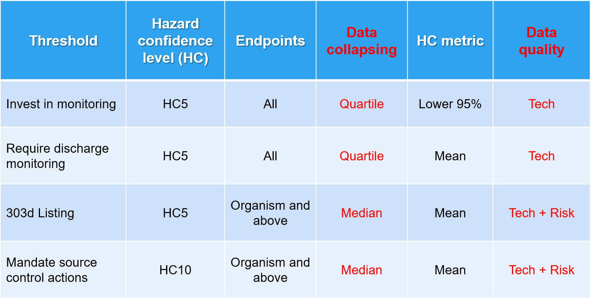

```{r libraries, include=FALSE}
library(tidyverse)
library(calecopal)
library(ssdtools)
library(DT)
library(plotly)
library(gridExtra)
library(grid)
library(wesanderson)
library(ggdark)
library(broom)
library(knitr)
library(viridis)
library(ggrepel)
library(scales)
library(gt)
library(ggsci)
```

```{r ERM}
# align by particles (report in particles/mL)
 'EC_env_p.particles.mL'
# # align by surface area (report in particles/mL)
'EC_poly_sa.particles.mL'
# # align by volume (report in particles/mL)
'EC_poly_v.particles.mL'
# # align by mass (report in particles/mL)
'EC_poly_m.particles.mL'
# # align by specific surface area (report in particles/mL)
'EC_poly_ssa.particles.mL'

#define sizes for filtering and alignment
small_tier_lower_size <- 1 #um
small_tier_upper_size <- 100 #um
large_tier_lower_size <- 10 #um
large_tier_upper_size <- 5000 #um
```


```{r Theme, include=FALSE}
#Theme type
     theme.type<- #theme_gray(base_size = 14)#,
                       dark_theme_bw(base_size = 15)
     #color selection
     fill.type <-    #scale_fill_viridis(discrete = TRUE)#,
                         #scale_fill_brewer(palette = "Paired"),
                          scale_fill_tron()#,
                         # scale_fill_locuszoom(),
                         # scale_fill_d3(),
                         # scale_fill_npg(),
                         # scale_fill_jama())
     #color selection
     color.type <- #scale_color_viridis(discrete = TRUE)#,
                         # scale_color_brewer(palette = "Paired"),
                          scale_color_tron()#,
                         # scale_color_locuszoom(),
                         # scale_color_d3(),
                         # scale_color_npg(),
                         # scale_color_jama())

```

```{r import and conversions, include=FALSE}
# Data Import
#require(readr)
#load aoc_z into dataframe. This file is generated from RDA_Maker.R
#source("Tox Data/RDA_Maker.R")
aoc_z <- readRDS(file = "Tox Data/aoc_z.Rda")

## First filter data with global filters
aoc_intermediate <- aoc_z %>% 
  filter(!environment %in% c("Terrestrial", "Not Reported"),
         org_f != "Bacterium",
         org_f != "Plant",
         effect.metric != "HONEC")   
#### Ecologically Relevant Metric calculations ####

###function to derive correction factor (CF) from Koelmans et al (equation 2)
CFfnx = function(a, #default alpha from Koelmans et al (2020)
                 x2D, #set detault values to convert ranges to (1-5,000 um) #5mm is upper defuault 
                 x1D, #1 um is lower default size
                 x2M, x1M){
  CF = (x2D^(1-a)-x1D^(1-a))/(x2M^(1-a)-x1M^(1-a)) 
  return(CF)}

#### equations for mu_x_poly (note that there are three depending on certain alphas for limits of equation)
###### if alpha does not equal 2 #####
mux.polyfnx = function(a.x, 
                       x_UL, 
                       x_LL){
  mux.poly = ((1-a.x)/(2-a.x)) * ((x_UL^(2-a.x) - x_LL^(2-a.x))/(x_UL^(1-a.x) - x_LL^(1-a.x)))
  return(mux.poly)}

##### If alpha does equal 2 #####
mux.polyfnx.2 = function(x_UL,x_LL){
  mux.poly = (log(x_UL/x_LL))/(x_LL^(-1) - x_UL^-1)
  return(mux.poly)}

### Calculating max ingestible parameters ###
## function to calcualte min and max ingestible surface area ##
SAfnx = function(a = a, # a = 0.5 * length
                 b = b, # b = 0.5 * width
                 c = c # c = 0.5 * height (note that hieght is 0.67 * width)
){
  SA = 4*pi*(((a*b)^1.6 + (a*c)^1.6 + (b*c)^1.6) / 3)^(1/1.6)
  return(SA)}

## max ingestible volume ##
volumefnx = function(R, L){
  volume = 0.111667 * pi * R^2 * L^3 #assumes height = 0.67 * Width, and Width:Length ratio is 'R' (compartment-specific)
  return(volume)}

#max ingestible mass
massfnx = function(R, L, p){
  mass = p * #density (g/cm^3)
    0.111667 * pi * R^2 * L^3 * # volume (um^3): assumes height = 0.67 * Width, and Width:Length ratio is 'R' (compartment-specific)
    1/1e12 ### NOT SURE IF THIS IS CORREC
   1e6 #correction factor
  return(mass)}

#max ingestible specific surface area
SSAfnx = function(a, # a = 0.5 * length
                  b,# b = 0.5 * width
                  c,# c = 0.5 * height (note that hieght is 0.67 * width)
                  m #mass (ug)
){
  SSA = (4*pi*(((a*b)^1.6 + (a*c)^1.6 + (b*c)^1.6) / 3)^(1/1.6))/m
  return(SSA)}

## parametrization ##
# Define params for correction #
alpha = 2.07 #table s4 for marine surface water. length
# define parameters for power law coefficients
a.sa = 1.5 #marine surface area power law
a.v = 1.48 #a_V for marine surface water volume
a.m = 1.32 # upper limit fora_m for mass for marine surface water in table S4 
a.ssa = 1.98 # A_SSA for marine surface water

#define additional parameters for calculations based on averages in the environment
R.ave = 0.77 #average width to length ratio for microplastics in marine enviornment
p.ave = 1.10 #average density in marine surface water


##### SMALL TIER DATA ####
### Set size limits for tier
x2D_set = small_tier_upper_size #upper size range (default)
x1D_set = small_tier_lower_size #lower size range (default)
x1M_set = small_tier_lower_size #lower size range for measured
# calculate ERM for each species
aoc_final_small <- aoc_intermediate  %>% 
  mutate(x2M = max.size.ingest.mm * 1000) %>% #max size ingest in um
  mutate(CF_bio = CFfnx(x1M = x1M_set, x2M = x2M, x1D = x1D_set, x2D = x2D_set, a = alpha)) %>%  #calculate CF_bio
  mutate(EC_env_p.particles.mL = dose.particles.mL.master * CF_bio) %>%  #aligned particle effect concentraiton (1-5000 um)
  ## Surface area ERM
  mutate(mu.sa.mono = particle.surface.area.um2) %>% #define mu_x_mono for alignment to ERM
  mutate(x_LL_sa = SAfnx(a = x1D_set/2, b = x1D_set/2, c = (2/3)*(x1D_set/2))) %>%  #calculate lower ingestible surface area
  mutate(x_UL_sa = SAfnx(a = x2M/2, b = x2M/2, c = (2/3)*(x2M/2))) %>%  #calculate upper ingestible surface area
  mutate(mu.sa.poly = if(a.sa == 2){mux.polyfnx.2(x_UL_sa, x_LL_sa)} else if (a.sa != 2){mux.polyfnx(a.sa, x_UL_sa, x_LL_sa)}) %>% #calculate mu_x_poly for surface area
  mutate(EC_poly_sa.particles.mL = (EC_env_p.particles.mL * mu.sa.mono)/mu.sa.poly) %>%  #calculate polydisperse effect concentration for surface area (particles/mL)
  ## volume ERM
  mutate(mu.v.mono = particle.volume.um3) %>% #define mu_x_mono for alignment to ERM
  mutate(x_LL_v = volumefnx(R = R.ave, L = x1D_set)) %>%  #calculate lower ingestible volume 
  mutate(x_UL_v = volumefnx(R = R.ave, L = x2M)) %>%  #calculate maximum ingestible volume 
  mutate(mu.v.poly = if(a.v == 2){mux.polyfnx.2(x_UL_v, x_LL_v)} else if (a.v != 2){mux.polyfnx(a.v, x_UL_v, x_LL_v)}) %>% #calculate mu_x_poly for volume
  mutate(EC_poly_v.particles.mL = (EC_env_p.particles.mL * mu.v.mono)/mu.v.poly) %>%  #calculate polydisperse effect concentration for volume (particles/mL)
  ## mass ERM
  mutate(mu.m.mono = mass.per.particle.mg * 1000) %>% #define mu_x_mono for alignment to ERM (ug)
  mutate(x_LL_m = massfnx(R = R.ave, L = x1D_set, p = p.ave)) %>%  #calculate lower ingestible mas
  mutate(x_UL_m = massfnx(R = R.ave, L = x2M, p = p.ave)) %>%  #calculate upper ingestible mass
  mutate(mu.m.poly = if(a.m == 2){mux.polyfnx.2(x_UL_m, x_LL_m)} else if (a.m != 2){mux.polyfnx(a.m, x_UL_m, x_LL_m)}) %>% #calculate mu_x_poly for mass
  mutate(EC_poly_m.particles.mL = (EC_env_p.particles.mL * mu.m.mono)/mu.m.poly) %>%  #calculate polydisperse effect concentration for volume (particles/mL)
  ## specific surface area ERM
  mutate(mu.ssa.mono = mu.sa.mono/mu.m.mono) %>% #define mu_x_mono for alignment to ERM (um^2/ug)
  mutate(x_LL_ssa = SSAfnx(a = x1D_set/2, b = x1D_set/2, c = (2/3)*(x1D_set/2), m = x_LL_m)) %>%  #calculate lower ingestible SSA
  mutate(x_UL_ssa = SSAfnx(a = x2M/2, b = x2M/2, c = (2/3)*(x2M/2), m = x_UL_m)) %>%  #calculate upper ingestible SSA  (um^2/ug)
  mutate(mu.ssa.poly = if(a.ssa == 2){mux.polyfnx.2(x_UL_ssa, x_LL_ssa)} else if (a.ssa != 2){mux.polyfnx(a.ssa, x_UL_ssa, x_LL_ssa)}) %>% #calculate mu_x_poly for specific surface area
  mutate(EC_poly_ssa.particles.mL = (EC_env_p.particles.mL * mu.ssa.mono)/mu.ssa.poly) #calculate polydisperse effect concentration for specific surface area (particles/mL)

##### SMALL TIER DATA ####
### Set size limits for tier
x2D_set = large_tier_upper_size #upper size range (default)
x1D_set = large_tier_lower_size #lower size range (default)
x1M_set = large_tier_lower_size #lower size range for measured
# calculate ERM for each species
aoc_final_large <- aoc_intermediate  %>% 
  mutate(x2M = max.size.ingest.mm * 1000) %>% #max size ingest in um
  mutate(CF_bio = CFfnx(x1M = x1M_set, x2M = x2M, x1D = x1D_set, x2D = x2D_set, a = alpha)) %>%  #calculate CF_bio
  mutate(EC_env_p.particles.mL = dose.particles.mL.master * CF_bio) %>%  #aligned particle effect concentraiton (1-5000 um)
  ## Surface area ERM
  mutate(mu.sa.mono = particle.surface.area.um2) %>% #define mu_x_mono for alignment to ERM
  mutate(x_LL_sa = SAfnx(a = x1D_set/2, b = x1D_set/2, c = (2/3)*(x1D_set/2))) %>%  #calculate lower ingestible surface area
  mutate(x_UL_sa = SAfnx(a = x2M/2, b = x2M/2, c = (2/3)*(x2M/2))) %>%  #calculate upper ingestible surface area
  mutate(mu.sa.poly = if(a.sa == 2){mux.polyfnx.2(x_UL_sa, x_LL_sa)} else if (a.sa != 2){mux.polyfnx(a.sa, x_UL_sa, x_LL_sa)}) %>% #calculate mu_x_poly for surface area
  mutate(EC_poly_sa.particles.mL = (EC_env_p.particles.mL * mu.sa.mono)/mu.sa.poly) %>%  #calculate polydisperse effect concentration for surface area (particles/mL)
  ## volume ERM
  mutate(mu.v.mono = particle.volume.um3) %>% #define mu_x_mono for alignment to ERM
  mutate(x_LL_v = volumefnx(R = R.ave, L = x1D_set)) %>%  #calculate lower ingestible volume 
  mutate(x_UL_v = volumefnx(R = R.ave, L = x2M)) %>%  #calculate maximum ingestible volume 
  mutate(mu.v.poly = if(a.v == 2){mux.polyfnx.2(x_UL_v, x_LL_v)} else if (a.v != 2){mux.polyfnx(a.v, x_UL_v, x_LL_v)}) %>% #calculate mu_x_poly for volume
  mutate(EC_poly_v.particles.mL = (EC_env_p.particles.mL * mu.v.mono)/mu.v.poly) %>%  #calculate polydisperse effect concentration for volume (particles/mL)
  ## mass ERM
  mutate(mu.m.mono = mass.per.particle.mg * 1000) %>% #define mu_x_mono for alignment to ERM (ug)
  mutate(x_LL_m = massfnx(R = R.ave, L = x1D_set, p = p.ave)) %>%  #calculate lower ingestible mas
  mutate(x_UL_m = massfnx(R = R.ave, L = x2M, p = p.ave)) %>%  #calculate upper ingestible mass
  mutate(mu.m.poly = if(a.m == 2){mux.polyfnx.2(x_UL_m, x_LL_m)} else if (a.m != 2){mux.polyfnx(a.m, x_UL_m, x_LL_m)}) %>% #calculate mu_x_poly for mass
  mutate(EC_poly_m.particles.mL = (EC_env_p.particles.mL * mu.m.mono)/mu.m.poly) %>%  #calculate polydisperse effect concentration for volume (particles/mL)
  ## specific surface area ERM
  mutate(mu.ssa.mono = mu.sa.mono/mu.m.mono) %>% #define mu_x_mono for alignment to ERM (um^2/ug)
  mutate(x_LL_ssa = SSAfnx(a = x1D_set/2, b = x1D_set/2, c = (2/3)*(x1D_set/2), m = x_LL_m)) %>%  #calculate lower ingestible SSA
  mutate(x_UL_ssa = SSAfnx(a = x2M/2, b = x2M/2, c = (2/3)*(x2M/2), m = x_UL_m)) %>%  #calculate upper ingestible SSA  (um^2/ug)
  mutate(mu.ssa.poly = if(a.ssa == 2){mux.polyfnx.2(x_UL_ssa, x_LL_ssa)} else if (a.ssa != 2){mux.polyfnx(a.ssa, x_UL_ssa, x_LL_ssa)}) %>% #calculate mu_x_poly for specific surface area
  mutate(EC_poly_ssa.particles.mL = (EC_env_p.particles.mL * mu.ssa.mono)/mu.ssa.poly) #calculate polydisperse effect concentration for specific surface area (particles/mL)
```



The figure above displays the working threshold framework for the ambient threshold group for the Microplastics Health Effects Workshop. 

The current framework for generating SSDs includes the following parameters:

Data pertaining to only aquatic organisms are included (marine and freshwater).  

All taxa are included with the exception of bacterium and plants.  

HONEC (Highest Observed No Effect Concentration) are excluded.  

Assessment factors are applied to convert all other effect metrics into NOECs:


Reference: Wigger et al. 2020 (doi: 10.1002/ieam.4214)  

Assessment factors are applied to convert acute data into chronic:  


Green rows are from Wigger et al. 2020. Grey rows were agreed upon by the ambient threshold working group.

Reference: Wigger et al. 2020 (doi: 10.1002/ieam.4214)

Note: Values may be slightly different than those presented in the shiny app as concentrations are converted from particles/mL to particles/L ahead of calculations.

# Re-scaling effect concentrations according to Ecological Relevent Metrics (ERMs)
## Particles
A monodisperse effect concentration (e.g. 5 micron spheres) may be re-scaled to a default size range (e.g. 1 - 5,000 microns) using methods described in Kooi et al (2021). Re-scaling to a default size range allows direct comparison to exposure concentrations for a default size range (which may also be re-scaled). 

The effect concentration must first be corrected for bioavailability. If the suspected effect mechanism depends on ingestion of the particle, particles that are too large to be ingested by the organism of interest should be considered to not be bioavailable. Further, if toxicity depends on tissue translocation, particles too large to be translocated will be considered to be unavailable.

Given an upper limit (UL) and lower limit (LL) of the measured and default size range, a dimensionless correction factor ($CF_{meas}$) for measured environmental concentrations or ($CF_{bio}$) for bioavailable effect concentrations may be calculated, which rescales the measured (M) or bioavailable (B) number concentrations for a certain size range to the number concentration for the microplastics default (D) size range (e.g. 1 to 5,000 um) according to the power law distribution for length (L) with slope $\alpha_L$ in Table S4 of Kooi et al (2021). 

The following equation for $CF_{meas}$ is identical for effect concentration ($CF_{Bio}$) except the bioavailable fraction of particles is denoted as UL,B and LL,B on the denominator.

$CF_{Meas} = \frac{L^{1-a}_{UL,D} - L^{1-a}_{LL,D}}{L^{1-a}_{UL,M} - L^{1-a}_{LL,M}}$

The resulting correction factor ($CF_{meas}$, unitless is then multiplied by the measured concentration ($C_{Meas}$) to obtain a rescaled exposure number concentration $C_{Env} =  CF_{meas} x C_{meas}$.

The monodisperse effect concentration in particles/L is corrected to an environmental polydisperse distribution of 1-5,000 um microplastics by first calculating $CF_{Bio}$ using the following equation:

$CF_{Bio} = \frac{L^{1-a}_{5,000} - L^{1-a}_{1}}{L^{1-a}_{10} - L^{1-a}_{1}}$

The threshold effect concentration for the bioavailable size fraction of particles ($EC_{poly}$; particles/L) can be related to the threshold effect concentration for the environmentally relevant (1 to 5,000 um) range of particles ($EC_{env}$; particles/L) with the following equation:

$EC_{env} = EC_{poly} * CF_{bio}$

In order to convert the monodisperse microplastic particle effect concentration a second correction must occur, which takes into consideration the ecologically relevant metric (ERM) [(Koelmans et al 2017)](https://europepmc.org/article/med/28971682). For a given ERM, the threshold may be related to both mono- or polydisperse particles interchangeably so long as the total magnitude of ERM remains the same (Koelmans et al, 2020). 

##  Surface Area
In the case of reactive oxygen species formation (ROS) as a key initiating event for toxicity (*REF NEEDED*), specific surface area (SSA) is hypothesized to be the ERM *(Koelmans et al, unpublished)*. Kooi et al (2021) provide an equation which preserves the ERM of interest (i.e. SSA) between mono- and polydisperse particles for a given threshold effect level:

$EC_{poly} * \mu_{x,poly} = EC_{mono} * \mu_{x,mono}$

Where $EC_{mono}$ (particles/L) is the effect number concentration for monodisperse particles and $\mu_{sa,mono}$ is the mean value for the ERM of interest (i.e. SA) for the monodisperse particles. The above equation may be used to convert both monodisperse and polydisperse distributions with any level of polydispersity. 

For surface area as an ERM, $\mu_{sa,mono}$ is equivalent to the average surface area of a the particle, calculated as follows:

$SA = 4*\pi*r^2$

Where r = 0.5 x D, where D = 5 um (length).

Since the probability distribution of ERM $sa$ (surface area) follows a power law regime, the mean ERM value for the polydisperse particles, $\mu_{sa,poly}$, can be calculated as:

$\mu_{sa,poly} = \frac{1 - a_{sa}}{2 - a_{sa}}  \frac{X^{2-a_x}_{UL} - X^{2-a_x}_{LL}}{X^{1-a_x}_{UL} - X^{1-a_x}_{LL}}$

Where UL and LL are respectively defined as the upper and lower limit in ERM $sa$ for which the mean is calculated, and $a_sa$ is the power law exponent of ERM $sa$. In the case of $a$ = 2 (the $a_{sa}$  for the area of microplastics in surface freshwater), an alternative equation must be used (Kooi et al 2021):

$\mu_{sa,poly} =  \frac{ln(\frac{X_{UL}}{X_{LL}})} {X^{-1}_{LL} - X^{-1}_{UL}}$

For surface area, UL and LL are calculated using the equation for the surface area of an ellipsoid:

$S = 4 \pi (\frac{(ab)^{1.6} + (ac)^{1.6} + (bc)^{1.6}}{3})^{1/1.6}$

With a, b, c being equal to 0.5 x length, 0.5 x width, and 0.5x height, respectively. The same minimum and maximum bioavailable values for length and width are used, while for a height a value of 0.67 x width is used. 

## Volume

In the case of an ERM of interest being total volume, $\mu_{x,mono}$ is equivalent to the average volume of a the monodisperse particle (i.e. $\mu_{v,mono}$), calculated as follows:

$V = \frac{4}{3}{\pi}r^3$

Where r = radius (length/2; 2.5 um).

Since the probability distribution of ERM $v$ (volume) follows a power law regime, the mean ERM value for the polydisperse particles, $\mu_{V,poly}$, can be calculated as:

$\mu_{v,poly} = \frac{1 - a}{2 - a}  \frac{X^{2-a_{v}}_{UL} - X^{2-a_{v} }_{LL}}{X^{1-a_{v}}_{UL} - X^{1-a_{v}}_{LL}}$

Where UL and LL are respectively defined as the upper and lower limit in ERM $v$ (volume) for which the mean is calculated, and $a_v$ is the power law exponent of mass. In the case of marine surface water,an $a_v$ of 1.48 is utilized (Kooi et al 2021; Table S4).

For volume as a ERM, UL and LL are volume-based upper and lower limits, respectively of bioaccessibility based on the length of particles. To estimate volume-based limits based on particle length, the volume of bioaccessible particles is first calculated as follows:

$V_{i} = \frac{4}{3}\pi abc$

Where $V_i$ is the volume for a given particle *i*, and a, b, and c are radii along the principal axes, corresponding to one-half times the length, width, and height of an ellipsoid. Upper and lower limits of bioavailability for volume correspond to the maximum ingestible size of particles and the lower limit of the size range to be aligned to (typically 1 micron).


The above equation can be applied to fragments, thin films, microbeads, spheres, or fibers given a known length to width ratios for such shapes, with the height assumed to be equivalent to 0.67 x width (Kooi et al 2021). Width to length ratios differ for microplastics differ by compartment, with averages ranging from 0.67 to 0.77 (Kooi et al 2021; Table S3). Averaged values may be used to estimate the volume of polydisperse environmental mixtures of microplastics.

Substituting $R_i$ for the length to width ratio of a particles, the formula simplifies to:

$V_i = 0.111667*pi*R_i^2*L_i^3$

Where $L_i$ is the length of the particle.

## Mass

In the case of an ERM of interest being total mass, $\mu_{x,mono}$ is equivalent to the average mass of a the monodisperse particle (i.e. $\mu_{m,mono}$), calculated as follows:

$m = pV*\frac{1}{1e12}*1e6$

Where *m* is the mass (ug), *p* is density (g/cm^3), *V* is volume (um^3) - which is calculated by the cube of the radius of each particle (i.e. 1/2 * length, or 2.5 um), and additional conversion factors for g to ug (1e6) and cm^3 to um^3 (1e-12).

Since the probability distribution of ERM $m$ (mass) follows a power law regime, the mean ERM value for the polydisperse particles, $\mu_{m,poly}$, can be calculated as:

$\mu_{m,poly} = \frac{1 - a}{2 - a}  \frac{X^{2-a_{m}}_{UL} - X^{2-a_{m} }_{LL}}{X^{1-a_{m}}_{UL} - X^{1-a_{m}}_{LL}}$

Where UL and LL are respectively defined as the upper and lower limit in ERM $m$ (mass) for which the mean is calculated, and $a_m$ is the power law exponent of mass. In the case of marine surface water,an $a_m$ of 1.32 is utilized (Kooi et al 2021; Table S4).

For mass, UL and LL are mass-based upper and lower limits of bioaccessibility based on the width of particles, respectively. To estimate mass-based limits based on size, the volume of bioaccessible particles is first calculated using the equation for the volume of an ellipsoid, then multipied by the average density of particles in the 1-5,000 um distribution in the environmental compartment of interest (e.g.surface marine water: 1.10 g/cm^3) (Kooi et al 2021; table S3).

$X_{LL/UL} = pV*\frac{1}{1e12}*1e6$

Where $X_{LL/UL}$ is the lower/upper limit of bioacccessible mass (ug), *p* is density (g/cm^3), *V* is volume (um^3), and additional conversion factors for mg to g (x1000) and cm^3 to um^3 (1e-12).

## Specific Surface Area

In the case of an ERM of interest being specific surface area, $\mu_{ssa,mono}$ is equivalent to the surface area of a 5 um PS sphere (i.e. $\mu_{sa,mono}$) divided by the mass (i.e. $\mu_{m,mono}$), calculated as follows:

$SSA = \frac{SA}{m}$

Where *SA* is the surface area (um^2) of the particle (5 um PS sphere), and *m* is the mass (ug).


Since the probability distribution of ERM $ssa$ (specific surface area) follows a power law regime, the mean ERM value for the polydisperse particles, $\mu_{ssa,poly}$, can be calculated as:

$\mu_{ssa,poly} = \frac{1 - a_{ssa}}{2 - a_{ssa}}  \frac{X^{2-a_{m}}_{UL} - X^{2-a_{m} }_{LL}}{X^{1-a_{m}}_{UL} - X^{1-a_{m}}_{LL}}$

Where UL and LL are respectively defined as the upper and lower limit in ERM $ssa$ (ssa) for which the mean is calculated, and $a_ssa$ is the power law exponent of specific surface area. For example, marine surface water has an $a_ssa$ of 1.98 (Kooi et al 2021; Table S4).

For specific surface area, UL and LL are area/mass-based upper and lower limits of bioaccessibility based on the width of particles, respectively. To estimate area/mass-based limits based on size, the volume of bioaccessible particles  is first calculated using the equation for the surface area of an ellipsoid, then divided by the lower and upper bioavailable  mass of particles in the 1-8-5,000 um distribution in surface marine water, as calculated above.

$SSA = \frac{4 \pi (\frac{(ab)^{1.6} + (ac)^{1.6} + (bc)^{1.6}}{3})^{1/1.6}}{m}$

With a, b, c being equal to 0.5 x length, 0.5 x width, and 0.5x height, respectively. The same minimum and maximum bioavailable values for length and width are used, while for a height a value of 0.67 x width is used. 


# ERM = Particles
```{r}
ERM <- "Particles"
```

## Tiers 1 & 2

Tier 1 and 2 are the same SSD. A different HC metric is selected to differentiate between the tiers. Specifically, Tier 1 uses the 95% CI whereas Tier 2 uses the Mean. See below for more details of specific parameters. 

Hazard Confidence Level = HC5  

Endpoints = All  

Levels of Biological Organization = All  

HC Metric = 95% CI (Tier 1); Mean (Tier 2)  

Data Quality = Pass Technical Quality Red Criteria

### Data Filtering

```{r size category selection, include=FALSE}
tier1_2_large <- aoc_final_large %>% 
  filter(tier_zero_tech_f == "Red Criteria Passed") %>% 
  #choose ERM
         mutate(dose_new = EC_env_p.particles.mL / (af.time * af.noec)) %>%  
         drop_na(dose_new) %>% 
         mutate(dose_new = dose_new * 1000) %>% 
  filter(size_f %in% c("100µm < 1mm", "1mm < 5mm")) 

# Count observations and studies
tier1_2_large.obs <- tier1_2_large %>% summarize(n.obs = n(), n.studies = n_distinct(doi), n.taxa = n_distinct(org_f), n.species = n_distinct(species_f))

# ### 10 - 100 um
# tier1_2_medium <- tier1_2 %>% 
#   filter(size_f %in% c("10µm < 100µm")) 
#   
# # Count observations and studies
# tier1_2_medium.obs <- tier1_2_medium %>% summarize(n.obs = n(), n.studies = n_distinct(doi), n.taxa = n_distinct(org_f), n.species = n_distinct(species_f))

### 1 - 100 um
tier1_2_small <- aoc_final_small %>% 
  filter(tier_zero_tech_f == "Red Criteria Passed") %>% 
  #choose ERM
         mutate(dose_new = EC_env_p.particles.mL / (af.time * af.noec)) %>%  
         drop_na(dose_new) %>% 
         mutate(dose_new = dose_new * 1000) %>% 
  filter(size_f %in% c("1µm < 10µm", "10µm < 100µm")) 
  
# Count observations and studies
tier1_2_small.obs <- tier1_2_small %>% summarize(n.obs = n(), n.studies = n_distinct(doi), n.taxa = n_distinct(org_f), n.species = n_distinct(species_f))
```

```{r endpoint plots, message=FALSE}
#large
endpoints_tier1_2_large <- tier1_2_large %>% 
  group_by(lvl1_f, bio_f) %>% 
  mutate(lvl1_count = n()) %>% 
  group_by(lvl1_f, lvl1_count, bio_f) %>% 
  summarise() %>%  
  ggplot(aes(x = lvl1_f, y=lvl1_count, fill = bio_f))+
  geom_bar(stat = "identity") +
  scale_fill_manual(values = wes_palette("Zissou1", 5, type = "continuous")) +
  labs(title = "Tier 1 & 2, Endpoint Representation", subtitle = "100µm - 5mm", x = "Endpoint Category", y = "Number of Endpoints", fill = "Biological Level\nof Organization", caption = "Number of endpoints is prior to data collapse") +
  theme_test() +
  scale_x_discrete(labels = wrap_format(10)) 
        

plot(endpoints_tier1_2_large)

#medium
# endpoints_tier1_2_medium <- tier1_2_medium %>% 
#   group_by(lvl1_f, bio_f) %>% 
#   mutate(lvl1_count = n()) %>% 
#   group_by(lvl1_f, lvl1_count, bio_f) %>% 
#   summarise() %>%  
#   ggplot(aes(x = lvl1_f, y=lvl1_count, fill = bio_f))+
#   geom_bar(stat = "identity") +
#   scale_fill_manual(values = wes_palette("Zissou1", 5, type = "continuous")) +
#   labs(title = "Tier 1 & 2, Endpoint Representation", subtitle = "10µm < 100µm", x = "Endpoint Category", y = "Number of Endpoints", fill = "Biological Level\nof Organization", caption = "Number of endpoints is prior to data collapse") +
#   theme_test() +
#   scale_x_discrete(labels = wrap_format(10)) 
#         
# 
# plot(endpoints_tier1_2_medium)

#small
endpoints_tier1_2_small <- tier1_2_small %>% 
  group_by(lvl1_f, bio_f) %>% 
  mutate(lvl1_count = n()) %>% 
  group_by(lvl1_f, lvl1_count, bio_f) %>% 
  summarise() %>%  
  ggplot(aes(x = lvl1_f, y=lvl1_count, fill = bio_f))+
  geom_bar(stat = "identity") +
  scale_fill_manual(values = wes_palette("Zissou1", 5, type = "continuous")) +
  labs(title = "Tier 1 & 2, Endpoint Representation", subtitle = "1µm < 100µm", x = "Endpoint Category", y = "Number of Endpoints", fill = "Biological Level\nof Organization", caption = "Number of endpoints is prior to data collapse") +
  theme_test() +
  scale_x_discrete(labels = wrap_format(10)) 
        

plot(endpoints_tier1_2_small)
```
### SSD Build
#### Data Collapse
```{r data collapse, include=FALSE}

#First quartile large particles
tier1_2_large_1q <- tier1_2_large %>% 
  group_by(Species, Group) %>% 
  summarize(Conc = quantile(dose_new, 0.25))

#First quartile medium particles
# tier1_2_medium_1q <- tier1_2_medium %>% 
#   group_by(Species, Group) %>% 
#   summarize(Conc = quantile(dose_new, 0.25))

#First quartile small particles
tier1_2_small_1q <- tier1_2_small %>% 
  group_by(Species, Group) %>% 
  summarize(Conc = quantile(dose_new, 0.25))

```


#### Large (10 - 5000 um) 

```{r include=TRUE, warning=FALSE}
###### --modelling ####
dists_tier1_2_large_1q <- ssd_fit_dists(tier1_2_large_1q, left = "Conc", dists = c("weibull", "llogis", "lnorm", "gamma", "lgumbel"), computable = FALSE, silent = FALSE) 

#autoplot(dists_tier1_2_large_1q) #plots the distribution in ggplotier2
#### Goodness of fit ####
gof_tier1_2_large_1q <- as.data.frame(ssd_gof(dists_tier1_2_large_1q)) %>% mutate_if(is.numeric, ~ signif(., 3))

#### Prediction ####
set.seed(99)
pred_tier1_2_large_1q <- predict(dists_tier1_2_large_1q, average = TRUE, ic = "aicc", nboot = 10, ci= TRUE) 

#add unique ID for multiplot
pred_tier1_2_large_1q_particles <- pred_tier1_2_large_1q
SSD_tier1_2_large_1q_particles <- SSD_tier1_2_large_1q

#order data
SSD_tier1_2_large_1q <- tier1_2_large_1q[order(tier1_2_large_1q$Conc), ]
SSD_tier1_2_large_1q$frac <- ppoints(tier1_2_large_1q$Conc, 0.5)

tier1_2_large_1q_lcl <- c(pred_tier1_2_large_1q$lcl[5]) #CI95
tier1_2_large_1q_hc5 <- c(pred_tier1_2_large_1q$est[5]) #HC5
pred_tier1_2_large_1q$est_format <-format(pred_tier1_2_large_1q$est, digits = 3, scientific = TRUE)

#ggplot
tier1_2_large_1q_ggplot <- ggplot(pred_tier1_2_large_1q,aes_string(x = "est")) +
      geom_xribbon(aes_string(xmin = "lcl", xmax = "ucl", y = "percent/100"), alpha = 0.2, color = "blue", fill = "lightblue") +
      geom_line(aes_string(y = "percent/100"), color = "gray") +
      geom_point(data = SSD_tier1_2_large_1q,aes(x = Conc, y =frac, color = Group)) + 
      geom_text_repel(data = SSD_tier1_2_large_1q, aes(x = Conc, y = frac, label = Species, color = Group), nudge_x = 0.2, size = 3, segment.alpha = 0.5) + 
      scale_y_continuous("Species Affected (%)", labels = scales::percent, limits = c(0,1)) +
  labs(title = "Microplastics Species Sensitivity Distribution",
             subtitle = paste("(ERM = ",ERM,")")) +
      coord_trans(x = "log10") +
      scale_x_continuous(breaks = scales::trans_breaks("log10", function(x) 10^x, n = 15),
                         labels = trans_format("log10", scales::math_format(10^.x))) + 
  labs(title = "Tier 1/2, 100-5000 µm", x = "particles/L") +
      fill.type + #user-selected
      color.type + #user-selected
      theme.type #user theme

plot(tier1_2_large_1q_ggplot)
```

```{r include=FALSE, warning=FALSE}
# ###### --modelling ####
# dists_tier1_2_medium_1q <- ssd_fit_dists(tier1_2_medium_1q, left = "Conc", dists = c("weibull", "llogis", "lnorm", "gamma", "lgumbel"), computable = FALSE, silent = FALSE) 
# 
# #autoplot(dists_tier1_2_medium_1q) #plots the distribution in ggplotier2
# #### Goodness of fit ####
# gof_tier1_2_medium_1q <- as.data.frame(ssd_gof(dists_tier1_2_medium_1q)) %>% mutate_if(is.numeric, ~ signif(., 3))
# 
# #### Prediction ####
# set.seed(99)
# pred_tier1_2_medium_1q <- predict(dists_tier1_2_medium_1q, average = TRUE, ic = "aicc", nboot = 10, ci= TRUE) 
# 
# #order data
# SSD_tier1_2_medium_1q <- tier1_2_medium_1q[order(tier1_2_medium_1q$Conc), ]
# SSD_tier1_2_medium_1q$frac <- ppoints(tier1_2_medium_1q$Conc, 0.5)
# 
# tier1_2_medium_1q_lcl <- c(pred_tier1_2_medium_1q$lcl[5]) #CI95
# tier1_2_medium_1q_hc5 <- c(pred_tier1_2_medium_1q$est[5]) #HC5
# pred_tier1_2_medium_1q$est_format <-format(pred_tier1_2_medium_1q$est, digits = 3, scientific = TRUE)
# 
# #ggplot
# tier1_2_medium_1q_ggplot <- ggplot(pred_tier1_2_medium_1q,aes_string(x = "est")) +
#       geom_xribbon(aes_string(xmin = "lcl", xmax = "ucl", y = "percent/100"), alpha = 0.2, color = "blue", fill = "lightblue") +
#       geom_line(aes_string(y = "percent/100"), color = "gray") +
#       geom_point(data = SSD_tier1_2_medium_1q,aes(x = Conc, y =frac, color = Group)) + 
#       geom_text_repel(data = SSD_tier1_2_medium_1q, aes(x = Conc, y = frac, label = Species, color = Group), nudge_x = 0.2, size = 3, segment.alpha = 0.5) + 
#       scale_y_continuous("Species Affected (%)", labels = scales::percent, limits = c(0,1)) +
#       coord_trans(x = "log10") +
#       scale_x_continuous(breaks = scales::trans_breaks("log10", function(x) 10^x, n = 15),
#                          labels = trans_format("log10", scales::math_format(10^.x))) + 
#   labs(title = "Tier 1/2, 10-100 µm", x = "particles/L") +
#       fill.type + #user-selected
#       color.type + #user-selected
#       theme.type #user theme
# 
# plot(tier1_2_medium_1q_ggplot)
```

#### Small (1 - 100 um) 

```{r include=TRUE, warning=FALSE}
###### --modelling ####
dists_tier1_2_small_1q <- ssd_fit_dists(tier1_2_small_1q, left = "Conc", dists = c("weibull", "llogis", "lnorm", "gamma", "lgumbel"), computable = FALSE, silent = FALSE) 

#autoplot(dists_tier1_2_small_1q) #plots the distribution in ggplotier2
#### Goodness of fit ####
gof_tier1_2_small_1q <- as.data.frame(ssd_gof(dists_tier1_2_small_1q)) %>% mutate_if(is.numeric, ~ signif(., 3))

#### Prediction ####
set.seed(99)
pred_tier1_2_small_1q <- predict(dists_tier1_2_small_1q, average = TRUE, ic = "aicc", nboot = 10, ci= TRUE) 

#order data
SSD_tier1_2_small_1q <- tier1_2_small_1q[order(tier1_2_small_1q$Conc), ]
SSD_tier1_2_small_1q$frac <- ppoints(tier1_2_small_1q$Conc, 0.5)

tier1_2_small_1q_lcl <- c(pred_tier1_2_small_1q$lcl[5]) #CI95
tier1_2_small_1q_hc5 <- c(pred_tier1_2_small_1q$est[5]) #HC5
pred_tier1_2_small_1q$est_format <-format(pred_tier1_2_small_1q$est, digits = 3, scientific = TRUE)

#ggplot
tier1_2_small_1q_ggplot <- ggplot(pred_tier1_2_small_1q,aes_string(x = "est")) +
      geom_xribbon(aes_string(xmin = "lcl", xmax = "ucl", y = "percent/100"), alpha = 0.2, color = "blue", fill = "lightblue") +
      geom_line(aes_string(y = "percent/100"), color = "gray") +
      geom_point(data = SSD_tier1_2_small_1q,aes(x = Conc, y =frac, color = Group)) + 
      geom_text_repel(data = SSD_tier1_2_small_1q, aes(x = Conc, y = frac, label = Species, color = Group), nudge_x = 0.2, size = 3, segment.alpha = 0.5) + 
      scale_y_continuous("Species Affected (%)", labels = scales::percent, limits = c(0,1)) +
  labs(title = "Microplastics Species Sensitivity Distribution",
             subtitle = paste("(ERM = ",ERM,")")) +
      coord_trans(x = "log10") +
      scale_x_continuous(breaks = scales::trans_breaks("log10", function(x) 10^x, n = 15),
                         labels = trans_format("log10", scales::math_format(10^.x))) + 
  labs(title = "Tier 1/2, 1-100 µm", x = "particles/L") +
      fill.type + #user-selected
      color.type + #user-selected
      theme.type #user theme

plot(tier1_2_small_1q_ggplot)
```

### Tier 1 & 2 Summary Table

Hazard Confidence Level = HC5  

Endpoints = All  

Levels of Biological Organization = All  

HC Metric = 95% CI (Tier 1); Mean (Tier 2)  

Data Quality = Pass Technical Quality Red Criteria

```{r}
#save unique ID for ERM
tier1_large_p <- tier1_2_large_1q_lcl
tier2_large_p <- tier1_2_large_1q_hc5
tier1_small_p <- tier1_2_small_1q_lcl
tier2_small_p <- tier1_2_small_1q_hc5

larges <- list(tier1_2_large_1q_lcl, tier1_2_large_1q_hc5,
              tier1_2_large.obs[[1,1]], #n.obs
              tier1_2_large.obs[[1,2]], #n.studies
              tier1_2_large.obs[[1,3]], #n.taxa
              tier1_2_large.obs[[1,4]]) #n.species

# mediums <- list(tier1_2_medium_1q_lcl, tier1_2_medium_1q_hc5,
#               tier1_2_medium.obs[[1,1]], #n.obs
#               tier1_2_medium.obs[[1,2]], #n.studies
#               tier1_2_medium.obs[[1,3]], #n.taxa
#               tier1_2_medium.obs[[1,4]]) #n.species

smalls <- list(tier1_2_small_1q_lcl, tier1_2_small_1q_hc5,
              tier1_2_small.obs[[1,1]], #n.obs
              tier1_2_small.obs[[1,2]], #n.studies
              tier1_2_small.obs[[1,3]], #n.taxa
              tier1_2_small.obs[[1,4]]) #n.species

# Convert to data frames
largesdf <- data.frame(matrix(unlist(larges), ncol = 6))
# mediumsdf <- data.frame(matrix(unlist(mediums), ncol = 6))
smallsdf <- data.frame(matrix(unlist(smalls), ncol = 6))

# Rename columns
colnames(largesdf) <- c("Tier_1", "Tier_2", "N_Obs.", "N_Doi", "N_Taxa", "N_Species")
# colnames(mediumsdf) <- c("Tier_1", "Tier_2", "N_Obs.", "N_Doi", "N_Taxa", "N_Species")
colnames(smallsdf) <- c("Tier_1", "Tier_2", "N_Obs.", "N_Doi", "N_Taxa", "N_Species")

# Make tables

gt(largesdf) %>% 
  tab_header(title = "Tier 1/2, 100-5000 um", paste("Thresholds presented in particles/L; ERM = ",ERM)) %>% 
  fmt_number(columns = vars(Tier_1, Tier_2),decimals = 2, use_seps = TRUE) 

             
# gt(mediumsdf) %>% 
#   tab_header(title = "Tier 1/2, 10-100 um", subtitle = "Thresholds presented in particles/L") %>% 
#   fmt_number(columns = vars(Tier_1, Tier_2),decimals = 2, use_seps = TRUE)

gt(smallsdf) %>% 
  tab_header(title = "Tier 1/2, 1-100 um", subtitle = paste("Thresholds presented in particles/L; ERM = ",ERM)
             ) %>% 
  fmt_number(columns = vars(Tier_1, Tier_2),decimals = 2, use_seps = TRUE)
```

## Tiers 3 & 4

Tier 3 and 4 are the same SSD. A different HC metric is selected to differentiate between the tiers. Specifically, Tier 1 uses the 95% CI whereas Tier 2 uses the Mean. See below for more details of specific parameters. 

Hazard Confidence Level = HC5(Tier3)/HC10(Tier4)  

Endpoints = All  

Levels of Biological Organization = Organism and Population  

HC Metric = Mean  

Data Quality = Pass Technical & Risk Quality Red Criteria

### Data Collapsing

```{r size category selection - tiers 3/4, include=FALSE}

#### Size filters ####

### 100 - 5000 um
tier3_4_large <-  aoc_final_large %>% 
  filter(tier_zero_tech_f == "Red Criteria Passed",
         tier_zero_risk_f == "Red Criteria Passed",
         bio_f %in% c("Organism", "Population")) %>% 
         mutate(dose_new = EC_env_p.particles.mL / (af.time * af.noec)) %>%  
         drop_na(dose_new) %>% 
         mutate(dose_new = dose_new*1000) %>% 
  filter(size_f %in% c("10µm < 100µm", "100µm < 1mm", "1mm < 5mm")) 

# Count observations and studies
tier3_4_large.obs <- tier3_4_large %>% summarize(n.obs = n(), n.studies = n_distinct(doi), n.taxa = n_distinct(org_f), n.species = n_distinct(species_f))

# ### 10 - 100 um
# tier3_4_medium <- tier3_4 %>% 
#   filter(size_f %in% c("10µm < 100µm")) 
#   
# # Count observations and studies
# tier3_4_medium.obs <- tier3_4_medium %>% summarize(n.obs = n(), n.studies = n_distinct(doi), n.taxa = n_distinct(org_f), n.species = n_distinct(species_f))

### 1 - 10 um
tier3_4_small <- aoc_final_small %>% 
  filter(tier_zero_tech_f == "Red Criteria Passed",
         tier_zero_risk_f == "Red Criteria Passed",
         bio_f %in% c("Organism", "Population")) %>% 
         mutate(dose_new = EC_env_p.particles.mL / (af.time * af.noec)) %>%  
         drop_na(dose_new) %>% 
         mutate(dose_new = dose_new*1000) %>% 
  filter(size_f %in% c("1µm < 10µm","10µm < 100µm")) 
  
# Count observations and studies
tier3_4_small.obs <- tier3_4_small %>% summarize(n.obs = n(), n.studies = n_distinct(doi), n.taxa = n_distinct(org_f), n.species = n_distinct(species_f))
```

```{r endpoint plots - tiers 3/4, message=FALSE}
#large
endpoints_tier3_4_large <- tier3_4_large %>% 
  group_by(lvl1_f, bio_f) %>% 
  mutate(lvl1_count = n()) %>% 
  group_by(lvl1_f, lvl1_count, bio_f) %>% 
  summarise() %>%  
  ggplot(aes(x = lvl1_f, y=lvl1_count, fill = bio_f))+
  geom_bar(stat = "identity") +
  scale_fill_manual(values = wes_palette("Zissou1", 5, type = "continuous")) +
  labs(title = "Tier 1 & 2, Endpoint Representation", subtitle = "10µm - 5mm", x = "Endpoint Category", y = "Number of Endpoints", fill = "Biological Level\nof Organization", caption = "Number of endpoints is prior to data collapse") +
  theme_test() +
  scale_x_discrete(labels = wrap_format(10)) 
        

plot(endpoints_tier3_4_large)

#medium
# endpoints_tier3_4_medium <- tier3_4_medium %>% 
#   group_by(lvl1_f, bio_f) %>% 
#   mutate(lvl1_count = n()) %>% 
#   group_by(lvl1_f, lvl1_count, bio_f) %>% 
#   summarise() %>%  
#   ggplot(aes(x = lvl1_f, y=lvl1_count, fill = bio_f))+
#   geom_bar(stat = "identity") +
#   scale_fill_manual(values = wes_palette("Zissou1", 5, type = "continuous")) +
#   labs(title = "Tier 1 & 2, Endpoint Representation", subtitle = "10µm < 100µm", x = "Endpoint Category", y = "Number of Endpoints", fill = "Biological Level\nof Organization", caption = "Number of endpoints is prior to data collapse") +
#   theme_test() +
#   scale_x_discrete(labels = wrap_format(10)) 
#         
# 
# plot(endpoints_tier3_4_medium)

#small
endpoints_tier3_4_small <- tier3_4_small %>% 
  group_by(lvl1_f, bio_f) %>% 
  mutate(lvl1_count = n()) %>% 
  group_by(lvl1_f, lvl1_count, bio_f) %>% 
  summarise() %>%  
  ggplot(aes(x = lvl1_f, y=lvl1_count, fill = bio_f))+
  geom_bar(stat = "identity") +
  scale_fill_manual(values = wes_palette("Zissou1", 5, type = "continuous")) +
  labs(title = "Tier 1 & 2, Endpoint Representation", subtitle = "1µm < 100µm", x = "Endpoint Category", y = "Number of Endpoints", fill = "Biological Level\nof Organization", caption = "Number of endpoints is prior to data collapse") +
  theme_test() +
  scale_x_discrete(labels = wrap_format(10)) 
        

plot(endpoints_tier3_4_small)
```

```{r data collapse - tiers 3/4, include=FALSE}

#First quartile large particles
tier3_4_large_median <- tier3_4_large %>% 
  group_by(Species, Group) %>% 
  summarize(Conc = median(dose_new))

#First quartile medium particles
# tier3_4_medium_median <- tier3_4_medium %>% 
#   group_by(Species, Group) %>% 
#   summarize(Conc = median(dose_new))

#First quartile small particles
tier3_4_small_median <- tier3_4_small %>% 
  group_by(Species, Group) %>% 
  summarize(Conc = median(dose_new))

```

### SSD Build

#### Large (10 - 5000 um) 

```{r include=TRUE, warning=FALSE}
###### --modelling ####
dists_tier3_4_large_median <- ssd_fit_dists(tier3_4_large_median, left = "Conc", dists = c("weibull", "llogis", "lnorm", "gamma", "lgumbel"), computable = FALSE, silent = FALSE) 

#autoplot(dists_tier3_4_large_median) #plots the distribution in ggplotier2
#### Goodness of fit ####
gof_tier3_4_large_median <- as.data.frame(ssd_gof(dists_tier3_4_large_median)) %>% mutate_if(is.numeric, ~ signif(., 3))

#### Prediction ####
set.seed(99)
pred_tier3_4_large_median <- predict(dists_tier3_4_large_median, average = TRUE, ic = "aicc", nboot = 10, ci= TRUE) 

#order data
SSD_tier3_4_large_median <- tier3_4_large_median[order(tier3_4_large_median$Conc), ]
SSD_tier3_4_large_median$frac <- ppoints(tier3_4_large_median$Conc, 0.5)

tier3_4_large_median_hc5 <- c(pred_tier3_4_large_median$est[5]) #HC5
tier3_4_large_median_hc10 <- c(pred_tier3_4_large_median$est[10]) #HC10
pred_tier3_4_large_median$est_format <-format(pred_tier3_4_large_median$est, digits = 3, scientific = TRUE)

#ggplot
tier3_4_large_median_ggplot <- ggplot(pred_tier3_4_large_median,aes_string(x = "est")) +
      geom_xribbon(aes_string(xmin = "lcl", xmax = "ucl", y = "percent/100"), alpha = 0.2, color = "blue", fill = "lightblue") +
      geom_line(aes_string(y = "percent/100"), color = "gray") +
      geom_point(data = SSD_tier3_4_large_median,aes(x = Conc, y =frac, color = Group)) + 
      geom_text_repel(data = SSD_tier3_4_large_median, aes(x = Conc, y = frac, label = Species, color = Group), nudge_x = 0.2, size = 3, segment.alpha = 0.5) + 
      scale_y_continuous("Species Affected (%)", labels = scales::percent, limits = c(0,1)) +
  labs(title = "Microplastics Species Sensitivity Distribution",
             subtitle = paste("(ERM = ",ERM,")")) +
      coord_trans(x = "log10") +
      scale_x_continuous(breaks = scales::trans_breaks("log10", function(x) 10^x, n = 15),
                         labels = trans_format("log10", scales::math_format(10^.x))) + 
  labs(title = "Tier 1/2, 100-5000 µm", x = "particles/L") +
      fill.type + #user-selected
      color.type + #user-selected
      theme.type #user theme

plot(tier3_4_large_median_ggplot)
```

```{r include=FALSE, warning=FALSE}
###### --modelling ####
# dists_tier3_4_medium_median <- ssd_fit_dists(tier3_4_medium_median, left = "Conc", dists = c("weibull", "llogis", "lnorm", "gamma", "lgumbel"), computable = FALSE, silent = FALSE) 
# 
# #autoplot(dists_tier3_4_medium_median) #plots the distribution in ggplotier2
# #### Goodness of fit ####
# gof_tier3_4_medium_median <- as.data.frame(ssd_gof(dists_tier3_4_medium_median)) %>% mutate_if(is.numeric, ~ signif(., 3))
# 
# #### Prediction ####
# set.seed(99)
# pred_tier3_4_medium_median <- predict(dists_tier3_4_medium_median, average = TRUE, ic = "aicc", nboot = 10, ci= TRUE) 
# 
# #order data
# SSD_tier3_4_medium_median <- tier3_4_medium_median[order(tier3_4_medium_median$Conc), ]
# SSD_tier3_4_medium_median$frac <- ppoints(tier3_4_medium_median$Conc, 0.5)
# 
# tier3_4_medium_median_hc5 <- c(pred_tier3_4_medium_median$est[5]) #HC5
# tier3_4_medium_median_hc10 <- c(pred_tier3_4_medium_median$est[10]) #HC10
# pred_tier3_4_medium_median$est_format <-format(pred_tier3_4_medium_median$est, digits = 3, scientific = TRUE)
# 
# #ggplot
# tier3_4_medium_median_ggplot <- ggplot(pred_tier3_4_medium_median,aes_string(x = "est")) +
#       geom_xribbon(aes_string(xmin = "lcl", xmax = "ucl", y = "percent/100"), alpha = 0.2, color = "blue", fill = "lightblue") +
#       geom_line(aes_string(y = "percent/100"), color = "gray") +
#       geom_point(data = SSD_tier3_4_medium_median,aes(x = Conc, y =frac, color = Group)) + 
#       geom_text_repel(data = SSD_tier3_4_medium_median, aes(x = Conc, y = frac, label = Species, color = Group), nudge_x = 0.2, size = 3, segment.alpha = 0.5) + 
#       scale_y_continuous("Species Affected (%)", labels = scales::percent, limits = c(0,1)) +
#       coord_trans(x = "log10") +
#       scale_x_continuous(breaks = scales::trans_breaks("log10", function(x) 10^x, n = 15),
#                          labels = trans_format("log10", scales::math_format(10^.x))) + 
#   labs(title = "Tier 1/2, 10-100 µm", x = "particles/L") +
#       fill.type + #user-selected
#       color.type + #user-selected
#       theme.type #user theme
# 
# tier3_4_medium_median_ggplot
```

#### Small (1 - 100 um) 

```{r include=TRUE, warning=FALSE}
###### --modelling ####
dists_tier3_4_small_median <- ssd_fit_dists(tier3_4_small_median, left = "Conc", dists = c("weibull", "llogis", "lnorm", "gamma", "lgumbel"), computable = FALSE, silent = FALSE) 

#autoplot(dists_tier3_4_small_median) #plots the distribution in ggplotier2
#### Goodness of fit ####
gof_tier3_4_small_median <- as.data.frame(ssd_gof(dists_tier3_4_small_median)) %>% mutate_if(is.numeric, ~ signif(., 3))

#### Prediction ####
set.seed(99)
pred_tier3_4_small_median <- predict(dists_tier3_4_small_median, average = TRUE, ic = "aicc", nboot = 10, ci= TRUE) 

#order data
SSD_tier3_4_small_median <- tier3_4_small_median[order(tier3_4_small_median$Conc), ]
SSD_tier3_4_small_median$frac <- ppoints(tier3_4_small_median$Conc, 0.5)

tier3_4_small_median_hc5 <- c(pred_tier3_4_small_median$est[5]) #HC5
tier3_4_small_median_hc10 <- c(pred_tier3_4_small_median$est[10]) #HC10
pred_tier3_4_small_median$est_format <-format(pred_tier3_4_small_median$est, digits = 3, scientific = TRUE)

#ggplot
tier3_4_small_median_ggplot <- ggplot(pred_tier3_4_small_median,aes_string(x = "est")) +
      geom_xribbon(aes_string(xmin = "lcl", xmax = "ucl", y = "percent/100"), alpha = 0.2, color = "blue", fill = "lightblue") +
      geom_line(aes_string(y = "percent/100"), color = "gray") +
      geom_point(data = SSD_tier3_4_small_median,aes(x = Conc, y =frac, color = Group)) + 
      geom_text_repel(data = SSD_tier3_4_small_median, aes(x = Conc, y = frac, label = Species, color = Group), nudge_x = 0.2, size = 3, segment.alpha = 0.5) + 
      scale_y_continuous("Species Affected (%)", labels = scales::percent, limits = c(0,1)) +
  labs(title = "Microplastics Species Sensitivity Distribution",
             subtitle = paste("(ERM = ",ERM,")")) +
      coord_trans(x = "log10") +
      scale_x_continuous(breaks = scales::trans_breaks("log10", function(x) 10^x, n = 15),
                         labels = trans_format("log10", scales::math_format(10^.x))) + 
  labs(title = "Tier 1/2, 1-100 µm", x = "particles/L") +
      fill.type + #user-selected
      color.type + #user-selected
      theme.type #user theme

plot(tier3_4_small_median_ggplot)
```

#### Tier 3 & 4 Summary Table

Hazard Confidence Level = HC5(Tier3)/HC10(Tier4)  

Endpoints = All  

Levels of Biological Organization = Organism and Population  

HC Metric = Mean  

Data Quality = Pass Technical & Risk Quality Red Criteria  

```{r include=TRUE}
#save unique ID for ERM
tier3_large_p <- tier3_4_large_median_hc5
tier4_large_p <- tier3_4_large_median_hc10
tier3_small_p <- tier3_4_small_median_hc5
tier4_small_p <- tier3_4_small_median_hc10

larges <- list(tier3_4_large_median_hc5, tier3_4_large_median_hc10,
              tier3_4_large.obs[[1,1]], #n.obs
              tier3_4_large.obs[[1,2]], #n.studies
              tier3_4_large.obs[[1,3]], #n.taxa
              tier3_4_large.obs[[1,4]]) #n.species

# mediums <- list(tier3_4_medium_median_hc5, tier3_4_medium_median_hc10,
#               tier3_4_medium.obs[[1,1]], #n.obs
#               tier3_4_medium.obs[[1,2]], #n.studies
#               tier3_4_medium.obs[[1,3]], #n.taxa
#               tier3_4_medium.obs[[1,4]]) #n.species

smalls <- list(tier3_4_small_median_hc5, tier3_4_small_median_hc10,
              tier3_4_small.obs[[1,1]], #n.obs
              tier3_4_small.obs[[1,2]], #n.studies
              tier3_4_small.obs[[1,3]], #n.taxa
              tier3_4_small.obs[[1,4]]) #n.species

# Convert to data frames
largesdf <- data.frame(matrix(unlist(larges), ncol = 6))
# mediumsdf <- data.frame(matrix(unlist(mediums), ncol = 6))
smallsdf <- data.frame(matrix(unlist(smalls), ncol = 6))

# Rename columns
colnames(largesdf) <- c("Tier_3", "Tier_4", "N_Obs.", "N_Doi", "N_Taxa", "N_Species")
# colnames(mediumsdf) <- c("Tier_1", "Tier_2", "N_Obs.", "N_Doi", "N_Taxa", "N_Species")
colnames(smallsdf) <- c("Tier_3", "Tier_4", "N_Obs.", "N_Doi", "N_Taxa", "N_Species")

# Make tables

gt(largesdf) %>% 
  tab_header(title = "Tier 3/4, 10-5000 um", subtitle = "Thresholds presented in particles/L") %>% 
  fmt_number(columns = vars(Tier_3, Tier_4),decimals = 2, use_seps = TRUE) 

             
# gt(mediumsdf) %>% 
#   tab_header(title = "Tier 1/2, 10-100 um", subtitle = "Thresholds presented in particles/L") %>% 
#   fmt_number(columns = vars(Tier_3, Tier_4),decimals = 2, use_seps = TRUE)

gt(smallsdf) %>% 
  tab_header(title = "Tier 3/4, 1-100 um", subtitle = "Thresholds presented in particles/L") %>% 
  fmt_number(columns = vars(Tier_3, Tier_4),decimals = 2, use_seps = TRUE)

```
# ERM = Volume
```{r}
ERM <- "Volume"
```

## Tiers 1 & 2

Tier 1 and 2 are the same SSD. A different HC metric is selected to differentiate between the tiers. Specifically, Tier 1 uses the 95% CI whereas Tier 2 uses the Mean. See below for more details of specific parameters. 

Hazard Confidence Level = HC5  

Endpoints = All  

Levels of Biological Organization = All  

HC Metric = 95% CI (Tier 1); Mean (Tier 2)  

Data Quality = Pass Technical Quality Red Criteria

### Data Filtering

```{r size category selection, include=FALSE}
tier1_2_large <- aoc_final_large %>% 
  filter(tier_zero_tech_f == "Red Criteria Passed") %>% 
  #choose ERM
         mutate(dose_new = EC_poly_v.particles.mL / (af.time * af.noec)) %>%  
         drop_na(dose_new) %>% 
         mutate(dose_new = dose_new * 1000) %>% 
  filter(size_f %in% c("100µm < 1mm", "1mm < 5mm")) 

# Count observations and studies
tier1_2_large.obs <- tier1_2_large %>% summarize(n.obs = n(), n.studies = n_distinct(doi), n.taxa = n_distinct(org_f), n.species = n_distinct(species_f))

# ### 10 - 100 um
# tier1_2_medium <- tier1_2 %>% 
#   filter(size_f %in% c("10µm < 100µm")) 
#   
# # Count observations and studies
# tier1_2_medium.obs <- tier1_2_medium %>% summarize(n.obs = n(), n.studies = n_distinct(doi), n.taxa = n_distinct(org_f), n.species = n_distinct(species_f))

### 1 - 100 um
tier1_2_small <- aoc_final_small %>% 
  filter(tier_zero_tech_f == "Red Criteria Passed") %>% 
  #choose ERM
         mutate(dose_new = EC_poly_v.particles.mL / (af.time * af.noec)) %>%  
         drop_na(dose_new) %>% 
         mutate(dose_new = dose_new * 1000) %>% 
  filter(size_f %in% c("1µm < 10µm", "10µm < 100µm")) 
  
# Count observations and studies
tier1_2_small.obs <- tier1_2_small %>% summarize(n.obs = n(), n.studies = n_distinct(doi), n.taxa = n_distinct(org_f), n.species = n_distinct(species_f))
```

```{r endpoint plots, message=FALSE}
#large
endpoints_tier1_2_large <- tier1_2_large %>% 
  group_by(lvl1_f, bio_f) %>% 
  mutate(lvl1_count = n()) %>% 
  group_by(lvl1_f, lvl1_count, bio_f) %>% 
  summarise() %>%  
  ggplot(aes(x = lvl1_f, y=lvl1_count, fill = bio_f))+
  geom_bar(stat = "identity") +
  scale_fill_manual(values = wes_palette("Zissou1", 5, type = "continuous")) +
  labs(title = "Tier 1 & 2, Endpoint Representation", subtitle = "100µm - 5mm", x = "Endpoint Category", y = "Number of Endpoints", fill = "Biological Level\nof Organization", caption = "Number of endpoints is prior to data collapse") +
  theme_test() +
  scale_x_discrete(labels = wrap_format(10)) 
        

plot(endpoints_tier1_2_large)

#medium
# endpoints_tier1_2_medium <- tier1_2_medium %>% 
#   group_by(lvl1_f, bio_f) %>% 
#   mutate(lvl1_count = n()) %>% 
#   group_by(lvl1_f, lvl1_count, bio_f) %>% 
#   summarise() %>%  
#   ggplot(aes(x = lvl1_f, y=lvl1_count, fill = bio_f))+
#   geom_bar(stat = "identity") +
#   scale_fill_manual(values = wes_palette("Zissou1", 5, type = "continuous")) +
#   labs(title = "Tier 1 & 2, Endpoint Representation", subtitle = "10µm < 100µm", x = "Endpoint Category", y = "Number of Endpoints", fill = "Biological Level\nof Organization", caption = "Number of endpoints is prior to data collapse") +
#   theme_test() +
#   scale_x_discrete(labels = wrap_format(10)) 
#         
# 
# plot(endpoints_tier1_2_medium)

#small
endpoints_tier1_2_small <- tier1_2_small %>% 
  group_by(lvl1_f, bio_f) %>% 
  mutate(lvl1_count = n()) %>% 
  group_by(lvl1_f, lvl1_count, bio_f) %>% 
  summarise() %>%  
  ggplot(aes(x = lvl1_f, y=lvl1_count, fill = bio_f))+
  geom_bar(stat = "identity") +
  scale_fill_manual(values = wes_palette("Zissou1", 5, type = "continuous")) +
  labs(title = "Tier 1 & 2, Endpoint Representation", subtitle = "1µm < 100µm", x = "Endpoint Category", y = "Number of Endpoints", fill = "Biological Level\nof Organization", caption = "Number of endpoints is prior to data collapse") +
  theme_test() +
  scale_x_discrete(labels = wrap_format(10)) 
        

plot(endpoints_tier1_2_small)
```
### SSD Build
#### Data Collapse
```{r data collapse, include=FALSE}

#First quartile large particles
tier1_2_large_1q <- tier1_2_large %>% 
  group_by(Species, Group) %>% 
  summarize(Conc = quantile(dose_new, 0.25))

#First quartile medium particles
# tier1_2_medium_1q <- tier1_2_medium %>% 
#   group_by(Species, Group) %>% 
#   summarize(Conc = quantile(dose_new, 0.25))

#First quartile small particles
tier1_2_small_1q <- tier1_2_small %>% 
  group_by(Species, Group) %>% 
  summarize(Conc = quantile(dose_new, 0.25))

```


#### Large (10 - 5000 um) 

```{r include=TRUE, warning=FALSE}
###### --modelling ####
dists_tier1_2_large_1q <- ssd_fit_dists(tier1_2_large_1q, left = "Conc", dists = c("weibull", "llogis", "lnorm", "gamma", "lgumbel"), computable = FALSE, silent = FALSE) 

#autoplot(dists_tier1_2_large_1q) #plots the distribution in ggplotier2
#### Goodness of fit ####
gof_tier1_2_large_1q <- as.data.frame(ssd_gof(dists_tier1_2_large_1q)) %>% mutate_if(is.numeric, ~ signif(., 3))

#### Prediction ####
set.seed(99)
pred_tier1_2_large_1q <- predict(dists_tier1_2_large_1q, average = TRUE, ic = "aicc", nboot = 10, ci= TRUE) 

#order data
SSD_tier1_2_large_1q <- tier1_2_large_1q[order(tier1_2_large_1q$Conc), ]
SSD_tier1_2_large_1q$frac <- ppoints(tier1_2_large_1q$Conc, 0.5)

tier1_2_large_1q_lcl <- c(pred_tier1_2_large_1q$lcl[5]) #CI95
tier1_2_large_1q_hc5 <- c(pred_tier1_2_large_1q$est[5]) #HC5
pred_tier1_2_large_1q$est_format <-format(pred_tier1_2_large_1q$est, digits = 3, scientific = TRUE)


#add unique ID for multiplot
pred_tier1_2_large_1q_volume <- pred_tier1_2_large_1q
SSD_tier1_2_large_1q_volume <- SSD_tier1_2_large_1q

#ggplot
tier1_2_large_1q_ggplot <- ggplot(pred_tier1_2_large_1q,aes_string(x = "est")) +
      geom_xribbon(aes_string(xmin = "lcl", xmax = "ucl", y = "percent/100"), alpha = 0.2, color = "blue", fill = "lightblue") +
      geom_line(aes_string(y = "percent/100"), color = "gray") +
      geom_point(data = SSD_tier1_2_large_1q,aes(x = Conc, y =frac, color = Group)) + 
      geom_text_repel(data = SSD_tier1_2_large_1q, aes(x = Conc, y = frac, label = Species, color = Group), nudge_x = 0.2, size = 3, segment.alpha = 0.5) + 
      scale_y_continuous("Species Affected (%)", labels = scales::percent, limits = c(0,1)) +
  labs(title = "Microplastics Species Sensitivity Distribution",
             subtitle = paste("(ERM = ",ERM,")")) +
      coord_trans(x = "log10") +
      scale_x_continuous(breaks = scales::trans_breaks("log10", function(x) 10^x, n = 15),
                         labels = trans_format("log10", scales::math_format(10^.x))) + 
  labs(title = "Tier 1/2, 100-5000 µm", x = "particles/L") +
      fill.type + #user-selected
      color.type + #user-selected
      theme.type #user theme

plot(tier1_2_large_1q_ggplot)
```

```{r include=FALSE, warning=FALSE}
# ###### --modelling ####
# dists_tier1_2_medium_1q <- ssd_fit_dists(tier1_2_medium_1q, left = "Conc", dists = c("weibull", "llogis", "lnorm", "gamma", "lgumbel"), computable = FALSE, silent = FALSE) 
# 
# #autoplot(dists_tier1_2_medium_1q) #plots the distribution in ggplotier2
# #### Goodness of fit ####
# gof_tier1_2_medium_1q <- as.data.frame(ssd_gof(dists_tier1_2_medium_1q)) %>% mutate_if(is.numeric, ~ signif(., 3))
# 
# #### Prediction ####
# set.seed(99)
# pred_tier1_2_medium_1q <- predict(dists_tier1_2_medium_1q, average = TRUE, ic = "aicc", nboot = 10, ci= TRUE) 
# 
# #order data
# SSD_tier1_2_medium_1q <- tier1_2_medium_1q[order(tier1_2_medium_1q$Conc), ]
# SSD_tier1_2_medium_1q$frac <- ppoints(tier1_2_medium_1q$Conc, 0.5)
# 
# tier1_2_medium_1q_lcl <- c(pred_tier1_2_medium_1q$lcl[5]) #CI95
# tier1_2_medium_1q_hc5 <- c(pred_tier1_2_medium_1q$est[5]) #HC5
# pred_tier1_2_medium_1q$est_format <-format(pred_tier1_2_medium_1q$est, digits = 3, scientific = TRUE)
# 
# #ggplot
# tier1_2_medium_1q_ggplot <- ggplot(pred_tier1_2_medium_1q,aes_string(x = "est")) +
#       geom_xribbon(aes_string(xmin = "lcl", xmax = "ucl", y = "percent/100"), alpha = 0.2, color = "blue", fill = "lightblue") +
#       geom_line(aes_string(y = "percent/100"), color = "gray") +
#       geom_point(data = SSD_tier1_2_medium_1q,aes(x = Conc, y =frac, color = Group)) + 
#       geom_text_repel(data = SSD_tier1_2_medium_1q, aes(x = Conc, y = frac, label = Species, color = Group), nudge_x = 0.2, size = 3, segment.alpha = 0.5) + 
#       scale_y_continuous("Species Affected (%)", labels = scales::percent, limits = c(0,1)) +
#       coord_trans(x = "log10") +
#       scale_x_continuous(breaks = scales::trans_breaks("log10", function(x) 10^x, n = 15),
#                          labels = trans_format("log10", scales::math_format(10^.x))) + 
#   labs(title = "Tier 1/2, 10-100 µm", x = "particles/L") +
#       fill.type + #user-selected
#       color.type + #user-selected
#       theme.type #user theme
# 
# plot(tier1_2_medium_1q_ggplot)
```

#### Small (1 - 100 um) 

```{r include=TRUE, warning=FALSE}
###### --modelling ####
dists_tier1_2_small_1q <- ssd_fit_dists(tier1_2_small_1q, left = "Conc", dists = c("weibull", "llogis", "lnorm", "gamma", "lgumbel"), computable = FALSE, silent = FALSE) 

#autoplot(dists_tier1_2_small_1q) #plots the distribution in ggplotier2
#### Goodness of fit ####
gof_tier1_2_small_1q <- as.data.frame(ssd_gof(dists_tier1_2_small_1q)) %>% mutate_if(is.numeric, ~ signif(., 3))

#### Prediction ####
set.seed(99)
pred_tier1_2_small_1q <- predict(dists_tier1_2_small_1q, average = TRUE, ic = "aicc", nboot = 10, ci= TRUE) 

#order data
SSD_tier1_2_small_1q <- tier1_2_small_1q[order(tier1_2_small_1q$Conc), ]
SSD_tier1_2_small_1q$frac <- ppoints(tier1_2_small_1q$Conc, 0.5)

tier1_2_small_1q_lcl <- c(pred_tier1_2_small_1q$lcl[5]) #CI95
tier1_2_small_1q_hc5 <- c(pred_tier1_2_small_1q$est[5]) #HC5
pred_tier1_2_small_1q$est_format <-format(pred_tier1_2_small_1q$est, digits = 3, scientific = TRUE)

#ggplot
tier1_2_small_1q_ggplot <- ggplot(pred_tier1_2_small_1q,aes_string(x = "est")) +
      geom_xribbon(aes_string(xmin = "lcl", xmax = "ucl", y = "percent/100"), alpha = 0.2, color = "blue", fill = "lightblue") +
      geom_line(aes_string(y = "percent/100"), color = "gray") +
      geom_point(data = SSD_tier1_2_small_1q,aes(x = Conc, y =frac, color = Group)) + 
      geom_text_repel(data = SSD_tier1_2_small_1q, aes(x = Conc, y = frac, label = Species, color = Group), nudge_x = 0.2, size = 3, segment.alpha = 0.5) + 
      scale_y_continuous("Species Affected (%)", labels = scales::percent, limits = c(0,1)) +
  labs(title = "Microplastics Species Sensitivity Distribution",
             subtitle = paste("(ERM = ",ERM,")")) +
      coord_trans(x = "log10") +
      scale_x_continuous(breaks = scales::trans_breaks("log10", function(x) 10^x, n = 15),
                         labels = trans_format("log10", scales::math_format(10^.x))) + 
  labs(title = "Tier 1/2, 1-100 µm", x = "particles/L") +
      fill.type + #user-selected
      color.type + #user-selected
      theme.type #user theme

plot(tier1_2_small_1q_ggplot)
```

### Tier 1 & 2 Summary Table

Hazard Confidence Level = HC5  

Endpoints = All  

Levels of Biological Organization = All  

HC Metric = 95% CI (Tier 1); Mean (Tier 2)  

Data Quality = Pass Technical Quality Red Criteria

```{r}
#save unique ID for ERM
tier1_large_v <- tier1_2_large_1q_lcl
tier2_large_v <- tier1_2_large_1q_hc5
tier1_small_v <- tier1_2_small_1q_lcl
tier2_small_v <- tier1_2_small_1q_hc5

larges <- list(tier1_2_large_1q_lcl, tier1_2_large_1q_hc5,
              tier1_2_large.obs[[1,1]], #n.obs
              tier1_2_large.obs[[1,2]], #n.studies
              tier1_2_large.obs[[1,3]], #n.taxa
              tier1_2_large.obs[[1,4]]) #n.species

# mediums <- list(tier1_2_medium_1q_lcl, tier1_2_medium_1q_hc5,
#               tier1_2_medium.obs[[1,1]], #n.obs
#               tier1_2_medium.obs[[1,2]], #n.studies
#               tier1_2_medium.obs[[1,3]], #n.taxa
#               tier1_2_medium.obs[[1,4]]) #n.species

smalls <- list(tier1_2_small_1q_lcl, tier1_2_small_1q_hc5,
              tier1_2_small.obs[[1,1]], #n.obs
              tier1_2_small.obs[[1,2]], #n.studies
              tier1_2_small.obs[[1,3]], #n.taxa
              tier1_2_small.obs[[1,4]]) #n.species

# Convert to data frames
largesdf <- data.frame(matrix(unlist(larges), ncol = 6))
# mediumsdf <- data.frame(matrix(unlist(mediums), ncol = 6))
smallsdf <- data.frame(matrix(unlist(smalls), ncol = 6))

# Rename columns
colnames(largesdf) <- c("Tier_1", "Tier_2", "N_Obs.", "N_Doi", "N_Taxa", "N_Species")
# colnames(mediumsdf) <- c("Tier_1", "Tier_2", "N_Obs.", "N_Doi", "N_Taxa", "N_Species")
colnames(smallsdf) <- c("Tier_1", "Tier_2", "N_Obs.", "N_Doi", "N_Taxa", "N_Species")

# Make tables

gt(largesdf) %>% 
  tab_header(title = "Tier 1/2, 100-5000 um", subtitle = "Thresholds presented in particles/L") %>% 
  fmt_number(columns = vars(Tier_1, Tier_2),decimals = 2, use_seps = TRUE) 

             
# gt(mediumsdf) %>% 
#   tab_header(title = "Tier 1/2, 10-100 um", subtitle = "Thresholds presented in particles/L") %>% 
#   fmt_number(columns = vars(Tier_1, Tier_2),decimals = 2, use_seps = TRUE)

gt(smallsdf) %>% 
  tab_header(title = "Tier 1/2, 1-100 um", subtitle = paste("Thresholds presented in particles/L; ERM = ",ERM)
             ) %>% 
  fmt_number(columns = vars(Tier_1, Tier_2),decimals = 2, use_seps = TRUE)

```

## Tiers 3 & 4

Tier 3 and 4 are the same SSD. A different HC metric is selected to differentiate between the tiers. Specifically, Tier 1 uses the 95% CI whereas Tier 2 uses the Mean. See below for more details of specific parameters. 

Hazard Confidence Level = HC5(Tier3)/HC10(Tier4)  

Endpoints = All  

Levels of Biological Organization = Organism and Population  

HC Metric = Mean  

Data Quality = Pass Technical & Risk Quality Red Criteria

### Data Collapsing
```{r size category selection - tiers 3/4, include=FALSE}

#### Size filters ####

### 100 - 5000 um
tier3_4_large <-  aoc_final_large %>% 
  filter(tier_zero_tech_f == "Red Criteria Passed",
         tier_zero_risk_f == "Red Criteria Passed",
         bio_f %in% c("Organism", "Population")) %>% 
         mutate(dose_new = EC_poly_v.particles.mL / (af.time * af.noec)) %>%  
         drop_na(dose_new) %>% 
         mutate(dose_new = dose_new*1000) %>% 
  filter(size_f %in% c("10µm < 100µm", "100µm < 1mm", "1mm < 5mm")) 

# Count observations and studies
tier3_4_large.obs <- tier3_4_large %>% summarize(n.obs = n(), n.studies = n_distinct(doi), n.taxa = n_distinct(org_f), n.species = n_distinct(species_f))

# ### 10 - 100 um
# tier3_4_medium <- tier3_4 %>% 
#   filter(size_f %in% c("10µm < 100µm")) 
#   
# # Count observations and studies
# tier3_4_medium.obs <- tier3_4_medium %>% summarize(n.obs = n(), n.studies = n_distinct(doi), n.taxa = n_distinct(org_f), n.species = n_distinct(species_f))

### 1 - 10 um
tier3_4_small <- aoc_final_small %>% 
  filter(tier_zero_tech_f == "Red Criteria Passed",
         tier_zero_risk_f == "Red Criteria Passed",
         bio_f %in% c("Organism", "Population")) %>% 
         mutate(dose_new = EC_poly_v.particles.mL / (af.time * af.noec)) %>%  
         drop_na(dose_new) %>% 
         mutate(dose_new = dose_new*1000) %>% 
  filter(size_f %in% c("1µm < 10µm","10µm < 100µm")) 
  
# Count observations and studies
tier3_4_small.obs <- tier3_4_small %>% summarize(n.obs = n(), n.studies = n_distinct(doi), n.taxa = n_distinct(org_f), n.species = n_distinct(species_f))
```

```{r endpoint plots - tiers 3/4, message=FALSE}
#large
endpoints_tier3_4_large <- tier3_4_large %>% 
  group_by(lvl1_f, bio_f) %>% 
  mutate(lvl1_count = n()) %>% 
  group_by(lvl1_f, lvl1_count, bio_f) %>% 
  summarise() %>%  
  ggplot(aes(x = lvl1_f, y=lvl1_count, fill = bio_f))+
  geom_bar(stat = "identity") +
  scale_fill_manual(values = wes_palette("Zissou1", 5, type = "continuous")) +
  labs(title = "Tier 1 & 2, Endpoint Representation", subtitle = "10µm - 5mm", x = "Endpoint Category", y = "Number of Endpoints", fill = "Biological Level\nof Organization", caption = "Number of endpoints is prior to data collapse") +
  theme_test() +
  scale_x_discrete(labels = wrap_format(10)) 
        

plot(endpoints_tier3_4_large)

#medium
# endpoints_tier3_4_medium <- tier3_4_medium %>% 
#   group_by(lvl1_f, bio_f) %>% 
#   mutate(lvl1_count = n()) %>% 
#   group_by(lvl1_f, lvl1_count, bio_f) %>% 
#   summarise() %>%  
#   ggplot(aes(x = lvl1_f, y=lvl1_count, fill = bio_f))+
#   geom_bar(stat = "identity") +
#   scale_fill_manual(values = wes_palette("Zissou1", 5, type = "continuous")) +
#   labs(title = "Tier 1 & 2, Endpoint Representation", subtitle = "10µm < 100µm", x = "Endpoint Category", y = "Number of Endpoints", fill = "Biological Level\nof Organization", caption = "Number of endpoints is prior to data collapse") +
#   theme_test() +
#   scale_x_discrete(labels = wrap_format(10)) 
#         
# 
# plot(endpoints_tier3_4_medium)

#small
endpoints_tier3_4_small <- tier3_4_small %>% 
  group_by(lvl1_f, bio_f) %>% 
  mutate(lvl1_count = n()) %>% 
  group_by(lvl1_f, lvl1_count, bio_f) %>% 
  summarise() %>%  
  ggplot(aes(x = lvl1_f, y=lvl1_count, fill = bio_f))+
  geom_bar(stat = "identity") +
  scale_fill_manual(values = wes_palette("Zissou1", 5, type = "continuous")) +
  labs(title = "Tier 1 & 2, Endpoint Representation", subtitle = "1µm < 100µm", x = "Endpoint Category", y = "Number of Endpoints", fill = "Biological Level\nof Organization", caption = "Number of endpoints is prior to data collapse") +
  theme_test() +
  scale_x_discrete(labels = wrap_format(10)) 
        

plot(endpoints_tier3_4_small)
```

```{r data collapse - tiers 3/4, include=FALSE}

#First quartile large particles
tier3_4_large_median <- tier3_4_large %>% 
  group_by(Species, Group) %>% 
  summarize(Conc = median(dose_new))

#First quartile medium particles
# tier3_4_medium_median <- tier3_4_medium %>% 
#   group_by(Species, Group) %>% 
#   summarize(Conc = median(dose_new))

#First quartile small particles
tier3_4_small_median <- tier3_4_small %>% 
  group_by(Species, Group) %>% 
  summarize(Conc = median(dose_new))

```

### SSD Build

#### Large (10 - 5000 um) 

```{r include=TRUE, warning=FALSE}
###### --modelling ####
dists_tier3_4_large_median <- ssd_fit_dists(tier3_4_large_median, left = "Conc", dists = c("weibull", "llogis", "lnorm", "gamma", "lgumbel"), computable = FALSE, silent = FALSE) 

#autoplot(dists_tier3_4_large_median) #plots the distribution in ggplotier2
#### Goodness of fit ####
gof_tier3_4_large_median <- as.data.frame(ssd_gof(dists_tier3_4_large_median)) %>% mutate_if(is.numeric, ~ signif(., 3))

#### Prediction ####
set.seed(99)
pred_tier3_4_large_median <- predict(dists_tier3_4_large_median, average = TRUE, ic = "aicc", nboot = 10, ci= TRUE) 

#order data
SSD_tier3_4_large_median <- tier3_4_large_median[order(tier3_4_large_median$Conc), ]
SSD_tier3_4_large_median$frac <- ppoints(tier3_4_large_median$Conc, 0.5)

tier3_4_large_median_hc5 <- c(pred_tier3_4_large_median$est[5]) #HC5
tier3_4_large_median_hc10 <- c(pred_tier3_4_large_median$est[10]) #HC10
pred_tier3_4_large_median$est_format <-format(pred_tier3_4_large_median$est, digits = 3, scientific = TRUE)

#ggplot
tier3_4_large_median_ggplot <- ggplot(pred_tier3_4_large_median,aes_string(x = "est")) +
      geom_xribbon(aes_string(xmin = "lcl", xmax = "ucl", y = "percent/100"), alpha = 0.2, color = "blue", fill = "lightblue") +
      geom_line(aes_string(y = "percent/100"), color = "gray") +
      geom_point(data = SSD_tier3_4_large_median,aes(x = Conc, y =frac, color = Group)) + 
      geom_text_repel(data = SSD_tier3_4_large_median, aes(x = Conc, y = frac, label = Species, color = Group), nudge_x = 0.2, size = 3, segment.alpha = 0.5) + 
      scale_y_continuous("Species Affected (%)", labels = scales::percent, limits = c(0,1)) +
  labs(title = "Microplastics Species Sensitivity Distribution",
             subtitle = paste("(ERM = ",ERM,")")) +
      coord_trans(x = "log10") +
      scale_x_continuous(breaks = scales::trans_breaks("log10", function(x) 10^x, n = 15),
                         labels = trans_format("log10", scales::math_format(10^.x))) + 
  labs(title = "Tier 1/2, 100-5000 µm", x = "particles/L") +
      fill.type + #user-selected
      color.type + #user-selected
      theme.type #user theme

plot(tier3_4_large_median_ggplot)
```

```{r include=FALSE, warning=FALSE}
###### --modelling ####
# dists_tier3_4_medium_median <- ssd_fit_dists(tier3_4_medium_median, left = "Conc", dists = c("weibull", "llogis", "lnorm", "gamma", "lgumbel"), computable = FALSE, silent = FALSE) 
# 
# #autoplot(dists_tier3_4_medium_median) #plots the distribution in ggplotier2
# #### Goodness of fit ####
# gof_tier3_4_medium_median <- as.data.frame(ssd_gof(dists_tier3_4_medium_median)) %>% mutate_if(is.numeric, ~ signif(., 3))
# 
# #### Prediction ####
# set.seed(99)
# pred_tier3_4_medium_median <- predict(dists_tier3_4_medium_median, average = TRUE, ic = "aicc", nboot = 10, ci= TRUE) 
# 
# #order data
# SSD_tier3_4_medium_median <- tier3_4_medium_median[order(tier3_4_medium_median$Conc), ]
# SSD_tier3_4_medium_median$frac <- ppoints(tier3_4_medium_median$Conc, 0.5)
# 
# tier3_4_medium_median_hc5 <- c(pred_tier3_4_medium_median$est[5]) #HC5
# tier3_4_medium_median_hc10 <- c(pred_tier3_4_medium_median$est[10]) #HC10
# pred_tier3_4_medium_median$est_format <-format(pred_tier3_4_medium_median$est, digits = 3, scientific = TRUE)
# 
# #ggplot
# tier3_4_medium_median_ggplot <- ggplot(pred_tier3_4_medium_median,aes_string(x = "est")) +
#       geom_xribbon(aes_string(xmin = "lcl", xmax = "ucl", y = "percent/100"), alpha = 0.2, color = "blue", fill = "lightblue") +
#       geom_line(aes_string(y = "percent/100"), color = "gray") +
#       geom_point(data = SSD_tier3_4_medium_median,aes(x = Conc, y =frac, color = Group)) + 
#       geom_text_repel(data = SSD_tier3_4_medium_median, aes(x = Conc, y = frac, label = Species, color = Group), nudge_x = 0.2, size = 3, segment.alpha = 0.5) + 
#       scale_y_continuous("Species Affected (%)", labels = scales::percent, limits = c(0,1)) +
#       coord_trans(x = "log10") +
#       scale_x_continuous(breaks = scales::trans_breaks("log10", function(x) 10^x, n = 15),
#                          labels = trans_format("log10", scales::math_format(10^.x))) + 
#   labs(title = "Tier 1/2, 10-100 µm", x = "particles/L") +
#       fill.type + #user-selected
#       color.type + #user-selected
#       theme.type #user theme
# 
# tier3_4_medium_median_ggplot
```

#### Small (1 - 100 um) 

```{r include=TRUE, warning=FALSE}
###### --modelling ####
dists_tier3_4_small_median <- ssd_fit_dists(tier3_4_small_median, left = "Conc", dists = c("weibull", "llogis", "lnorm", "gamma", "lgumbel"), computable = FALSE, silent = FALSE) 

#autoplot(dists_tier3_4_small_median) #plots the distribution in ggplotier2
#### Goodness of fit ####
gof_tier3_4_small_median <- as.data.frame(ssd_gof(dists_tier3_4_small_median)) %>% mutate_if(is.numeric, ~ signif(., 3))

#### Prediction ####
set.seed(99)
pred_tier3_4_small_median <- predict(dists_tier3_4_small_median, average = TRUE, ic = "aicc", nboot = 10, ci= TRUE) 

#order data
SSD_tier3_4_small_median <- tier3_4_small_median[order(tier3_4_small_median$Conc), ]
SSD_tier3_4_small_median$frac <- ppoints(tier3_4_small_median$Conc, 0.5)

tier3_4_small_median_hc5 <- c(pred_tier3_4_small_median$est[5]) #HC5
tier3_4_small_median_hc10 <- c(pred_tier3_4_small_median$est[10]) #HC10
pred_tier3_4_small_median$est_format <-format(pred_tier3_4_small_median$est, digits = 3, scientific = TRUE)

#ggplot
tier3_4_small_median_ggplot <- ggplot(pred_tier3_4_small_median,aes_string(x = "est")) +
      geom_xribbon(aes_string(xmin = "lcl", xmax = "ucl", y = "percent/100"), alpha = 0.2, color = "blue", fill = "lightblue") +
      geom_line(aes_string(y = "percent/100"), color = "gray") +
      geom_point(data = SSD_tier3_4_small_median,aes(x = Conc, y =frac, color = Group)) + 
      geom_text_repel(data = SSD_tier3_4_small_median, aes(x = Conc, y = frac, label = Species, color = Group), nudge_x = 0.2, size = 3, segment.alpha = 0.5) + 
      scale_y_continuous("Species Affected (%)", labels = scales::percent, limits = c(0,1)) +
  labs(title = "Microplastics Species Sensitivity Distribution",
             subtitle = paste("(ERM = ",ERM,")")) +
      coord_trans(x = "log10") +
      scale_x_continuous(breaks = scales::trans_breaks("log10", function(x) 10^x, n = 15),
                         labels = trans_format("log10", scales::math_format(10^.x))) + 
  labs(title = "Tier 1/2, 1-100 µm", x = "particles/L") +
      fill.type + #user-selected
      color.type + #user-selected
      theme.type #user theme

plot(tier3_4_small_median_ggplot)
```

#### Tier 3 & 4 Summary Table

Hazard Confidence Level = HC5(Tier3)/HC10(Tier4)  

Endpoints = All  

Levels of Biological Organization = Organism and Population  

HC Metric = Mean  

Data Quality = Pass Technical & Risk Quality Red Criteria  

```{r include=TRUE}
#save unique ID for ERM
tier3_large_v <- tier3_4_large_median_hc5
tier4_large_v <- tier3_4_large_median_hc10
tier3_small_v <- tier3_4_small_median_hc5
tier4_small_v <- tier3_4_small_median_hc10

larges <- list(tier3_4_large_median_hc5, tier3_4_large_median_hc10,
              tier3_4_large.obs[[1,1]], #n.obs
              tier3_4_large.obs[[1,2]], #n.studies
              tier3_4_large.obs[[1,3]], #n.taxa
              tier3_4_large.obs[[1,4]]) #n.species

# mediums <- list(tier3_4_medium_median_hc5, tier3_4_medium_median_hc10,
#               tier3_4_medium.obs[[1,1]], #n.obs
#               tier3_4_medium.obs[[1,2]], #n.studies
#               tier3_4_medium.obs[[1,3]], #n.taxa
#               tier3_4_medium.obs[[1,4]]) #n.species

smalls <- list(tier3_4_small_median_hc5, tier3_4_small_median_hc10,
              tier3_4_small.obs[[1,1]], #n.obs
              tier3_4_small.obs[[1,2]], #n.studies
              tier3_4_small.obs[[1,3]], #n.taxa
              tier3_4_small.obs[[1,4]]) #n.species

# Convert to data frames
largesdf <- data.frame(matrix(unlist(larges), ncol = 6))
# mediumsdf <- data.frame(matrix(unlist(mediums), ncol = 6))
smallsdf <- data.frame(matrix(unlist(smalls), ncol = 6))

# Rename columns
colnames(largesdf) <- c("Tier_3", "Tier_4", "N_Obs.", "N_Doi", "N_Taxa", "N_Species")
# colnames(mediumsdf) <- c("Tier_1", "Tier_2", "N_Obs.", "N_Doi", "N_Taxa", "N_Species")
colnames(smallsdf) <- c("Tier_3", "Tier_4", "N_Obs.", "N_Doi", "N_Taxa", "N_Species")

# Make tables

gt(largesdf) %>% 
  tab_header(title = "Tier 3/4, 10-5000 um", subtitle = "Thresholds presented in particles/L") %>% 
  fmt_number(columns = vars(Tier_3, Tier_4),decimals = 2, use_seps = TRUE) 

             
# gt(mediumsdf) %>% 
#   tab_header(title = "Tier 1/2, 10-100 um", subtitle = "Thresholds presented in particles/L") %>% 
#   fmt_number(columns = vars(Tier_3, Tier_4),decimals = 2, use_seps = TRUE)

gt(smallsdf) %>% 
  tab_header(title = "Tier 3/4, 1-100 um", subtitle = "Thresholds presented in particles/L") %>% 
  fmt_number(columns = vars(Tier_3, Tier_4),decimals = 2, use_seps = TRUE)

```

# ERM = Surface Area
```{r}
ERM <- "Surface Area"
```

## Tiers 1 & 2

Tier 1 and 2 are the same SSD. A different HC metric is selected to differentiate between the tiers. Specifically, Tier 1 uses the 95% CI whereas Tier 2 uses the Mean. See below for more details of specific parameters. 

Hazard Confidence Level = HC5  

Endpoints = All  

Levels of Biological Organization = All  

HC Metric = 95% CI (Tier 1); Mean (Tier 2)  

Data Quality = Pass Technical Quality Red Criteria

### Data Filtering

```{r size category selection, include=FALSE}
tier1_2_large <- aoc_final_large %>% 
  filter(tier_zero_tech_f == "Red Criteria Passed") %>% 
  #choose ERM
         mutate(dose_new = EC_poly_sa.particles.mL / (af.time * af.noec)) %>%  
         drop_na(dose_new) %>% 
         mutate(dose_new = dose_new * 1000) %>% 
  filter(size_f %in% c("100µm < 1mm", "1mm < 5mm")) 

# Count observations and studies
tier1_2_large.obs <- tier1_2_large %>% summarize(n.obs = n(), n.studies = n_distinct(doi), n.taxa = n_distinct(org_f), n.species = n_distinct(species_f))

# ### 10 - 100 um
# tier1_2_medium <- tier1_2 %>% 
#   filter(size_f %in% c("10µm < 100µm")) 
#   
# # Count observations and studies
# tier1_2_medium.obs <- tier1_2_medium %>% summarize(n.obs = n(), n.studies = n_distinct(doi), n.taxa = n_distinct(org_f), n.species = n_distinct(species_f))

### 1 - 100 um
tier1_2_small <- aoc_final_small %>% 
  filter(tier_zero_tech_f == "Red Criteria Passed") %>% 
  #choose ERM
         mutate(dose_new = EC_poly_sa.particles.mL / (af.time * af.noec)) %>%  
         drop_na(dose_new) %>% 
         mutate(dose_new = dose_new * 1000) %>% 
  filter(size_f %in% c("1µm < 10µm", "10µm < 100µm")) 
  
# Count observations and studies
tier1_2_small.obs <- tier1_2_small %>% summarize(n.obs = n(), n.studies = n_distinct(doi), n.taxa = n_distinct(org_f), n.species = n_distinct(species_f))
```

```{r endpoint plots, message=FALSE}
#large
endpoints_tier1_2_large <- tier1_2_large %>% 
  group_by(lvl1_f, bio_f) %>% 
  mutate(lvl1_count = n()) %>% 
  group_by(lvl1_f, lvl1_count, bio_f) %>% 
  summarise() %>%  
  ggplot(aes(x = lvl1_f, y=lvl1_count, fill = bio_f))+
  geom_bar(stat = "identity") +
  scale_fill_manual(values = wes_palette("Zissou1", 5, type = "continuous")) +
  labs(title = "Tier 1 & 2, Endpoint Representation", subtitle = "100µm - 5mm", x = "Endpoint Category", y = "Number of Endpoints", fill = "Biological Level\nof Organization", caption = "Number of endpoints is prior to data collapse") +
  theme_test() +
  scale_x_discrete(labels = wrap_format(10)) 
        

plot(endpoints_tier1_2_large)

#medium
# endpoints_tier1_2_medium <- tier1_2_medium %>% 
#   group_by(lvl1_f, bio_f) %>% 
#   mutate(lvl1_count = n()) %>% 
#   group_by(lvl1_f, lvl1_count, bio_f) %>% 
#   summarise() %>%  
#   ggplot(aes(x = lvl1_f, y=lvl1_count, fill = bio_f))+
#   geom_bar(stat = "identity") +
#   scale_fill_manual(values = wes_palette("Zissou1", 5, type = "continuous")) +
#   labs(title = "Tier 1 & 2, Endpoint Representation", subtitle = "10µm < 100µm", x = "Endpoint Category", y = "Number of Endpoints", fill = "Biological Level\nof Organization", caption = "Number of endpoints is prior to data collapse") +
#   theme_test() +
#   scale_x_discrete(labels = wrap_format(10)) 
#         
# 
# plot(endpoints_tier1_2_medium)

#small
endpoints_tier1_2_small <- tier1_2_small %>% 
  group_by(lvl1_f, bio_f) %>% 
  mutate(lvl1_count = n()) %>% 
  group_by(lvl1_f, lvl1_count, bio_f) %>% 
  summarise() %>%  
  ggplot(aes(x = lvl1_f, y=lvl1_count, fill = bio_f))+
  geom_bar(stat = "identity") +
  scale_fill_manual(values = wes_palette("Zissou1", 5, type = "continuous")) +
  labs(title = "Tier 1 & 2, Endpoint Representation", subtitle = "1µm < 100µm", x = "Endpoint Category", y = "Number of Endpoints", fill = "Biological Level\nof Organization", caption = "Number of endpoints is prior to data collapse") +
  theme_test() +
  scale_x_discrete(labels = wrap_format(10)) 
        

plot(endpoints_tier1_2_small)
```
### SSD Build
#### Data Collapse
```{r data collapse, include=FALSE}

#First quartile large particles
tier1_2_large_1q <- tier1_2_large %>% 
  group_by(Species, Group) %>% 
  summarize(Conc = quantile(dose_new, 0.25))

#First quartile medium particles
# tier1_2_medium_1q <- tier1_2_medium %>% 
#   group_by(Species, Group) %>% 
#   summarize(Conc = quantile(dose_new, 0.25))

#First quartile small particles
tier1_2_small_1q <- tier1_2_small %>% 
  group_by(Species, Group) %>% 
  summarize(Conc = quantile(dose_new, 0.25))

```


#### Large (10 - 5000 um) 

```{r include=TRUE, warning=FALSE}
###### --modelling ####
dists_tier1_2_large_1q <- ssd_fit_dists(tier1_2_large_1q, left = "Conc", dists = c("weibull", "llogis", "lnorm", "gamma", "lgumbel"), computable = FALSE, silent = FALSE) 

#autoplot(dists_tier1_2_large_1q) #plots the distribution in ggplotier2
#### Goodness of fit ####
gof_tier1_2_large_1q <- as.data.frame(ssd_gof(dists_tier1_2_large_1q)) %>% mutate_if(is.numeric, ~ signif(., 3))

#### Prediction ####
set.seed(99)
pred_tier1_2_large_1q <- predict(dists_tier1_2_large_1q, average = TRUE, ic = "aicc", nboot = 10, ci= TRUE) 

#order data
SSD_tier1_2_large_1q <- tier1_2_large_1q[order(tier1_2_large_1q$Conc), ]
SSD_tier1_2_large_1q$frac <- ppoints(tier1_2_large_1q$Conc, 0.5)

tier1_2_large_1q_lcl <- c(pred_tier1_2_large_1q$lcl[5]) #CI95
tier1_2_large_1q_hc5 <- c(pred_tier1_2_large_1q$est[5]) #HC5
pred_tier1_2_large_1q$est_format <-format(pred_tier1_2_large_1q$est, digits = 3, scientific = TRUE)

#add unique ID for multiplot
pred_tier1_2_large_1q_surfacearea <- pred_tier1_2_large_1q
SSD_tier1_2_large_1q_surfacearea <- SSD_tier1_2_large_1q

#ggplot
tier1_2_large_1q_ggplot <- ggplot(pred_tier1_2_large_1q,aes_string(x = "est")) +
      geom_xribbon(aes_string(xmin = "lcl", xmax = "ucl", y = "percent/100"), alpha = 0.2, color = "blue", fill = "lightblue") +
      geom_line(aes_string(y = "percent/100"), color = "gray") +
      geom_point(data = SSD_tier1_2_large_1q,aes(x = Conc, y =frac, color = Group)) + 
      geom_text_repel(data = SSD_tier1_2_large_1q, aes(x = Conc, y = frac, label = Species, color = Group), nudge_x = 0.2, size = 3, segment.alpha = 0.5) + 
      scale_y_continuous("Species Affected (%)", labels = scales::percent, limits = c(0,1)) +
  labs(title = "Microplastics Species Sensitivity Distribution",
             subtitle = paste("(ERM = ",ERM,")")) +
      coord_trans(x = "log10") +
      scale_x_continuous(breaks = scales::trans_breaks("log10", function(x) 10^x, n = 15),
                         labels = trans_format("log10", scales::math_format(10^.x))) + 
  labs(title = "Tier 1/2, 100-5000 µm", x = "particles/L") +
      fill.type + #user-selected
      color.type + #user-selected
      theme.type #user theme

plot(tier1_2_large_1q_ggplot)
```

```{r include=FALSE, warning=FALSE}
# ###### --modelling ####
# dists_tier1_2_medium_1q <- ssd_fit_dists(tier1_2_medium_1q, left = "Conc", dists = c("weibull", "llogis", "lnorm", "gamma", "lgumbel"), computable = FALSE, silent = FALSE) 
# 
# #autoplot(dists_tier1_2_medium_1q) #plots the distribution in ggplotier2
# #### Goodness of fit ####
# gof_tier1_2_medium_1q <- as.data.frame(ssd_gof(dists_tier1_2_medium_1q)) %>% mutate_if(is.numeric, ~ signif(., 3))
# 
# #### Prediction ####
# set.seed(99)
# pred_tier1_2_medium_1q <- predict(dists_tier1_2_medium_1q, average = TRUE, ic = "aicc", nboot = 10, ci= TRUE) 
# 
# #order data
# SSD_tier1_2_medium_1q <- tier1_2_medium_1q[order(tier1_2_medium_1q$Conc), ]
# SSD_tier1_2_medium_1q$frac <- ppoints(tier1_2_medium_1q$Conc, 0.5)
# 
# tier1_2_medium_1q_lcl <- c(pred_tier1_2_medium_1q$lcl[5]) #CI95
# tier1_2_medium_1q_hc5 <- c(pred_tier1_2_medium_1q$est[5]) #HC5
# pred_tier1_2_medium_1q$est_format <-format(pred_tier1_2_medium_1q$est, digits = 3, scientific = TRUE)
# 
# #ggplot
# tier1_2_medium_1q_ggplot <- ggplot(pred_tier1_2_medium_1q,aes_string(x = "est")) +
#       geom_xribbon(aes_string(xmin = "lcl", xmax = "ucl", y = "percent/100"), alpha = 0.2, color = "blue", fill = "lightblue") +
#       geom_line(aes_string(y = "percent/100"), color = "gray") +
#       geom_point(data = SSD_tier1_2_medium_1q,aes(x = Conc, y =frac, color = Group)) + 
#       geom_text_repel(data = SSD_tier1_2_medium_1q, aes(x = Conc, y = frac, label = Species, color = Group), nudge_x = 0.2, size = 3, segment.alpha = 0.5) + 
#       scale_y_continuous("Species Affected (%)", labels = scales::percent, limits = c(0,1)) +
#       coord_trans(x = "log10") +
#       scale_x_continuous(breaks = scales::trans_breaks("log10", function(x) 10^x, n = 15),
#                          labels = trans_format("log10", scales::math_format(10^.x))) + 
#   labs(title = "Tier 1/2, 10-100 µm", x = "particles/L") +
#       fill.type + #user-selected
#       color.type + #user-selected
#       theme.type #user theme
# 
# plot(tier1_2_medium_1q_ggplot)
```

#### Small (1 - 100 um) 

```{r include=TRUE, warning=FALSE}
###### --modelling ####
dists_tier1_2_small_1q <- ssd_fit_dists(tier1_2_small_1q, left = "Conc", dists = c("weibull", "llogis", "lnorm", "gamma", "lgumbel"), computable = FALSE, silent = FALSE) 

#autoplot(dists_tier1_2_small_1q) #plots the distribution in ggplotier2
#### Goodness of fit ####
gof_tier1_2_small_1q <- as.data.frame(ssd_gof(dists_tier1_2_small_1q)) %>% mutate_if(is.numeric, ~ signif(., 3))

#### Prediction ####
set.seed(99)
pred_tier1_2_small_1q <- predict(dists_tier1_2_small_1q, average = TRUE, ic = "aicc", nboot = 10, ci= TRUE) 

#order data
SSD_tier1_2_small_1q <- tier1_2_small_1q[order(tier1_2_small_1q$Conc), ]
SSD_tier1_2_small_1q$frac <- ppoints(tier1_2_small_1q$Conc, 0.5)

tier1_2_small_1q_lcl <- c(pred_tier1_2_small_1q$lcl[5]) #CI95
tier1_2_small_1q_hc5 <- c(pred_tier1_2_small_1q$est[5]) #HC5
pred_tier1_2_small_1q$est_format <-format(pred_tier1_2_small_1q$est, digits = 3, scientific = TRUE)

#ggplot
tier1_2_small_1q_ggplot <- ggplot(pred_tier1_2_small_1q,aes_string(x = "est")) +
      geom_xribbon(aes_string(xmin = "lcl", xmax = "ucl", y = "percent/100"), alpha = 0.2, color = "blue", fill = "lightblue") +
      geom_line(aes_string(y = "percent/100"), color = "gray") +
      geom_point(data = SSD_tier1_2_small_1q,aes(x = Conc, y =frac, color = Group)) + 
      geom_text_repel(data = SSD_tier1_2_small_1q, aes(x = Conc, y = frac, label = Species, color = Group), nudge_x = 0.2, size = 3, segment.alpha = 0.5) + 
      scale_y_continuous("Species Affected (%)", labels = scales::percent, limits = c(0,1)) +
  labs(title = "Microplastics Species Sensitivity Distribution",
             subtitle = paste("(ERM = ",ERM,")")) +
      coord_trans(x = "log10") +
      scale_x_continuous(breaks = scales::trans_breaks("log10", function(x) 10^x, n = 15),
                         labels = trans_format("log10", scales::math_format(10^.x))) + 
  labs(title = "Tier 1/2, 1-100 µm", x = "particles/L") +
      fill.type + #user-selected
      color.type + #user-selected
      theme.type #user theme

plot(tier1_2_small_1q_ggplot)
```

### Tier 1 & 2 Summary Table

Hazard Confidence Level = HC5  

Endpoints = All  

Levels of Biological Organization = All  

HC Metric = 95% CI (Tier 1); Mean (Tier 2)  

Data Quality = Pass Technical Quality Red Criteria

```{r}
#save unique ID for ERM
tier1_large_sa <- tier1_2_large_1q_lcl
tier2_large_sa <- tier1_2_large_1q_hc5
tier1_small_sa <- tier1_2_small_1q_lcl
tier2_small_sa <- tier1_2_small_1q_hc5

larges <- list(tier1_2_large_1q_lcl, tier1_2_large_1q_hc5,
              tier1_2_large.obs[[1,1]], #n.obs
              tier1_2_large.obs[[1,2]], #n.studies
              tier1_2_large.obs[[1,3]], #n.taxa
              tier1_2_large.obs[[1,4]]) #n.species

# mediums <- list(tier1_2_medium_1q_lcl, tier1_2_medium_1q_hc5,
#               tier1_2_medium.obs[[1,1]], #n.obs
#               tier1_2_medium.obs[[1,2]], #n.studies
#               tier1_2_medium.obs[[1,3]], #n.taxa
#               tier1_2_medium.obs[[1,4]]) #n.species

smalls <- list(tier1_2_small_1q_lcl, tier1_2_small_1q_hc5,
              tier1_2_small.obs[[1,1]], #n.obs
              tier1_2_small.obs[[1,2]], #n.studies
              tier1_2_small.obs[[1,3]], #n.taxa
              tier1_2_small.obs[[1,4]]) #n.species

# Convert to data frames
largesdf <- data.frame(matrix(unlist(larges), ncol = 6))
# mediumsdf <- data.frame(matrix(unlist(mediums), ncol = 6))
smallsdf <- data.frame(matrix(unlist(smalls), ncol = 6))

# Rename columns
colnames(largesdf) <- c("Tier_1", "Tier_2", "N_Obs.", "N_Doi", "N_Taxa", "N_Species")
# colnames(mediumsdf) <- c("Tier_1", "Tier_2", "N_Obs.", "N_Doi", "N_Taxa", "N_Species")
colnames(smallsdf) <- c("Tier_1", "Tier_2", "N_Obs.", "N_Doi", "N_Taxa", "N_Species")

# Make tables

gt(largesdf) %>% 
  tab_header(title = "Tier 1/2, 100-5000 um", subtitle = "Thresholds presented in particles/L") %>% 
  fmt_number(columns = vars(Tier_1, Tier_2),decimals = 2, use_seps = TRUE) 

             
# gt(mediumsdf) %>% 
#   tab_header(title = "Tier 1/2, 10-100 um", subtitle = "Thresholds presented in particles/L") %>% 
#   fmt_number(columns = vars(Tier_1, Tier_2),decimals = 2, use_seps = TRUE)

gt(smallsdf) %>% 
  tab_header(title = "Tier 1/2, 1-100 um", subtitle = paste("Thresholds presented in particles/L; ERM = ",ERM)
             ) %>% 
  fmt_number(columns = vars(Tier_1, Tier_2),decimals = 2, use_seps = TRUE)

```

## Tiers 3 & 4

Tier 3 and 4 are the same SSD. A different HC metric is selected to differentiate between the tiers. Specifically, Tier 1 uses the 95% CI whereas Tier 2 uses the Mean. See below for more details of specific parameters. 

Hazard Confidence Level = HC5(Tier3)/HC10(Tier4)  

Endpoints = All  

Levels of Biological Organization = Organism and Population  

HC Metric = Mean  

Data Quality = Pass Technical & Risk Quality Red Criteria

### Data Collapsing

```{r size category selection - tiers 3/4, include=FALSE}

#### Size filters ####

### 100 - 5000 um
tier3_4_large <-  aoc_final_large %>% 
  filter(tier_zero_tech_f == "Red Criteria Passed",
         tier_zero_risk_f == "Red Criteria Passed",
         bio_f %in% c("Organism", "Population")) %>% 
         mutate(dose_new = EC_poly_sa.particles.mL / (af.time * af.noec)) %>%  
         drop_na(dose_new) %>% 
         mutate(dose_new = dose_new*1000) %>% 
  filter(size_f %in% c("10µm < 100µm", "100µm < 1mm", "1mm < 5mm")) 

# Count observations and studies
tier3_4_large.obs <- tier3_4_large %>% summarize(n.obs = n(), n.studies = n_distinct(doi), n.taxa = n_distinct(org_f), n.species = n_distinct(species_f))

# ### 10 - 100 um
# tier3_4_medium <- tier3_4 %>% 
#   filter(size_f %in% c("10µm < 100µm")) 
#   
# # Count observations and studies
# tier3_4_medium.obs <- tier3_4_medium %>% summarize(n.obs = n(), n.studies = n_distinct(doi), n.taxa = n_distinct(org_f), n.species = n_distinct(species_f))

### 1 - 10 um
tier3_4_small <- aoc_final_small %>% 
  filter(tier_zero_tech_f == "Red Criteria Passed",
         tier_zero_risk_f == "Red Criteria Passed",
         bio_f %in% c("Organism", "Population")) %>% 
         mutate(dose_new = EC_poly_sa.particles.mL / (af.time * af.noec)) %>%  
         drop_na(dose_new) %>% 
         mutate(dose_new = dose_new*1000) %>% 
  filter(size_f %in% c("1µm < 10µm","10µm < 100µm")) 
  
# Count observations and studies
tier3_4_small.obs <- tier3_4_small %>% summarize(n.obs = n(), n.studies = n_distinct(doi), n.taxa = n_distinct(org_f), n.species = n_distinct(species_f))
```

```{r endpoint plots - tiers 3/4, message=FALSE}
#large
endpoints_tier3_4_large <- tier3_4_large %>% 
  group_by(lvl1_f, bio_f) %>% 
  mutate(lvl1_count = n()) %>% 
  group_by(lvl1_f, lvl1_count, bio_f) %>% 
  summarise() %>%  
  ggplot(aes(x = lvl1_f, y=lvl1_count, fill = bio_f))+
  geom_bar(stat = "identity") +
  scale_fill_manual(values = wes_palette("Zissou1", 5, type = "continuous")) +
  labs(title = "Tier 1 & 2, Endpoint Representation", subtitle = "10µm - 5mm", x = "Endpoint Category", y = "Number of Endpoints", fill = "Biological Level\nof Organization", caption = "Number of endpoints is prior to data collapse") +
  theme_test() +
  scale_x_discrete(labels = wrap_format(10)) 
        

plot(endpoints_tier3_4_large)

#medium
# endpoints_tier3_4_medium <- tier3_4_medium %>% 
#   group_by(lvl1_f, bio_f) %>% 
#   mutate(lvl1_count = n()) %>% 
#   group_by(lvl1_f, lvl1_count, bio_f) %>% 
#   summarise() %>%  
#   ggplot(aes(x = lvl1_f, y=lvl1_count, fill = bio_f))+
#   geom_bar(stat = "identity") +
#   scale_fill_manual(values = wes_palette("Zissou1", 5, type = "continuous")) +
#   labs(title = "Tier 1 & 2, Endpoint Representation", subtitle = "10µm < 100µm", x = "Endpoint Category", y = "Number of Endpoints", fill = "Biological Level\nof Organization", caption = "Number of endpoints is prior to data collapse") +
#   theme_test() +
#   scale_x_discrete(labels = wrap_format(10)) 
#         
# 
# plot(endpoints_tier3_4_medium)

#small
endpoints_tier3_4_small <- tier3_4_small %>% 
  group_by(lvl1_f, bio_f) %>% 
  mutate(lvl1_count = n()) %>% 
  group_by(lvl1_f, lvl1_count, bio_f) %>% 
  summarise() %>%  
  ggplot(aes(x = lvl1_f, y=lvl1_count, fill = bio_f))+
  geom_bar(stat = "identity") +
  scale_fill_manual(values = wes_palette("Zissou1", 5, type = "continuous")) +
  labs(title = "Tier 1 & 2, Endpoint Representation", subtitle = "1µm < 100µm", x = "Endpoint Category", y = "Number of Endpoints", fill = "Biological Level\nof Organization", caption = "Number of endpoints is prior to data collapse") +
  theme_test() +
  scale_x_discrete(labels = wrap_format(10)) 
        

plot(endpoints_tier3_4_small)
```

```{r data collapse - tiers 3/4, include=FALSE}

#First quartile large particles
tier3_4_large_median <- tier3_4_large %>% 
  group_by(Species, Group) %>% 
  summarize(Conc = median(dose_new))

#First quartile medium particles
# tier3_4_medium_median <- tier3_4_medium %>% 
#   group_by(Species, Group) %>% 
#   summarize(Conc = median(dose_new))

#First quartile small particles
tier3_4_small_median <- tier3_4_small %>% 
  group_by(Species, Group) %>% 
  summarize(Conc = median(dose_new))

```

### SSD Build

#### Large (10 - 5000 um) 

```{r include=TRUE, warning=FALSE}
###### --modelling ####
dists_tier3_4_large_median <- ssd_fit_dists(tier3_4_large_median, left = "Conc", dists = c("weibull", "llogis", "lnorm", "gamma", "lgumbel"), computable = FALSE, silent = FALSE) 

#autoplot(dists_tier3_4_large_median) #plots the distribution in ggplotier2
#### Goodness of fit ####
gof_tier3_4_large_median <- as.data.frame(ssd_gof(dists_tier3_4_large_median)) %>% mutate_if(is.numeric, ~ signif(., 3))

#### Prediction ####
set.seed(99)
pred_tier3_4_large_median <- predict(dists_tier3_4_large_median, average = TRUE, ic = "aicc", nboot = 10, ci= TRUE) 

#order data
SSD_tier3_4_large_median <- tier3_4_large_median[order(tier3_4_large_median$Conc), ]
SSD_tier3_4_large_median$frac <- ppoints(tier3_4_large_median$Conc, 0.5)

tier3_4_large_median_hc5 <- c(pred_tier3_4_large_median$est[5]) #HC5
tier3_4_large_median_hc10 <- c(pred_tier3_4_large_median$est[10]) #HC10
pred_tier3_4_large_median$est_format <-format(pred_tier3_4_large_median$est, digits = 3, scientific = TRUE)

#ggplot
tier3_4_large_median_ggplot <- ggplot(pred_tier3_4_large_median,aes_string(x = "est")) +
      geom_xribbon(aes_string(xmin = "lcl", xmax = "ucl", y = "percent/100"), alpha = 0.2, color = "blue", fill = "lightblue") +
      geom_line(aes_string(y = "percent/100"), color = "gray") +
      geom_point(data = SSD_tier3_4_large_median,aes(x = Conc, y =frac, color = Group)) + 
      geom_text_repel(data = SSD_tier3_4_large_median, aes(x = Conc, y = frac, label = Species, color = Group), nudge_x = 0.2, size = 3, segment.alpha = 0.5) + 
      scale_y_continuous("Species Affected (%)", labels = scales::percent, limits = c(0,1)) +
  labs(title = "Microplastics Species Sensitivity Distribution",
             subtitle = paste("(ERM = ",ERM,")")) +
      coord_trans(x = "log10") +
      scale_x_continuous(breaks = scales::trans_breaks("log10", function(x) 10^x, n = 15),
                         labels = trans_format("log10", scales::math_format(10^.x))) + 
  labs(title = "Tier 1/2, 100-5000 µm", x = "particles/L") +
      fill.type + #user-selected
      color.type + #user-selected
      theme.type #user theme

plot(tier3_4_large_median_ggplot)
```

```{r include=FALSE, warning=FALSE}
###### --modelling ####
# dists_tier3_4_medium_median <- ssd_fit_dists(tier3_4_medium_median, left = "Conc", dists = c("weibull", "llogis", "lnorm", "gamma", "lgumbel"), computable = FALSE, silent = FALSE) 
# 
# #autoplot(dists_tier3_4_medium_median) #plots the distribution in ggplotier2
# #### Goodness of fit ####
# gof_tier3_4_medium_median <- as.data.frame(ssd_gof(dists_tier3_4_medium_median)) %>% mutate_if(is.numeric, ~ signif(., 3))
# 
# #### Prediction ####
# set.seed(99)
# pred_tier3_4_medium_median <- predict(dists_tier3_4_medium_median, average = TRUE, ic = "aicc", nboot = 10, ci= TRUE) 
# 
# #order data
# SSD_tier3_4_medium_median <- tier3_4_medium_median[order(tier3_4_medium_median$Conc), ]
# SSD_tier3_4_medium_median$frac <- ppoints(tier3_4_medium_median$Conc, 0.5)
# 
# tier3_4_medium_median_hc5 <- c(pred_tier3_4_medium_median$est[5]) #HC5
# tier3_4_medium_median_hc10 <- c(pred_tier3_4_medium_median$est[10]) #HC10
# pred_tier3_4_medium_median$est_format <-format(pred_tier3_4_medium_median$est, digits = 3, scientific = TRUE)
# 
# #ggplot
# tier3_4_medium_median_ggplot <- ggplot(pred_tier3_4_medium_median,aes_string(x = "est")) +
#       geom_xribbon(aes_string(xmin = "lcl", xmax = "ucl", y = "percent/100"), alpha = 0.2, color = "blue", fill = "lightblue") +
#       geom_line(aes_string(y = "percent/100"), color = "gray") +
#       geom_point(data = SSD_tier3_4_medium_median,aes(x = Conc, y =frac, color = Group)) + 
#       geom_text_repel(data = SSD_tier3_4_medium_median, aes(x = Conc, y = frac, label = Species, color = Group), nudge_x = 0.2, size = 3, segment.alpha = 0.5) + 
#       scale_y_continuous("Species Affected (%)", labels = scales::percent, limits = c(0,1)) +
#       coord_trans(x = "log10") +
#       scale_x_continuous(breaks = scales::trans_breaks("log10", function(x) 10^x, n = 15),
#                          labels = trans_format("log10", scales::math_format(10^.x))) + 
#   labs(title = "Tier 1/2, 10-100 µm", x = "particles/L") +
#       fill.type + #user-selected
#       color.type + #user-selected
#       theme.type #user theme
# 
# tier3_4_medium_median_ggplot
```

#### Small (1 - 100 um) 

```{r include=TRUE, warning=FALSE}
###### --modelling ####
dists_tier3_4_small_median <- ssd_fit_dists(tier3_4_small_median, left = "Conc", dists = c("weibull", "llogis", "lnorm", "gamma", "lgumbel"), computable = FALSE, silent = FALSE) 

#autoplot(dists_tier3_4_small_median) #plots the distribution in ggplotier2
#### Goodness of fit ####
gof_tier3_4_small_median <- as.data.frame(ssd_gof(dists_tier3_4_small_median)) %>% mutate_if(is.numeric, ~ signif(., 3))

#### Prediction ####
set.seed(99)
pred_tier3_4_small_median <- predict(dists_tier3_4_small_median, average = TRUE, ic = "aicc", nboot = 10, ci= TRUE) 

#order data
SSD_tier3_4_small_median <- tier3_4_small_median[order(tier3_4_small_median$Conc), ]
SSD_tier3_4_small_median$frac <- ppoints(tier3_4_small_median$Conc, 0.5)

tier3_4_small_median_hc5 <- c(pred_tier3_4_small_median$est[5]) #HC5
tier3_4_small_median_hc10 <- c(pred_tier3_4_small_median$est[10]) #HC10
pred_tier3_4_small_median$est_format <-format(pred_tier3_4_small_median$est, digits = 3, scientific = TRUE)

#ggplot
tier3_4_small_median_ggplot <- ggplot(pred_tier3_4_small_median,aes_string(x = "est")) +
      geom_xribbon(aes_string(xmin = "lcl", xmax = "ucl", y = "percent/100"), alpha = 0.2, color = "blue", fill = "lightblue") +
      geom_line(aes_string(y = "percent/100"), color = "gray") +
      geom_point(data = SSD_tier3_4_small_median,aes(x = Conc, y =frac, color = Group)) + 
      geom_text_repel(data = SSD_tier3_4_small_median, aes(x = Conc, y = frac, label = Species, color = Group), nudge_x = 0.2, size = 3, segment.alpha = 0.5) + 
      scale_y_continuous("Species Affected (%)", labels = scales::percent, limits = c(0,1)) +
  labs(title = "Microplastics Species Sensitivity Distribution",
             subtitle = paste("(ERM = ",ERM,")")) +
      coord_trans(x = "log10") +
      scale_x_continuous(breaks = scales::trans_breaks("log10", function(x) 10^x, n = 15),
                         labels = trans_format("log10", scales::math_format(10^.x))) + 
  labs(title = "Tier 1/2, 1-100 µm", x = "particles/L") +
      fill.type + #user-selected
      color.type + #user-selected
      theme.type #user theme

plot(tier3_4_small_median_ggplot)
```

#### Tier 3 & 4 Summary Table

Hazard Confidence Level = HC5(Tier3)/HC10(Tier4)  

Endpoints = All  

Levels of Biological Organization = Organism and Population  

HC Metric = Mean  

Data Quality = Pass Technical & Risk Quality Red Criteria  

```{r include=TRUE}
#save unique ID for ERM
tier3_large_sa <- tier3_4_large_median_hc5
tier4_large_sa <- tier3_4_large_median_hc10
tier3_small_sa <- tier3_4_small_median_hc5
tier4_small_sa <- tier3_4_small_median_hc10

larges <- list(tier3_4_large_median_hc5, tier3_4_large_median_hc10,
              tier3_4_large.obs[[1,1]], #n.obs
              tier3_4_large.obs[[1,2]], #n.studies
              tier3_4_large.obs[[1,3]], #n.taxa
              tier3_4_large.obs[[1,4]]) #n.species

# mediums <- list(tier3_4_medium_median_hc5, tier3_4_medium_median_hc10,
#               tier3_4_medium.obs[[1,1]], #n.obs
#               tier3_4_medium.obs[[1,2]], #n.studies
#               tier3_4_medium.obs[[1,3]], #n.taxa
#               tier3_4_medium.obs[[1,4]]) #n.species

smalls <- list(tier3_4_small_median_hc5, tier3_4_small_median_hc10,
              tier3_4_small.obs[[1,1]], #n.obs
              tier3_4_small.obs[[1,2]], #n.studies
              tier3_4_small.obs[[1,3]], #n.taxa
              tier3_4_small.obs[[1,4]]) #n.species

# Convert to data frames
largesdf <- data.frame(matrix(unlist(larges), ncol = 6))
# mediumsdf <- data.frame(matrix(unlist(mediums), ncol = 6))
smallsdf <- data.frame(matrix(unlist(smalls), ncol = 6))

# Rename columns
colnames(largesdf) <- c("Tier_3", "Tier_4", "N_Obs.", "N_Doi", "N_Taxa", "N_Species")
# colnames(mediumsdf) <- c("Tier_1", "Tier_2", "N_Obs.", "N_Doi", "N_Taxa", "N_Species")
colnames(smallsdf) <- c("Tier_3", "Tier_4", "N_Obs.", "N_Doi", "N_Taxa", "N_Species")

# Make tables

gt(largesdf) %>% 
  tab_header(title = "Tier 3/4, 10-5000 um", subtitle = "Thresholds presented in particles/L") %>% 
  fmt_number(columns = vars(Tier_3, Tier_4),decimals = 2, use_seps = TRUE) 

             
# gt(mediumsdf) %>% 
#   tab_header(title = "Tier 1/2, 10-100 um", subtitle = "Thresholds presented in particles/L") %>% 
#   fmt_number(columns = vars(Tier_3, Tier_4),decimals = 2, use_seps = TRUE)

gt(smallsdf) %>% 
  tab_header(title = "Tier 3/4, 1-100 um", subtitle = "Thresholds presented in particles/L") %>% 
  fmt_number(columns = vars(Tier_3, Tier_4),decimals = 2, use_seps = TRUE)

```

# ERM = Mass
```{r}
ERM <- "Mass"
```

## Tiers 1 & 2

Tier 1 and 2 are the same SSD. A different HC metric is selected to differentiate between the tiers. Specifically, Tier 1 uses the 95% CI whereas Tier 2 uses the Mean. See below for more details of specific parameters. 

Hazard Confidence Level = HC5  

Endpoints = All  

Levels of Biological Organization = All  

HC Metric = 95% CI (Tier 1); Mean (Tier 2)  

Data Quality = Pass Technical Quality Red Criteria

### Data Filtering

```{r size category selection, include=FALSE}
tier1_2_large <- aoc_final_large %>% 
  filter(tier_zero_tech_f == "Red Criteria Passed") %>% 
  #choose ERM
         mutate(dose_new = EC_poly_m.particles.mL / (af.time * af.noec)) %>%  
         drop_na(dose_new) %>% 
         mutate(dose_new = dose_new * 1000) %>% 
  filter(size_f %in% c("100µm < 1mm", "1mm < 5mm")) 

# Count observations and studies
tier1_2_large.obs <- tier1_2_large %>% summarize(n.obs = n(), n.studies = n_distinct(doi), n.taxa = n_distinct(org_f), n.species = n_distinct(species_f))

# ### 10 - 100 um
# tier1_2_medium <- tier1_2 %>% 
#   filter(size_f %in% c("10µm < 100µm")) 
#   
# # Count observations and studies
# tier1_2_medium.obs <- tier1_2_medium %>% summarize(n.obs = n(), n.studies = n_distinct(doi), n.taxa = n_distinct(org_f), n.species = n_distinct(species_f))

### 1 - 100 um
tier1_2_small <- aoc_final_small %>% 
  filter(tier_zero_tech_f == "Red Criteria Passed") %>% 
  #choose ERM
         mutate(dose_new = EC_poly_m.particles.mL / (af.time * af.noec)) %>%  
         drop_na(dose_new) %>% 
         mutate(dose_new = dose_new * 1000) %>% 
  filter(size_f %in% c("1µm < 10µm", "10µm < 100µm")) 
  
# Count observations and studies
tier1_2_small.obs <- tier1_2_small %>% summarize(n.obs = n(), n.studies = n_distinct(doi), n.taxa = n_distinct(org_f), n.species = n_distinct(species_f))
```

```{r endpoint plots, message=FALSE}
#large
endpoints_tier1_2_large <- tier1_2_large %>% 
  group_by(lvl1_f, bio_f) %>% 
  mutate(lvl1_count = n()) %>% 
  group_by(lvl1_f, lvl1_count, bio_f) %>% 
  summarise() %>%  
  ggplot(aes(x = lvl1_f, y=lvl1_count, fill = bio_f))+
  geom_bar(stat = "identity") +
  scale_fill_manual(values = wes_palette("Zissou1", 5, type = "continuous")) +
  labs(title = "Tier 1 & 2, Endpoint Representation", subtitle = "100µm - 5mm", x = "Endpoint Category", y = "Number of Endpoints", fill = "Biological Level\nof Organization", caption = "Number of endpoints is prior to data collapse") +
  theme_test() +
  scale_x_discrete(labels = wrap_format(10)) 
        

plot(endpoints_tier1_2_large)

#medium
# endpoints_tier1_2_medium <- tier1_2_medium %>% 
#   group_by(lvl1_f, bio_f) %>% 
#   mutate(lvl1_count = n()) %>% 
#   group_by(lvl1_f, lvl1_count, bio_f) %>% 
#   summarise() %>%  
#   ggplot(aes(x = lvl1_f, y=lvl1_count, fill = bio_f))+
#   geom_bar(stat = "identity") +
#   scale_fill_manual(values = wes_palette("Zissou1", 5, type = "continuous")) +
#   labs(title = "Tier 1 & 2, Endpoint Representation", subtitle = "10µm < 100µm", x = "Endpoint Category", y = "Number of Endpoints", fill = "Biological Level\nof Organization", caption = "Number of endpoints is prior to data collapse") +
#   theme_test() +
#   scale_x_discrete(labels = wrap_format(10)) 
#         
# 
# plot(endpoints_tier1_2_medium)

#small
endpoints_tier1_2_small <- tier1_2_small %>% 
  group_by(lvl1_f, bio_f) %>% 
  mutate(lvl1_count = n()) %>% 
  group_by(lvl1_f, lvl1_count, bio_f) %>% 
  summarise() %>%  
  ggplot(aes(x = lvl1_f, y=lvl1_count, fill = bio_f))+
  geom_bar(stat = "identity") +
  scale_fill_manual(values = wes_palette("Zissou1", 5, type = "continuous")) +
  labs(title = "Tier 1 & 2, Endpoint Representation", subtitle = "1µm < 100µm", x = "Endpoint Category", y = "Number of Endpoints", fill = "Biological Level\nof Organization", caption = "Number of endpoints is prior to data collapse") +
  theme_test() +
  scale_x_discrete(labels = wrap_format(10)) 
        

plot(endpoints_tier1_2_small)
```
### SSD Build
#### Data Collapse
```{r data collapse, include=FALSE}

#First quartile large particles
tier1_2_large_1q <- tier1_2_large %>% 
  group_by(Species, Group) %>% 
  summarize(Conc = quantile(dose_new, 0.25))

#First quartile medium particles
# tier1_2_medium_1q <- tier1_2_medium %>% 
#   group_by(Species, Group) %>% 
#   summarize(Conc = quantile(dose_new, 0.25))

#First quartile small particles
tier1_2_small_1q <- tier1_2_small %>% 
  group_by(Species, Group) %>% 
  summarize(Conc = quantile(dose_new, 0.25))

```


#### Large (10 - 5000 um) 

```{r include=TRUE, warning=FALSE}
###### --modelling ####
dists_tier1_2_large_1q <- ssd_fit_dists(tier1_2_large_1q, left = "Conc", dists = c("weibull", "llogis", "lnorm", "gamma", "lgumbel"), computable = FALSE, silent = FALSE) 

#autoplot(dists_tier1_2_large_1q) #plots the distribution in ggplotier2
#### Goodness of fit ####
gof_tier1_2_large_1q <- as.data.frame(ssd_gof(dists_tier1_2_large_1q)) %>% mutate_if(is.numeric, ~ signif(., 3))

#### Prediction ####
set.seed(99)
pred_tier1_2_large_1q <- predict(dists_tier1_2_large_1q, average = TRUE, ic = "aicc", nboot = 10, ci= TRUE) 

#order data
SSD_tier1_2_large_1q <- tier1_2_large_1q[order(tier1_2_large_1q$Conc), ]
SSD_tier1_2_large_1q$frac <- ppoints(tier1_2_large_1q$Conc, 0.5)

tier1_2_large_1q_lcl <- c(pred_tier1_2_large_1q$lcl[5]) #CI95
tier1_2_large_1q_hc5 <- c(pred_tier1_2_large_1q$est[5]) #HC5
pred_tier1_2_large_1q$est_format <-format(pred_tier1_2_large_1q$est, digits = 3, scientific = TRUE)

#add unique ID for multiplot
pred_tier1_2_large_1q_mass <- pred_tier1_2_large_1q
SSD_tier1_2_large_1q_mass <- SSD_tier1_2_large_1q

#ggplot
tier1_2_large_1q_ggplot <- ggplot(pred_tier1_2_large_1q,aes_string(x = "est")) +
      geom_xribbon(aes_string(xmin = "lcl", xmax = "ucl", y = "percent/100"), alpha = 0.2, color = "blue", fill = "lightblue") +
      geom_line(aes_string(y = "percent/100"), color = "gray") +
      geom_point(data = SSD_tier1_2_large_1q,aes(x = Conc, y =frac, color = Group)) + 
      geom_text_repel(data = SSD_tier1_2_large_1q, aes(x = Conc, y = frac, label = Species, color = Group), nudge_x = 0.2, size = 3, segment.alpha = 0.5) + 
      scale_y_continuous("Species Affected (%)", labels = scales::percent, limits = c(0,1)) +
  labs(title = "Microplastics Species Sensitivity Distribution",
             subtitle = paste("(ERM = ",ERM,")")) +
      coord_trans(x = "log10") +
      scale_x_continuous(breaks = scales::trans_breaks("log10", function(x) 10^x, n = 15),
                         labels = trans_format("log10", scales::math_format(10^.x))) + 
  labs(title = "Tier 1/2, 100-5000 µm", x = "particles/L") +
      fill.type + #user-selected
      color.type + #user-selected
      theme.type #user theme

plot(tier1_2_large_1q_ggplot)
```

```{r include=FALSE, warning=FALSE}
# ###### --modelling ####
# dists_tier1_2_medium_1q <- ssd_fit_dists(tier1_2_medium_1q, left = "Conc", dists = c("weibull", "llogis", "lnorm", "gamma", "lgumbel"), computable = FALSE, silent = FALSE) 
# 
# #autoplot(dists_tier1_2_medium_1q) #plots the distribution in ggplotier2
# #### Goodness of fit ####
# gof_tier1_2_medium_1q <- as.data.frame(ssd_gof(dists_tier1_2_medium_1q)) %>% mutate_if(is.numeric, ~ signif(., 3))
# 
# #### Prediction ####
# set.seed(99)
# pred_tier1_2_medium_1q <- predict(dists_tier1_2_medium_1q, average = TRUE, ic = "aicc", nboot = 10, ci= TRUE) 
# 
# #order data
# SSD_tier1_2_medium_1q <- tier1_2_medium_1q[order(tier1_2_medium_1q$Conc), ]
# SSD_tier1_2_medium_1q$frac <- ppoints(tier1_2_medium_1q$Conc, 0.5)
# 
# tier1_2_medium_1q_lcl <- c(pred_tier1_2_medium_1q$lcl[5]) #CI95
# tier1_2_medium_1q_hc5 <- c(pred_tier1_2_medium_1q$est[5]) #HC5
# pred_tier1_2_medium_1q$est_format <-format(pred_tier1_2_medium_1q$est, digits = 3, scientific = TRUE)
# 
# #ggplot
# tier1_2_medium_1q_ggplot <- ggplot(pred_tier1_2_medium_1q,aes_string(x = "est")) +
#       geom_xribbon(aes_string(xmin = "lcl", xmax = "ucl", y = "percent/100"), alpha = 0.2, color = "blue", fill = "lightblue") +
#       geom_line(aes_string(y = "percent/100"), color = "gray") +
#       geom_point(data = SSD_tier1_2_medium_1q,aes(x = Conc, y =frac, color = Group)) + 
#       geom_text_repel(data = SSD_tier1_2_medium_1q, aes(x = Conc, y = frac, label = Species, color = Group), nudge_x = 0.2, size = 3, segment.alpha = 0.5) + 
#       scale_y_continuous("Species Affected (%)", labels = scales::percent, limits = c(0,1)) +
#       coord_trans(x = "log10") +
#       scale_x_continuous(breaks = scales::trans_breaks("log10", function(x) 10^x, n = 15),
#                          labels = trans_format("log10", scales::math_format(10^.x))) + 
#   labs(title = "Tier 1/2, 10-100 µm", x = "particles/L") +
#       fill.type + #user-selected
#       color.type + #user-selected
#       theme.type #user theme
# 
# plot(tier1_2_medium_1q_ggplot)
```

#### Small (1 - 100 um) 

```{r include=TRUE, warning=FALSE}
###### --modelling ####
dists_tier1_2_small_1q <- ssd_fit_dists(tier1_2_small_1q, left = "Conc", dists = c("weibull", "llogis", "lnorm", "lgumbel"), computable = FALSE, silent = FALSE) 

#autoplot(dists_tier1_2_small_1q) #plots the distribution in ggplotier2
#### Goodness of fit ####
gof_tier1_2_small_1q <- as.data.frame(ssd_gof(dists_tier1_2_small_1q)) %>% mutate_if(is.numeric, ~ signif(., 3))

#### Prediction ####
set.seed(99)
pred_tier1_2_small_1q <- predict(dists_tier1_2_small_1q, average = TRUE, ic = "aicc", nboot = 10, ci= TRUE) 

#order data
SSD_tier1_2_small_1q <- tier1_2_small_1q[order(tier1_2_small_1q$Conc), ]
SSD_tier1_2_small_1q$frac <- ppoints(tier1_2_small_1q$Conc, 0.5)

tier1_2_small_1q_lcl <- c(pred_tier1_2_small_1q$lcl[5]) #CI95
tier1_2_small_1q_hc5 <- c(pred_tier1_2_small_1q$est[5]) #HC5
pred_tier1_2_small_1q$est_format <-format(pred_tier1_2_small_1q$est, digits = 3, scientific = TRUE)

#ggplot
tier1_2_small_1q_ggplot <- ggplot(pred_tier1_2_small_1q,aes_string(x = "est")) +
      geom_xribbon(aes_string(xmin = "lcl", xmax = "ucl", y = "percent/100"), alpha = 0.2, color = "blue", fill = "lightblue") +
      geom_line(aes_string(y = "percent/100"), color = "gray") +
      geom_point(data = SSD_tier1_2_small_1q,aes(x = Conc, y =frac, color = Group)) + 
      geom_text_repel(data = SSD_tier1_2_small_1q, aes(x = Conc, y = frac, label = Species, color = Group), nudge_x = 0.2, size = 3, segment.alpha = 0.5) + 
      scale_y_continuous("Species Affected (%)", labels = scales::percent, limits = c(0,1)) +
  labs(title = "Microplastics Species Sensitivity Distribution",
             subtitle = paste("(ERM = ",ERM,")")) +
      coord_trans(x = "log10") +
      scale_x_continuous(breaks = scales::trans_breaks("log10", function(x) 10^x, n = 15),
                         labels = trans_format("log10", scales::math_format(10^.x))) + 
  labs(title = "Tier 1/2, 1-100 µm", x = "particles/L") +
      fill.type + #user-selected
      color.type + #user-selected
      theme.type #user theme

plot(tier1_2_small_1q_ggplot)
```

### Tier 1 & 2 Summary Table

Hazard Confidence Level = HC5  

Endpoints = All  

Levels of Biological Organization = All  

HC Metric = 95% CI (Tier 1); Mean (Tier 2)  

Data Quality = Pass Technical Quality Red Criteria

```{r}
#save unique ID for ERM
tier1_large_m <- tier1_2_large_1q_lcl
tier2_large_m <- tier1_2_large_1q_hc5
tier1_small_m <- tier1_2_small_1q_lcl
tier2_small_m <- tier1_2_small_1q_hc5

larges <- list(tier1_2_large_1q_lcl, tier1_2_large_1q_hc5,
              tier1_2_large.obs[[1,1]], #n.obs
              tier1_2_large.obs[[1,2]], #n.studies
              tier1_2_large.obs[[1,3]], #n.taxa
              tier1_2_large.obs[[1,4]]) #n.species

# mediums <- list(tier1_2_medium_1q_lcl, tier1_2_medium_1q_hc5,
#               tier1_2_medium.obs[[1,1]], #n.obs
#               tier1_2_medium.obs[[1,2]], #n.studies
#               tier1_2_medium.obs[[1,3]], #n.taxa
#               tier1_2_medium.obs[[1,4]]) #n.species

smalls <- list(tier1_2_small_1q_lcl, tier1_2_small_1q_hc5,
              tier1_2_small.obs[[1,1]], #n.obs
              tier1_2_small.obs[[1,2]], #n.studies
              tier1_2_small.obs[[1,3]], #n.taxa
              tier1_2_small.obs[[1,4]]) #n.species

# Convert to data frames
largesdf <- data.frame(matrix(unlist(larges), ncol = 6))
# mediumsdf <- data.frame(matrix(unlist(mediums), ncol = 6))
smallsdf <- data.frame(matrix(unlist(smalls), ncol = 6))

# Rename columns
colnames(largesdf) <- c("Tier_1", "Tier_2", "N_Obs.", "N_Doi", "N_Taxa", "N_Species")
# colnames(mediumsdf) <- c("Tier_1", "Tier_2", "N_Obs.", "N_Doi", "N_Taxa", "N_Species")
colnames(smallsdf) <- c("Tier_1", "Tier_2", "N_Obs.", "N_Doi", "N_Taxa", "N_Species")

# Make tables

gt(largesdf) %>% 
  tab_header(title = "Tier 1/2, 100-5000 um", subtitle = "Thresholds presented in particles/L") %>% 
  fmt_number(columns = vars(Tier_1, Tier_2),decimals = 2, use_seps = TRUE) 

             
# gt(mediumsdf) %>% 
#   tab_header(title = "Tier 1/2, 10-100 um", subtitle = "Thresholds presented in particles/L") %>% 
#   fmt_number(columns = vars(Tier_1, Tier_2),decimals = 2, use_seps = TRUE)

gt(smallsdf) %>% 
  tab_header(title = "Tier 1/2, 1-100 um", subtitle = paste("Thresholds presented in particles/L; ERM = ",ERM)
             ) %>% 
  fmt_number(columns = vars(Tier_1, Tier_2),decimals = 2, use_seps = TRUE)

```

## Tiers 3 & 4

Tier 3 and 4 are the same SSD. A different HC metric is selected to differentiate between the tiers. Specifically, Tier 1 uses the 95% CI whereas Tier 2 uses the Mean. See below for more details of specific parameters. 

Hazard Confidence Level = HC5(Tier3)/HC10(Tier4)  

Endpoints = All  

Levels of Biological Organization = Organism and Population  

HC Metric = Mean  

Data Quality = Pass Technical & Risk Quality Red Criteria

### Data Collapsing

```{r size category selection - tiers 3/4, include=FALSE}

#### Size filters ####

### 100 - 5000 um
tier3_4_large <-  aoc_final_large %>% 
  filter(tier_zero_tech_f == "Red Criteria Passed",
         tier_zero_risk_f == "Red Criteria Passed",
         bio_f %in% c("Organism", "Population")) %>% 
         mutate(dose_new = EC_poly_m.particles.mL / (af.time * af.noec)) %>%  
         drop_na(dose_new) %>% 
         mutate(dose_new = dose_new*1000) %>% 
  filter(size_f %in% c("10µm < 100µm", "100µm < 1mm", "1mm < 5mm")) 

# Count observations and studies
tier3_4_large.obs <- tier3_4_large %>% summarize(n.obs = n(), n.studies = n_distinct(doi), n.taxa = n_distinct(org_f), n.species = n_distinct(species_f))

# ### 10 - 100 um
# tier3_4_medium <- tier3_4 %>% 
#   filter(size_f %in% c("10µm < 100µm")) 
#   
# # Count observations and studies
# tier3_4_medium.obs <- tier3_4_medium %>% summarize(n.obs = n(), n.studies = n_distinct(doi), n.taxa = n_distinct(org_f), n.species = n_distinct(species_f))

### 1 - 10 um
tier3_4_small <- aoc_final_small %>% 
  filter(tier_zero_tech_f == "Red Criteria Passed",
         tier_zero_risk_f == "Red Criteria Passed",
         bio_f %in% c("Organism", "Population")) %>% 
         mutate(dose_new = EC_poly_m.particles.mL / (af.time * af.noec)) %>%  
         drop_na(dose_new) %>% 
         mutate(dose_new = dose_new*1000) %>% 
  filter(size_f %in% c("1µm < 10µm","10µm < 100µm")) 
  
# Count observations and studies
tier3_4_small.obs <- tier3_4_small %>% summarize(n.obs = n(), n.studies = n_distinct(doi), n.taxa = n_distinct(org_f), n.species = n_distinct(species_f))
```

```{r endpoint plots - tiers 3/4, message=FALSE}
#large
endpoints_tier3_4_large <- tier3_4_large %>% 
  group_by(lvl1_f, bio_f) %>% 
  mutate(lvl1_count = n()) %>% 
  group_by(lvl1_f, lvl1_count, bio_f) %>% 
  summarise() %>%  
  ggplot(aes(x = lvl1_f, y=lvl1_count, fill = bio_f))+
  geom_bar(stat = "identity") +
  scale_fill_manual(values = wes_palette("Zissou1", 5, type = "continuous")) +
  labs(title = "Tier 1 & 2, Endpoint Representation", subtitle = "10µm - 5mm", x = "Endpoint Category", y = "Number of Endpoints", fill = "Biological Level\nof Organization", caption = "Number of endpoints is prior to data collapse") +
  theme_test() +
  scale_x_discrete(labels = wrap_format(10)) 
        

plot(endpoints_tier3_4_large)

#medium
# endpoints_tier3_4_medium <- tier3_4_medium %>% 
#   group_by(lvl1_f, bio_f) %>% 
#   mutate(lvl1_count = n()) %>% 
#   group_by(lvl1_f, lvl1_count, bio_f) %>% 
#   summarise() %>%  
#   ggplot(aes(x = lvl1_f, y=lvl1_count, fill = bio_f))+
#   geom_bar(stat = "identity") +
#   scale_fill_manual(values = wes_palette("Zissou1", 5, type = "continuous")) +
#   labs(title = "Tier 1 & 2, Endpoint Representation", subtitle = "10µm < 100µm", x = "Endpoint Category", y = "Number of Endpoints", fill = "Biological Level\nof Organization", caption = "Number of endpoints is prior to data collapse") +
#   theme_test() +
#   scale_x_discrete(labels = wrap_format(10)) 
#         
# 
# plot(endpoints_tier3_4_medium)

#small
endpoints_tier3_4_small <- tier3_4_small %>% 
  group_by(lvl1_f, bio_f) %>% 
  mutate(lvl1_count = n()) %>% 
  group_by(lvl1_f, lvl1_count, bio_f) %>% 
  summarise() %>%  
  ggplot(aes(x = lvl1_f, y=lvl1_count, fill = bio_f))+
  geom_bar(stat = "identity") +
  scale_fill_manual(values = wes_palette("Zissou1", 5, type = "continuous")) +
  labs(title = "Tier 1 & 2, Endpoint Representation", subtitle = "1µm < 100µm", x = "Endpoint Category", y = "Number of Endpoints", fill = "Biological Level\nof Organization", caption = "Number of endpoints is prior to data collapse") +
  theme_test() +
  scale_x_discrete(labels = wrap_format(10)) 
        

plot(endpoints_tier3_4_small)
```

```{r data collapse - tiers 3/4, include=FALSE}

#First quartile large particles
tier3_4_large_median <- tier3_4_large %>% 
  group_by(Species, Group) %>% 
  summarize(Conc = median(dose_new))

#First quartile medium particles
# tier3_4_medium_median <- tier3_4_medium %>% 
#   group_by(Species, Group) %>% 
#   summarize(Conc = median(dose_new))

#First quartile small particles
tier3_4_small_median <- tier3_4_small %>% 
  group_by(Species, Group) %>% 
  summarize(Conc = median(dose_new))

```

### SSD Build

#### Large (10 - 5000 um) 

```{r include=TRUE, warning=FALSE}
###### --modelling ####
dists_tier3_4_large_median <- ssd_fit_dists(tier3_4_large_median, left = "Conc", dists = c("llogis", "lnorm", "gamma", "lgumbel"), computable = FALSE, silent = FALSE) 

#autoplot(dists_tier3_4_large_median) #plots the distribution in ggplotier2
#### Goodness of fit ####
gof_tier3_4_large_median <- as.data.frame(ssd_gof(dists_tier3_4_large_median)) %>% mutate_if(is.numeric, ~ signif(., 3))

#### Prediction ####
set.seed(99)
pred_tier3_4_large_median <- predict(dists_tier3_4_large_median, average = TRUE, ic = "aicc", nboot = 10, ci= TRUE) 

#order data
SSD_tier3_4_large_median <- tier3_4_large_median[order(tier3_4_large_median$Conc), ]
SSD_tier3_4_large_median$frac <- ppoints(tier3_4_large_median$Conc, 0.5)

tier3_4_large_median_hc5 <- c(pred_tier3_4_large_median$est[5]) #HC5
tier3_4_large_median_hc10 <- c(pred_tier3_4_large_median$est[10]) #HC10
pred_tier3_4_large_median$est_format <-format(pred_tier3_4_large_median$est, digits = 3, scientific = TRUE)

#ggplot
tier3_4_large_median_ggplot <- ggplot(pred_tier3_4_large_median,aes_string(x = "est")) +
      geom_xribbon(aes_string(xmin = "lcl", xmax = "ucl", y = "percent/100"), alpha = 0.2, color = "blue", fill = "lightblue") +
      geom_line(aes_string(y = "percent/100"), color = "gray") +
      geom_point(data = SSD_tier3_4_large_median,aes(x = Conc, y =frac, color = Group)) + 
      geom_text_repel(data = SSD_tier3_4_large_median, aes(x = Conc, y = frac, label = Species, color = Group), nudge_x = 0.2, size = 3, segment.alpha = 0.5) + 
      scale_y_continuous("Species Affected (%)", labels = scales::percent, limits = c(0,1)) +
  labs(title = "Microplastics Species Sensitivity Distribution",
             subtitle = paste("(ERM = ",ERM,")")) +
      coord_trans(x = "log10") +
      scale_x_continuous(breaks = scales::trans_breaks("log10", function(x) 10^x, n = 15),
                         labels = trans_format("log10", scales::math_format(10^.x))) + 
  labs(title = "Tier 1/2, 100-5000 µm", x = "particles/L") +
      fill.type + #user-selected
      color.type + #user-selected
      theme.type #user theme

plot(tier3_4_large_median_ggplot)
```

```{r include=FALSE, warning=FALSE}
###### --modelling ####
# dists_tier3_4_medium_median <- ssd_fit_dists(tier3_4_medium_median, left = "Conc", dists = c("weibull", "llogis", "lnorm", "gamma", "lgumbel"), computable = FALSE, silent = FALSE) 
# 
# #autoplot(dists_tier3_4_medium_median) #plots the distribution in ggplotier2
# #### Goodness of fit ####
# gof_tier3_4_medium_median <- as.data.frame(ssd_gof(dists_tier3_4_medium_median)) %>% mutate_if(is.numeric, ~ signif(., 3))
# 
# #### Prediction ####
# set.seed(99)
# pred_tier3_4_medium_median <- predict(dists_tier3_4_medium_median, average = TRUE, ic = "aicc", nboot = 10, ci= TRUE) 
# 
# #order data
# SSD_tier3_4_medium_median <- tier3_4_medium_median[order(tier3_4_medium_median$Conc), ]
# SSD_tier3_4_medium_median$frac <- ppoints(tier3_4_medium_median$Conc, 0.5)
# 
# tier3_4_medium_median_hc5 <- c(pred_tier3_4_medium_median$est[5]) #HC5
# tier3_4_medium_median_hc10 <- c(pred_tier3_4_medium_median$est[10]) #HC10
# pred_tier3_4_medium_median$est_format <-format(pred_tier3_4_medium_median$est, digits = 3, scientific = TRUE)
# 
# #ggplot
# tier3_4_medium_median_ggplot <- ggplot(pred_tier3_4_medium_median,aes_string(x = "est")) +
#       geom_xribbon(aes_string(xmin = "lcl", xmax = "ucl", y = "percent/100"), alpha = 0.2, color = "blue", fill = "lightblue") +
#       geom_line(aes_string(y = "percent/100"), color = "gray") +
#       geom_point(data = SSD_tier3_4_medium_median,aes(x = Conc, y =frac, color = Group)) + 
#       geom_text_repel(data = SSD_tier3_4_medium_median, aes(x = Conc, y = frac, label = Species, color = Group), nudge_x = 0.2, size = 3, segment.alpha = 0.5) + 
#       scale_y_continuous("Species Affected (%)", labels = scales::percent, limits = c(0,1)) +
#       coord_trans(x = "log10") +
#       scale_x_continuous(breaks = scales::trans_breaks("log10", function(x) 10^x, n = 15),
#                          labels = trans_format("log10", scales::math_format(10^.x))) + 
#   labs(title = "Tier 1/2, 10-100 µm", x = "particles/L") +
#       fill.type + #user-selected
#       color.type + #user-selected
#       theme.type #user theme
# 
# tier3_4_medium_median_ggplot
```

#### Small (1 - 100 um) 

```{r include=TRUE, warning=FALSE}
###### --modelling ####
dists_tier3_4_small_median <- ssd_fit_dists(tier3_4_small_median, left = "Conc", dists = c("weibull", "llogis", "lnorm", "gamma", "lgumbel"), computable = FALSE, silent = FALSE) 

#autoplot(dists_tier3_4_small_median) #plots the distribution in ggplotier2
#### Goodness of fit ####
gof_tier3_4_small_median <- as.data.frame(ssd_gof(dists_tier3_4_small_median)) %>% mutate_if(is.numeric, ~ signif(., 3))

#### Prediction ####
set.seed(99)
pred_tier3_4_small_median <- predict(dists_tier3_4_small_median, average = TRUE, ic = "aicc", nboot = 10, ci= TRUE) 

#order data
SSD_tier3_4_small_median <- tier3_4_small_median[order(tier3_4_small_median$Conc), ]
SSD_tier3_4_small_median$frac <- ppoints(tier3_4_small_median$Conc, 0.5)

tier3_4_small_median_hc5 <- c(pred_tier3_4_small_median$est[5]) #HC5
tier3_4_small_median_hc10 <- c(pred_tier3_4_small_median$est[10]) #HC10
pred_tier3_4_small_median$est_format <-format(pred_tier3_4_small_median$est, digits = 3, scientific = TRUE)

#ggplot
tier3_4_small_median_ggplot <- ggplot(pred_tier3_4_small_median,aes_string(x = "est")) +
      geom_xribbon(aes_string(xmin = "lcl", xmax = "ucl", y = "percent/100"), alpha = 0.2, color = "blue", fill = "lightblue") +
      geom_line(aes_string(y = "percent/100"), color = "gray") +
      geom_point(data = SSD_tier3_4_small_median,aes(x = Conc, y =frac, color = Group)) + 
      geom_text_repel(data = SSD_tier3_4_small_median, aes(x = Conc, y = frac, label = Species, color = Group), nudge_x = 0.2, size = 3, segment.alpha = 0.5) + 
      scale_y_continuous("Species Affected (%)", labels = scales::percent, limits = c(0,1)) +
  labs(title = "Microplastics Species Sensitivity Distribution",
             subtitle = paste("(ERM = ",ERM,")")) +
      coord_trans(x = "log10") +
      scale_x_continuous(breaks = scales::trans_breaks("log10", function(x) 10^x, n = 15),
                         labels = trans_format("log10", scales::math_format(10^.x))) + 
  labs(title = "Tier 1/2, 1-100 µm", x = "particles/L") +
      fill.type + #user-selected
      color.type + #user-selected
      theme.type #user theme

plot(tier3_4_small_median_ggplot)
```

#### Tier 3 & 4 Summary Table

Hazard Confidence Level = HC5(Tier3)/HC10(Tier4)  

Endpoints = All  

Levels of Biological Organization = Organism and Population  

HC Metric = Mean  

Data Quality = Pass Technical & Risk Quality Red Criteria  

```{r include=TRUE}
#save unique ID for ERM
tier3_large_m <- tier3_4_large_median_hc5
tier4_large_m <- tier3_4_large_median_hc10
tier3_small_m <- tier3_4_small_median_hc5
tier4_small_m <- tier3_4_small_median_hc10

larges <- list(tier3_4_large_median_hc5, tier3_4_large_median_hc10,
              tier3_4_large.obs[[1,1]], #n.obs
              tier3_4_large.obs[[1,2]], #n.studies
              tier3_4_large.obs[[1,3]], #n.taxa
              tier3_4_large.obs[[1,4]]) #n.species

# mediums <- list(tier3_4_medium_median_hc5, tier3_4_medium_median_hc10,
#               tier3_4_medium.obs[[1,1]], #n.obs
#               tier3_4_medium.obs[[1,2]], #n.studies
#               tier3_4_medium.obs[[1,3]], #n.taxa
#               tier3_4_medium.obs[[1,4]]) #n.species

smalls <- list(tier3_4_small_median_hc5, tier3_4_small_median_hc10,
              tier3_4_small.obs[[1,1]], #n.obs
              tier3_4_small.obs[[1,2]], #n.studies
              tier3_4_small.obs[[1,3]], #n.taxa
              tier3_4_small.obs[[1,4]]) #n.species

# Convert to data frames
largesdf <- data.frame(matrix(unlist(larges), ncol = 6))
# mediumsdf <- data.frame(matrix(unlist(mediums), ncol = 6))
smallsdf <- data.frame(matrix(unlist(smalls), ncol = 6))

# Rename columns
colnames(largesdf) <- c("Tier_3", "Tier_4", "N_Obs.", "N_Doi", "N_Taxa", "N_Species")
# colnames(mediumsdf) <- c("Tier_1", "Tier_2", "N_Obs.", "N_Doi", "N_Taxa", "N_Species")
colnames(smallsdf) <- c("Tier_3", "Tier_4", "N_Obs.", "N_Doi", "N_Taxa", "N_Species")

# Make tables

gt(largesdf) %>% 
  tab_header(title = "Tier 3/4, 10-5000 um", subtitle = "Thresholds presented in particles/L") %>% 
  fmt_number(columns = vars(Tier_3, Tier_4),decimals = 2, use_seps = TRUE) 

             
# gt(mediumsdf) %>% 
#   tab_header(title = "Tier 1/2, 10-100 um", subtitle = "Thresholds presented in particles/L") %>% 
#   fmt_number(columns = vars(Tier_3, Tier_4),decimals = 2, use_seps = TRUE)

gt(smallsdf) %>% 
  tab_header(title = "Tier 3/4, 1-100 um", subtitle = "Thresholds presented in particles/L") %>% 
  fmt_number(columns = vars(Tier_3, Tier_4),decimals = 2, use_seps = TRUE)

```

# ERM = Specific Surface Area
```{r}
ERM <- "Specific Surface Area"
```

## Tiers 1 & 2

Tier 1 and 2 are the same SSD. A different HC metric is selected to differentiate between the tiers. Specifically, Tier 1 uses the 95% CI whereas Tier 2 uses the Mean. See below for more details of specific parameters. 

Hazard Confidence Level = HC5  

Endpoints = All  

Levels of Biological Organization = All  

HC Metric = 95% CI (Tier 1); Mean (Tier 2)  

Data Quality = Pass Technical Quality Red Criteria

### Data Filtering

```{r size category selection, include=FALSE}
tier1_2_large <- aoc_final_large %>% 
  filter(tier_zero_tech_f == "Red Criteria Passed") %>% 
  #choose ERM
         mutate(dose_new = EC_poly_ssa.particles.mL / (af.time * af.noec)) %>%  
         drop_na(dose_new) %>% 
         mutate(dose_new = dose_new * 1000) %>% 
  filter(size_f %in% c("100µm < 1mm", "1mm < 5mm")) 

# Count observations and studies
tier1_2_large.obs <- tier1_2_large %>% summarize(n.obs = n(), n.studies = n_distinct(doi), n.taxa = n_distinct(org_f), n.species = n_distinct(species_f))

# ### 10 - 100 um
# tier1_2_medium <- tier1_2 %>% 
#   filter(size_f %in% c("10µm < 100µm")) 
#   
# # Count observations and studies
# tier1_2_medium.obs <- tier1_2_medium %>% summarize(n.obs = n(), n.studies = n_distinct(doi), n.taxa = n_distinct(org_f), n.species = n_distinct(species_f))

### 1 - 100 um
tier1_2_small <- aoc_final_small %>% 
  filter(tier_zero_tech_f == "Red Criteria Passed") %>% 
  #choose ERM
         mutate(dose_new = EC_poly_ssa.particles.mL / (af.time * af.noec)) %>%  
         drop_na(dose_new) %>% 
         mutate(dose_new = dose_new * 1000) %>% 
  filter(size_f %in% c("1µm < 10µm", "10µm < 100µm")) 
  
# Count observations and studies
tier1_2_small.obs <- tier1_2_small %>% summarize(n.obs = n(), n.studies = n_distinct(doi), n.taxa = n_distinct(org_f), n.species = n_distinct(species_f))
```

```{r endpoint plots, message=FALSE}
#large
endpoints_tier1_2_large <- tier1_2_large %>% 
  group_by(lvl1_f, bio_f) %>% 
  mutate(lvl1_count = n()) %>% 
  group_by(lvl1_f, lvl1_count, bio_f) %>% 
  summarise() %>%  
  ggplot(aes(x = lvl1_f, y=lvl1_count, fill = bio_f))+
  geom_bar(stat = "identity") +
  scale_fill_manual(values = wes_palette("Zissou1", 5, type = "continuous")) +
  labs(title = "Tier 1 & 2, Endpoint Representation", subtitle = "100µm - 5mm", x = "Endpoint Category", y = "Number of Endpoints", fill = "Biological Level\nof Organization", caption = "Number of endpoints is prior to data collapse") +
  theme_test() +
  scale_x_discrete(labels = wrap_format(10)) 
        

plot(endpoints_tier1_2_large)

#medium
# endpoints_tier1_2_medium <- tier1_2_medium %>% 
#   group_by(lvl1_f, bio_f) %>% 
#   mutate(lvl1_count = n()) %>% 
#   group_by(lvl1_f, lvl1_count, bio_f) %>% 
#   summarise() %>%  
#   ggplot(aes(x = lvl1_f, y=lvl1_count, fill = bio_f))+
#   geom_bar(stat = "identity") +
#   scale_fill_manual(values = wes_palette("Zissou1", 5, type = "continuous")) +
#   labs(title = "Tier 1 & 2, Endpoint Representation", subtitle = "10µm < 100µm", x = "Endpoint Category", y = "Number of Endpoints", fill = "Biological Level\nof Organization", caption = "Number of endpoints is prior to data collapse") +
#   theme_test() +
#   scale_x_discrete(labels = wrap_format(10)) 
#         
# 
# plot(endpoints_tier1_2_medium)

#small
endpoints_tier1_2_small <- tier1_2_small %>% 
  group_by(lvl1_f, bio_f) %>% 
  mutate(lvl1_count = n()) %>% 
  group_by(lvl1_f, lvl1_count, bio_f) %>% 
  summarise() %>%  
  ggplot(aes(x = lvl1_f, y=lvl1_count, fill = bio_f))+
  geom_bar(stat = "identity") +
  scale_fill_manual(values = wes_palette("Zissou1", 5, type = "continuous")) +
  labs(title = "Tier 1 & 2, Endpoint Representation", subtitle = "1µm < 100µm", x = "Endpoint Category", y = "Number of Endpoints", fill = "Biological Level\nof Organization", caption = "Number of endpoints is prior to data collapse") +
  theme_test() +
  scale_x_discrete(labels = wrap_format(10)) 
        

plot(endpoints_tier1_2_small)
```
### SSD Build
#### Data Collapse
```{r data collapse, include=FALSE}

#First quartile large particles
tier1_2_large_1q <- tier1_2_large %>% 
  group_by(Species, Group) %>% 
  summarize(Conc = quantile(dose_new, 0.25))

#First quartile medium particles
# tier1_2_medium_1q <- tier1_2_medium %>% 
#   group_by(Species, Group) %>% 
#   summarize(Conc = quantile(dose_new, 0.25))

#First quartile small particles
tier1_2_small_1q <- tier1_2_small %>% 
  group_by(Species, Group) %>% 
  summarize(Conc = quantile(dose_new, 0.25))

```


#### Large (10 - 5000 um) 

```{r include=TRUE, warning=FALSE}
###### --modelling ####
dists_tier1_2_large_1q <- ssd_fit_dists(tier1_2_large_1q, left = "Conc", dists = c("weibull", "llogis", "lnorm", "gamma", "lgumbel"), computable = FALSE, silent = FALSE) 

#autoplot(dists_tier1_2_large_1q) #plots the distribution in ggplotier2
#### Goodness of fit ####
gof_tier1_2_large_1q <- as.data.frame(ssd_gof(dists_tier1_2_large_1q)) %>% mutate_if(is.numeric, ~ signif(., 3))

#### Prediction ####
set.seed(99)
pred_tier1_2_large_1q <- predict(dists_tier1_2_large_1q, average = TRUE, ic = "aicc", nboot = 10, ci= TRUE) 

#order data
SSD_tier1_2_large_1q <- tier1_2_large_1q[order(tier1_2_large_1q$Conc), ]
SSD_tier1_2_large_1q$frac <- ppoints(tier1_2_large_1q$Conc, 0.5)

tier1_2_large_1q_lcl <- c(pred_tier1_2_large_1q$lcl[5]) #CI95
tier1_2_large_1q_hc5 <- c(pred_tier1_2_large_1q$est[5]) #HC5
pred_tier1_2_large_1q$est_format <-format(pred_tier1_2_large_1q$est, digits = 3, scientific = TRUE)

#ggplot
tier1_2_large_1q_ggplot <- ggplot(pred_tier1_2_large_1q,aes_string(x = "est")) +
      geom_xribbon(aes_string(xmin = "lcl", xmax = "ucl", y = "percent/100"), alpha = 0.2, color = "blue", fill = "lightblue") +
      geom_line(aes_string(y = "percent/100"), color = "gray") +
      geom_point(data = SSD_tier1_2_large_1q,aes(x = Conc, y =frac, color = Group)) + 
      geom_text_repel(data = SSD_tier1_2_large_1q, aes(x = Conc, y = frac, label = Species, color = Group), nudge_x = 0.2, size = 3, segment.alpha = 0.5) + 
      scale_y_continuous("Species Affected (%)", labels = scales::percent, limits = c(0,1)) +
  labs(title = "Microplastics Species Sensitivity Distribution",
             subtitle = paste("(ERM = ",ERM,")")) +
      coord_trans(x = "log10") +
      scale_x_continuous(breaks = scales::trans_breaks("log10", function(x) 10^x, n = 15),
                         labels = trans_format("log10", scales::math_format(10^.x))) + 
  labs(title = "Tier 1/2, 100-5000 µm", x = "particles/L") +
      fill.type + #user-selected
      color.type + #user-selected
      theme.type #user theme

plot(tier1_2_large_1q_ggplot)
```

```{r include=FALSE, warning=FALSE}
# ###### --modelling ####
# dists_tier1_2_medium_1q <- ssd_fit_dists(tier1_2_medium_1q, left = "Conc", dists = c("weibull", "llogis", "lnorm", "gamma", "lgumbel"), computable = FALSE, silent = FALSE) 
# 
# #autoplot(dists_tier1_2_medium_1q) #plots the distribution in ggplotier2
# #### Goodness of fit ####
# gof_tier1_2_medium_1q <- as.data.frame(ssd_gof(dists_tier1_2_medium_1q)) %>% mutate_if(is.numeric, ~ signif(., 3))
# 
# #### Prediction ####
# set.seed(99)
# pred_tier1_2_medium_1q <- predict(dists_tier1_2_medium_1q, average = TRUE, ic = "aicc", nboot = 10, ci= TRUE) 
# 
# #order data
# SSD_tier1_2_medium_1q <- tier1_2_medium_1q[order(tier1_2_medium_1q$Conc), ]
# SSD_tier1_2_medium_1q$frac <- ppoints(tier1_2_medium_1q$Conc, 0.5)
# 
# tier1_2_medium_1q_lcl <- c(pred_tier1_2_medium_1q$lcl[5]) #CI95
# tier1_2_medium_1q_hc5 <- c(pred_tier1_2_medium_1q$est[5]) #HC5
# pred_tier1_2_medium_1q$est_format <-format(pred_tier1_2_medium_1q$est, digits = 3, scientific = TRUE)
# 
# #ggplot
# tier1_2_medium_1q_ggplot <- ggplot(pred_tier1_2_medium_1q,aes_string(x = "est")) +
#       geom_xribbon(aes_string(xmin = "lcl", xmax = "ucl", y = "percent/100"), alpha = 0.2, color = "blue", fill = "lightblue") +
#       geom_line(aes_string(y = "percent/100"), color = "gray") +
#       geom_point(data = SSD_tier1_2_medium_1q,aes(x = Conc, y =frac, color = Group)) + 
#       geom_text_repel(data = SSD_tier1_2_medium_1q, aes(x = Conc, y = frac, label = Species, color = Group), nudge_x = 0.2, size = 3, segment.alpha = 0.5) + 
#       scale_y_continuous("Species Affected (%)", labels = scales::percent, limits = c(0,1)) +
#       coord_trans(x = "log10") +
#       scale_x_continuous(breaks = scales::trans_breaks("log10", function(x) 10^x, n = 15),
#                          labels = trans_format("log10", scales::math_format(10^.x))) + 
#   labs(title = "Tier 1/2, 10-100 µm", x = "particles/L") +
#       fill.type + #user-selected
#       color.type + #user-selected
#       theme.type #user theme
# 
# plot(tier1_2_medium_1q_ggplot)
```

#### Small (1 - 100 um) 

```{r include=TRUE, warning=FALSE}
###### --modelling ####
dists_tier1_2_small_1q <- ssd_fit_dists(tier1_2_small_1q, left = "Conc", dists = c("weibull", "llogis", "lnorm", "gamma", "lgumbel"), computable = FALSE, silent = FALSE) 

#autoplot(dists_tier1_2_small_1q) #plots the distribution in ggplotier2
#### Goodness of fit ####
gof_tier1_2_small_1q <- as.data.frame(ssd_gof(dists_tier1_2_small_1q)) %>% mutate_if(is.numeric, ~ signif(., 3))

#### Prediction ####
set.seed(99)
pred_tier1_2_small_1q <- predict(dists_tier1_2_small_1q, average = TRUE, ic = "aicc", nboot = 10, ci= TRUE) 

#order data
SSD_tier1_2_small_1q <- tier1_2_small_1q[order(tier1_2_small_1q$Conc), ]
SSD_tier1_2_small_1q$frac <- ppoints(tier1_2_small_1q$Conc, 0.5)

tier1_2_small_1q_lcl <- c(pred_tier1_2_small_1q$lcl[5]) #CI95
tier1_2_small_1q_hc5 <- c(pred_tier1_2_small_1q$est[5]) #HC5
pred_tier1_2_small_1q$est_format <-format(pred_tier1_2_small_1q$est, digits = 3, scientific = TRUE)

#ggplot
tier1_2_small_1q_ggplot <- ggplot(pred_tier1_2_small_1q,aes_string(x = "est")) +
      geom_xribbon(aes_string(xmin = "lcl", xmax = "ucl", y = "percent/100"), alpha = 0.2, color = "blue", fill = "lightblue") +
      geom_line(aes_string(y = "percent/100"), color = "gray") +
      geom_point(data = SSD_tier1_2_small_1q,aes(x = Conc, y =frac, color = Group)) + 
      geom_text_repel(data = SSD_tier1_2_small_1q, aes(x = Conc, y = frac, label = Species, color = Group), nudge_x = 0.2, size = 3, segment.alpha = 0.5) + 
      scale_y_continuous("Species Affected (%)", labels = scales::percent, limits = c(0,1)) +
  labs(title = "Microplastics Species Sensitivity Distribution",
             subtitle = paste("(ERM = ",ERM,")")) +
      coord_trans(x = "log10") +
      scale_x_continuous(breaks = scales::trans_breaks("log10", function(x) 10^x, n = 15),
                         labels = trans_format("log10", scales::math_format(10^.x))) + 
  labs(title = "Tier 1/2, 1-100 µm", x = "particles/L") +
      fill.type + #user-selected
      color.type + #user-selected
      theme.type #user theme

plot(tier1_2_small_1q_ggplot)
```

### Tier 1 & 2 Summary Table

Hazard Confidence Level = HC5  

Endpoints = All  

Levels of Biological Organization = All  

HC Metric = 95% CI (Tier 1); Mean (Tier 2)  

Data Quality = Pass Technical Quality Red Criteria

```{r}
#save unique ID for ERM
tier1_large_ssa <- tier1_2_large_1q_lcl
tier2_large_ssa <- tier1_2_large_1q_hc5
tier1_small_ssa <- tier1_2_small_1q_lcl
tier2_small_ssa <- tier1_2_small_1q_hc5

larges <- list(tier1_2_large_1q_lcl, tier1_2_large_1q_hc5,
              tier1_2_large.obs[[1,1]], #n.obs
              tier1_2_large.obs[[1,2]], #n.studies
              tier1_2_large.obs[[1,3]], #n.taxa
              tier1_2_large.obs[[1,4]]) #n.species

# mediums <- list(tier1_2_medium_1q_lcl, tier1_2_medium_1q_hc5,
#               tier1_2_medium.obs[[1,1]], #n.obs
#               tier1_2_medium.obs[[1,2]], #n.studies
#               tier1_2_medium.obs[[1,3]], #n.taxa
#               tier1_2_medium.obs[[1,4]]) #n.species

smalls <- list(tier1_2_small_1q_lcl, tier1_2_small_1q_hc5,
              tier1_2_small.obs[[1,1]], #n.obs
              tier1_2_small.obs[[1,2]], #n.studies
              tier1_2_small.obs[[1,3]], #n.taxa
              tier1_2_small.obs[[1,4]]) #n.species

# Convert to data frames
largesdf <- data.frame(matrix(unlist(larges), ncol = 6))
# mediumsdf <- data.frame(matrix(unlist(mediums), ncol = 6))
smallsdf <- data.frame(matrix(unlist(smalls), ncol = 6))

# Rename columns
colnames(largesdf) <- c("Tier_1", "Tier_2", "N_Obs.", "N_Doi", "N_Taxa", "N_Species")
# colnames(mediumsdf) <- c("Tier_1", "Tier_2", "N_Obs.", "N_Doi", "N_Taxa", "N_Species")
colnames(smallsdf) <- c("Tier_1", "Tier_2", "N_Obs.", "N_Doi", "N_Taxa", "N_Species")

# Make tables

gt(largesdf) %>% 
  tab_header(title = "Tier 1/2, 100-5000 um", subtitle = "Thresholds presented in particles/L") %>% 
  fmt_number(columns = vars(Tier_1, Tier_2),decimals = 2, use_seps = TRUE) 

             
# gt(mediumsdf) %>% 
#   tab_header(title = "Tier 1/2, 10-100 um", subtitle = "Thresholds presented in particles/L") %>% 
#   fmt_number(columns = vars(Tier_1, Tier_2),decimals = 2, use_seps = TRUE)

gt(smallsdf) %>% 
  tab_header(title = "Tier 1/2, 1-100 um", subtitle = paste("Thresholds presented in particles/L; ERM = ",ERM)
             ) %>% 
  fmt_number(columns = vars(Tier_1, Tier_2),decimals = 2, use_seps = TRUE)

```

## Tiers 3 & 4

Tier 3 and 4 are the same SSD. A different HC metric is selected to differentiate between the tiers. Specifically, Tier 1 uses the 95% CI whereas Tier 2 uses the Mean. See below for more details of specific parameters. 

Hazard Confidence Level = HC5(Tier3)/HC10(Tier4)  

Endpoints = All  

Levels of Biological Organization = Organism and Population  

HC Metric = Mean  

Data Quality = Pass Technical & Risk Quality Red Criteria

### Data Collapsing

```{r size category selection - tiers 3/4, include=FALSE}

#### Size filters ####

### 100 - 5000 um
tier3_4_large <-  aoc_final_large %>% 
  filter(tier_zero_tech_f == "Red Criteria Passed",
         tier_zero_risk_f == "Red Criteria Passed",
         bio_f %in% c("Organism", "Population")) %>% 
         mutate(dose_new = EC_poly_ssa.particles.mL / (af.time * af.noec)) %>%  
         drop_na(dose_new) %>% 
         mutate(dose_new = dose_new*1000) %>% 
  filter(size_f %in% c("10µm < 100µm", "100µm < 1mm", "1mm < 5mm")) 

# Count observations and studies
tier3_4_large.obs <- tier3_4_large %>% summarize(n.obs = n(), n.studies = n_distinct(doi), n.taxa = n_distinct(org_f), n.species = n_distinct(species_f))

# ### 10 - 100 um
# tier3_4_medium <- tier3_4 %>% 
#   filter(size_f %in% c("10µm < 100µm")) 
#   
# # Count observations and studies
# tier3_4_medium.obs <- tier3_4_medium %>% summarize(n.obs = n(), n.studies = n_distinct(doi), n.taxa = n_distinct(org_f), n.species = n_distinct(species_f))

### 1 - 10 um
tier3_4_small <- aoc_final_small %>% 
  filter(tier_zero_tech_f == "Red Criteria Passed",
         tier_zero_risk_f == "Red Criteria Passed",
         bio_f %in% c("Organism", "Population")) %>% 
         mutate(dose_new = EC_poly_ssa.particles.mL / (af.time * af.noec)) %>%  
         drop_na(dose_new) %>% 
         mutate(dose_new = dose_new*1000) %>% 
  filter(size_f %in% c("1µm < 10µm","10µm < 100µm")) 
  
# Count observations and studies
tier3_4_small.obs <- tier3_4_small %>% summarize(n.obs = n(), n.studies = n_distinct(doi), n.taxa = n_distinct(org_f), n.species = n_distinct(species_f))
```

```{r endpoint plots - tiers 3/4, message=FALSE}
#large
endpoints_tier3_4_large <- tier3_4_large %>% 
  group_by(lvl1_f, bio_f) %>% 
  mutate(lvl1_count = n()) %>% 
  group_by(lvl1_f, lvl1_count, bio_f) %>% 
  summarise() %>%  
  ggplot(aes(x = lvl1_f, y=lvl1_count, fill = bio_f))+
  geom_bar(stat = "identity") +
  scale_fill_manual(values = wes_palette("Zissou1", 5, type = "continuous")) +
  labs(title = "Tier 1 & 2, Endpoint Representation", subtitle = "10µm - 5mm", x = "Endpoint Category", y = "Number of Endpoints", fill = "Biological Level\nof Organization", caption = "Number of endpoints is prior to data collapse") +
  theme_test() +
  scale_x_discrete(labels = wrap_format(10)) 
        

plot(endpoints_tier3_4_large)

#medium
# endpoints_tier3_4_medium <- tier3_4_medium %>% 
#   group_by(lvl1_f, bio_f) %>% 
#   mutate(lvl1_count = n()) %>% 
#   group_by(lvl1_f, lvl1_count, bio_f) %>% 
#   summarise() %>%  
#   ggplot(aes(x = lvl1_f, y=lvl1_count, fill = bio_f))+
#   geom_bar(stat = "identity") +
#   scale_fill_manual(values = wes_palette("Zissou1", 5, type = "continuous")) +
#   labs(title = "Tier 1 & 2, Endpoint Representation", subtitle = "10µm < 100µm", x = "Endpoint Category", y = "Number of Endpoints", fill = "Biological Level\nof Organization", caption = "Number of endpoints is prior to data collapse") +
#   theme_test() +
#   scale_x_discrete(labels = wrap_format(10)) 
#         
# 
# plot(endpoints_tier3_4_medium)

#small
endpoints_tier3_4_small <- tier3_4_small %>% 
  group_by(lvl1_f, bio_f) %>% 
  mutate(lvl1_count = n()) %>% 
  group_by(lvl1_f, lvl1_count, bio_f) %>% 
  summarise() %>%  
  ggplot(aes(x = lvl1_f, y=lvl1_count, fill = bio_f))+
  geom_bar(stat = "identity") +
  scale_fill_manual(values = wes_palette("Zissou1", 5, type = "continuous")) +
  labs(title = "Tier 1 & 2, Endpoint Representation", subtitle = "1µm < 100µm", x = "Endpoint Category", y = "Number of Endpoints", fill = "Biological Level\nof Organization", caption = "Number of endpoints is prior to data collapse") +
  theme_test() +
  scale_x_discrete(labels = wrap_format(10)) 
        

plot(endpoints_tier3_4_small)
```

```{r data collapse - tiers 3/4, include=FALSE}

#First quartile large particles
tier3_4_large_median <- tier3_4_large %>% 
  group_by(Species, Group) %>% 
  summarize(Conc = median(dose_new))

#First quartile medium particles
# tier3_4_medium_median <- tier3_4_medium %>% 
#   group_by(Species, Group) %>% 
#   summarize(Conc = median(dose_new))

#First quartile small particles
tier3_4_small_median <- tier3_4_small %>% 
  group_by(Species, Group) %>% 
  summarize(Conc = median(dose_new))

```

### SSD Build

#### Large (10 - 5000 um) 

```{r include=TRUE, warning=FALSE}
###### --modelling ####
dists_tier3_4_large_median <- ssd_fit_dists(tier3_4_large_median, left = "Conc", dists = c("weibull", "llogis", "lnorm", "gamma", "lgumbel"), computable = FALSE, silent = FALSE) 

#autoplot(dists_tier3_4_large_median) #plots the distribution in ggplotier2
#### Goodness of fit ####
gof_tier3_4_large_median <- as.data.frame(ssd_gof(dists_tier3_4_large_median)) %>% mutate_if(is.numeric, ~ signif(., 3))

#### Prediction ####
set.seed(99)
pred_tier3_4_large_median <- predict(dists_tier3_4_large_median, average = TRUE, ic = "aicc", nboot = 10, ci= TRUE) 

#order data
SSD_tier3_4_large_median <- tier3_4_large_median[order(tier3_4_large_median$Conc), ]
SSD_tier3_4_large_median$frac <- ppoints(tier3_4_large_median$Conc, 0.5)

tier3_4_large_median_hc5 <- c(pred_tier3_4_large_median$est[5]) #HC5
tier3_4_large_median_hc10 <- c(pred_tier3_4_large_median$est[10]) #HC10
pred_tier3_4_large_median$est_format <-format(pred_tier3_4_large_median$est, digits = 3, scientific = TRUE)

#ggplot
tier3_4_large_median_ggplot <- ggplot(pred_tier3_4_large_median,aes_string(x = "est")) +
      geom_xribbon(aes_string(xmin = "lcl", xmax = "ucl", y = "percent/100"), alpha = 0.2, color = "blue", fill = "lightblue") +
      geom_line(aes_string(y = "percent/100"), color = "gray") +
      geom_point(data = SSD_tier3_4_large_median,aes(x = Conc, y =frac, color = Group)) + 
      geom_text_repel(data = SSD_tier3_4_large_median, aes(x = Conc, y = frac, label = Species, color = Group), nudge_x = 0.2, size = 3, segment.alpha = 0.5) + 
      scale_y_continuous("Species Affected (%)", labels = scales::percent, limits = c(0,1)) +
  labs(title = "Microplastics Species Sensitivity Distribution",
             subtitle = paste("(ERM = ",ERM,")")) +
      coord_trans(x = "log10") +
      scale_x_continuous(breaks = scales::trans_breaks("log10", function(x) 10^x, n = 15),
                         labels = trans_format("log10", scales::math_format(10^.x))) + 
  labs(title = "Tier 1/2, 100-5000 µm", x = "particles/L") +
      fill.type + #user-selected
      color.type + #user-selected
      theme.type #user theme

plot(tier3_4_large_median_ggplot)
```

```{r include=FALSE, warning=FALSE}
###### --modelling ####
# dists_tier3_4_medium_median <- ssd_fit_dists(tier3_4_medium_median, left = "Conc", dists = c("weibull", "llogis", "lnorm", "gamma", "lgumbel"), computable = FALSE, silent = FALSE) 
# 
# #autoplot(dists_tier3_4_medium_median) #plots the distribution in ggplotier2
# #### Goodness of fit ####
# gof_tier3_4_medium_median <- as.data.frame(ssd_gof(dists_tier3_4_medium_median)) %>% mutate_if(is.numeric, ~ signif(., 3))
# 
# #### Prediction ####
# set.seed(99)
# pred_tier3_4_medium_median <- predict(dists_tier3_4_medium_median, average = TRUE, ic = "aicc", nboot = 10, ci= TRUE) 
# 
# #order data
# SSD_tier3_4_medium_median <- tier3_4_medium_median[order(tier3_4_medium_median$Conc), ]
# SSD_tier3_4_medium_median$frac <- ppoints(tier3_4_medium_median$Conc, 0.5)
# 
# tier3_4_medium_median_hc5 <- c(pred_tier3_4_medium_median$est[5]) #HC5
# tier3_4_medium_median_hc10 <- c(pred_tier3_4_medium_median$est[10]) #HC10
# pred_tier3_4_medium_median$est_format <-format(pred_tier3_4_medium_median$est, digits = 3, scientific = TRUE)
# 
# #ggplot
# tier3_4_medium_median_ggplot <- ggplot(pred_tier3_4_medium_median,aes_string(x = "est")) +
#       geom_xribbon(aes_string(xmin = "lcl", xmax = "ucl", y = "percent/100"), alpha = 0.2, color = "blue", fill = "lightblue") +
#       geom_line(aes_string(y = "percent/100"), color = "gray") +
#       geom_point(data = SSD_tier3_4_medium_median,aes(x = Conc, y =frac, color = Group)) + 
#       geom_text_repel(data = SSD_tier3_4_medium_median, aes(x = Conc, y = frac, label = Species, color = Group), nudge_x = 0.2, size = 3, segment.alpha = 0.5) + 
#       scale_y_continuous("Species Affected (%)", labels = scales::percent, limits = c(0,1)) +
#       coord_trans(x = "log10") +
#       scale_x_continuous(breaks = scales::trans_breaks("log10", function(x) 10^x, n = 15),
#                          labels = trans_format("log10", scales::math_format(10^.x))) + 
#   labs(title = "Tier 1/2, 10-100 µm", x = "particles/L") +
#       fill.type + #user-selected
#       color.type + #user-selected
#       theme.type #user theme
# 
# tier3_4_medium_median_ggplot
```

#### Small (1 - 100 um) 

```{r include=TRUE, warning=FALSE}
###### --modelling ####
dists_tier3_4_small_median <- ssd_fit_dists(tier3_4_small_median, left = "Conc", dists = c("weibull", "llogis", "lnorm", "gamma", "lgumbel"), computable = FALSE, silent = FALSE) 

#autoplot(dists_tier3_4_small_median) #plots the distribution in ggplotier2
#### Goodness of fit ####
gof_tier3_4_small_median <- as.data.frame(ssd_gof(dists_tier3_4_small_median)) %>% mutate_if(is.numeric, ~ signif(., 3))

#### Prediction ####
set.seed(99)
pred_tier3_4_small_median <- predict(dists_tier3_4_small_median, average = TRUE, ic = "aicc", nboot = 10, ci= TRUE) 

#order data
SSD_tier3_4_small_median <- tier3_4_small_median[order(tier3_4_small_median$Conc), ]
SSD_tier3_4_small_median$frac <- ppoints(tier3_4_small_median$Conc, 0.5)

tier3_4_small_median_hc5 <- c(pred_tier3_4_small_median$est[5]) #HC5
tier3_4_small_median_hc10 <- c(pred_tier3_4_small_median$est[10]) #HC10
pred_tier3_4_small_median$est_format <-format(pred_tier3_4_small_median$est, digits = 3, scientific = TRUE)

#ggplot
tier3_4_small_median_ggplot <- ggplot(pred_tier3_4_small_median,aes_string(x = "est")) +
      geom_xribbon(aes_string(xmin = "lcl", xmax = "ucl", y = "percent/100"), alpha = 0.2, color = "blue", fill = "lightblue") +
      geom_line(aes_string(y = "percent/100"), color = "gray") +
      geom_point(data = SSD_tier3_4_small_median,aes(x = Conc, y =frac, color = Group)) + 
      geom_text_repel(data = SSD_tier3_4_small_median, aes(x = Conc, y = frac, label = Species, color = Group), nudge_x = 0.2, size = 3, segment.alpha = 0.5) + 
      scale_y_continuous("Species Affected (%)", labels = scales::percent, limits = c(0,1)) +
  labs(title = "Microplastics Species Sensitivity Distribution",
             subtitle = paste("(ERM = ",ERM,")")) +
      coord_trans(x = "log10") +
      scale_x_continuous(breaks = scales::trans_breaks("log10", function(x) 10^x, n = 15),
                         labels = trans_format("log10", scales::math_format(10^.x))) + 
  labs(title = "Tier 1/2, 1-100 µm", x = "particles/L") +
      fill.type + #user-selected
      color.type + #user-selected
      theme.type #user theme

plot(tier3_4_small_median_ggplot)
```

#### Tier 3 & 4 Summary Table

Hazard Confidence Level = HC5(Tier3)/HC10(Tier4)  

Endpoints = All  

Levels of Biological Organization = Organism and Population  

HC Metric = Mean  

Data Quality = Pass Technical & Risk Quality Red Criteria  

```{r include=TRUE}
#save unique ID for ERM
tier3_large_ssa <- tier3_4_large_median_hc5
tier4_large_ssa <- tier3_4_large_median_hc10
tier3_small_ssa <- tier3_4_small_median_hc5
tier4_small_ssa <- tier3_4_small_median_hc10

larges <- list(tier3_4_large_median_hc5, tier3_4_large_median_hc10,
              tier3_4_large.obs[[1,1]], #n.obs
              tier3_4_large.obs[[1,2]], #n.studies
              tier3_4_large.obs[[1,3]], #n.taxa
              tier3_4_large.obs[[1,4]]) #n.species

# mediums <- list(tier3_4_medium_median_hc5, tier3_4_medium_median_hc10,
#               tier3_4_medium.obs[[1,1]], #n.obs
#               tier3_4_medium.obs[[1,2]], #n.studies
#               tier3_4_medium.obs[[1,3]], #n.taxa
#               tier3_4_medium.obs[[1,4]]) #n.species

smalls <- list(tier3_4_small_median_hc5, tier3_4_small_median_hc10,
              tier3_4_small.obs[[1,1]], #n.obs
              tier3_4_small.obs[[1,2]], #n.studies
              tier3_4_small.obs[[1,3]], #n.taxa
              tier3_4_small.obs[[1,4]]) #n.species

# Convert to data frames
largesdf <- data.frame(matrix(unlist(larges), ncol = 6))
# mediumsdf <- data.frame(matrix(unlist(mediums), ncol = 6))
smallsdf <- data.frame(matrix(unlist(smalls), ncol = 6))

# Rename columns
colnames(largesdf) <- c("Tier_3", "Tier_4", "N_Obs.", "N_Doi", "N_Taxa", "N_Species")
# colnames(mediumsdf) <- c("Tier_1", "Tier_2", "N_Obs.", "N_Doi", "N_Taxa", "N_Species")
colnames(smallsdf) <- c("Tier_3", "Tier_4", "N_Obs.", "N_Doi", "N_Taxa", "N_Species")

# Make tables

gt(largesdf) %>% 
  tab_header(title = "Tier 3/4, 10-5000 um", subtitle = "Thresholds presented in particles/L") %>% 
  fmt_number(columns = vars(Tier_3, Tier_4),decimals = 2, use_seps = TRUE) 

             
# gt(mediumsdf) %>% 
#   tab_header(title = "Tier 1/2, 10-100 um", subtitle = "Thresholds presented in particles/L") %>% 
#   fmt_number(columns = vars(Tier_3, Tier_4),decimals = 2, use_seps = TRUE)

gt(smallsdf) %>% 
  tab_header(title = "Tier 3/4, 1-100 um", subtitle = "Thresholds presented in particles/L") %>% 
  fmt_number(columns = vars(Tier_3, Tier_4),decimals = 2, use_seps = TRUE)

```


# Multi plots
```{r}
## Particles, Mass, Volume for Tier 1
ggplot(pred_tier1_2_large_1q_particles,aes_string(x = "est")) +
      geom_xribbon(aes_string(xmin = "lcl", xmax = "ucl", y = "percent/100"), alpha = 0.2, fill = "green", color = "green") +
      geom_line(aes_string(y = "percent/100"), color = "gray") +
     # geom_point(data = SSD_tier1_2_large_1q_particles,aes(x = Conc, y =frac, color = Group)) + 
  
      #geom_text_repel(data = SSD_tier1_2_large_1q, aes(x = Conc, y = frac, label = Species, color = Group), nudge_x = 0.2, size = 3, segment.alpha = 0.5) + 
  #Volume
 # geom_point(data = SSD_tier1_2_large_1q_volume,aes(x = Conc, y =frac, color = Group)) + 
  geom_xribbon(data =pred_tier1_2_large_1q_volume, aes_string(xmin = "lcl", xmax = "ucl", y = "percent/100"), alpha = 0.2, color = "red", fill = "red") +
  #Mass
 # geom_point(data = SSD_tier1_2_large_1q_mass,aes(x = Conc, y =frac, color = Group)) + 
  geom_xribbon(data =pred_tier1_2_large_1q_mass, aes_string(xmin = "lcl", xmax = "ucl", y = "percent/100"), alpha = 0.2, color = "blue", fill = "blue") +
  #surface area
 # geom_point(data = SSD_tier1_2_large_1q_surfacearea,aes(x = Conc, y =frac, color = Group)) + 
  geom_xribbon(data =pred_tier1_2_large_1q_surfacearea, aes_string(xmin = "lcl", xmax = "ucl", y = "percent/100"), alpha = 0.2, color = "yellow", fill = "yellow") +
  #aesthetics
  scale_color_manual(name = "ERM",
                       breaks = c("green", "red", "blue", "yellow"),
                       labels = c("particles","volume", "mass", "surface area"),
                       guide = "legend")+
      scale_y_continuous("Species Affected (%)", labels = scales::percent, limits = c(0,1)) +
  labs(title = "Microplastics Species Sensitivity Distribution",
             subtitle = "Green = Particles, Red = Volume, Blue = Mass, Yellow = surface area") +
      coord_trans(x = "log10") +
      scale_x_continuous(breaks = scales::trans_breaks("log10", function(x) 10^x, n = 15),
                         labels = trans_format("log10", scales::math_format(10^.x))) + 
  labs(title = "Tier 1/2, 100-5000 µm", x = "particles/L") +
      fill.type + #user-selected
      color.type + #user-selected
      theme.type #user theme

```


# Grand Summary
```{r}
ERM_small <- tibble(
  "Tier" = c('Tier1', 'Tier2', 'Tier3', 'Tier4'),
  "Particle" = c(tier1_small_p, tier2_small_p, tier3_small_p, tier4_small_p), 
  "Volume" = c(tier1_small_v, tier2_small_v, tier3_small_v, tier4_small_v), 
  "Surface Area" = c(tier1_small_sa, tier2_small_sa, tier3_small_sa, tier4_small_sa),
  "Mass" = c(tier1_small_m, tier2_small_m, tier3_small_m, tier4_small_m)#,
  #"Specific Surface Area" = c(tier1_small_ssa, tier2_small_ssa, tier3_small_ssa, tier4_small_ssa)
                    )

### Not sure why mass estimates are SO small. For now, just multiplying by 1e16...
#ERM_small <- ERM_small %>% 
 # mutate(Mass = Mass * 1E16)

# build gt table
full_val_range <- ERM_small %>% 
    ungroup %>% 
    select_if(is.numeric) %>% 
    range

gt(ERM_small) %>% 
  tab_header(title = "1-100 um Thresholds (Aligned)", subtitle = "Thresholds presented in particles/L") %>% 
  fmt_number(columns = vars(Particle, Volume,'Surface Area', Mass),#, 'Specific Surface Area'), 
             n_sigfig = 2,
             use_seps = TRUE) %>% 
    data_color(
    columns = names(ERM_small)[2:5],
    colors = scales::col_numeric(
      palette = paletteer::paletteer_d(palette = "ggsci::teal_material") %>% as.character(),
      domain = full_val_range),
    alpha = 0.75) %>% 
    tab_options(column_labels.hidden = FALSE) #%>% 
    #as_raw_html() # return as html


```

```{r}
ERM_large <- tibble(
  "Tier" = c('Tier1', 'Tier2', 'Tier3', 'Tier4'),
  "Particle" = c(tier1_large_p, tier2_large_p, tier3_large_p, tier4_large_p), 
  "Volume" = c(tier1_large_v, tier2_large_v, tier3_large_v, tier4_large_v), 
  "Surface Area" = c(tier1_large_sa, tier2_large_sa, tier3_large_sa, tier4_large_sa),
  "Mass" = c(tier1_large_m, tier2_large_m, tier3_large_m, tier4_large_m)#,
  #"Specific Surface Area" = c(tier1_large_ssa, tier2_large_ssa, tier3_large_ssa, tier4_large_ssa)
                    )
### Not sure why mass estimates are SO small. For now, just multiplying by 1e16...
#ERM_large <- ERM_large %>% 
 # mutate(Mass = Mass * 1E16)

full_val_range <- ERM_large %>% 
    ungroup %>% 
    select_if(is.numeric) %>% 
    range

gt(ERM_large) %>% 
  tab_header(title = "10-5,000 um Thresholds (Aligned)", subtitle = "Thresholds presented in particles/L") %>% 
  fmt_number(columns = vars(Particle, Volume,'Surface Area', Mass),#, 'Specific Surface Area'), 
             n_sigfig = 2,
             use_seps = TRUE) %>% 
    data_color(
    columns = names(ERM_large)[2:5],
    colors = scales::col_numeric(
      palette = paletteer::paletteer_d(palette = "ggsci::teal_material") %>% as.character(),
      domain = full_val_range),
    alpha = 0.75) %>% 
    tab_options(column_labels.hidden = FALSE) #%>% 
    #as_raw_html() # return as html
```


